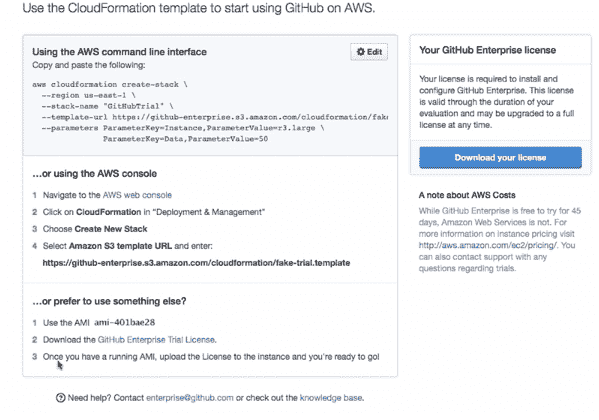

# 一个全新的 GitHub 企业现在支持 AWS

> 原文：<https://thenewstack.io/an-all-new-github-enterprise-now-supports-aws/>

GitHub Enterprise 现在支持亚马逊网络服务(AWS ),作为其服务“全新”更新的一部分。这个消息是今天早上从 GitHub 博客传来的，同时还有一系列其他新的更新。

GitHub 提供了三种在 AWS 上使用 GitHub Enterprise 的方法。

【T2

这一整合显示了 AWS 在生态系统中的强大。客户正在使用他们自己的基础架构，但 AWS 上的工作负载仍在继续扩展。这是 GitHub 为适应向 AWS 迁移所做的努力。它还展示了 GitHub 如何努力使这项服务对开发人员和 It 人员来说更加可行，因为他们在历史上并不是代码共享和协作技术的深度用户。

很明显，AWS 服务非常环保。用户必须确保他们使用的是更高版本的 GitHub Enterprise，特别是 11.10.344 到 11.10.348。GitHub 在 GitHub Enterprise 和 AWS 上构建了自己的基础设施，以适应新的服务。设置完成后，用户就可以备份他们现有的实例，并上传到 AWS，这样就可以进行访问了。

在视频说明中，整个过程看起来相当简单，视频说明了如何在 AWS 上使用 EC2 托管 GitHun，如何添加 EDS 卷、标记、安全组和 SSH 密钥对。

值得注意的是带有 GitHub Enterprise 许可证的 AWS 认证过程。管理员设置实例，然后与团队中的其他人共享密码。这似乎有点不安全，因为密码共享是一种实践，攻击者可以利用它来访问实例本身。

GitHub 高管在电子邮件中表示:

我们的安全团队建议使用安全的密码管理服务，如 LastPass，在团队中共享密码。此外，管理员可以通过防火墙或安全组限制对端口 8443 / 8080 的访问，从而锁定对 GitHub 企业管理控制台的访问。

下面是设置的进入:

更详细的视频展示了如何迁移到新的 AWS 服务:

GitHub Enterprise 还提供了许多新服务:

*   GitHub Enterprise 现在使用 Ubuntu 12.04 LTS，利用 Ubuntu 提供的基础组件的长期更新和安全修复。
*   在线备份实用程序:无需在备份运行期间将设备置于维护模式。根据 Gi GitHub 的说法，这意味着开发团队没有停机时间。
*   GitHub Enterprise 在改进其复制模式方面做出了新的努力。这使得能够“配置第二个相同的实例(带热备用的故障转移)，以便在主实例发生任何情况时立即采取行动。”

GitHub Enterprise 有许多新特性，包括可以与 OneLogin、PingIdentity、Okta 和 Shibboleth 等服务集成的 SAML 支持。这些集成允许与这些“身份提供商”进行单点登录，以便从一个位置管理您组织的用户，或者一次管理一组用户的应用程序访问，而不是单独管理。”

正如我在 2012 年为 TechCrunch 写的文章一样，GitHub 企业服务被认为是 GitHub 的成功之路。该公司在 2012 年从 Andreessen Horowitz 获得了 1 亿美元，因此它可以建立一种内部技术，开发人员可以部署代码并与其他开发人员合作。它可以与任何开放式虚拟化格式(OVF)集成。软件包系统旨在使开发人员能够轻松地从软件的当前版本升级到最新版本。升级将每周和每季度进行。

尚不清楚 GitHub 取得了多大的成功。它与 Atlassian 等公司的服务相比如何也不清楚。但毫无疑问，与 AWS 的集成有助于使社交编码更适用于分布式基础设施上的开发过程。

<svg xmlns:xlink="http://www.w3.org/1999/xlink" viewBox="0 0 68 31" version="1.1"><title>Group</title> <desc>Created with Sketch.</desc></svg>