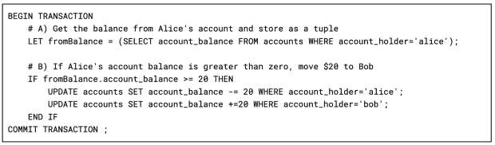

# Apache Cassandra 的突破:大规模的 ACID 交易

> 原文：<https://thenewstack.io/an-apache-cassandra-breakthrough-acid-transactions-at-scale/>

让我们先把最好的部分拿出来。 [ACID transactions](https://en.wikipedia.org/wiki/ACID) 即将来到 Apache Cassandra。全球可用的通用交易，以 Cassandra 的方式运作。这不是什么印刷精美的小把戏，也不是什么古老技术的应用。

这要归功于苹果公司和密歇根大学的一个团队在计算机科学上取得的一项名为[协议](https://cwiki.apache.org/confluence/download/attachments/188744725/Accord.pdf?version=2&modificationDate=1637000779000&api=v2) (pdf)的非凡突破。它将通过打开新的用例来帮助 Cassandra 改变我们对数据的看法。

对于那些不了解 Cassandra 项目的来龙去脉及其特性的人来说，这意味着什么。没有什么比将应用程序投入生产的速度更重要了。但是，想要将 Cassandra 的规模、弹性和传奇的多数据中心支持用于金融交易等工作的开发人员必须在他们的应用程序中编写一系列复杂的解决方案。比如说，与使用 Oracle 相比，权衡是很重要的。

同意吗？没有取舍。Cassandra 现在将[支持一切令人惊叹的东西](https://thenewstack.io/4-common-questions-we-hear-about-apache-cassandra/)，同时将事务支持转移到数据库，这将大大降低代码复杂性。

## **观察者的眼睛**

一个数据库系统具有基本的功能，如[可靠地存储数据](https://thenewstack.io/3-approaches-to-migrate-sql-applications-to-apache-cassandra/)并可供查询。管理数据的变化并不总是数据库的功能。在许多 NoSQL 系统的情况下，变更管理的负担被委托给用户。数据变化的观察者是赋予排他性重要性的人。

假设重点是积累给定的数据。在这种情况下，观察者必须知道数据被持久地接收和存储——例如，股票报价机数据，其中每个数据点都是唯一的和累积的。不需要排他性。

在更敏感的操作中，数据更改的观察者需要感觉他们是使用数据库的唯一进程。这是计算机科学中的一个概念，叫做“隔离”；是酸中的“我”(原子性、一致性、孤立性、持久性)。

一个经典的例子是银行转账，钱从一个银行账户中扣除，然后加入到另一个账户中——完全按照这个顺序。观察过程需要排他性，以避免其他过程做出可能导致不一致或意外的改变。意外情况包括无意中允许从低于 0 美元的账户转账。隔离保证一次只有一个进程可以进行更改，如果两个进程竞争相同的数据，其中一个进程必须等待另一个进程完成。

## 拥抱你的懒惰

开发人员需要使用他们可以信任的系统快速行动。近 50 年来，ACID 事务一直是数据库系统中信任的黄金标准。开发人员根据需求进行权衡，有时会导致他们使用不支持 ACID 事务的系统。

对于 NoSQL 系统，权衡偏好历来倾向于规模和正常运行时间，同时牺牲交易。

将酸性交易引入卡珊德拉是为了减少交易。Cassandra 在保持最坏情况下的正常运行时间的同时，在线性扩展方面已经有了良好的声誉。

当您需要一个能够满足互联网需求的数据库时，Cassandra 是您的最佳选择。因此，对事务的需求成为开发人员权衡冲突的来源也就不足为奇了。

## **我们能达成共识吗？**

在分布式系统中，大型集群中的每个成员节点可以独立工作，或者需要与其他节点协调工作。在交易中，“嘿，我们都需要在某些事情上达成一致，”计算机科学家称之为共识，开发这些协议是一个持续改进的领域。

[Paxos](https://en.wikipedia.org/wiki/Paxos_(computer_science)) 是一个由来已久的共识协议，2013 年被 Cassandra 用于所谓的“轻量级事务”轻量级，因为它确保单个分区的数据更改被隔离在一个事务中，但是不能选择多个表或分区。此外，Paxos 需要多次往返以获得一致意见，这就产生了大量额外的延迟，并详细说明了何时在应用程序中使用轻量级事务。

Raft 协议被开发为下一代协议，以取代 Paxos，Etcd、CockroachDB 和 DynamoDB 等几个系统都采用了它。它通过创建一个选举产生的领导人来减少往返行程。

Cassandra 在这种方法中的缺点是领导者不会跨越数据中心，因此需要多个领导者(参见[扳手](https://static.googleusercontent.com/media/research.google.com/en//archive/spanner-osdi2012.pdf))。选举领导人也违反了卡桑德拉的“无共享”原则，并会对处理失败提出新的要求。如果一个节点发生故障，必须选举新的领导者。

其他数据库——例如 FaunaDB 和 foundation db——已经走上了试图通过减少到一个单一的全球领导者来解决多重领导问题的道路，如 [Calvin 论文](https://cs.yale.edu/homes/thomson/publications/calvin-sigmod12.pdf)中所述。因为这些是为具有不同需求的其他数据库构建的，所以在那些情况下使用的方法不符合 Cassandra 对故障模式的预期标准。

Cassandra 认为失败是运行大型分布式系统的一部分。一个或多个节点离线不会导致性能快速下降或可用性问题。我们需要一种不同的方法。

## **我们达成一致了吗？**

对于卡珊德拉项目来说，什么是可以接受的，我们会非常固执己见。我们的标准是坚持分布式系统应该如何运行的核心信念。在跨一个或多个数据中心运行多个节点时，应始终保持性能和可扩展性。我们可能要求很高，但这正是 Cassandra 成为众多组织选择的原因。

共识协议的前几个版本解决了问题的不同部分，但每个版本都提出了一个违反 Cassandra 某些价值观的折衷方案。据说下一个重大突破离上一个还差两篇论文。在这种情况下，论文是 [Accord](https://cwiki.apache.org/confluence/download/attachments/188744725/Accord.pdf?version=2&modificationDate=1637000779000&api=v2) ，它在消除权衡方面花了很大力气。

Accord 解决了以前的共识协议没有解决的两个问题:我们如何在一次往返中获得全球可用的共识？第一个新颖的机制是重排序缓冲区。

假设使用商用硬件，节点之间的时钟差异是不可避免的。除了节点之间的延迟之外，重新排序缓冲区还测量节点之间的差异。每个副本都可以使用此信息来正确排序来自每个节点的数据，并说明差异，从而保证时间戳协议的往返一致性。

另一个机制是快速通道选举人。当在恢复之前选举新的领导者时，故障模式会产生延迟。快速通道选举人使用 Cassandra 中预先存在的功能和一些新颖的实现，在 Cassandra 所能容忍的相同故障级别下，维持一个无领导的快速通道以达到法定人数。更多细节可以在[提案](https://cwiki.apache.org/confluence/display/CASSANDRA/CEP-15%3A+General+Purpose+Transactions)中阅读。

## **它是如何工作的？**

最大的影响将是开发人员的生产力，所以让我们看看实际情况是怎样的。考虑我们前面提到的以下银行转帐示例:

首先是您将在 Cassandra 查询语言(CQL)中看到的新语法。交易包含在`BEGIN TRANSACTION`和`COMMIT TRANSACTION`声明中。事务标记中的一切都将独立于其他进程自动发生。在本例中，我们将从 Alice 的账户中转账 20 美元给 Bob。没有比这更经典的了！

在 A 部分中，我们可以从现有记录中选择数据，并将结果分配给一个元组(多个项存储在一个变量中)。根据`SELECT`子句中有多少列，可以在元组中存储一个或多个值。这些值将在 B 部分中使用，以在进行数据更改之前测试条件。

在这种情况下，我们将在向 Bob 转账之前测试 Alice 的账户中是否有 20 美元。如果是，那么`UPDATE`将 Alice 的账户余额减少 20 美元，然后将 Bob 的账户余额增加 20 美元。如果爱丽丝的钱少于 20 美元，那么变化就不会发生。

从观察过程来看，幕后是一组以独占方式执行的序列化数据库命令。在一个或多个数据中心之间，事务只需要一次往返就可以获得一致，并且如果任何节点离线，只要至少有法定数量的副本可用，操作仍然会发生。

这正是 Cassandra 喜欢的工作方式，但我们刚刚用一个全球可用的交易提升了我们的游戏。

## **下一步是什么**

Accord 和与之相关的所有工作仍在进行中，并计划包含在下一个 Cassandra 版本中。因为这些都是开源的，那些等不及的人可以从 Cassandra 库克隆一个`cep-15-accord`分支的副本，然后构建自己的副本。对于其他人来说，随着发布时间的临近，我们会有可供你们使用和测试的版本。这对卡珊德拉来说将是一个游戏改变者，我相信你会想亲眼看看的。

我最感兴趣的是听听社区的意见，看看全球可用的事务以您期望的 Cassandra 的速度和弹性运行时，您会发现哪些用例。是时候放弃那些最后的关系数据库工作负载了吗？

我们也渴望听到您对我们所有渠道的反馈，包括 Apache Software Foundation[Slack 或项目邮件列表](https://cassandra.apache.org/_/community.html#discussions)。开源项目中的特性不断发展，以满足用户的需求。这就是为什么你在塑造[阿帕奇卡珊德拉](https://dtsx.io/3Ch9bW9)的未来中扮演着关键的角色。

随着这一激动人心的新功能的发展，请继续关注更多的使用案例和信息。你可以期待在即将到来的 2023 年[卡珊德拉峰会](http://cassandrasummit.org)上会有几次关于这个的会谈。你不会想错过这些的。

<svg xmlns:xlink="http://www.w3.org/1999/xlink" viewBox="0 0 68 31" version="1.1"><title>Group</title> <desc>Created with Sketch.</desc></svg>