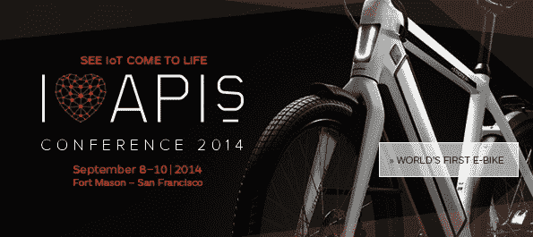
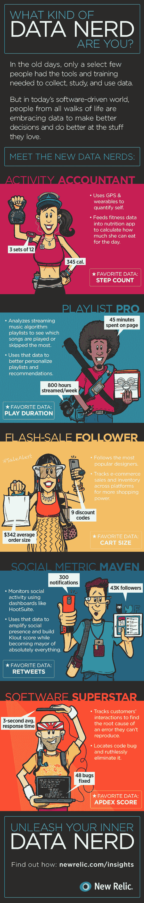

# API 连接自行车、移动成熟度、数据书呆子和来自赞助商的更多内容

> 原文：<https://thenewstack.io/an-api-connected-bike-mobile-maturity-data-nerds-and-more-from-the-sponsored-feed/>

API 是物联网的连接器。但对于大多数公司来说，在进入这个新的互联设备领域之前，成熟度仍然是一个重要因素。然而，数据狂人无处不在，他们对新形式的信息架构的熟悉将使持续开发过程比以往更加现实。这些是你在阅读新的 Stack sponsored feed 时可能会看到的主题，它出现在每个帖子的底部。赞助商提要中的项目链接回赞助商的博客。赞助商发布的帖子越多，他们的帖子出现在提要顶部的就越多。

**金维** : [企业移动性成熟度模型:你在曲线的哪里？](http://www.kinvey.com/blog/3936/the-enterprise-mobility-maturity-model-where-are-you-on-the-curve?utm_source=feedburner&utm_medium=feed&utm_campaign=Feed%3A+kinvey+%28Kinvey+Backend+as+a+Service+Blog%29)

这里有一个你不常看到的帖子。金维的角度不是关于开发应用程序的方法，而是关注你的公司在成熟度曲线上的位置。考虑到这一点，Kinvey 定义了成熟过程的四个步骤。

[下载白皮书全文](http://www.kinvey.com/mobility-maturity-model)了解更多关于 Kinvey 对企业移动性成熟度模型的看法，其中包括在周期的每个阶段构建的应用类型的示例。

用更少的资源做更多的事情——高等教育的财务规划

大学不容易管理，大多数 18 岁的孩子都失去了这一点，Tidemark 的陈尚实写道，他最近在 2014 年校园技术大会上花了几天时间。大学系统比以往任何时候都更复杂，资源紧张，迫使高等教育专业人员少花钱多办事。

像布朗大学这样的大学正在重新思考旧的流程，并创建新的以云为中心的持续规划系统。例如，Tidemark 开发了一个打包应用程序，用于战略规划、收入规划、人员预算和控制、部门预算、资本规划和拨款规划。Tidemark 产品允许部门领导通过资助课程、拨款、职位、用途和其他类别来了解和计划。

和平、爱、蜜蜂和…自行车

下面是下一代 API 让我兴奋的地方。不仅仅是应用程序联网，自行车和其他东西也是如此。Stromer eBike 是将于 9 月 8 日至 10 日在旧金山♥工业博览会上展示的几项物联网技术之一。展出的其他物品包括:

福特将展示其 OpenXC 平台，该平台可以为联网汽车提供 DIY 应用和可插拔模块。Zuli 将展示其智能插头，根据智能手机的接近程度，根据个人偏好和存在情况自动调整灯光和电器。Tessel 将展示其可编程微控制器如何简化物联网开发。

**新遗迹**:你是什么样的数据呆子？[信息图]

无论我们做什么或我们是谁，数据是如何改变我们的。查看信息图:

【T2

Digital Ocean、Adallom 和 Cloudosft 也发布了值得再次注意的帖子。数字海洋看看如何使用 OAuth 2。Adallom 涵盖了端到端的安全性，Cloudsoft 有一些来自最近在爱丁堡举行的 Docker meetup 的视频。

特色图片[通过](https://www.flickr.com/photos/libertinus/5332337899/in/photolist-98cChk-ihorP5-9iWmLv-7XM1CE-o7NJbB-9hGFDy-jTtAtD-7ogomR-nUQaEE-fTM4q2-5Z28zY-cnkNR1-8Dy7fb-8yMKFk-fk2Lzv-9RcvHZ-fk2LTr-fyGmDt-fyGnsT-fpK2hk-9V4VdF-f5bkax-f5bjE8-f5qzk3-f5qzib-f5qz2Y-f5bjTZ-f5bjUk-f5bkdk-fyWEDW-nuVgeh-328Fej-6rtgs6-nSSMAC-nWGwne-nzXh7Z-6MT7MD-dzk3Zg-f5bkjV-f5bjAn-f5qyGC-f5bjA6-f5bjFV-f5qz3d-nqTpVv-7C2oY7-f5bkNp-cucZc7-nSFW4e-8i2d1U/) Flickr 知识共享。

<svg xmlns:xlink="http://www.w3.org/1999/xlink" viewBox="0 0 68 31" version="1.1"><title>Group</title> <desc>Created with Sketch.</desc></svg>