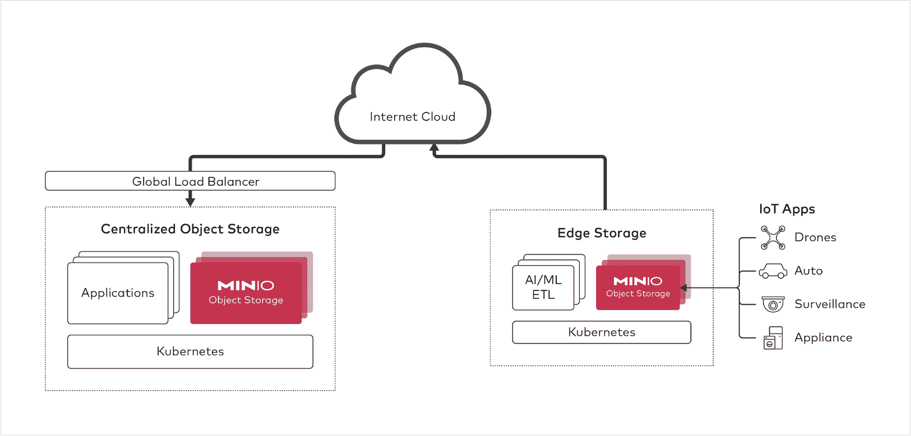
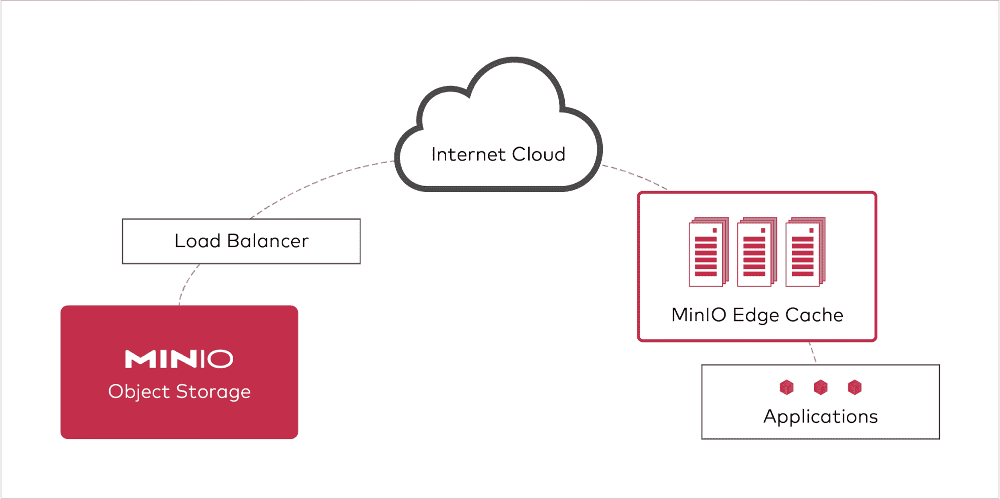

# 建筑师的边缘存储指南

> 原文：<https://thenewstack.io/an-architects-guide-to-edge-storage/>

乔纳森·西蒙兹

乔纳森是 MinIO 公司的首席营销官。此前，他是 Ayasdi 的 CMO，并在 OmniSci、AceMetrix 和 2Wire 担任高级营销职务。

当前一代的边缘计算仍处于起步阶段。鉴于其目前的规模(60 亿美元)和增长预期(到 2028 年达到 610 亿美元)，这是一个了不起的声明。尽管如此，随着 5G 刚刚站稳脚跟，物联网(IoT)经济呈爆炸式增长，事实是我们真的不知道它会变得多大，或多快。

MinIO 的 architect 系列的这一部分(另请参见混合云存储指南[和多云存储指南](https://thenewstack.io/an-architects-guide-to-hybrid-cloud-storage/)[关注边缘存储。在边缘正确处理数据可以确保可扩展、经济高效且安全的基础架构。另一方面，未能建立正确的体系结构可能会导致数据丢失、安全漏洞以及与公共云来回传输数据所需的带宽相关的高昂成本。](https://thenewstack.io/an-architects-guide-to-multicloud/)

我们旨在为实现前者提供指导。

## **为什么边缘？**

边缘计算将内容、数据和处理放在离使用它们并与之交互的应用、事物和用户更近的地方。边缘计算的主要挑战是实现带宽优化的架构，提供性能、弹性和安全性，而无需在基础设施上进行大量投资。

从架构的角度来看，带宽是一个关键的考虑因素，原因很明显:每千兆字节(GB)的带宽是存储的四倍(例如，在 AWS 上是 0.023 比 0.09)。

边缘的上升是数据增长的函数。虽然数据中心备受关注，但许多分析师预计，在一两年内，这些墙之外的企业创建的数据将超过墙内的企业。

我们将讨论边缘存储的模型(边缘存储和边缘缓存)以及成功的要求。让我们从模型开始。

## **边缘存储**

当目标是在边缘上进行处理和分析时，使用边缘存储模型，过滤掉噪声并仅保留/发送见解和与这些见解相关联的数据。在此模型中，应用程序、计算和存储位于边缘，旨在就地存储和处理数据。目标不是在边缘存储 Pb(PBs)的数据；更确切地说，这个模型设想的是几百千兆字节到几千兆字节左右。视觉上看起来是这样的:

在最远程的边缘，您拥有产生数据的设备，以及存储和计算/分析。计算/分析的范围可以从 Splunk DSP(数据流处理器)到深度神经网络模型开发，但这里的关键点是在远程边缘有 ETL、处理和洞察生成。这些实例通过 Kubernetes 作为数据管道进行容器化和管理。

> Kubernetes 是 edge 体系结构的一个关键促成因素，它有效地提出了存储应该分解和基于对象的要求。

要完成该架构，需要添加一个负载平衡器、另一层 Kubernetes，然后有一个原始对象存储服务器和应用层—训练模型、进行大规模分析等。—在更集中的位置。

像福乐鸡快餐店这样的餐馆采用这种模式。它用于面部识别系统。这是制造用例以及 5G 用例的默认设计。

在每种情况下，在现场或经济上邻近的位置都有足够的存储和计算来从数据中学习。

让我们以一辆从传感器产生数据的汽车为例，MinIO 在这一领域拥有丰富的部署专业知识。收集数据的目的是建立和训练机器学习模型。汽车内部没有计算资源来进行训练，这是 GPU 最密集的部分。在这种情况下，数据被发送到边缘数据中心，以建立和训练机器学习模型。一旦模型经过训练，它就可以被发送回汽车，并用于根据传感器传来的新数据做出决策和得出结论。

将训练和处理分布在地理上尽可能靠近设备是有意义的。

最终，这些数据将最终出现在云中(公共或私有)。它将快速积累，在自动驾驶汽车的情况下，它将很快成为多个 PBs。因此，您将在两端需要相同的存储:在边缘和云中。

对象存储是云中的首选存储。因此，对象存储是边缘的首选存储。下面我们将讨论边缘存储需要具备哪些属性。但现在需要注意的是，传统的 SAN/NAS 系统不够灵活，而且通常与这些使用情形不兼容，因为数据处理应用程序正在本机采用 S3 API。

虽然有些人将边缘与私有云混为一谈，但这是一个错误。公、私、边的定义在这一点上从根本上模糊了。它们都来自同一套实践:容器化、编排、RESTful APIs、自动化和微服务。“分类”是架构师优化目标的函数:性能、经济性、安全性、弹性和规模。

## **边缘缓存**

回想一下边缘的第一条规则，将带宽视为成本最高的部分(AWS 上的 4 倍)，我们来看第二个核心边缘案例:边缘缓存。边缘缓存并不是一个新概念，因为内容交付网络(cdn)已经有几十年的历史了，但它也是对象存储再次改变规则的一个领域。cdn 需要紧密集成到对象存储系统中，以维护对象的安全性和一致性模型。

在此模型中，边缘充当网关缓存，在应用程序和公共云之间创建中介。在这种情况下，网关由带有大量硬盘或闪存驱动器的服务器支持，部署在世界各地的边缘数据中心。看起来是这样的:

【T2

对公共云的所有访问都通过这些缓存(直写缓存)，因此数据上传到公共云时有严格的一致性保证。基于 ETAG(实体标签)匹配或缓存控制头，从缓存中为后续读取提供服务。这种体系结构通过减少传输数据所需的带宽来降低成本，通过将数据缓存在离应用程序更近的地方来提高性能，并且还降低了运营成本。数据仍然保存在公共云中，但缓存在边缘，因此如果边缘数据中心被烧毁，它仍然在那里。

有了 MinIO 的对象存储网关，人们还可以采用零管理的无共享架构。你部署一次就忘了。添加一个节点、两个节点、2，000 个节点—这没有关系，它们在体系结构上彼此独立，并且完全无状态。继续缩放。如果一个节点死了，就让它去吧。

## **边缘的属性**

无论您在边缘构建哪种类型的架构，任何边缘存储系统都需要内置某些属性，无论是在边缘处理中心、物联网设备本身还是作为边缘缓存系统的一部分。首先，如前所述，存储需要是基于对象的，并且可以通过 HTTPs 访问。对象是边缘的默认模式。文件和数据块协议不能扩展到本地网络之外。

但是，该对象存储还有其他要求，如下所示:

### **弹性**

弹性对于边缘存储至关重要。熟练的工程师更难物理访问和维护物联网设备或边缘数据中心。与此同时，物联网设备中的驱动器，甚至是边缘数据中心中的驱动器，都受到比传统数据中心中的驱动器更恶劣的物理条件的影响。

这些体系结构，尤其是存储组件，需要能够就地发生故障。会发生驱动器故障。如果没有正确的体系结构，驱动器故障会导致数据丢失。除了丢失数据之外，更换驱动器可能是一场运营噩梦，因为这需要经验丰富的技术人员访问地理位置分散的数据中心和/或维护数千台边缘设备。

对于存储架构来说，使用自我修复和自动化来确保数据安全(即使在驱动器出现故障时)以及在特定边缘位置的所有驱动器都出现故障时自动故障转移到其他数据中心至关重要。

### **软件定义+容器友好+开源**

软件定义的存储解决方案提供了传统系统所不具备的灵活性。它们可以同样轻松地运行在各种硬件平台上，并且可以很容易地进行远程维护。

此外，软件定义的存储解决方案在容器化和流程编排方面更胜一筹。你可能还记得，[五金器具](https://blog.min.io/high-performance-object-storage-with-kubernetes/)是不可能装箱的。考虑到需要加速/减速和扩展/收缩 edge 解决方案，Kubernetes 友好的解决方案是必需的。

第三，解决方案需要开源。这对于那些早已看到开源价值的电信公司来说是理所当然的(见 [O-Ran](https://www.o-ran.org/) )，但对于其他行业来说也很重要，在这些行业中，摆脱锁定、自由检查和自由创新都是选择过程的关键。开源的另一个未被重视的价值主张是易于采用——它可以在高度异构的配置中运行，并且以专有软件永远无法做到的方式得到强化。

### **无状态**

边缘存储系统需要由完全一次性的物理基础架构组成。如果它们着火了，应该不会有数据丢失。如果发生意外，应该不会有数据丢失。关键状态应该存储在公共云中，这样单个硬件元素就可以被丢弃。

不可能把边缘的驱动器当成宠物。他们几乎总是要经受更艰苦的物质条件，这使他们不仅面临失败的风险，还面临腐败的风险。

### **速度**

处理数据的速度越快，做出商业决策的速度就越快。速度是将数据处理从传统数据中心和公共云转移的主要原因之一。T2 加速数据处理和数据传输的能力对于充分利用边缘计算至关重要。

延迟很难解决，即使是在处理位于边缘的数据中心时。成功的架构师尽可能地解决延迟问题。一种广泛使用的技术是处理和分析内存中的数据，以消除磁盘带来的延迟。实现边缘速度需要消除对高延迟网络的任何依赖。

### **轻量级**

边缘设备很小。要使存储系统在边缘上可行，它必须以非常少的计算和存储资源提供速度、弹性和安全性。在资源较少的设备上运行的能力——例如[Raspberry Pi](https://www.thepolyglotdeveloper.com/2017/02/using-raspberry-pi-distributed-object-storage-minio/)——对于构建可能在物联网设备中的单个固态驱动器上运行的存储系统来说至关重要。然而，关键是，从应用程序和 API 的角度来看，单个固态硬盘必须看起来和行为上都像一个成熟的服务器。

### **安全**

没有办法完全确保边缘数据中心或物联网设备的物理安全性。确保静态和传输中的加密至关重要，因为在边缘数据中心周围放置与传统数据中心相同的物理安全措施是不切实际的，在物联网设备中也是不可能的。边缘驱动器的物理脆弱性使得加密至关重要，因此即使数据被访问，也无法被读取或篡改。

## **总结**

在边缘世界中，设计合适的架构至关重要。本文介绍了两种模型，一种是在边缘收集数据，另一种是将数据推到边缘。虽然这些模型根本不同，但存储选择是相同的:对象。

<svg xmlns:xlink="http://www.w3.org/1999/xlink" viewBox="0 0 68 31" version="1.1"><title>Group</title> <desc>Created with Sketch.</desc></svg>