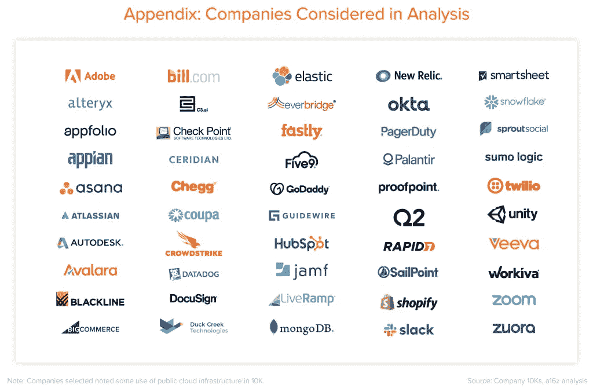

# 多云架构师指南

> 原文：<https://thenewstack.io/an-architects-guide-to-multicloud/>

乔纳森·西蒙兹

乔纳森是 MinIO 公司的首席营销官。此前，他是 Ayasdi 的 CMO，并在 OmniSci、AceMetrix 和 2Wire 担任高级营销职务。

混合云和多云之间的界限在这一点上是模糊的。混合云的定义当然更加宽泛(公共云、本地云、边缘云)。“多云”通常指多个公共云。让它变得模糊的是，云是一种心态，而不是物理位置。因此，我们现在看到这些术语可以互换使用。

不管定义如何，有一点是明确的:两者成功的首要原则都非常相似。

如今，混合云炙手可热，而多云也同样盛行。每个大型企业都是多云企业。每个公共云海报公司都有另一个公共云上的数据。原因多种多样—锁定、定价、应用、客户需求、运营灵活性—但结果是一样的。多云不再是偶然事件，而是企业云战略的重要组成部分。

在这篇文章中，我们希望回答的问题是:什么类型的企业从多云中受益最大，成功的关键是什么？

让我们从成功的驱动因素开始，然后将注意力转向从中受益最大的企业。

在多云中取得成功有两个核心要素。第一个是 Kubernetes，第二个是对象存储。其他一切都是遥遥领先的第三。

## **库伯内特魔法**

在最基本的层面上，Kubernetes 的价值在于其将基础设施视为代码的能力——为软件堆栈的有状态和无状态组件提供全面的自动化。

Kubernetes 是大规模云计算的主要方法，因为它让开发人员专注于功能性(我们将回到这一点),而无需为可管理性或可移植性而苦恼。它还让 It 部门能够自动处理可能影响正常运行时间的运营细节。

结果是应用程序更快上市，无缝扩展，并且可以在任何地方运行。

Kubernetes 的神奇之处在于，它是一种不断给予的礼物。你投入 Kubernetes 越多，它就越能自动化和抽象化；你能提取的价值就越大。这意味着应用程序、基础架构和数据。如果你只在应用程序中使用 Kubernetes，你只是利用了一小部分价值。出于这个原因，Kubernetes 不成比例地奖励大胆的人。这导致了对象存储的平行增长，因为它比传统的存储选项(如块和文件)更容易放入容器中。

## **物体储存波**

如上所述，CPU、网络和存储是由 Kubernetes 抽象的物理层。必须对它们进行抽象，以便应用程序和数据存储可以在任何地方作为容器运行。特别是，数据存储包括所有持久服务(数据库、消息队列和对象存储)。

从 Kubernetes 的角度来看，对象存储与任何其他键值存储或数据库没有什么不同。存储层简化为底层的物理或虚拟驱动器。将持久性数据存储作为容器运行的需求源于混合云的可移植性。将基本服务留给外部物理设备或公共云会剥夺 Kubernetes 自动化的优势。

传统上，应用程序依赖数据库来存储和处理结构化数据；和存储(如本地驱动器或分布式文件系统)来存放所有非结构化甚至半结构化的数据。然而，非结构化数据的快速增长挑战了这一模式。正如开发人员很快了解到的那样，POSIX(可移植操作系统接口)太繁琐，开销太大，不允许应用程序大规模执行，并且局限于数据中心(因为它从来没有打算提供跨地区和大洲的访问)。

这将他们引向了对象存储，它是为 RESTful APIs 设计的(由 AWS S3 首创)。现在，应用程序不再有处理本地存储的负担，这使得它们实际上是无状态的，因为状态是由远程存储系统控制的。

今天，应用程序是带着这种期望从头开始构建的。处理某种数据(日志、元数据、blobs 等)的设计良好的现代应用程序，通过将状态保存到相关的存储系统，符合云原生(RESTful API)设计原则。

这使得对象存储成为云的主要存储类别，正如公共云对对象存储的依赖(以及数据块和文件的定价)以及私有云和边缘高性能对象存储的出现所证明的那样。

## **但是有一个条件…**

Kubernetes 是伟大的平等者。S3 兼容对象存储是 Kubernetes 的完美存储类。组合并重复对吗？

可惜没有。事实证明，S3 兼容的对象存储无法在其他公共云上找到。每一种公共云存储服务——谷歌云存储、Azure Blob 存储、阿里巴巴对象存储服务和 IBM 云对象存储——都引入了自己的专有 API，并且从根本上相互不兼容。

GCP —与 S3 不兼容。Azure —与 S3 不兼容。阿里巴巴——与 S3 不兼容。IBM 云—与 S3 不兼容。Oracle 云—与 S3 不兼容。

这本质上是可以解决的 Kubernetes 又一次成为了关键。答案就在 Kubernetes——软件定义的原生对象存储。这样，您就拥有了在所有云、内部和边缘环境中运行应用所需的一切，无论应用规模大小。

## **谁从 Kubernetes 本地软件定义的对象存储中受益**

Andreessen Horowitz [的团队发布了一篇精彩的文章，内容是关于上市公司云优先的成本。在那篇文章中，该团队建立在我们几个季度以来一直在说的基础上:云是一个学习、专注于产品和保持敏捷的好地方，但从规模上看，它根本没有长期意义。](https://a16z.com/2021/05/27/cost-of-cloud-paradox-market-cap-cloud-lifecycle-scale-growth-repatriation-optimization/)

想想云原生精英。A16Z 列出了这个清单:

它们都以弹性计算、网络和存储作为基础组件，以自助服务/多租户作为与客户互动的工具。但这并不是它们成功的原因，也不是公共云独有的特征。这些企业通过专注于他们的产品成功地实现了规模化，这几乎总是意味着在单一的公共云平台上运行。由于显而易见的原因，公共云平台与 AWS 不成比例，因为它是客户所在的地方。它为 AWS 创造了一个异常强大且异常有利可图的循环。

选择公共云很重要，但它并没有改变游戏规则。有成千上万的企业建立在 AWS 的基础上，但很少有企业进入云 100 名单。那些产品/市场契合度高、简单易用、经济性透明并且可以动态扩展和缩减的云。

这些公司中的每一家都有(或正面临)一个合理的改变游戏规则的问题。如果我必须保持增长，我必须在更多的云上…那么我该如何实现呢？这不仅仅是其他公共云，这个问题更广泛，包括私有云、Kubernetes 发行版，对于一些人来说，它甚至意味着边缘云。

技术战略团队需要考虑两个选择。第一，积累专业知识，专门为每个云的 API 集编写代码。第二，找到一个抽象基础架构的解决方案，这样他们就可以将应用程序架构简化为能够在任何云上运行的单一代码库。

我想你知道这是怎么回事。

定制云集成被证明是一个糟糕的想法。每增加一个本机集成，复杂性就会增加一个数量级。第三种云并不比前两种更容易——实际上更难。事实证明这是一个 n 体问题——更难抽象出功能和性能中不可避免的不一致，更难管理与最低公分母相关联的折衷。如果你投资于专门的团队，你就是在每个平台上每年投资 500 万至 1000 万美元在工程师身上(如果你能吸引并雇佣他们的话)。存储成本会有所不同。失去部落知识的代价也将会增加。最终，它会导致错误的和不可维护的应用程序代码。

## 大规模现代存储

虽然 Kubernetes 解决了这方面的大量挑战，并在云中商品化了基础架构堆栈的重要部分，但症结在于存储。块和文件本质上不是云原生的，POSIX API 从可伸缩性的角度，或者从可操作性和可维护性的角度来看，从来都不是 Kubernetes 的良好补充。Kubernetes 要真正取得成功，需要现代化的存储。

现代大规模存储是对象存储。句号。

当这些企业能够将 Kubernetes 与 S3 兼容的高性能软件定义的对象存储结合起来时，他们就可以解决这个问题。现在，这些企业可以从产品第一的角度攻击每一个云，完全抽象基础架构。这实际上改变了游戏规则。

当您选择 S3 兼容、高性能、软件定义的对象存储(推广插件，即我们)时，您可能每年在工程师身上投资一小部分，再加上存储成本(或在私有云/边缘云的情况下的硬件成本)，这使得经济性变得显而易见，即使您在 20 个平台上提供您的产品。

企业甚至可以选择推出自己的基础设施云，使用创新的主机托管提供商，如 Equinix 等。在这种情况下，您可以长期租用基础架构，实现定价可预测性、服务保证和全球覆盖。然后将 Azure、AWS、Oracle 和 Tanzu 实例指向那里。是的，你为带宽付费；但是根据应用程序的类型，假设它主要是读操作，那么它的成本会低得多。

## **多云剧本**

这是多云架构师的行动手册。

第一步:专注于你的产品，在公共云上建立一个伟大的企业。在某种程度上，这是快速、简单和经济可行的。我们喜欢 AWS 作为起点，因为 S3。是的，一个竞争对手推荐另一个竞争对手似乎有些奇怪，但全世界都应该感谢他们推广了 S3。

第二步:发展你的 Kubernetes 排骨。在开发 Kubernetes 上运行的软件方面积累专业知识，使其具有弹性、高性能和可伸缩性。现在是时候学习如何最大限度地利用你在 Kubernetes 的容器中编写的代码了。如果你已经在公共云中(并遵循了我们的建议),你就有了对象存储的能力——可能是 S3。

步骤 3:根据您自己的客户和战略考虑，从另一个云开始规划您的全球统治地位。使用 Kubernetes 和 MinIO(或另一个 S3 兼容的、高性能的、软件定义的、Kubernetes-native object store)进行迁移。

第四步:做大。每个公共云。每个 Kubernetes 区。您自己的私有云。从客户的角度不可知。

这看起来过于简单，但事实上它很有效，上面列表中的许多公司已经在这样做了。你[可以一下午亲自](https://min.io/download)试试。

<svg xmlns:xlink="http://www.w3.org/1999/xlink" viewBox="0 0 68 31" version="1.1"><title>Group</title> <desc>Created with Sketch.</desc></svg>