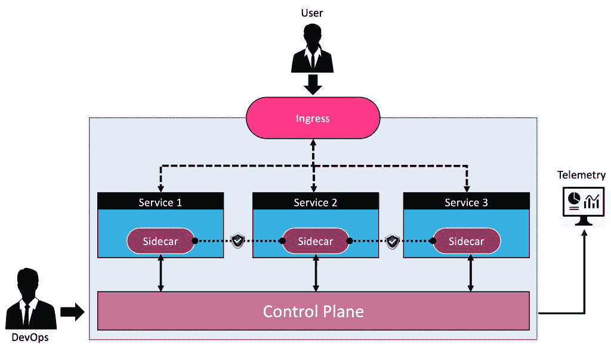
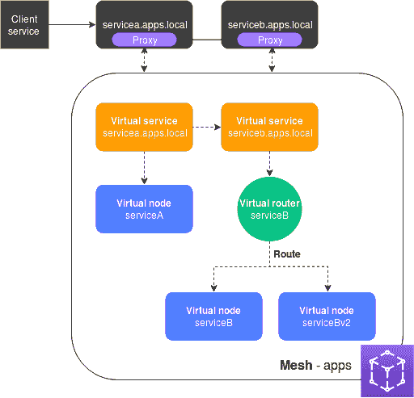
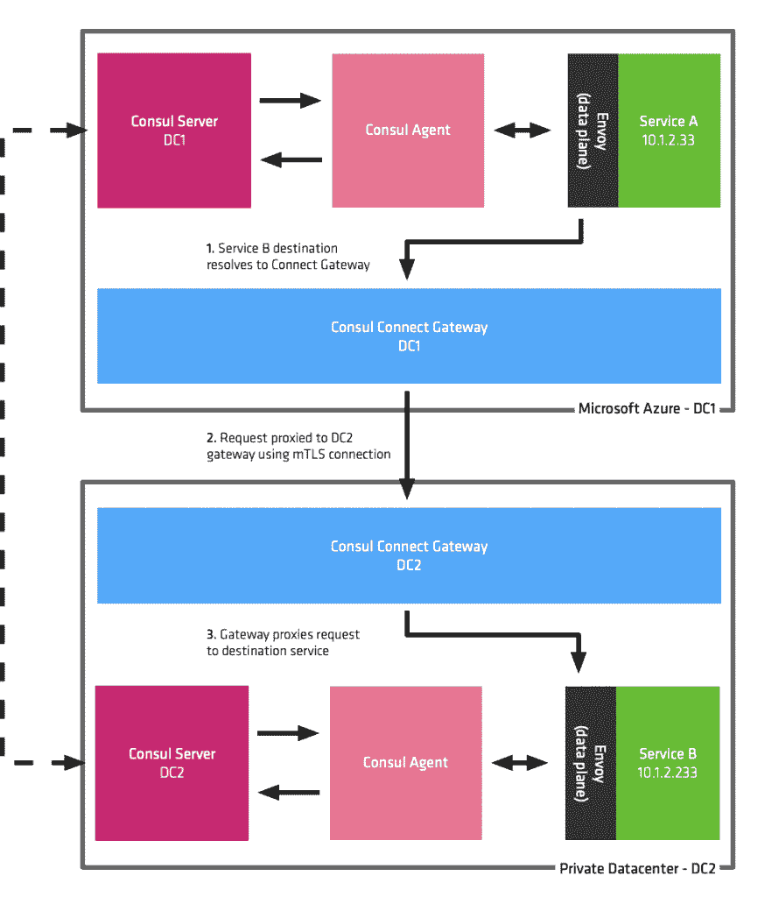
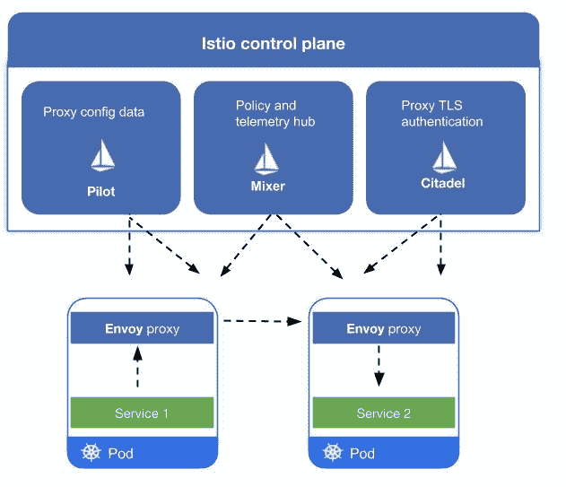
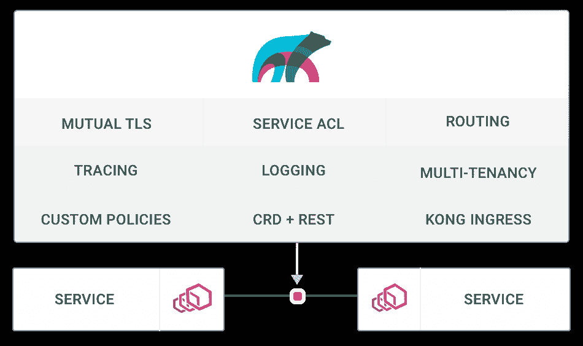
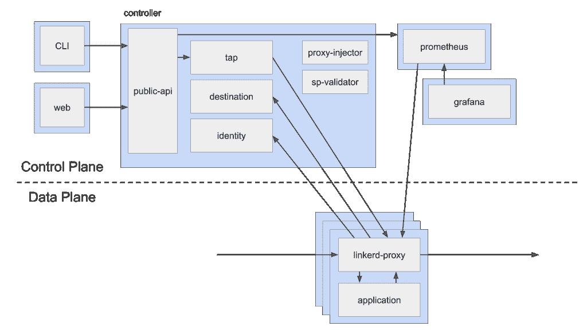
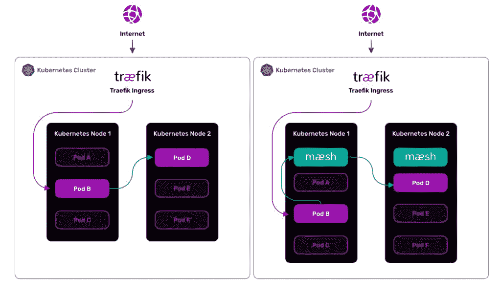

# 服务网格平台的探索性指南

> 原文：<https://thenewstack.io/an-exploratory-guide-to-the-service-mesh-platforms/>

本周和下周，News Stack 将发布一系列关于服务网格给 Kubernetes 部署带来的价值的帖子。这是第一部分。经常回来看看

[for more updates](/category/service-mesh/)

.

向微服务的转变带来了一系列挑战。如果架构、设计和开发微服务被认为是复杂的，那么部署和管理它们也同样复杂。

开发人员需要确保跨服务的通信是安全的。他们还需要实现分布式跟踪，以告知每次调用需要多长时间。分布式服务的一些最佳实践(如重试、断路器)为服务带来了弹性。[微服务](/category/microservices/)通常是多语言的，使用不同的库和 SDK。编写一个通用的、可重用的软件来管理跨不同协议(如 HTTP、gRPC 和 GraphQL)的服务内通信是复杂、昂贵和耗时的。

部署基于微服务的应用程序后，第二天的操作由 [DevOps 团队](https://thenewstack.io/category/devops/)执行。他们需要监控服务健康、延迟、日志、事件和跟踪。开发运维团队还需要实施基于策略的路由来配置蓝/绿部署、金丝雀版本和滚动升级。最后，来自多个微服务的指标、事件、日志和警报需要与现有的可观察性和监控堆栈进行聚合和集成。

[服务网格](https://thenewstack.io/category/service-mesh/)，云原生和微服务领域的一个新现象，试图为开发者和运营商解决这些问题。在容器编排之后，如果有一项技术获得了开发人员和操作人员的关注，那肯定是服务网格。云原生倡导者建议在生产环境中运行微服务时使用服务网格。

服务网格将开发人员从构建特定于语言的 SDK 和工具来管理服务内部的通信中解放出来。对于运营商而言，服务网格提供了开箱即用的流量策略、可观察性和来自堆栈的洞察力。

服务网格最好的一点是，它是一个“零接触”软件，不会强制更改代码或配置。通过利用 sidecar 的模式，服务网格将代理注入到每个服务中，充当主机服务的代理。由于代理或代理拦截每个入站和出站调用，它获得了对调用堆栈的无与伦比的可见性。与服务相关联的每个代理将从调用堆栈收集的遥测数据发送到一个集中式组件，该组件也充当控制平面。当运营商配置流量策略时，他们将其提交给控制平面，控制平面将其推入代理以影响流量。软件可靠性工程师(SREs)利用服务网格的可观察性来深入了解应用程序。

[服务网格与 Kubernetes 入口控制器](https://thenewstack.io/why-do-you-need-istio-when-you-already-have-kubernetes/)或现有 API 网关集成。API 网关和入口处理南北流量，而服务网格负责东西流量。

总的来说，服务网格是一个支持安全的服务到服务通信的基础设施层。它依赖于部署在每个微服务旁边的轻量级网络代理。集中式控制平面协调代理来管理流量策略、安全性和可观察性。

尽管服务网格主要用于打包为容器的微服务，但它也可以与虚拟机甚至物理服务器集成。通过有效利用服务网格的流量策略，可以无缝集成跨多个环境运行的应用程序。这一因素使得服务网格成为混合云和多云的关键促成因素之一。

企业可以选择多种服务网格。本文试图帮助比较和对比云原生生态系统中可用的一些主流服务网格平台。

## AWS 应用网格

[AWS App Mesh](https://aws.amazon.com/app-mesh/) 在 AWS re:Invent 2018 上发布，旨在为亚马逊网络服务的计算和容器服务带来服务网格的好处。它可以很容易地配置亚马逊 EC2，亚马逊 ECS，AWS Fargate，亚马逊 EKS，甚至 AWS 前哨。

由于 App Mesh 可以充当虚拟机和容器的服务网格，因此 Amazon 创建了一个基于虚拟服务、虚拟节点、虚拟路由器和虚拟路由的抽象层。

虚拟服务代表部署在 VM 或容器中的实际服务。虚拟服务的每个版本都映射到一个虚拟节点。虚拟服务和虚拟节点之间存在一对多的关系。当部署新版本的微服务时，它只是被配置为一个虚拟节点。类似于网络路由器，虚拟路由器充当虚拟节点的端点。虚拟路由器具有一个或多个遵循流量策略和重试策略的虚拟路由。网格对象充当所有相关实体和服务的逻辑边界。

代理与参与网格的每个服务相关联，处理网格内流动的所有流量。

假设我们在 AWS 中运行两个服务——*servicea . apps . local*和 *serviceb.apps.local* 。

我们可以轻松地将这些服务网状化，而无需修改代码。

我们注意到 *serviceb.apps.local* 有一个虚拟服务，一个虚拟节点，一个虚拟路由器，它有两条虚拟路由，决定发送到微服务 v1 和 v2 的流量百分比。

关于 AWS App Mesh 的详细解释，参考我之前的[文章](/aws-app-mesh-amazons-own-service-mesh-for-microservices/)和[教程](/perform-canary-deployments-with-aws-app-mesh-on-amazon-eks/)。

像大多数服务网格平台一样，AWS App Mesh 也依赖于开源的 [Envoy proxy](https://www.envoyproxy.io/) 数据平面。App Mesh 控制平面的构建考虑了 AWS 计算服务。Amazon 还定制了 Envoy 代理来支持这个控制平面。

将 AWS App Mesh 与亚马逊 EKS 一起使用时，您将获得自动边车注入的好处以及在 YAML 定义 App Mesh 实体的能力。Amazon 已经为 EKS 构建了 CRDs 来简化带有标准 Kubernetes 对象的应用网格的配置。

AWS App Mesh 生成的遥测可以与亚马逊 CloudWatch 集成。这些指标可以导出到 Splunk、Prometheus 和 Grafana 等第三方服务，以及 Zipkin 和 LightStep 等开放跟踪解决方案。

对于使用 AWS 计算服务的客户，AWS App Mesh 是免费的。AWS App Mesh 不另收费。

## 领事

HashiCorp 的 Consul 是一个服务发现平台，内置了一个键/值存储。对于在同一主机或分布式环境中运行的服务，它充当高效、轻量级的负载平衡器。Consul 公开了一个用于发现注册服务的 DNS 查询接口。它还对所有注册的服务执行健康检查。

在容器和 Kubernetes 成为主流之前，Consul 就已经创建了。但是微服务和服务网格的兴起促使 HashiCorp 将 Consul 扩展为一个成熟的服务网格平台。Consul 利用其名为 Connect 的服务网格特性，使用相互传输层安全性(TLS)提供服务到服务的连接授权和加密。

关于实现 Consul 的详细解释和分步指南，请参考我的教程 [Consul 服务发现](/implementing-service-discovery-of-microservices-with-consul/)和 [Consul 连接](/implement-a-service-mesh-with-consul-connect/)。

由于 sidecar 模式是服务网格的首选方法，Consul Connect 自带代理来处理入站和出站服务连接。基于插件架构，Envoy 可以作为 Consul 的替代代理。

Consul 为 Consul 增加了两个基本的能力——安全性和可观察性。

默认情况下，Consul 向服务端点添加一个 TLS 证书来实现相互 TLS (mTLS)。这确保了服务到服务的通信总是加密的。安全策略通过定义服务访问控制的意图来实现，并用于控制哪些服务可以建立连接。意图可以拒绝或允许来自特定服务的流量。例如，数据库服务可以拒绝直接来自 web 服务的入站流量，但允许通过业务逻辑服务发出的请求。

当 Envoy 用作 Consul Connect 的代理时，它利用了 L7 的可观察性特性。与 Consul Connect 集成的 Envoy 可以配置为将遥测数据发送到各种源，包括 statsd、dogstatsd 和 Prometheus。

根据上下文，Consul 可以充当客户端(代理)或服务器，当与 orchestrators(如 Nomad 和 Kubernetes)集成时，它支持 sidecar 注入。在 Kubernetes 有一个部署领事连接的舵图。Consul Connect 配置和元数据作为注释添加到提交给 Kubernetes 的 pod 规范中。它可以与 Ambassador 集成，Ambassador 是 Datawire 的入口控制器，用于处理南北流量。

Consul 缺乏用于实施蓝/绿部署或 canary 版本的高级流量路由和分流功能。与其他服务网格选择相比，它的安全流量策略不是很灵活。通过集成 Envoy，可以配置一些高级路由策略。但是，Consul Connect 并没有为此提供接口。

总的来说，Consul 和 Consul Connect 是易于管理的健壮的服务发现和网格平台。

## 伊斯迪奥

Istio 是最受欢迎的开源服务网格平台之一，由 Google、IBM 和 Red Hat 提供支持。

Istio 也是首批使用 Envoy 作为代理的服务网格技术之一。它遵循与微服务相关的集中式控制平面和分布式数据平面的标准方法。

虽然 Istio 可以与虚拟机一起使用，但它主要与 Kubernetes 集成。部署在特定命名空间中的 pod 可以配置为自动边车注入，其中 Istio 会将数据平面组件附加到 pod。

Istio 为微服务开发商和运营商提供三种主要功能:

*   **流量管理** : Istio 简化了断路器、超时和重试等服务级别属性的配置，并使实施 A/B 测试、金丝雀部署和基于百分比的流量拆分的分阶段部署等配置变得更加容易。它还提供了开箱即用的故障恢复功能，有助于使您的应用程序在相关服务或网络出现故障时更加健壮。Istio 自带处理南北流量的入口。关于使用 Istio 实现蓝/绿部署的端到端指南，请参考我过去的[教程](https://thenewstack.io/tutorial-blue-green-deployments-with-kubernetes-and-istio/)。
*   **安全性** : Istio 为服务内部通信提供了开箱即用的安全功能。它提供底层的安全通信通道，并管理大规模服务通信的身份验证、授权和加密。使用 Istio，服务通信在默认情况下是安全的，让开发人员和操作人员在不同的协议和运行时上一致地执行策略，而无需更改代码或配置。
*   **可观察性**:由于 Istio 的数据平面拦截了入站和出站流量，因此它可以看到当前的部署状态。Istio 提供了强大的跟踪、监控和日志记录功能，可以深入了解服务网格部署。Istio 配备了集成和预配置的 Prometheus 和 Grafana 仪表盘，以实现可观察性。参考我的[教程](/tutorial-explore-istios-traffic-rules-and-telemetry-capabilities/)关于配置和访问 Istio 的可观察性仪表板。

Google 和 IBM 提供托管 Istio 作为他们托管的 Kubernetes 平台的一部分。谷歌基于 Istio 构建了 [Knative](https://knative.dev/) 作为无服务器计算环境。对于 Anthos、Cloud Run 等 Google 服务来说，Istio 已经成为核心基础。与其他产品相比，Istio 被认为是一个复杂而繁重的服务网格平台。但是可扩展性和丰富的功能使其成为企业的首选平台。

## 库马

[库马](https://kuma.io/)于 2019 年 9 月推出，是服务网状生态系统的最新参与者之一。它由 [Kong，Inc](http://konghq.com) 开发和维护，后者是一家 API gateway 公司，构建了与 Kong 同名的开源商业产品。

库马是 Kong API gateway 的逻辑扩展。前者处理南北交通，而后者管理东西交通。

像大多数服务网格平台一样，库马具有独立的数据平面和控制平面组件。控制平面是服务网格的核心使能器，它掌握着所有服务配置的主要事实，并且可以无限扩展以管理整个组织中成千上万的服务。库马将快速数据平面与高级控制平面相结合，允许用户通过 Kubernetes 或 REST API 中的自定义资源定义(CRD)轻松设置权限、公开指标和设置路由策略。

库马的数据平面与 Envoy proxy 紧密集成，后者允许数据平面在部署于 Kubernetes 的虚拟机或容器中运行。

库马有两种部署模式:1)通用和 2) Kubernetes。在 Kubernetes 中运行时，库马利用 API 服务器和 etcd 数据库来存储配置。在通用模式下，它需要一个外部 PostgreSQL 作为数据存储。

**库马-cp** ，控制平面组件管理一个或多个数据平面组件， **kuma-dp** 。向网格注册的每个微服务运行一个专属的 **kuma-dp** 副本。在 Kubernetes 中， **kuma-cp** 在 kuma-system 名称空间中作为 CRD 运行。为 kuma 注释的名称空间可以将数据平面注入每个 pod。

库马附带了一个 GUI，它提供了部署的概述，包括向控制平面注册的每个数据平面的状态。同一个界面可用于查看连接到微服务的代理的健康检查、流量策略、路由和跟踪。

库马服务网格有一个内置的 CA，用于加密基于 mTLS 的流量。可以基于与微服务相关联的标签来配置流量许可。跟踪可以与 Zipkin 集成，而指标可以重定向到 Prometheus。

库马中缺少一些高级弹性功能，如断路、重试、故障注入和延迟注入。

库马是一个设计良好、干净的服务网格实现。它与 Kong Gateway 的集成可能会推动其在现有用户和客户中的采用。

## Linkerd 2.x

Linkerd 2.x 是由[buppy](https://buoyant.io/)专为 Kubernetes 打造的开源服务网格。它获得了 Apache V2 的许可，是一个云计算基础孵化项目。

[Linkerd](https://linkerd.io/) 是一个超轻量级、易于安装的服务网格平台。它有三个组件——1)CLI&UI，2)控制平面和 3)数据平面。

一旦 CLI 安装在可以与 Kubernetes 集群通信的机器上，就可以用一个命令安装控制平面。控制平面的所有组件都作为 Kubernetes 部署安装在 linkerd 名称空间中。web 和 CLI 工具使用控制器的 API 服务器。目的地组件将路由信息告知运行数据平面的代理。注入器是一个 Kubernetes 准入控制器，它在每次创建 pod 时都会接收一个 webhook 请求。该服务用于将代理作为一个 sidecar 注入一个名称空间中启动的每个 pod。身份组件负责管理对实现代理之间的 mTLS 连接至关重要的证书。tap 组件从 CLI 和 web UI 接收请求，以实时观察请求和响应。

Linkerd 附带预配置的 Prometheus 和 Grafana 组件，提供开箱即用的仪表板。

数据平面有一个轻量级代理，它将自己作为一个 sidecar 附加到服务上。有一个 Kubernetes Init 容器来配置 iptables 以定义流量，并将代理连接到控制平面。

Linkerd 符合服务网格的所有属性—流量路由/分流、安全性和可观察性。

关于 Linkerd 的详细概述，请参考我之前的[分析](https://thenewstack.io/linkerd-2-0-the-service-mesh-for-service-owners-platform-architects-sres/)。

有趣的是，Linkerd 没有使用 Envoy 作为代理。相反，它依赖于用 Rust 编程语言编写的专门构建的轻量级代理。Linkerd 没有内置到堆栈中的入口，但它可以与入口控制器协同工作。

继 Istio 之后，Linkerd 是最受欢迎的服务网格平台之一。它吸引了考虑轻量级和易于使用的服务网格的开发人员和运营商的注意力。

## 梅什

[Maesh](https://containo.us/maesh/) 来自 [Containous](https://containo.us) ，这家公司打造了广受欢迎的 ingress[Traefik](https://containo.us/traefik)。与 Kong，Inc .类似，Containous 建造了 Maesh 来补充 Traefik。Maesh 处理微服务中的东西向流量，而 Traefik 驱动南北向流量。像库马一样，Maesh 也可以与其他入口控制器一起工作。

与其他服务网格平台相比，Maesh 采用了不同的方法。它不使用边车模式来操纵交通。相反，它为每个 Kubernetes 节点部署一个 pod，以提供定义良好的服务端点。即使部署了 Maesh，微服务也可以继续工作。但是，当他们使用由 Maesh 公开的替代端点时，他们可以利用服务网格功能。

Maesh 的目标是提供一个非侵入性和非侵入性的基础设施，为开发人员提供选择加入的能力。但这也意味着该平台缺乏一些关键功能，如透明 TLS 加密。

Maesh 支持服务网格的基本特性，包括路由和可观察性，但安全性除外。它支持服务网格接口(SMI)项目定义的最新规范。

在我在 Kubernetes 部署的所有服务网格技术中，我发现 Maesh 是最简单和最快的平台。

*贾纳基拉姆·MSV 的网络研讨会系列“机器智能和现代基础设施(MI2)”提供了涵盖前沿技术的信息丰富、见解深刻的会议。在 http://mi2.live 注册即将到来的 MI2 网络研讨会*

<svg xmlns:xlink="http://www.w3.org/1999/xlink" viewBox="0 0 68 31" version="1.1"><title>Group</title> <desc>Created with Sketch.</desc></svg>