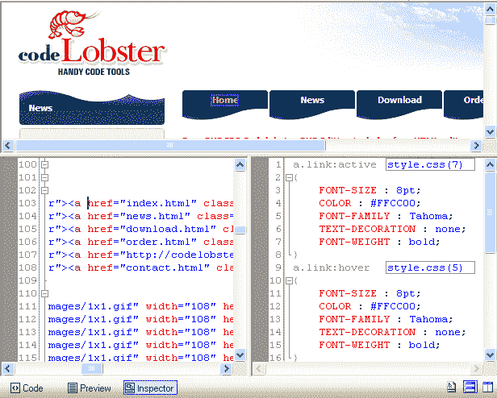

# PHP IDEs: CodeLobster PHP Edition 还是 JetBrains PhpStorm？

> 原文：<https://thenewstack.io/an-ide-for-php/>

在当今世界中，那些敢于为 PHP 开发集成开发环境的人所签约的不仅仅是一个 PHP 编辑器、调试器和一些支持工具。通常，PHP 开发人员的堆栈还包括 HTML、CSS、JavaScript 和一些 SQL 更不用说任何数量的前端预处理器或者模型视图控制器(MVC)框架了。

这意味着任何 PHP 开发环境要想在编辑器和 ide 的庞大生态系统中有所作为，就应该为所有这些相邻的技术提供插件和便利的特性。

有几个开发环境符合这些标准: [CodeLobster PHP Edition](http://www.codelobster.com/) 、 [JetBrains PhpStorm](https://www.jetbrains.com/phpstorm/) 和 [Adobe Dreamweaver](http://www.adobe.com/products/dreamweaver.html) 。

由于 Dreamweaver 在实际编码过程中提供了如此多的抽象，我们将把分析的重点转移到 CodeLobster 和 PhpStorm 上。

CodeLobster 对每一个主要的 PHP MVC 框架都有插件支持，同时还有越来越多的 JavaScript 库的插件。这种插件支持在 PHP IDE 中很难找到，所以毫不奇怪，你必须购买 CodeLobster 的 99 美元顶级许可证才能使用它们。

CodeLobster 的 HTML/CSS 代码检查器。

该许可还将允许您使用子层特性，在这种情况下，子层特性包括版本控制和 CSS 预处理器支持等。

JetBrains PhpStorm 带来了所有这些特性，但在插件部分提供了超过 250 个插件，更加有力。与 PhpStorm 相关联的还有使用 [PHPUnit](https://phpunit.de/) 的集成测试；生产代码库的一个重要特性。

PhpStorm 的许可必须每年更新一次，从 89 美元开始，第三年以后降到 53 美元。想要商业执照？根据用户数量的不同，价格可能会从 199 美元不等。然而，重要的一点是，学生、教师和创业公司可以完全免费获得许可证。

虽然 PhpStorm 的年度许可模式加起来是一大笔钱，但从长远来看，该公司对企业市场之外的开发人员的考虑是令人钦佩的。

CodeLobster 采取了一种免费增值的方式，提供一个淡化版本的软件，除非你购买了他们的两个许可证之一——[Lite 或 Professional](http://www.codelobster.com/order.html) 。精简版售价 39.95 美元，专业版售价 99.95 美元。

CodeLobster 最奇怪的地方是它只适用于 Windows。在搜索未来的 Unix 支持时，我偶然发现了一个 CodeLobster 官方论坛，在那里，一个 Mac 和 Linux 用户社区正在询问并愿意在必要时将 CodeLobster 移植到 Unix。Codelobster Inc .对此并不感兴趣，甚至发表了一份官方声明，称“我们认为 Linux 用户没有为二手软件付费的习惯。因此，我们不会开发(一个)Linux 版本。”

在克服了如此多的与 PHP IDEs 相关的挑战之后，CodeLobster 选择排除如此大部分的编程社区，这似乎很奇怪。考虑到 JetBrains 为 PHP IDE 领域提供了一个全功能和完全跨平台的解决方案，我认为 CodeLobster 可能会在未来开始感到收缩。

特征图片:[来自 JetBrains 的 PHP form IDE](https://www.jetbrains.com/phpstorm/)。

<svg xmlns:xlink="http://www.w3.org/1999/xlink" viewBox="0 0 68 31" version="1.1"><title>Group</title> <desc>Created with Sketch.</desc></svg>