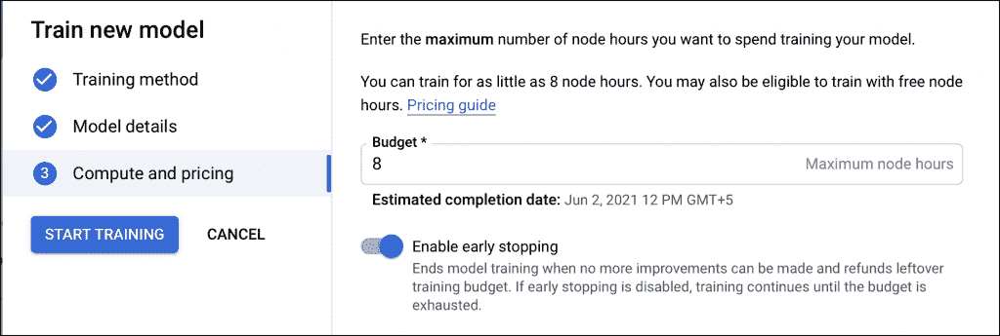
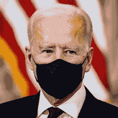

# Google Vertex AI AutoML 简介:训练和推理

> 原文：<https://thenewstack.io/an-introduction-to-google-vertex-ai-automl-training-and-inference/>

这篇文章是探索谷歌新推出的 Vertex AI 的两部分系列的第二部分，这是一个统一的机器学习和深度学习平台。这篇文章深入研究了训练和推理过程。阅读上一期关于数据准备的文章，

[here](https://thenewstack.io/a-tutorial-introduction-to-google-vertex-ai-automl-data-preparation/)

.

谷歌的 Vertex AI 是一个统一的机器学习和深度学习平台，支持 AutoML 模型和定制模型。在本教程中，我们将训练一个图像分类模型，用顶点人工智能自动检测人脸面具。

要完成本教程，您需要在工作站上安装有效的 Google Cloud 订阅和 Google Cloud SDK。

训练此模型涉及三个步骤-数据集创建、训练和推理。

参考教程的[前一部分，完成数据集创建步骤。本教程将重点介绍模型的训练和推理。](https://thenewstack.io/a-tutorial-introduction-to-google-vertex-ai-automl-data-preparation/)

数据集准备就绪后，让我们首先单击“训练新模型”按钮:


在下一步中，选择 AutoML 并单击继续:


为模型命名，并保留数据分割的默认值:


让我们为培训提供八小时的节点预算。当模型精度达到令人满意的水平时，确保能够提前停止以完成训练；



最后，开始培训，并等待工作完成后发送的电子邮件:


该模型现在已经过训练，并且在 Vertex AI 仪表板中可用:


随意探索诸如精确度、召回率和混淆矩阵等属性:


让我们继续部署模型来测试准确性。在“部署和测试”部分，单击“部署到端点:


通过为端点命名、100%流量分流和一个计算节点来配置端点。


等待端点准备好通过上传图像来测试模型:


上传戴面具和不戴面具的人脸图像，玩玩模型:


现在让我们使用 cURL 从命令行调用模型端点。

创建一个 JSON 对象来保存图像数据。它应该是 base64 编码的字符串。

将 base-64 编码的字符串放在一个名为`input.json`的文件中，用该字符串填充内容元素。

```
{
  "instances":  [{
    "content":  ""
  }],
  "parameters":  {
    "confidenceThreshold":  0.5,
    "maxPredictions":  5
  }
}

```

为端点 id、项目 id、区域和输入 JSON 文件设置环境变量。

```
#replace with your model endpoint
ENDPOINT_ID=""
#replace with your project id 
PROJECT_ID=""  
REGION="europe-west4"
INPUT_DATA_FILE="input.json"

```

生成 cURL 请求并评估响应。

```
curl  \
-X  POST  \
-H  "Authorization: Bearer $(gcloud auth print-access-token)"  \
-H  "Content-Type: application/json"  \
https://$REGION-aiplatform.googleapis.com/v1alpha1/projects/${PROJECT_ID}/locations/$REGION/endpoints/${ENDPOINT_ID}:predict \
-d  "@${INPUT_DATA_FILE}"

```

我从美国总统乔·拜登戴着面具的样图中得到了以下回应:



如你所见，该模型以 82%的置信度正确预测了带有面罩的图像:


这个模型现在可以用于任何可以调用 REST 端点的应用程序。

在即将到来的一个教程中，我们将创建一个顶点 AI 自定义模型，来训练一个卷积神经网络来检测人脸面具。敬请关注。

<svg xmlns:xlink="http://www.w3.org/1999/xlink" viewBox="0 0 68 31" version="1.1"><title>Group</title> <desc>Created with Sketch.</desc></svg>