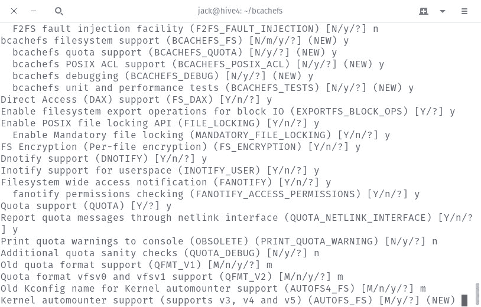

# 介绍新的 Linux 文件系统 bcachefs

> 原文：<https://thenewstack.io/an-introduction-to-new-linux-filesystem-bcachefs/>

如果您使用 Linux 的时间足够长，那么您可能已经体验过许多不同类型的文件系统。当我第一次开始使用 Linux 时(回到 1997 年)，文件系统的选择大多局限于 ext2。现在有了 ext4、btrfs、ZFS、xfs、jfs 等等。这是一个很大的选择——尤其是考虑到 Windows 和 macOS 往往只有一个选项可用。

当然，还有另一种选择正在兴起。这个新的文件系统由 Kent Overstreet 创建，称为 bcachefs。Bcachefs 是一个写时拷贝(COW)文件系统，它重视可靠性和健壮性。bcachefs 的特性列表令人印象深刻:

*   完整数据和元数据校验和
*   RAID 支持
*   贮藏
*   分层/写回压缩
*   分身术
*   加密
*   给…拍快照
*   可扩展(测试容量超过 50 TB)
*   还有更多。

## 何必呢？

尽管 bcachefs 相对较新，但它相当稳定，并且已经拥有了一个不断增长的用户群体。但是很可能出现在每个 Linux 用户脑海中的一个大问题是，“为什么要这么麻烦？”根据 Overstreet 的说法，“bcachefs 的巨大优势是 bcache 已经是文件系统的下半部分，它快速、稳定，并且有足够大的用户群来证明这一点，并且有一个测试套件可以测试为支持文件系统而对现有功能进行的任何更改。”

注意:Bcache 是 Linux 内核块层中的一个缓存系统，用于访问辅助存储设备，并允许一个或多个快速存储设备(如 SSD)充当较慢设备(如老式 HDs)的缓存。

引入 bcache 的最大原因是创建一个文件系统，其特性集可以与 ZFS 和 btrfs 相媲美，同时享受 ext4 文件系统的性能。这并非易事，但这是奥弗斯特里特即将完成的一项任务。根据最新的 [Phoronix 基准测试](https://www.phoronix.com/scan.php?page=article&item=bcachefs-linux-2019&num=2)，bcachefs 还有一段路要走，但它显示出了希望。事实上，根据测试，bcachefs 已经可以胜过许多其他文件系统。

## 克服尾部延迟

此外，根据 Overstreet 的说法，基准测试没有显示的是“bcachefs 在设计时很大程度上考虑了尾部延迟。”什么是尾部潜伏期？通常，在大型系统中，数据分布在多个存储设备上。当用户或服务请求数据时，所述数据是在整个系统中以比特和片断的形式被请求的。在这个请求之后，有一个(非常短暂的)等待响应的过程。响应请求最慢的驱动器会导致响应延迟。这种延迟就是尾部延迟。

bcachefs 文件系统试图克服尾部延迟。根据 Overstreet 的说法，“在 bcachefs 中，线程在 IO 上阻塞的唯一原因是因为它被显式请求(未缓存的读取或 fsync 操作)，或者资源耗尽—完全停止。”

克服尾部延迟将是云计算的福音。Zeqi Lai、、Minming Li、Zhenhau Li、Ningwei Dai 和 Yuchi Chen 在他们的论文[Tail cutter:Wisely Cutting Tail Latency in cloud cdn with Cost Constraints](http://www.greenorbs.org/people/lzh/papers/%5BINFOCOM%2716%5D%20TailCutter.pdf)中指出:“高延迟变化的影响对于流行的应用程序来说是有问题的，在这些应用程序中，即使 1%的流量也对应于大量的用户请求，对于要求用户下载多个对象的应用程序来说也是如此……”

由于尾部延迟是一个问题，云实施可能会受到延迟的影响…尤其是在大规模实施时。假设数百万用户请求对象，结果这些请求被存储链中最薄弱的环节延迟了。Bcachefs 可以解决这个问题。

*可能*是操作术语。因为这个新的文件系统仍然处于测试阶段，所以测试是一个挑战。

说到这个…

## 准备好了吗？

不。尽管可以在系统上安装 bcachefs，但这是一个相当复杂的过程，而且文件系统还没有完全准备好投入生产。尽管许多功能已经 100%实现，但有些功能仍在开发中。其中一些功能及其状态包括:

*   复制完成了 80%。
*   擦除编码尚未开始。
*   加密尚未开始。
*   快照正在进行中。
*   PMEM 支持尚未启动。
*   Reflink(对浅拷贝使用共享的、引用计数的扩展)于 2019 年 8 月 21 日正式完成。

很明显，bcachefs 还没有准备好迎接黄金时段。这很容易理解，因为这个新的文件系统只由 Overstreet 开发。目前，即使是 bcachefs 的文档也非常少。

## 如果你想试试

如果你是那种大胆的人(而且你有大量的空闲时间)，你总是可以测试 bcachefs。要做到这一点，你需要通过几道关卡(其中之一就是编译内核)。不要在生产机器上这样做。使用虚拟机或备用服务器或桌面来测试 bcachefs。

我用以下步骤在 Ubuntu Server 18.04 上成功测试了 bcachefs:

使用以下命令安装必要的依赖项:

```
sudo apt-get install devscripts gcc git libaio-dev libattr1-dev libblkid-dev libkeyutils-dev liblz4-dev libscrypt-dev libsodium-dev liburcu-dev libzstd-dev make pkg-config uuid-dev zlib1g-dev make  -y

```

使用命令克隆 bachefs 和 bcachefs-tools 源代码:

```
git clone https://evilpiepirate.org/git/bcachefs-tools.git
git clone https://evilpiepirate.org/git/bcachefs.git

```

使用以下命令构建 bcachefs 用户空间实用程序:

```
cd  ~/bcachefs-tools
make deb
cd  ..

```

使用命令复制当前内核配置:

```
sudo cp  /boot/config-XXX-generic  ~/bcachefs

```

其中 XXX 是您系统上的内核版本。

现在是配置内核的时候了。使用命令进入 bcachefs 目录:

现在发出命令:

这是需要相当长时间的安装部分。你将不得不回答很多问题。请密切注意结尾，因为那是您能够启用 bcachefs 支持的时候(**图 1** )。

**图一**



在内核中启用 bcachefs 支持。

一旦完成，用命令:
构建内核

同样，上述步骤需要相当长的时间。一旦完成，用下面的命令安装您的新内核:

```
cd  ..
sudo dpkg  --install bcachefs-tools*.deb linux-image-X*.deb linux-libc-dev*.deb
sudo update-grub

```

其中 X 是编译后内核的发布号。当上面的命令完成时，您可以重新启动到新编译的内核，并通过创建一个新的分区然后运行命令来尝试 bcachefs:

```
sudo bcachefs format  /dev/XXX

```

其中 XXX 是新创建的分区的名称。

一旦完成，就可以创建挂载点，添加 fstab 条目，挂载新创建的分区，并体验 bcachefs 文件系统。只要确保向开发人员报告任何发现的错误。

<svg xmlns:xlink="http://www.w3.org/1999/xlink" viewBox="0 0 68 31" version="1.1"><title>Group</title> <desc>Created with Sketch.</desc></svg>