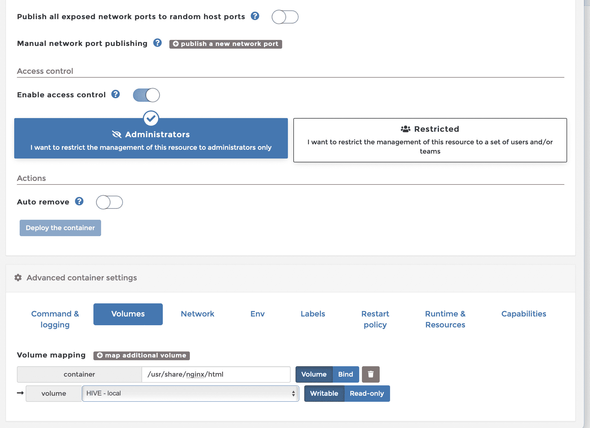
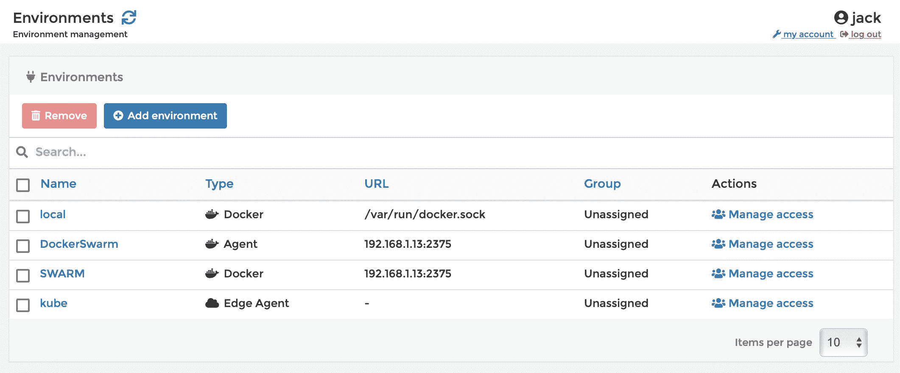

# Portainer，一个用于 Docker 管理的 GUI

> 原文：<https://thenewstack.io/an-introduction-to-portainer-a-gui-for-docker-management/>

当大多数开发人员和管理员考虑部署、管理和使用 Docker 容器时，他们首先考虑的是命令行。毕竟，Docker 最初是作为一个命令行工具创建的，你可以从 CLI(命令行界面)使用 Docker。Docker CLI 快速、灵活，可以在任何支持 Docker 运行时引擎的机器上使用。考虑到许多人使用的容器来自第三方云主机，这些主机通常不为容器环境提供 GUI 工具，所以从命令行管理您的部署非常有意义。

但是并不是每个管理员、开发人员和用户都喜欢命令行。当然，当你第一次学习 Docker 的细节时，你当然应该从命令行开始。毕竟，没有比 CLI 更好的方法来学习如何部署和管理容器了。尽管如此，当您非常忙碌时，命令行工具会变得有点笨拙。除此之外，当从命令行使用时，一些高级 Docker 特性可能会变得有点麻烦。

这就是为什么一些公司已经生产了各种类型的 GUI 工具来帮助管理容器。这些工具从过于简单到极其复杂，从功能丰富到功能缺乏(以及介于两者之间的任何东西)。

例如，你可能遇到过官方的 [Docker 桌面](https://www.docker.com/products/docker-desktop/)客户端。尽管这是一个管理当前部署的容器的好工具，但它实际上并没有提供在 GUI 中构建新容器部署的选项。换句话说，您必须从命令行部署您的容器，然后您可以从 Docker 桌面 GUI 中管理它们。虽然这个桌面客户端是一个可靠的入口，但它并不是一个允许您管理 Docker 容器每个方面的一站式工具。

这就是像 [Portainer](https://www.portainer.io/) 这样的工具派上用场的地方。

我已经在 TNS 上的一系列教程中介绍了 Portainer 的许多方面，包括 Portainer 的[部署](https://thenewstack.io/deploy-portainer-for-easier-container-management/)，[用 Portainer 部署全栈应用](https://thenewstack.io/deploy-a-full-stack-application-with-portainer/)，[用 Portainer 管理秘密](https://thenewstack.io/container-security-manage-secrets-with-portainer/)，[在 Portainer 中创建和使用卷](https://thenewstack.io/how-to-create-and-use-container-volumes-within-portainer/)，以及[用 Portainer 管理 Docker Swarm】，甚至](https://thenewstack.io/tutorial-manage-docker-swarm-with-portainer/)[用 Portainer 管理 Kubernetes】。当然，还会有更多。](https://thenewstack.io/portainer-how-to-add-a-kubernetes-environment/)

## 什么是 Portainer？

Portainer 是一个通用的容器管理工具，它可以与 Docker 和 Kubernetes 一起工作，使容器化应用程序和服务的部署和管理更加容易和高效。Portainer 拥有超过 650，000 名用户和 21，700 颗 GitHub 星，因此它被广泛使用和受欢迎。

在过去的一年中，Portainer 已经成为我管理容器部署的首选工具。其中一个主要原因是 Portainer 实际上使得使用容器变得可以理解。对我来说，这使它成为所有技能水平的管理员和开发人员的明显的管理平台。

> 你很难找到比 Portainer 功能更丰富、更易于使用的容器管理 GUI。

使用 Portainer，您可以:

*   降低单集群和多集群容器部署的复杂性。
*   使用用户友好的用户界面。
*   借助模板和默认配置整理最佳实践。
*   更加稳定可靠地工作。
*   应用集中的访问管理和权限。

Portainer 使以下工作变得相当容易:

*   部署和管理容器。
*   部署和管理全栈应用。
*   创建和管理网络。
*   创建和管理卷。
*   创建和管理模板。
*   创建和管理服务。
*   创造和管理秘密。
*   创建和管理环境变量。
*   创建和管理配置(针对非敏感信息)。
*   从各种存储库中提取和管理图像。
*   管理用户。
*   创建和管理环境。

如您所见，使用 Portainer 没有什么做不到的。

## Portainer 工作流程

我最喜欢 Portainer 的一个方面是它如何简化容器部署和管理工作流。例如，我可以下载一个映像，创建一个网络，添加一个卷，创建并保存秘密，然后构建并部署一个容器或一个全栈应用程序，利用我已经创建的一切(**图 1** )。

图 1:构建一个新的容器部署，它利用了我已经创建的元素，比如一个卷。

这些项目中的许多可以很容易地在其他部署中重用。我可以使用 GUI 选择元素、添加环境变量，甚至配置各种选项，如重启策略、标签、工作目录、用户等等，而不必构建复杂的清单来包含部署的各个方面。

Portainer 还使得管理对容器元素的访问变得非常容易。您可以授予所有用户完全访问权限，也可以限制系统中特定用户或组的访问权限。有了这个特性，您可以基于每个任务或部门创建特定的组，然后创建仅由这些组访问的各种元素。有了 [Portainer 商务版](https://www.portainer.io/pricing-new)，你也可以访问 RBAC。同样，您可以创建各种环境(**图 2** )，然后为每个环境分配特定的用户。

图 2:不同类型的环境被添加到 Portainer 中。

例如，您可以创建一个供开发人员使用的简单本地环境，然后只允许开发人员访问它。您还可以创建一个 Kubernetes 环境，并为其分配特定的管理员。或者，您可以创建一个附加到 Microsoft Azure 的环境，并将其分配给一组受信任的管理员/开发人员。

## 结论

你很难找到比 Portainer 功能更丰富、更易于使用的容器管理 GUI。在我看来，这个免费工具使任何人都有可能更快地掌握容器部署，而且比任何其他工具都更容易。无论你是刚开始使用容器，还是老用户，Portainer 都应该是第一个(也是最后一个)基于 web 的贵由考虑的对象。

<svg xmlns:xlink="http://www.w3.org/1999/xlink" viewBox="0 0 68 31" version="1.1"><title>Group</title> <desc>Created with Sketch.</desc></svg>