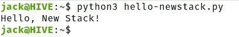

# 面向非程序员的 Python 介绍

> 原文：<https://thenewstack.io/an-introduction-to-python-for-non-programmers/>

欢迎阅读非程序员 Python 系列的第一篇文章。

如果你正在读这篇文章，你可能已经对编程产生了好奇心，并且正在寻找一个好的起点。我有好消息告诉你。Python 是开始这一旅程的最佳语言之一。为什么？我们一会儿会谈到这一点。但是首先，让我们来看看这种语言到底是什么，能做什么。

Python 是所谓的高级通用编程语言。让我们来分解一下这个定义。

一、什么是高级语言？让我们考虑一下这个:

在底部，你有计算机硬件，它只能理解所谓的“机器语言”因为机器语言(或机器代码)非常接近硬件，所以它被认为是低级语言(因为它存在于如此低的级别)。

随着你从低级上升，语言变得高级，因为它们是从硬件中抽象出来的。高级语言不需要查看或访问计算机的细节。如果有的话，它们会很难使用。

高级语言:

*   对程序员友好并且更容易理解。
*   内存效率较低。
*   更容易调试。
*   相对容易维护。
*   是可移植的(因此它们可以在任何支持平台上运行)
*   需要编译器或解释器。
*   被广泛使用。

因此，Python 作为一种高级语言，已经在用户友好性方面占了先机。

我们的下一个定义是通用。通用语言是一种用于解决各种问题的计算机语言。换句话说，你可以用通用语言做很多事情。

将这两者结合在一起，Python 就是一种可以轻松用于多种用途的编程语言。但是 Python 不仅仅是因为它是一种高级语言而易于使用。

## 是什么让 Python 这么好用？

Python 如此容易使用的主要原因之一是因为它读起来几乎像英语。Python 有一个非常清晰易懂的语法，用于 web 开发人员、桌面开发人员、游戏开发人员、数据科学家等等。随着 Python 的广泛使用，它有了一个非常大的社区，所以帮助永远不会远离。

因此，Python 易于阅读，到处都可以使用，并且有大量的社区支持。事实上，在所有编程语言中，Python 几乎总是被认为是最容易学习的。

画面越来越清晰。

说了这么多，让我们来介绍一下 Python。

## 解释语言

Python 有别于许多其他语言的另一点是，它是一种解释型语言。这意味着 Python 不需要编译器，所以你编写代码并运行它。这也意味着你必须安装 Python。如果您没有安装 python，如果您创建了 hello-newstack.py 文件，它将没有任何用处。然而，安装了 Python 之后，您可以创建文件、添加代码并运行它(无需首先编译它)。

让我们看一下这个非常简单的例子。

## 你好，新堆栈！

最广泛使用的例子之一(对于几乎任何编程语言)是 Hello，World！举例。这个简单的应用程序只做一件事——它在终端中打印出一行文本。为了做到这一点，Python 使用了所谓的函数，这是一组预先捆绑在一起实现特定结果的指令。这意味着程序员不必创造一切。

让我更简单地解释一下。我们拿乐高玩具来说吧。当你买一套乐高玩具时，它会附带一堆你可以用来组成物体的砖块。但是在这个工具包里，你还会发现一些特殊的部件，可以用来建造特殊的东西。例如，你会发现头、手、躯干、手臂和腿，这使得建造乐高人变得很容易。想象一下，如果你必须用附带的乐高积木来建造这些人，那要花多少时间。这不仅更具挑战性，而且人看起来也不像人(更像块状机器人)。

把那些特殊的“人的部分”想象成函数。你也可以考虑一些特殊的功能，使制造汽车、飞机、火箭或国际空间站变得更容易。

回到我们的例子。

对于 Hello，World 应用程序，我们只需要使用一个函数`print()`，它告诉解释器打印出()之间的内容。因此，在我们的 Hello，New Stack 示例中，该函数的用法如下:

`print('Hello, New Stack!')`

那是一行 Python 代码。更确切地说，这是您在 Hello，World 示例中需要的唯一一行*Python 代码。当然，优秀的开发人员也会记录他们的代码，所以我们不会仅仅添加那一行代码，而是以类似于
这样的代码开头*

```
#Print out the text "Hello, New Stack!".

```

让我们把这些放在一起。打开终端窗口，使用以下命令创建新文件:

nano hello-newstack.py

在该文件中，粘贴以下内容:

```
#Print out the text "Hello, New Stack!".
print('Hello, New Stack!')

```

使用[Ctrl]+[x]快捷键保存并关闭文件。

还记得我说过 python 文件(以。py)不装 Python 有什么好处吗？让我们安装它。我将在 Ubuntu Linux 20.04 上演示。回到终端窗口，发出以下命令:

`sudo apt-get install python3 -y`

现在，我们可以使用以下命令运行新的 Python 应用程序:

`python3 hello-newstack.py`

该命令的输出将简单地打印 Hello，New Stack！(**图一**)。



图 1:我们的新 Python 应用程序成功运行了！

恭喜你，你已经迈出了使用 Python 的第一步，而且你是在不了解任何计算机编程的情况下做到这一点的。在本系列的下一篇文章中，我们将学习更多关于这门语言的知识，以及如何创建一个稍微复杂一点的应用程序。

<svg xmlns:xlink="http://www.w3.org/1999/xlink" viewBox="0 0 68 31" version="1.1"><title>Group</title> <desc>Created with Sketch.</desc></svg>