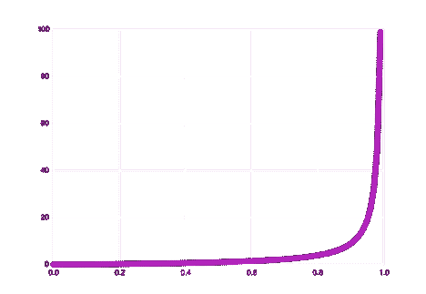

# 为什么灾难发生在边缘:排队论导论

> 原文：<https://thenewstack.io/an-introduction-to-queue-theory-why-disaster-happens-at-the-edges/>

技术专家喜欢速度和反馈:大容量缓存、大规模并行处理器、千兆赫、千兆位、千兆字节和万亿次浮点运算。

但是在现实世界的应用中，用户体验对原始能力的依赖比我们通常认为的要少。延迟峰值、旋转车轮、网站超时——这些问题通常不是资源不足的结果，而是队列管理不善的结果。

## 当我们谈论性能时，我们谈论的是什么

 [阿维沙伊什-沙洛姆

在一个任何东西都有 API 的世界里，任何东西都是软件问题。在 Avishai Ish-Shalom 的整个职业生涯中，这种洞察力一直指导着他致力于改善创建和操作现代软件的复杂社会技术系统，并促进数学在系统设计和操作中的应用。Avishai 在各种软件领域和岗位上工作了 15 年，曾担任 Aleph VC 的常驻工程师和 Wix.com 的工程经理，共同创立了 Fewbytes，并为许多其他公司提供软件运营、可靠性、设计和文化方面的咨询。目前，Avishai 是高性能“锡拉 NoSQL”数据库制造商“锡拉数据库”的开发者支持者。](https://www.linkedin.com/in/nukemberg) 

要了解原因，我们必须关注正确的指标。特别是，我们必须超越平均水平。

说到 it 性能，业余爱好者看的是平均值。专业人士看分布。

自然界充满了分布。暴风雨或多或少会很猛烈。气温年年不同。没有什么事情每次都以完全相同的方式发生。

每个分布都可以描述为一条曲线。这条曲线的宽度称为它的方差。更常见的结果聚集在峰值附近。不常见的位于尾部更远处。曲线越陡，方差越低，反之亦然。

关注曲线的峰值是很有诱惑力的。大部分结果都在那里。但是边缘是行动的地方。尾部事件发生的频率可能会降低，但还是会发生。在数字系统中，数十亿个事件在几秒钟内发生，百万分之一的事件一直在发生。它们对用户体验有着巨大的影响。

> 说到 it 性能，业余爱好者看的是平均值。专业人士看分布。

片刻的思考解释了为什么。顾名思义，平均结果是不起眼的。他们是人们习以为常的人——他们不会注意到的人。人们注意到的是异常值，尤其是负异常值。

正如链条的强度取决于其最薄弱的环节，系统的效率取决于其最糟糕的情况。如果您有一个平均延迟为 1 毫秒的数据库，用户不会记得它在 0.5 毫秒到 1.5 毫秒之间返回结果的所有时间。他们记得的是当延迟达到 5 秒或更长时的体验。

系统中的差异越大，离群体验就越多——处理或避免它们的代价就越大。

## 差异的成本

想象一下一列行驶在伦敦和巴黎之间的火车。假设点对点，旅程需要 120 分钟，平均行程延迟 15 分钟。现在假设在所有行程的分布中，最长的 5%延误 60 分钟以上。我们称之为 60 分的“P95”。假设最长的 1%的行程延误了 120 分钟或更多，那么我们的 P99 就是 120。在这种情况下，我们可以预计每 100 次旅行中有一次会比平均时间多花将近两个小时。

现在想象一下，火车公司有一份合同，规定火车在 100 次旅行中不能晚点超过 1 次。为了履行合同条款，火车每次都需要提前两个小时出发。这意味着我们可以预计，在 100 次旅行中，有 95 次火车将比需要的时间至少提前一个小时离开。对于一个只发生 1%的问题来说，这是一个很大的麻烦和不便。

现在用 IT 术语来说，用系统流程代替火车，用 SLA 代替合同，用等待时间代替延迟。就像火车有时会比平时晚点一样，流程有时会比平时花更长的时间来完成。性能差异越大，延迟的可能性就越大，当任务到达时，资源被占用的可能性就越大。我们称之为利用率，计算方法是到达率(作业到达的频率)除以服务率(作业被服务的频率)。利用率越高，等待处理作业的时间就越长。

这种现象特别影响团队工作流程，如 MapReduce 或 fork-join 或任何最初并行化工作的流程，然后不得不在最后等待掉队者。对于包含 1，000 个任务的 MapReduce 作业，即使其中一个任务延迟，整个作业也会延迟相同的时间。在这种情况下，衡量工作总体完成时间(以及客户满意度)的指标不是平均值，而是 P999。而且这种情况并不少见！在我们的 1000 个任务的工作中，至少有一个任务达到 p99 性能水平的可能性为 99.9%，达到 P999 的可能性为 63.2%。

这就是为什么超越平均水平如此重要，也是为什么人们常说“灾难发生在边缘”困扰你的不是平均延迟。是尾部潜伏期。

所以问题是，我们如何管理它？答案来自对排队论的研究。

## 排队和延迟

排队论出现于 20 世纪初，源于确定总机电话服务最有效操作的研究。

在数字系统中，队列无处不在:执行器、套接字、锁。任何异步运行的进程都可能依赖于队列。

队列本质上是一个工作器(在排队论中称为服务中心)，它从等待作业的缓冲区中取出作业。

队列的性能取决于几个因素，包括:

*   到达率:在一定时间内有多少作业到达队列
*   服务率:在一定时间内可以服务多少工作
*   服务时间:处理每项工作需要多长时间
*   服务原则:工作的优先级(先进先出/后进先出/优先级)

我们将延迟定义为任务在队列中等待的时间加上处理它所花费的时间。排队论的一个值得注意的发现是，当利用率接近 100%时，延迟接近无穷大。起初，潜伏期缓慢上升，但随后在较高的百分位数，它急剧增加，正如我们可以从图 1 中看到的

图一。

W =等待时间

𝜏 =平均服务时间

ρ =利用率

这表明了一个重要的经验法则:为了获得良好的性能质量，将利用率保持在 75%以下。这意味着供应，不是针对典型负载，而是针对极端负载。如果没有产能过剩，就会形成队列，延迟也会增加。

从图 1 中我们还可以看到，延迟不仅与利用率成比例，还与服务时间成比例。如果您的服务特别快，就有可能实现合理的延迟和高利用率。但是你需要小心。在𝜌 = 0.5 时，利用率 10%的波动几乎不会影响延迟(约 1.1 倍)，而在𝜌 = 0.9 时，10%的波动会影响性能(约 10 倍)。

因此，当以高利用率运行时，必须尽可能地限制差异。在包含多个部分的系统中，较慢的流程应该以较低的利用率运行，而较快的流程可以以较高的利用率运行。

当我们谈到利用率的变化时，我们称之为“缓慢变化”。“毕竟，利用率代表一段时间内的平均值。但是记住快速变化也很重要。即使平均利用率相同，到达率和服务率的差异也会对延迟产生重大影响。下面的图 2 说明了每个变量对延迟的影响。

图 2: C 是变异系数。

首先要注意的是，具有较低变化的服务(那些具有较低 c 值的服务)可以平衡较高的利用率水平——但只是在一定程度上。在最高利用率级别(p 0.9)，服务速度相对较小的变化会导致延迟显著增加。

服务速度也是如此。当利用率接近 1.0 时，延迟会向无穷大摆动。但是随着利用率的增加，较慢的服务更容易受到延迟高峰的影响。

教训:无论来源如何，差异都是表现的敌人。

## 不断扩大的队列

正如我们所见，进程有时运行得更快，有时运行得更慢。类似地，作业以不同的速率到达队列。随着时间的推移，延迟越来越多，队列越来越长。这引发了另一个重要的考虑:队列几乎总是空的或满的。在数字系统中，它们填充得如此之快，以至于很难看到一个处于中间状态。

至少，大队列会导致更高的延迟。它们还会产生陈旧结果的风险。当一个 10 秒钟的工作完成时，客户机可能不再需要结果了。也许用户已经导航到另一个网页。

考虑到它们增长的速度，无限长的队列尤其危险。即使是轻微的过载也会像滚雪球一样迅速失控，导致内存压力，并最终导致内存不足的情况。不幸的是，无限队列非常普遍。例如，Java 执行器默认拥有无限的队列。

因此，我们可以采取的一个简单的预防措施是限制队列的大小。第二种方法是为工作项设置一个生存时间(TTL ),并让流程丢弃任何超出限制的作业。

## 反压力

到目前为止，我们已经讨论了队列的内部工作方式。但是在现实世界的系统中，您有多个为彼此生成工作负载的服务，每个服务都有自己的队列和可变的性能范围。理想情况下，服务将避免为其下游的其他服务创建额外的工作负载。

这种方式被称为“背压”这是下游服务在队列已满时通知上游系统的过程。上游服务然后通知其上游的服务，依此类推。

例如，TCP 协议生成代码为 503 的背压。线程池可以通过简单地限制池的大小来实现背压。默认情况下，阻塞代码在每个线程的基础上有反压力，它会通过阻塞链自然地反向传播。

但是像 Kafka 这样的系统默认是没有背压的。幸运的是，有几个开源项目在 Kafka 中实现了背压，因此 web 服务器知道系统中何时出现了过载。

接下来的问题是如何应对。这基本上是延迟和错误率之间的权衡。如果我们不返回错误，或者找到一种替代方法来减少额外的负载，那么延迟将不可避免地增加。

正如我们已经看到的，一种方法是限制队列大小，并放弃任何超过限制的作业。这可以通过在 web 服务器上实现一个队列并让服务器为任何超过上限的请求返回一个 HTTP 503 响应来实现。或者，服务器可以呈现结果的缓存版本，或者将请求发送到回退服务。无论如何处理，目标都是从过载的队列中移除多余的请求。

另一个密切相关的方法是抑制到达率。我们可以计算在给定的时间内队列可以处理多少工作，并在到达率超过目标时开始卸载，而不是控制队列中作业的绝对数量。

## 外卖食品

总而言之:差异是性能的敌人，也是我们在使用软件时遇到的大部分延迟的来源。

要将延迟降至最低:

*   根据经验，目标利用率低于 75%，
*   将较慢的工作负载转移到利用率较低的路径，
*   当利用率高时，尽可能地限制变化，
*   在没有内置背压的系统中实施背压，
*   使用节流和减载来减轻下游队列的压力。

由此可见，开发人员应该致力于设计和实现不仅能提供高平均性能，而且能提供一致性能的软件，也就是说，具有低方差的软件。即使方差的增量减少也比原始平均速度的等量增加更能改善用户体验。

这个意思不是没有意义的。只是骗人的。要改变用户体验，你要努力的地方不是曲线的中间，而是两端。这是罕见的事件——离群值——告诉你你需要知道什么。

由[凯利·西克玛](https://unsplash.com/@kellysikkema?utm_source=unsplash&utm_medium=referral&utm_content=creditCopyText)在 [Unsplash](https://unsplash.com/s/photos/disaster?utm_source=unsplash&utm_medium=referral&utm_content=creditCopyText) 上拍摄的特写图片。

<svg xmlns:xlink="http://www.w3.org/1999/xlink" viewBox="0 0 68 31" version="1.1"><title>Group</title> <desc>Created with Sketch.</desc></svg>