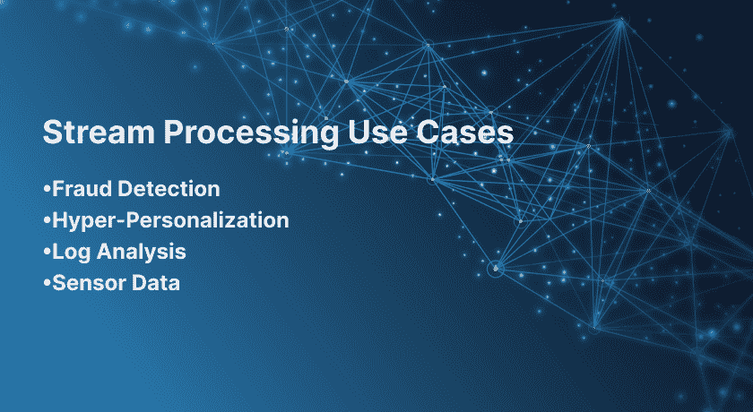

# 流处理简介

> 原文：<https://thenewstack.io/an-introduction-to-stream-processing/>

阿洛克·帕雷克

Alok Pareek 是 Striim 的创始人和产品主管。在加入 Striim 之前，Alok 曾在 Oracle 服务器技术开发部门担任副总裁，全面负责产品战略、管理以及数据集成和数据复制产品的愿景。Alok 还领导工程和性能团队，与全球战略客户在架构、解决方案和未来产品功能方面进行合作。Alok 是 GoldenGate 的技术副总裁，从 2004 年到 2009 年被甲骨文收购，他一直领导着 golden gate 的技术愿景和战略。他最初是 Oracle 内核开发团队的一名工程师，从事重做生成、恢复和高速数据移动工作超过十年。他拥有多项专利，发表了多篇论文，并在众多学术和行业会议上发表过论文。Alok 拥有斯坦福大学的计算机科学研究生学位。

全球各行各业产生了数量惊人的数据，并且还在以指数速度增长。这些大数据通常以实时流的形式出现，称为**流数据**，它已成为现代企业数据架构的重要组成部分，也是分析和数据科学的核心数据源。这些实时数据可以来自服务器日志、物联网传感器以及网站和应用的点击流数据。跟踪和分析这些数据已经成为支持企业数据科学不可或缺的一部分。

然而，由于两个原因，处理流数据很棘手。首先，您必须从每分钟都会生成事件的流源中收集大量数据。其次，在其原始形式中，流数据缺乏结构和模式，这使得使用分析工具进行查询很困难。

如今，在进行适当的分析之前，越来越需要处理、解析和结构化流数据。例如，当有人使用打车应用程序时会发生什么？该应用程序使用位置跟踪、交通数据和定价的实时数据来提供最合适的司机。它还根据实时和历史数据估计到达目的地需要多长时间。从用户端开始的整个过程需要几秒钟。但是，如果应用程序未能按时收集和处理这些数据，该怎么办呢？如果数据处理不是实时进行的，这个应用程序就没有任何价值。

传统上，面向批处理的方法用于数据处理。然而，这些方法无法处理实时生成的大量数据流。为了解决这些问题，许多组织转向流处理架构，将其作为处理大量传入数据并为最终用户提供实时洞察的有效解决方案。

## **什么是流处理？**

流处理是一种不断收集和处理实时或近实时数据的范例。它可以从多个来源收集数据流，并快速转换或结构化这些数据，以用于不同的目的。这种类型的实时数据包括来自社交媒体网络、电子商务购买、游戏玩家活动以及 web 或移动用户日志文件的信息。

正如我在之前的[对流处理的解释](https://www.youtube.com/watch?v=UMFH3_F3HVI&t=196s)中提到的，数据流处理的主要特征包括:

*   数据以持续的事件流形式到达
*   它需要高吞吐量的处理
*   它需要低延迟处理

*Alok Pareek* [*股*](https://www.youtube.com/watch?v=UMFH3_F3HVI&t=196s) *数据流处理的本质特征*

流处理可以是**无状态**或**有状态**。这里的状态指的是数据的状态，即以前的数据如何影响当前数据的处理。在无状态流中，当前事件的处理独立于之前的事件。假设您正在分析 weblogs，您需要计算在任何时刻有多少访问者正在查看您的页面。因为前一秒的结果不影响当前秒的结果，所以这是一个无状态操作。

对于有状态的流，当前和之前的事件共享它们的状态时有上下文。这个上下文可以帮助过去的事件塑造当前事件的处理。例如，一个全球品牌想要检查每小时购买特定产品的人数。有状态流处理可以帮助实时处理购买产品的用户。然后在一个状态下共享这些数据，以便可以在一个小时后对其进行汇总。

## 流处理是如何工作的？

流处理可以使用许多技术来处理无界数据。它通过获取当前片段对数据流进行分区，这样它们就可以成为可以分析的固定记录块。基于用例，这个当前片段可以来自最后两分钟或最后一小时，甚至是最后 200 个事件。这个片段被称为**窗口**。您可以使用不同的技术对数据加窗并处理加窗结果。

接下来，对窗口中累积的数据进行数据操作。这可能包括以下内容:

*   基本操作(如过滤)
*   聚合(例如，总和、最小值、最大值)
*   折叠/缩小

这样，每个窗口都有一个结果值。

## 流处理与批处理

批处理就是处理包含大量数据的批处理，这些数据通常是静态数据。相反，流处理处理连续的数据流，在这种情况下，数据在时间上没有起点或终点。然后，这些数据被实时输入流分析工具，以生成即时结果。

批处理要求在开始处理之前，首先将批处理数据加载到文件系统、数据库或任何其他存储介质中。这并不意味着流处理不能处理大量数据。然而，如果不需要实时分析，批处理更加实用和方便。为批处理编写代码也更容易。例如，一家基于健身的产品公司查看了全国多家商店的总收入。如果它想在一天结束时查看数据，批处理足以充分满足它的需求。

当您必须处理动态数据并快速交付分析结果时，流处理会更好。例如，这家健身公司现在想在播出广告后提高品牌兴趣。它可以使用流处理将社交媒体数据输入分析工具，以获得实时受众洞察。通过这种方式，它可以确定受众的反应，并研究如何实时放大品牌信息。

## 流处理用例

流处理架构分析实时数据的能力可以在几个方面产生重大影响。

### **欺诈检测**

流处理体系结构在发现、警告和管理欺诈活动方面至关重要。他们通过时间序列数据来分析用户行为，寻找可疑的模式。这些数据可以通过数据获取工具(例如 Striim)获取，并且可以包括以下内容:

*   用户身份(例如，电话号码)
*   行为模式(例如，浏览模式)
*   位置(如送货地址)
*   网络和设备(例如，IP 信息、设备型号)

然后对这些数据进行处理和分析，以发现隐藏的欺诈模式。例如，零售商可以在销售点处理实时流以识别信用卡欺诈。为此，它可以将客户的互动与不同的渠道和交易关联起来。这样，任何不寻常或与客户行为不一致的交易(例如，使用不同国家的送货地址)都可以立即得到审查。

### **超个性化**

埃森哲发现，91%的买家更有可能从提供个性化推荐的品牌那里购买。如今，企业需要更进一步，通过引入自动化个性化的工作流来改善客户体验。

批处理的个性化有一些限制。由于它使用历史数据，它无法利用数据来洞察用户在特定时刻发生的实时交互。此外，它在超个性化方面也失败了，因为它无法将这些实时流与客户的现有数据结合使用。

让我们以一个销售计算机硬件的卖家为例。他们的目标市场包括上班族和游戏玩家。通过流处理，卖家可以处理实时数据，以确定哪些访问者是需要打印机等硬件的办公室工作人员，哪些是更有可能寻找可以运行最新游戏的显卡的游戏玩家。

### **日志分析**

日志分析是工程团队通过检查计算机生成的记录(也称为日志)来识别缺陷的过程之一。

2009 年，PayPal 的网络基础设施面临一个技术问题，导致其在[离线一小时](https://www.mercurynews.com/2009/08/03/paypal-outage-frustrates-merchants-consumers/)。这次停机导致了价值 720 万美元的交易损失。在这种情况下，工程团队没有很多时间；他们必须通过日志分析快速找到故障的根本原因。为此，他们实时收集、分析和理解数据的方法是解决问题的关键。流处理架构使它成为一个自然的解决方案。如今，PayPal 使用流处理框架，最近在 2021 年第四季度处理了[53.4 亿笔支付](https://www.statista.com/statistics/218495/paypals-net-number-of-payments-per-quarter/#:~:text=PayPal%20processed%20around%205.34%20billion,million%20active%20user%20accounts%20worldwide)。

流处理可以通过收集原始系统日志、对其结构进行分类、将其转换为一致和标准化的格式并将其发送到其他系统来改进日志分析。

### **传感器数据**

传感器驱动的设备可以快速收集和发送大量数据，这对组织来说非常有价值。它们可以测量各种各样的数据，如空气质量、电力、气体、飞行时间、亮度、气压、湿度、温度和 GPS。收集完这些数据后，必须将其传输到远程服务器进行处理。在此过程中出现的挑战之一是处理设备传感器每秒发送的数百万条记录。您可能还需要执行不同的操作，比如过滤、聚合或丢弃不相关的数据。

流处理可以处理来自传感器的数据，包括来自不同来源的数据集成，并执行各种操作，如标准化数据和聚合数据。

### **实时分析**

虽然批处理有它的时间和地点，但它通常是为处理静态数据而保留的。相反，流处理处理连续的数据流，在这种情况下，数据在时间上没有起点或终点。这些数据随后被实时输入到一个[流分析工具](https://www.striim.com/)，以产生即时洞察。

## **结论**

随着越来越多的企业转向数据科学以更有效地竞争，流处理可能会成为更多关注的焦点。如此多的应用程序现在依赖于实时数据，这种发展几乎是不可避免的。虽然批处理无处不在，但我们很可能会在应用程序和用例的混合中看到两者的相互补充。显而易见的是，流处理在企业数据科学中有着巨大的潜力和光明的未来。

[https://www.youtube.com/embed/UMFH3_F3HVI?start=196&feature=oembed](https://www.youtube.com/embed/UMFH3_F3HVI?start=196&feature=oembed)

视频

<svg xmlns:xlink="http://www.w3.org/1999/xlink" viewBox="0 0 68 31" version="1.1"><title>Group</title> <desc>Created with Sketch.</desc></svg>