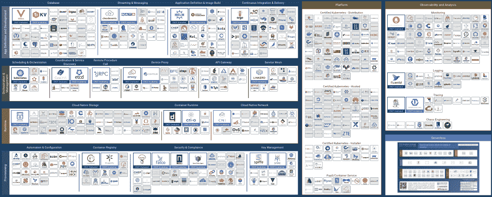
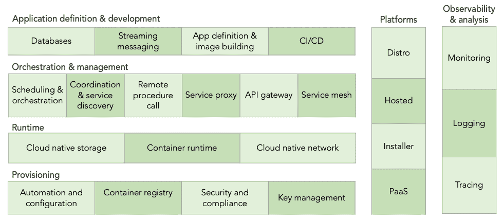
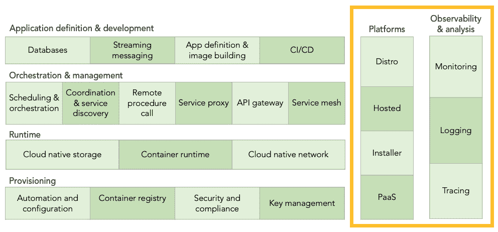

# 云原生环境简介

> 原文：<https://thenewstack.io/cloud-native/an-introduction-to-the-cloud-native-landscape/>

 [凯瑟琳·帕格尼尼

凯瑟琳·帕格尼尼在 Kublr 领导营销工作。从战略到战术，Catherine 帮助 Kublr 宣传云原生技术的无限力量，塑造品牌，并与增长保持同步。在加入这家科技初创公司之前，凯瑟琳在博思艾伦汉密尔顿和华盛顿邮报营销 B2B 服务。](https://www.linkedin.com/in/catherinepaganini/en/) 

如果你研究过云原生应用和技术，你可能会遇到[云原生计算基金会(CNCF)](https://landscape.cncf.io/) 云原生景观图。不足为奇的是，其规模之大令人难以招架。这么多品类，这么多技术。你如何理解它？

就像其他任何事情一样，如果你把它分解，一次分析一件，你会发现它并不复杂，而且很有意义。事实上，地图是按照功能整齐地组织起来的，一旦您理解了每个类别所代表的内容，导航就变得容易多了。

在本文中，系列的第一篇，我们将打破这个庞大的景观，并提供了整个景观，其层，列和类别的高级概述。在后续文章中，我们将放大每一层和每一列，并提供关于每一类别是什么、它解决什么问题以及如何解决的更多细节。

## 云原生景观的四个层次

首先，让我们将所有单独的技术从环境中剥离出来，看看类别。有不同的“行”反映建筑层，每个层都有自己的一组子类别。在第一层，您拥有调配基础架构的工具，这是您的基础。然后，您开始添加运行和管理应用程序所需的工具，如运行时和编排层。在最顶层，您拥有定义和开发应用程序的工具，例如数据库、映像构建和 CI/CD 工具(我们将在下面逐一讨论)。

现在，你应该记住的是，前景从基础设施开始，每一层都向实际应用靠拢。这就是这些层所代表的内容(我们将在后面讨论跨越这些层的两个“列”)。让我们从底层开始，一次探索每一层。

### 1.供应层

供应指的是创建和强化云原生应用程序所基于的基础所涉及的工具。它涵盖了从自动化基础设施的创建、管理和配置到扫描、签名和存储容器映像的所有内容。通过提供允许您设置和实施策略、在您的应用和平台中构建身份验证和授权以及处理机密分发的工具，配置甚至扩展到了安全领域。

在供应层，您会发现:

*   **自动化和配置工具**帮助工程师在没有人工干预的情况下构建计算环境。
*   **容器注册表**存储应用程序的可执行文件。
*   **安全性和** **合规性**框架针对不同的安全领域。
*   **密钥管理**解决方案有助于加密，确保只有授权用户才能访问应用。

这些工具允许工程师整理所有基础设施细节，以便系统可以根据需要启动和关闭新环境，确保它们的一致性和安全性。

### 2.运行时层

接下来是运行时层。运行时是容易混淆的术语之一。像其中的许多术语一样，它没有严格的定义，可以根据上下文有不同的用法。从狭义上讲，运行时是一个特定机器上的沙箱，准备运行一个应用程序——这是一个应用程序最起码需要的。在最广泛的意义上，运行时是应用程序需要运行的任何工具。

在 CNCF 云的原生环境中，运行时被定义为介于两者之间，侧重于对容器化应用程序特别重要的组件:它们需要运行、记忆和通信的内容。它们包括:

*   **云原生存储**为容器化应用提供虚拟化磁盘或持久性。
*   **容器运行时**为容器提供约束、资源和安全考虑，并使用编码的应用程序执行文件。
*   **云原生网络**，一个[分布式系统](https://thenewstack.io/primer-distributed-systems-and-cloud-native-computing/)的节点(机器或进程)通过该网络进行连接和通信。

### 3.编排和管理层

一旦您按照安全性和合规性标准(配置层)自动化了基础架构配置，并设置了应用程序运行所需的工具(运行层)，工程师必须弄清楚如何协调和管理他们的应用程序。编排和管理层处理如何将所有容器化的服务(应用程序组件)作为一个组进行管理。他们需要识别其他服务，相互通信，并进行协调。内在可扩展的云原生应用依赖于自动化和弹性，这由该层实现。

在这一层中，您会发现:

*   **编排和调度**部署和管理容器集群，确保它们具有弹性、松散耦合和可伸缩性。事实上，编排工具，在大多数情况下 [Kubernetes](https://thenewstack.io/primer-how-kubernetes-came-to-be-what-it-is-and-why-you-should-care/) ，是通过管理容器和操作环境来构成集群的
*   **协调和服务发现**这样服务(应用组件)就可以相互定位和通信。
*   **远程过程调用(RPC)** ，一种使一个节点上的服务能够与通过网络连接的不同节点上的服务进行通信的技术。
*   **服务代理**是服务之间的中介，服务通过它进行通信。代理的唯一目的是对服务通信施加更多的控制，它不会给通信本身增加任何东西。这些代理对下面提到的服务网格至关重要。
*   **API 网关**，一个抽象层，外部应用可以通过它进行通信。
*   **服务网格**在某种意义上类似于 API 网关，它是一个专用的基础设施层，应用程序通过它进行通信，但它提供策略驱动的*内部*服务到服务通信。此外，它可能包括从流量加密到服务发现，再到应用程序可观察性的所有内容。

### 4.应用程序定义和开发层

现在让我们移动到顶层。顾名思义，应用程序定义和开发层专注于使工程师能够构建应用程序并允许它们运行的工具。上面讨论的一切都与构建一个可靠、安全的环境和提供所有需要的应用程序依赖相关。

在此类别下，您将看到:

*   **数据库**支持应用程序以有组织的方式收集数据。
*   **流和消息**支持应用发送和接收消息(事件和流)。它不是一个网络层，而是一个排队和处理消息的工具。
*   应用程序定义和映像构建是帮助配置、维护和运行容器映像(应用程序的可执行文件)的服务。
*   **持续集成和交付(CI/CD)** 允许开发人员自动测试他们的代码是否与代码库(应用程序的其余部分)兼容，如果他们的团队足够成熟，甚至可以自动部署到生产环境中。

## 跨所有层运行的工具

回到类别概述，我们将探索贯穿所有层的两列。可观察性和分析是监控所有层的工具。另一方面，平台将这些层中的多种技术捆绑到一个解决方案中，包括可观察性和分析。

### 

### 可观察性和分析

为了限制服务中断并帮助降低 MRRT(同时解决问题)，您需要监控和分析应用程序的各个方面，以便立即检测和纠正任何异常情况。故障*将*发生在复杂的环境中，这些工具通过帮助尽快识别和解决故障来降低它们的影响。由于该类别贯穿并监控所有层，因此它位于侧面，而不是嵌入在特定层中。

在这里你会发现:

*   **日志记录**收集事件日志(关于进程的信息)的工具。
*   **监控**解决方案以收集指标(数字系统参数，如 RAM 可用性)。
*   **跟踪**比监视更进一步，监视用户请求的传播。这与服务网格的上下文相关。
*   **Chaos engineering** 是在产品中测试软件的工具，用于识别弱点并在它们影响服务交付之前修复它们。

### 平台

正如我们所看到的，每个模块都解决一个特定的问题。单靠存储并不能满足您管理应用的所有需求。您将需要一个编排工具、容器运行时、服务发现、网络、API 网关等。平台覆盖多个层面，将不同的工具捆绑在一起解决更大的问题。

配置和微调不同的模块，使它们可靠和安全，并确保它利用的所有技术都得到更新，漏洞得到修补，这不是一件容易的事情。有了平台，用户不必担心这些细节，这是真正的增值。

你可能会注意到，所有的分类都围绕着 Kubernetes。这是因为 Kubernetes 虽然只是拼图的一部分，但却是云原生堆栈的核心。顺便说一下，CNCF 是由 Kubernetes 作为其第一个种子项目创建的；所有其他项目随后跟进。

平台可以分为四类:

*   **Kubernetes 发行版**采用未修改的开源代码(尽管有些人会修改它)并围绕它添加市场需要的附加特性。
*   托管的 Kubernetes (又名托管的 Kubernetes)类似于一个发行版，但它是由您的提供商在他们的或您自己的基础设施上管理的。
*   **Kubernetes 安装人员**正是这样，他们自动化了 Kubernetes 的安装和配置过程。
*   **PaaS / container services** 类似于托管的 Kubernetes，但包括一套广泛的应用部署工具(通常是云原生环境的子集)。

## 结论

在每一类中，都有不同的工具来解决相同或相似的问题。一些是适应新现实的云前原生技术，而另一些则是全新的。不同之处在于它们的实现和设计方法。没有完美的技术可以检查所有的盒子。在大多数情况下，技术受到设计和架构选择的限制——总有一个折衷方案。

选择堆栈时，工程师必须仔细考虑每项功能和权衡，以确定最适合其用例的选项。虽然这带来了额外的复杂性，但选择数据存储、基础架构管理、消息传递系统等从未如此可行。最符合应用需求的。当今的系统架构比云出现之前要简单得多。此外，如果架构合理，云原生技术可以提供强大且急需的灵活性。在当今快速变化的技术生态系统中，这可能是最重要的能力之一。

我们希望这个快速概述是有帮助的。请继续关注我们的后续文章，了解每一层和每一列的更多信息！

***一如既往，感谢 [Oleg Chunihkin](https://www.linkedin.com/in/olegch/) 的所有投入，也感谢 [Jason Morgan](https://www.linkedin.com/in/jasonmorgan2/) ，我即将发表的更详细的风景文章的合著者(对此非常兴奋！).还要特别感谢来自 CNCF 的 Ihor Dvoretskyi，他非常友好地审阅了这篇文章，确保了它的准确性。***

<svg xmlns:xlink="http://www.w3.org/1999/xlink" viewBox="0 0 68 31" version="1.1"><title>Group</title> <desc>Created with Sketch.</desc></svg>