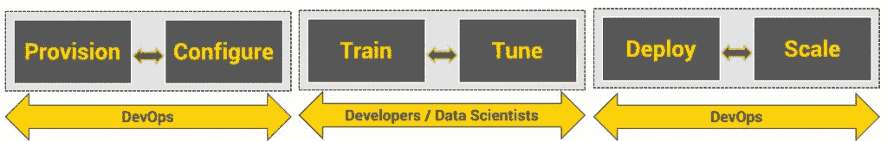
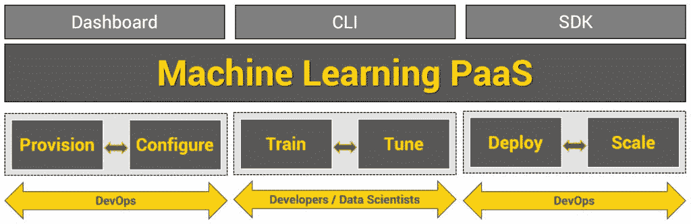

# 机器学习平台即服务简介

> 原文：<https://thenewstack.io/an-introduction-to-the-machine-learning-platform-as-a-service/>

编者按:本文是将持续集成和部署(CI/CD)实践引入机器学习系列的第一篇文章。查看新的堆栈，了解未来的部分。

机器学习平台即服务(ML PaaS)是公共云中发展最快的服务之一。它提供了机器学习模型的高效生命周期管理。

在高层次上，训练和部署机器学习模型涉及三个阶段。从经典的 ML 模型到使用复杂的神经网络架构构建的高级模型，这些阶段保持不变。

## 调配和配置环境

在实际培训开始之前，开发人员和数据科学家需要一个完全配置好的环境，包括正确的硬件和软件配置。

硬件配置可能包括加速训练过程的高端 CPU、GPU 或 FPGAs。配置软件栈需要安装特定于模型的各种框架和工具。

这些完全配置的环境需要作为一个集群运行，其中培训作业可以并行运行。大型数据集需要对集群中的每台机器本地可用，以加快访问速度。调配、配置、协调和终止计算资源是一项复杂的任务。

开发和数据科学团队依靠内部 DevOps 团队来解决这个问题。DevOps 团队通过传统的供应和配置工具(如 Chef、Puppet 和 Ansible)自动执行这些步骤。在 DevOps 团队将环境移交给数据科学团队之前，ML 培训工作无法开始。

### 训练和调整一个 ML 模型

测试平台准备就绪后，数据科学家将执行数据准备、培训、超参数调整和模型评估等步骤。这是一个反复的过程，每个步骤都可以重复多次，直到结果令人满意。

在训练和调整阶段，数据科学家记录多个指标，例如一层中的节点数量、深度学习神经网络的层数、优化器使用的学习率、评分技术以及实际分数。这些指标有助于选择正确的参数组合来提供最准确的结果。

可用的框架和工具不包括记录和记录对于协作和迭代培训过程至关重要的指标的机制。数据科学团队构建自己的日志引擎来记录和跟踪关键指标。因为这个引擎在环境之外，所以他们需要维护日志基础设施和可视化工具。

### 服务和扩展 ML 模型

一旦数据科学团队开发出一个训练有素的模型，开发人员就可以在生产中使用它。该模型通常是一个序列化的对象，需要包装在一个 REST web 服务中，该服务可以通过标准的 HTTP 客户端库和 SDK 来使用。

由于模型不断地被训练和调整，数据科学团队经常会发布新的版本。DevOps 预计将实现一个 CI/CD 管道来在生产中部署 ML 工件。他们可能必须执行蓝/绿部署，以找到生产使用的最佳模式。

公开 ML 模型的 web 服务必须伸缩以满足消费者的需求。它还需要高度安全，与中央 It 定义的其他策略保持一致。

为了满足这些需求，DevOps 团队转向容器和 Kubernetes 来管理 CI/CD 管道、安全性和 ML 模型的可伸缩性。他们使用 Jenkins 或 Spinnaker 等工具将数据处理管道与软件交付管道集成在一起。

### 开发人员和数据科学家面临的挑战

在上述三个阶段中，开发和数据科学团队发现处理第一个和最后一个阶段极具挑战性。比起处理基础设施和软件配置，他们的优势在于培训、调整和开发最精确的模型。对 DevOps 团队的高度依赖为这些团队引入了额外的依赖层。

当开发人员能够使用 API 来自动化重复性的任务时，他们是高效的。不幸的是，在 ML 模型开发和部署的最初和最后阶段，没有标准的、可移植的、定义良好的 API。

### ML PaaS 的崛起

ML PaaS 为开发人员和数据科学家提供了两个世界的精华——迭代软件开发和模型管理。它消除了为训练和服务机器学习模型配置和供应环境所涉及的摩擦。

ML PaaS 最大的优点是提供了抽象底层硬件和软件堆栈的 API。开发人员可以调用几个 API 来启动一个大型的基于 GPU 的机器集群，这些机器完全配置了数据准备工具、培训框架和监控工具，以开始一项复杂的培训工作。他们还将能够利用数据处理管道来自动化 ETL 作业。当模型准备好时，他们将发布最新版本作为面向开发人员的 web 服务，而不用担心打包和部署工件和依赖项。

公共云提供商拥有交付 ML PaaS 所需的所有构件。他们现在公开了一个抽象服务，连接计算、存储、网络和数据库之间的点，为开发人员带来统一的服务。尽管可以通过控制台访问该服务，但该平台的真正价值是通过 CLI 和 SDK 开发的。DevOps 团队可以将 CLI 集成到自动化中，而开发人员可以从诸如 Jupyter Notebooks、VS Code 或 PyCharm 等 ide 中使用 SDK。

SDK 为开发人员简化了数据处理和软件交付管道的创建。通过改变一个参数，他们将能够从基于 CPU 的训练集群切换到运行最新 NVIDIA K80 或 P100 加速器的强大 GPU 集群。

亚马逊、谷歌、IBM 和微软等云提供商已经构建了强大的 ML PaaS 产品。有关这些平台的概述，请参考[过去的文章](https://thenewstack.io/podcasts/tutorials/)。

在下一期“Azure ML 如何简化基于云的机器学习”中，我们将仔细研究其中一个 ML PaaS SDK。我演示了开发人员如何控制平台来管理端到端的 ML 管道。

<svg xmlns:xlink="http://www.w3.org/1999/xlink" viewBox="0 0 68 31" version="1.1"><title>Group</title> <desc>Created with Sketch.</desc></svg>