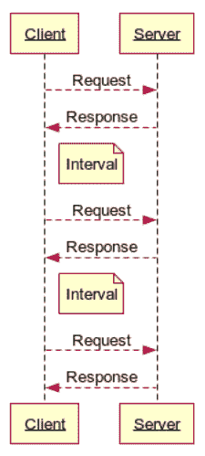
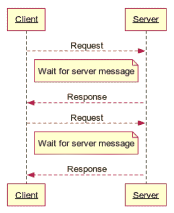

# 芭蕾舞女演员网络插座介绍

> 原文：<https://thenewstack.io/an-introduction-to-websockets-with-ballerina/>

[WSO2](https://wso2.com/) 赞助本帖。

WebSocket 是一种通信协议，用于通过 TCP 在 web 浏览器和服务器之间进行高效的全双工通信。在这篇文章中，我们将看看动态网站中使用的技术的历史。然后，我们将介绍 WebSockets 作为满足这些需求的现代方法，同时修复早期技术的缺点。

我们将使用[芭蕾舞演员](https://ballerina.io/?utm_source=tns&utm_medium=article&utm_campaign=websocket_and_ballerina_tns_nov20)的语言来演示如何有效地使用 WebSocket 功能。

## **动态网络:回望过去**

 [安亚娜·费尔南多

Anjana 是 WSO2 的开发者关系主管。他的最新冒险是他在芭蕾舞演员项目中的角色，在那里他广泛参与了该语言及其运行时的设计和实现，现在主要致力于其生态系统工程和福音活动。](https://www.linkedin.com/in/lafernando/) 

HTTP 通常用于典型的请求/响应场景。使用 JavaScript， [XMLHTTPRequest](https://developer.mozilla.org/en-US/docs/Web/API/XMLHttpRequest) 对象和 [Fetch API](https://developer.mozilla.org/en-US/docs/Web/API/Fetch_API) 帮助在后台将请求从客户端发送到服务器。这允许我们在不刷新或加载另一个网页的情况下执行数据操作。然而，这不支持服务器推送场景的需求，在服务器推送场景中，请求是从服务器发起并发送到客户端的。所以人们想出了变通的办法来使它成为可能。这些选项中有两个是轮询和长轮询。

定期轮询的工作原理是创建一个新的 HTTP 连接，向服务器发送请求，寻找新的更新。如果需要从服务器到客户端进行任何通信，服务器将在此时向客户端返回消息。如果没有什么新的东西，服务器会这样回答。根据服务器的响应，连接将被关闭。图 1 显示了轮询的高级操作。

[](https://cdn.thenewstack.io/media/2020/12/26f119b9-image1.png)

图 1: HTTP 常规轮询

这里，在每个轮询请求之后，我们等待一个特定的时间间隔，以限制重复发送到服务器的请求数量。但是，这个时间间隔增加了从服务器向客户端接收消息的潜在最大延迟。这是因为在上述间隔期间，如果服务器要发送数据，客户端必须等到下一个轮询周期才能从服务器获取新数据。使用长轮询可以避免这种情况。

在长轮询中，我们遵循与常规轮询相似的方法；但是，服务器不会立即返回包含客户端请求的响应，而是阻塞请求，直到它准备好向客户端发送一些数据。这个过程如下面的图 2 所示。

[](https://cdn.thenewstack.io/media/2020/12/9ae9903e-image3.png)

图 2: HTTP 长轮询

在这种方法中，客户端向服务器发起请求，服务器保留该请求，直到有任何数据要传递给客户端。我们常规轮询机制中的时间间隔现在是在服务器端，因此它可以在需要时立即联系客户端。一旦服务器向客户机发送了响应，客户机立即发起另一个请求，并重复相同的流程。此外，对于长轮询，我们将使用一个持久的(保持活动)HTTP 连接；没有必要关闭它，因为我们始终与服务器保持联系。与常规轮询相比，长轮询是一种更好的实时通信方法，因为它允许从服务器到客户端的即时通信。然而，我们需要保持从客户端到服务器的专用 HTTP 连接是活动的，这对于这种类型的通信是不可避免的。

我们现在已经看到了如何使用基于 HTTP 的 API 请求/响应流(半双工)来模拟全双工通信通道。像 [SocketIO](https://socket.io/) 这样的客户端库正是通过抽象出其内部操作细节并为用户提供一个易于使用的 API 来做到这一点的。那么，如果我们可以在操作中使用长轮询，我们还需要改进什么呢？答:通信数据效率和服务器必须承担的处理开销。典型的 HTTP 请求会有一组发送到服务器的头值，所以这成为客户端的数据开销，客户端可能会使用较小的有效负载执行许多请求。这个问题的解决方案是 WebSocket 传输。

## **HTTP 到 WebSocket**

WebSocket 提供了一种基于 TCP 的低延迟通信协议。这些协议在 HTTP 之外工作，并且在发送和接收消息时包含最小的帧技术。WebSocket 在处理 WebSocket 流量时也使用相同的 HTTP 服务器，它们使用由 HTTP 通道创建的相同通信通道。这有一个额外的优势，即与基础设施组件(如代理和防火墙)更兼容，这些组件已经配置为允许 HTTP 使用的端口。

让我们看看如何通过 WebSocket 握手创建 WebSocket 连接。HTTP 协议的[升级](https://developer.mozilla.org/en-US/docs/Web/HTTP/Protocol_upgrade_mechanism)特性将被用来做这件事。

WebSocket 客户端握手请求示例如下所示:

```
GET  /ws/echo HTTP/1.1
Connection:  Upgrade
Upgrade:  websocket
Sec-WebSocket-Version:  13
Sec-WebSocket-Key:  RmNX6Mdh0cnQqmc8am4nng==

```

对应的服务器握手响应如下:

```
HTTP/1.1  101  Switching Protocols
upgrade:  websocket
connection:  upgrade
sec-websocket-accept:  2JZViLsWMSpKcCBZum79UYSVbu0=

```

此时，TCP 连接不再使用 HTTP 协议，而是切换到使用 WebSocket 协议进行通信。

现在我们知道了 WebSocket 协议的基本工作原理，让我们看看如何使用它编写应用程序。

## **创建 WebSocket 服务**

在这一节中，我们将看看如何使用芭蕾舞演员 T4 的编程语言来实现基于 WebSocket 的服务。芭蕾舞女演员提供了一个易于使用的服务抽象作为一流的语言概念。

在 WebSocket 服务中，用户需要了解以下主要事件:

*   连接创建
*   数据报文
*   连接误差
*   连接关闭

上述各个事件通过芭蕾舞演员服务中各自的资源功能通知给用户。

### **连接创建**

当 WebSocket 客户端在成功的握手操作后成功建立连接时，就达到了这种状态。此时，如果服务中有可用的资源函数，则调用以下资源函数。

```
resource function onOpen(http:WebSocketCaller caller);

```

这个资源函数为我们提供了一个 WebSockerCaller 对象的实例，它可以用来与 WebSocket 客户端进行通信。使用此函数的一般模式是在创建连接时保存 caller 对象，每当应用程序想要向连接的客户端发送消息时，它可以使用存储的 caller 对象进行通信。

### **子协议处理**

创建 WebSocket 连接时，我们可以提供一个子协议列表，客户端可以按照优先级顺序处理这些子协议。这是在创建 WebSocket 客户端时以下列方式完成的。

```
var ws  =  new WebSocket("ws://localhost:8080/ws/subscribe",  ["xml",  "json"]);

```

子协议在 WebSocket 构造函数的第二个参数中给出，它可以给出单个字符串值或字符串数组。在上面的声明中，我们请求使用“xml”或“json”作为协议。

在服务器端，它将被配置为处理零个或多个子协议。当客户端请求特定协议时，将检查该子协议列表，并且服务器将按优先级顺序检查客户端的协议列表，以查看它在给定服务中是否受支持。如果找到匹配，它将把这个第一个匹配的协议返回给客户端。

子协议的服务器端配置是使用 WebSocketServiceConfig 注释完成的，使用它的“子协议”字段。下面显示了这种用法的一个例子，其中我们更新了先前的“订户”服务，以协商一个子协议并打印所选的子协议。

### **数据信息**

当 WebSocket 客户端向 WebSocket 服务发送文本或二进制消息时，就会收到数据消息。在服务中调用以下资源函数(如果可用)来分别处理文本和二进制消息。

```
resource function onText(http:WebSocketCaller caller,  string data);
resource function onBinary(http:WebSocketCaller caller,  byte[]  data);

```

使用 WebSocket 处理文本和二进制消息的完整芭蕾舞示例可在此处找到。

### **连接错误**

如果 WebSocket 连接出现错误，将通过生成所需的连接关闭框架来自动关闭连接。可以在服务中实现下面的资源函数，以接收将要发生这种情况的通知，并执行任何可能的清理或自定义日志记录操作。

```
resource function onError(http:WebSocketCaller caller,  error err);

```

### **连接关闭**

如果从客户端关闭连接，将通过调用下面的资源函数来通知服务。

```
resource function onClose(http:WebSocketCaller caller,  int statusCode,
                          string reason);

```

## **保护 WebSocket 通信**

只要有可能，我们应该在 TLS 上使用 WebSocket。这确保了我们通过网络进行的数据通信是安全的。在我们的 WebSocket 客户端中，我们可以使用“wss”协议方案来连接到安全的 WebSocket 服务器。参考下面的例子。

```
var ws  =  new WebSocket("wss://localhost:8443/ws/echo");

```

为了让我们的 WebSocket 服务与这种方法兼容，我们为 HTTP 侦听器配置了一个安全套接字。这个 HTTP 侦听器是在 WebSocket 升级中使用的，因此它将升级与 TLS 的 TCP 连接。

## **总结**

在本文中，我们深入研究了用于实现网页动态 web 体验的历史技术，并介绍了 WebSockets 作为网页和服务器之间全双工通信的现代方法。我们提供了芭蕾舞演员语言和 WebSockets 平台支持的概述，其中语言的服务抽象直观地符合为其通信定义的操作。

有关 Ballerina 和 WebSocket 支持的更多信息，您可以参考以下资源:

通过 Pixabay 的特征图像。

<svg xmlns:xlink="http://www.w3.org/1999/xlink" viewBox="0 0 68 31" version="1.1"><title>Group</title> <desc>Created with Sketch.</desc></svg>