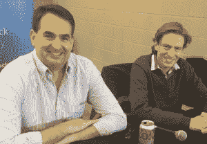

# 一位开源领袖走了，纪念丹·科恩

> 原文：<https://thenewstack.io/an-open-source-leader-is-gone-a-remembrance-of-dan-kohn/>

Kubernetes、云原生计算基金会和云原生计算社区将永远与 Dan Kohn 联系在一起，他因结肠癌并发症于周日在纽约市去世。他留下了一个美好的家庭，我们将永远记得这个家庭经常陪伴着丹旅行。

丹现在比生命更重要。他为我们留了一条路。他的存在与日俱增，因为我们现在记得他，也记得我们在自己身上看到的东西。在他之后，我们回忆起了一个纽约人、一个顾家的男人和一个引领我们时代伟大的开源运动的人。

规模。这一切都与规模有关，即基础架构的弹性如何随着应用程序工作负载的变化而变化。我们更多地将规模视为开发、部署和管理各地基础设施的真正途径，以及构建我们新现实的规划手段。云是一个模糊的概念。更真实的是运行在分布式架构上的服务和软件。在某种意义上，一切都是“云原生的”

我第一次见到丹是在 2016 年的 DockerCon 期间，吃早餐的时候。关于那次会面，我真正记得的是丹灿烂的笑容和他眼中的某种闪烁，我现在回忆起我去过的许多地方:纽约、上海、巴塞罗那、奥斯汀——这样的地方不胜枚举。

2016 年，我们对丹的所作所为知之甚少，但我们很快就得到了暗示。CNCF 已经建立，但它代表什么仍然有点不清楚。如果有的话，丹是一个商人和计算机科学家。他知道大规模计算的经济重要性，以及使其如此迷人的技术复杂性。

技术社区已经为丹这样的人做好了准备——他们需要帮助。开源云原生项目正在增长，但资源对于保持进展至关重要。他在那里是为了确保完成技术人员不应该做的工作:建立意识，支持新项目的宣传，也许最重要的是，平稳地进行会议。

[https://www.youtube.com/embed/v4KC3ajgNis?feature=oembed](https://www.youtube.com/embed/v4KC3ajgNis?feature=oembed)

视频

随着会议的召开，新一代的创业公司和技术领导者开始真正定义这个社区。毫无疑问，那些日子里涌现出来的领导者都要感谢 Dan，感谢他为他们提供了一个平台来讲述他们的故事，解释 Kubernetes 和云原生项目的复杂性。

每个项目都有自己的相关图例。对于我们这些极客记者来说，这些项目就像糖果一样。科德恩斯、集装箱、特使、普罗米修斯——他们都有这种魔力。你知道这些是需要烘焙到架构中的，就像馅饼中的配料。

更进一步的比喻是——丹的工作产生了一个多么大的经济馅饼。看看西雅图的 KubeCon，2016 年末。这个地方挤满了人。到处都有新的创业公司，更多的老牌供应商意识到这将是一件大事。

在随后的几年里，KubeCon + CloudNativeCon 活动吸引了成千上万的人。大约一年前在圣地亚哥，12000 人参加了 KubeCon + CloudNativeCon。每年，会议都在增加。随着这种增长，云原生环境中的公司出现了重大收购和数十亿美元的资金。

丹不厌其烦地讲述着库伯内特人和克劳德土著的故事。他不止一次在一次旅行中环游世界，包括当他从中国飞到阿姆斯特丹，在软件马戏团做关于凿除巨石的演讲。

Dan Kohn 将作为我们这个时代最伟大的开源领袖之一而被铭记。他现在是一个神话，也应该是。丹比生命更伟大。

谢谢你，丹，这些年来一直是我们的朋友和支持者——我们已经开始想念你了。

<svg xmlns:xlink="http://www.w3.org/1999/xlink" viewBox="0 0 68 31" version="1.1"><title>Group</title> <desc>Created with Sketch.</desc></svg>