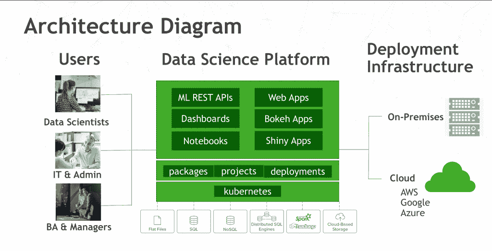
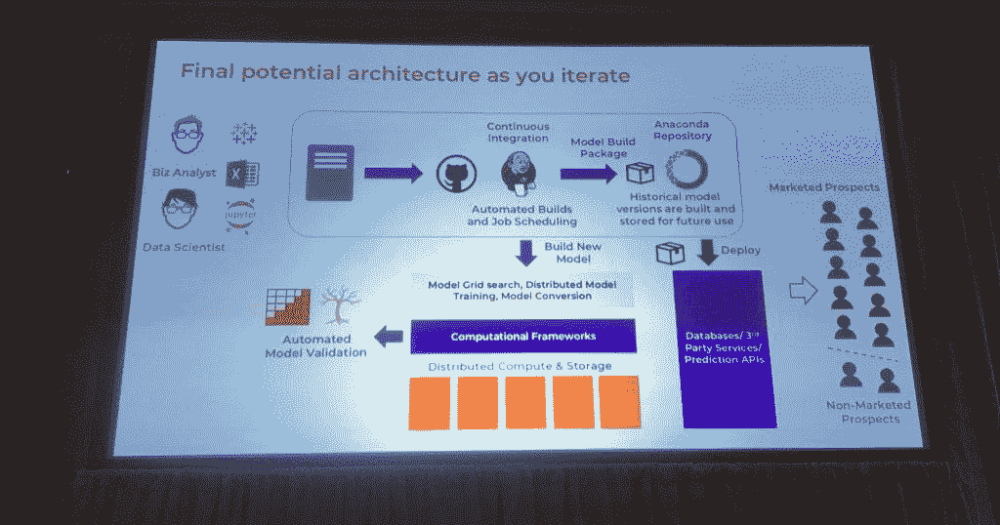

# Anaconda 的 Python/R 发行版为可扩展的机器学习奠定了基础

> 原文：<https://thenewstack.io/anacondas-python-r-distribution-sets-the-stage-for-scalable-machine-learning/>

当涉及到管理机器学习模型的开发时，git 就是不明白。

这是加拿大金融公司 [Wealthsimple](https://www.wealthsimple.com/en-us/) 的数据科学家 [Max Humber](http://maxhumber.com/) 学到的经验，他[在今年的 Anaconda 年度用户会议](https://speakerdeck.com/maxhumber/data-engineering-for-data-scientists)上分享了这一见解，AnacondaCon 在得克萨斯州奥斯汀举行。

“Git 管理代码，但对于管理模型参数来说并不太好，”他说。找到最佳模型，并对其进行相应的调整需要大量的反复试验。大部分工作包括将模型换入和换出代码，然后调整参数。为每一个测试保存程序的每一个版本是很麻烦的，而且也没有收集配置性能信息的机制。

因此 Humber 创建了 [Mummify](https://github.com/maxhumber/mummify) ，它记录模型每次运行的性能信息。Humber 说，它将所有创建的材料保存在 git 中，但不要求最终用户理解版本控制软件，这对开发人员来说是一项艰巨的任务。

目前，亨伯指出，人工智能模型，当它们被转移到生产中时，就变成了黑匣子，变得脆弱，IT 人员难以处理。开发机器学习模型有许多方面实际上是维护基础设施的方面，包括数据清理和准备、日志记录、工具、工作流管道和其他方面。

其中许多方面对公司的 IT 人员来说都是全新的。

Anaconda 的联合创始人兼首席技术官[王蒙杰](https://www.linkedin.com/in/pzwang/)说:“我认为 IT 部门必须更好地处理架构的多样性。公司里大家都用同一个栈的日子就要结束了。“现在，每个堆栈的每一层都在快速变化。单一文化已死。”

## 企业中的数据科学

2014 年，Gartner 曾预测，到 2017 年，60%的大数据项目将会失败。咨询公司 at[Full Spectrum Analytics](https://www.fullspectrumanalytics.com/about-us/)的合伙人 [Hussain Sultan](https://github.com/hussainsultan) 指出，实际百分比接近 85%，该公司已经在金融科技人工智能系统方面做了一些工作。

侯赛因·苏丹(右)和蒂姆·霍兰。

这种高失败率的一个主要原因是无法为这些项目提供清晰的业务成果，甚至无法将这些项目集成到更大的运营 it 基础架构中。在许多情况下，一个组织会开发一个概念验证，但从来没有把最终产品推向市场。

“新的见解、模型和战略不适合旧的实施流程，”同样来自 Full Spectrum Analytics 的 Tim Horan 补充道。数据科学家可能会使用新工具，或者寻找传统基础设施无法支持的技术。他特别指出 SAS 是一个广泛使用的分析包，但它不支持机器学习工作所需的非线性模型。

数据科学家不必要地与 IT 部门对抗的想法是 Anaconda 在会议中强调的主题。作为开场，该公司展示了一部名为“Pyception”的虚构电影的[模拟预告片](https://www.youtube.com/watch?v=UXd0EDy7aTY&feature=youtu.be)(由单词“Python”和几年前名为“Inception”的大片名称合并而成)。这是一个数据科学家团队，他们试图走出“沙盒”，进入实际的“生产环境”，他们必须面对 It 部门，在预告片中，IT 部门被描述为无情的杀手:

*“他们为什么向我们开枪？”*

*“他们是 IT 团队。他们不会让我们的 Python 模型脱离沙盒。他们希望我们用 Java 重写所有东西…”*

当然，这个人造视频和本周会议的要点是，IT 专业人士和数据科学家不必相互矛盾，数据科学家可以创建一个机器学习模型，而不必担心支持基础设施，并让该模型在任何地方运行，完全相同。简而言之，Anaconda 希望将数据科学家从“沙盒”中解放出来，王[打趣道。](https://twitter.com/thenewstack/status/983383296737411072)

[https://www.youtube.com/embed/UXd0EDy7aTY?feature=oembed](https://www.youtube.com/embed/UXd0EDy7aTY?feature=oembed)

视频

## 模型管理，包管理

通过多次会议，Anaconda 强调了其[Anaconda Enterprise Platform](https://www.anaconda.com/enterprise/)可用于机器学习并整合到现有的 IT 运营中是多么容易。该软件旨在为 Python 编程语言以及后来的 R 统计语言提供全方位的支持。对于去年年底发布的最新版本第 5 版，软件包[被重新架构](https://www.anaconda.com/blog/company-blog/introducing-anaconda-enterprise-5/)，以适应 DevOps 风格的持续集成和部署操作。

该软件现在围绕 Docker 和 Kubernetes 构建，并与轻量级目录访问协议(LDAP)和微软的 Active Directory 集成，用于身份验证和授权。Anaconda 技术咨询总监[迈克尔·格兰特](https://www.linkedin.com/in/mcgrant/)指出，因此，它可以用来打包用户的各种工作产品，以便网络上的其他人可以轻松地重用它们，并提供一种以可扩展的方式跨分布式系统运行这些工作的方法。

格兰特指出，在机器学习领域，这些能力可以用来打包模型。容器化模型提供了某些好处:它们可以被其他来源测试或验证，而不用担心依赖性，并且有了保证，在不同系统上运行模型仍然会提供相同的结果。数据科学家自己不必担心包管理，因为对于每个构建，Anaconda 自己会获取每个构建的最新依赖项。

特别是，使用 Anaconda 的打包工具 [Conda](https://conda.io/docs/) 可以帮助解决版本问题。在他的演讲中，Grant 展示了一个模型的所有组件，比如框架、验证数据、库(Panda、Numpy)都有不同的发布时间表，并按照自己的节奏前进。Conda 确保安装了正确的依赖包，模型的每个实例都用 Python 和/或 r 的不同副本打包。

除了代码本身，Conda 还可以用于测试数据的打包和版本控制。cronjob 或 Github 触发器可以用来启动一个新的模型构建，然后这个模型可以被自动发送到不同构建的不同通道，比如用于开发、生产和实验的通道。不同的通道可以被绑定到不同的自动化测试例程，实际上为可能涉及多个批准和测试的工作流通道的自动化提供了基础。

格兰特说，这些工具“帮助你建立一个精确的计算环境，你的模型将在其中运行”。

Hussain Sultan(右)和 Tim Horan 的机器学习开发全生命周期模型。

在另一场会议中，Anaconda 技术服务副总裁 Duane Lawrence(T1)简要介绍了 conda 如何帮助企业级的软件包管理。为了处理依赖性管理，Conda 可以从 Anaconda 本身下载最新版本，或者您选择的版本，直到构建号。

Lawrence 说，如果 IT 人员不愿意打开防火墙来提供与 Anaconda 的永久连接，他们还可以进行在线包镜像，其中包保存在本地，并在指定的时间定期更新。只有那些需要的包可以定期下载。该组织还可以建立一个 DMZ，在那里软件包被下载到一个中间服务器，在那里它们可以通过测试，然后在通过验证后在网络上分发。

Conda 能够创建虚拟发行版，每个发行版可能包含特定版本的库，允许管理员在同一组服务器上运行多个包。跨发行版的公共包可以是硬链接的，所以多个副本不会占用磁盘空间。

“每一项分析都可以在自己的环境中运行，”劳伦斯说。"您可以根据需要在生产环境中运行任意多个环境."

<svg xmlns:xlink="http://www.w3.org/1999/xlink" viewBox="0 0 68 31" version="1.1"><title>Group</title> <desc>Created with Sketch.</desc></svg>