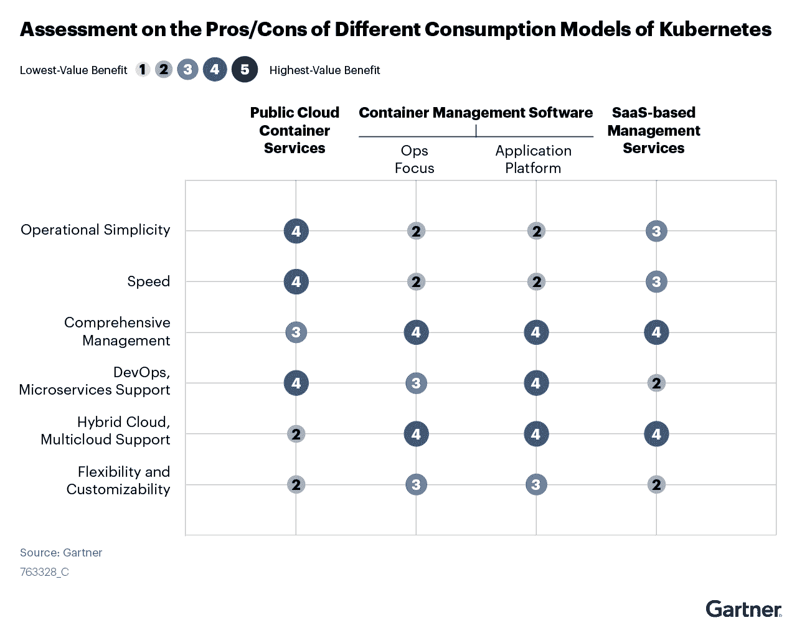

# 分析师报告:关于 Kubernetes 和容器，CTO 必须知道什么

> 原文：<https://thenewstack.io/analyst-report-what-ctos-must-know-about-kubernetes-and-containers/>

云原生应用和微服务对于任何现代企业的有效运营都至关重要。但是，技术高管不能购买现成的解决方案，或者在没有规划的情况下将传统基础架构移植到云原生架构中。

工程师需要合适的工具、团队和技能，但很难知道购买、实施哪些工具以及如何计算投资回报(ROI)。

Gartner 报告“ [CTO 的容器和 Kubernetes 指南—回答 10 大常见问题](https://go.chronosphere.io/gartner-cto-guide.html)”指出，容器和 Kubernetes 已经成为构建云原生应用程序和实现传统工作负载现代化的重要平台技术。到 2027 年，超过 90%的全球组织将在生产中运行容器化的应用程序，与 2021 年的不到 40%相比，这是一个显著的增长。

作者还写道，“企业在准确衡量其云原生投资的 ROI 以及为 it 蓬勃发展创建正确的组织结构方面面临挑战。”

以下是企业应该了解的容器和 Kubernetes，它们的主要用例，以及它们如何帮助运行云原生架构。

## 什么是容器、Kubernetes 及其用例？

容器是捆绑在一起的应用程序代码包。 [Kubernetes 是一个帮助管理集装箱的平台](https://chronosphere.io/learn/what-is-kubernetes-and-how-does-it-benefit-observability/)。

这些技术通常用于微服务、应用程序可移植性以及降低锁定风险。它们还支持开发运维工作流和传统应用的现代化。任何决定进行云原生或升级其基础设施的公司都必须同时使用容器和 Kubernetes。

据 Gartner 称，容器和 Kubernetes 的理想应用有:

*   对外部应用程序的依赖程度低。
*   支持应用程序基础设施和平台技术的容器映像。
*   快速的弹性需求和频繁的代码变更。
*   供应商支持的映像，适用于任何商业现货(COTS)应用程序部署。

## 行业对这些选项的支持程度如何？

大多数容器映像都是基于开源软件的。容器映像是静态文件，它保存了在计算系统中创建容器的所有可执行代码。

Gartner 的报告指出，与开源软件相比——在开源软件中，容器支持已经很普遍 COTS 应用程序容器支持的增长要慢得多，并且因供应商而异。

“虽然一些 COTS ISV(独立软件供应商)在战略上为 Kubernetes 提供了强有力的支持，如 IBM，但许多 COTS ISV 还不支持——特别是在基于 Windows 的应用程序或企业业务应用程序中。你应该回顾一下他们的战略 COTS ISVs 的容器支持策略和路线图，”作者写道。

尽管如此，Gartner 指出，越来越多的供应商正在开发容器支持，“更多的 ISV 正在实现与容器/kubernets 的更深层次的集成，而不仅仅是提供容器映像。”

该报告强调，截至 2022 年 2 月，AWS 集装箱市场有 524 个集装箱相关条目，比 2020 年 2 月的 320 个条目增长了 64%。

围绕 Kubernetes 和 containers 出现的行业趋势包括 VM 融合、有状态应用支持、边缘计算、无服务器融合和应用工作流自动化。

Kubernetes 和 containers 的开源和 COTS 应用程序的结合为组织提供了几个部署选项:

## 容器和 Kubernetes 有好处吗？

容器为专门运行云原生架构的组织提供了多种好处。它们提供了敏捷的应用程序开发和部署、环境一致性和不变性。

由于 Kubernetes 运行在容器软件之上，它提供了灵活性和选择。

“Kubernetes 由云提供商、ISV 和 ihv(独立硬件供应商)组成的庞大生态系统提供支持。这种 API 和跨平台一致性、开源创新和行业支持为首席技术官提供了很大程度的灵活性，”Gartner 的作者说。

### Kubernetes 的技术局限是什么？

平台的复杂性是 CTO 和 IT 经理必须承认的，尤其是容器和 Kubernetes 并不适合所有可能的用例。这些技术最适合动态、可扩展的环境，如果工程师试图使用它们来管理静态的 COTS 应用程序，则会增加复杂性。

### 成功的 Kubernetes 部署需要哪些技能？

成功的容器和 Kubernetes 实现的很大一部分是确保适当的团队和技能集能够管理和运行该技术。组织应该投资于各种核心和次要角色，包括安全性、平台操作、可靠性工程以及构建和发布工程。这些名称有助于确保 Kubernetes 部署的安全性、可靠性和一致性。

### Gartner 概述了运行 Kubernetes 环境的团队的角色和职责

开发团队应该承担编码、应用程序设计、实现和测试以及源代码管理的任务。

平台工程团队监督平台的选择、安装、配置和管理。成员还应该能够维护基本映像、集成 DevOps 管道、为开发人员提供自助服务功能、自动化容器供应，以及提供容量规划和工作负载隔离。

可靠性工程师致力于安全、监控和性能方面的工作。他们应该关注应用程序弹性；能够调试和记录生产问题；并负责事件管理和响应。

最后，构建和发布工程团队选择 CI/CD 部署管道，为新服务开发模板，培训开发团队，并创建仪表板来衡量效率和生产力。

### 组织如何衡量容器的投资回报率？

“通过构建一个全面的商业案例来确保投资回报率，这对于验证您投资于容器和 Kubernetes 并不纯粹是因为这是一项闪亮的新技术非常重要。报告作者写道:“组织需要现实地看待产生的成本和潜在的收益。

组织可以衡量的容器的好处包括开发人员的生产力、敏捷的 CI/CD 环境、基础设施效率的提高和运营开销的减少。

可能降低收益的潜在成本是容器即服务/平台即服务(CaaS/PaaS)许可费；用于安全、自动化和监控工具的额外软件许可证；基础设施投资成本；雇佣新员工来管理此类部署；和专业的实施服务，让一切都在线并顺利运行。

### Gartner 向技术领导者推荐了哪些步骤？

Gartner 作者建议技术领导者:

*   在承诺和扩展 Kubernetes 平台环境之前，确保存在强大的业务案例，确定适当的用例，并建立 DevOps 文化。
*   创建一个平台团队，负责管理平台选择、推动开发运维功能的标准化和自动化，并与开发人员合作培育云原生架构。
*   为集成不同技术组件的生产部署选择打包软件分发或云管理服务，简化该堆栈的生命周期管理并提供多云管理，而不是采用 DIY 方法。
*   根据软件速度、发布成功和运营效率收益等技术指标，以及收入增长和客户满意度等业务指标，准确衡量和传达收益。

容器和 Kubernetes 为希望运行云原生架构并将遗留应用带入 21 世纪的组织和 IT 领导者提供了明确的技术基础。为了成功的部署和健康的投资回报，组织应该确保适当的应用程序和人员到位。

[*下载完整报告*](https://go.chronosphere.io/gartner-cto-guide.html) *了解容器和 Kubernetes 对于云原生应用是如何必不可少的。*

<svg xmlns:xlink="http://www.w3.org/1999/xlink" viewBox="0 0 68 31" version="1.1"><title>Group</title> <desc>Created with Sketch.</desc></svg>