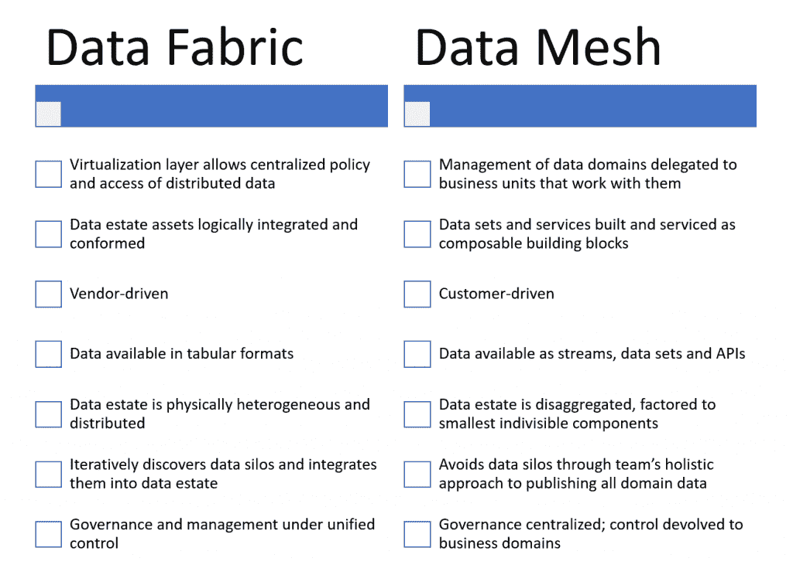

# 2022 年的分析意味着掌握分布式数据政治

> 原文：<https://thenewstack.io/analytics-in-2022-means-mastery-of-distributed-data-politics/>

 [安德鲁·布鲁斯

安德鲁·布鲁斯是 Blue Badge Insights 的创始人/首席执行官，为数据、分析、BI 和 AI 公司及其合作伙伴和客户提供战略和咨询服务。Andrew 撰写数据和分析方面的文章已经超过 10 年，是 GigaOm 在该领域的首席分析师。他还共同主持 Visual Studio Live！系列开发者大会，是微软区域总监和数据平台 MVP，一个企业家和咨询老手。](https://www.bluebadgeinsights.com/) 

大约十年来，企业和科技行业一直痴迷于大数据、分析、机器学习和建立数据驱动的实践。与此同时，新冠肺炎封锁及其后果加快了围绕数字化转型的努力和要求，而数字化转型本身是以数据驱动的文化和运营为前提的。虽然这推动了供应商的大量创新和客户的投资，但也导致了不可避免的高项目失败率，这是该死的技术采用的一个标志。

2021 年展示了这种极快的速度和后果。但在 2022 年，组织将需要从仅仅实施分析和机器学习技术转向成功应用、文化变革、用户满意度和采用数据驱动的实践。换句话说，组织必须从投资转向回报。这可能要困难得多。

好消息是已经出现了各种架构和方法来帮助避免和减少不成功的实现。但是顾客已经准备好这些方法了吗？他们是实用主义者，而不是纯粹主义者吗？他们接受过压力测试吗？他们被很好的理解了吗？在这个分析中，我将带您了解两个这样的领先架构:数据结构和数据网格。

仅仅解释这两种方法是没有价值的，因为已经有很多好的方法了。因此，我将尝试超越一个解释者，通过与政治政府类型的类比，将数据网格和数据结构模型置于上下文中。也许从地缘政治的角度考虑过去的事件可以激发我们的分析思维，并暗示技术方面的经验教训，有助于降低技术风险和提高成功。

## **问题的症结**

项目失败的一个关键是平台需求和客户现实之间的不匹配。大多数分析平台都以数据可用、可发现、可清理和可整合为前提。客户数据的真实情况与这种情况形成了鲜明对比。

虽然几乎每个供应商和从业者都知道数据是以未精炼和分散的形式开始的，但是许多人认为这种初始状态是一种缺陷，需要被纠正，并随后被避免。虽然这一更复杂的现实得到了承认，但它也受到了劝阻、贬低，并被视为一个补救目标。

从那里，ETL(提取、转换和加载)、数据管道、定制代码和点对点集成被应用于纠正这种不完美的状态，并使组织建立在良好集成的数据的稳定基础上，从而可以执行一系列分析任务。然后，一旦一切都完全启动并运行，单个数据存储库准备就绪，组织就可以呼气，并含蓄地假装以前的不完美状态从未真正存在过。

除了乌托邦和——真的——有点势利之外，这种方法还具有欺骗性和其他缺陷。好消息是，整个行业和消费者意识已经完全意识到了这种徒劳和否认，并开始着手解决这个问题。2022 年，组织将需要直面这个问题。

## **分析不便不是运营疏忽**

运营数据的分散本质并不是一个缺陷。这不是不完美。这不是计划不周的结果。分散是操作数据的自然状态。总体操作数据语料库应该是分散的。这是通过优化，而不是无能或缺乏远见。

[数据结构](https://thenewstack.io/how-do-you-weave-a-data-fabric/)和[数据网格](https://thenewstack.io/data-mesh-liberate-business-value-from-data-lakes-data-warehouses/)都承认试图在物理上集中所有数据是徒劳的。他们都认识到数据量只会不断增长，数据源只会不断增加。因此，这两者有时会被混为一谈。但是它们在理念和实现上都是截然不同的，每种方法都有很强的优点。

## **数据结构:厂商的橄榄枝**

数据结构平台提供了分散数据的物理现实，它们试图通过创建虚拟化的访问层来减轻这种现实，这些访问层仍然在逻辑上集成数据。这种逻辑上的统一意味着一个中央机构(无论是 it 部门、首席数据官还是卓越分析中心)仍然可以管理数据、治理数据并使其符合企业范围的标准。

数据结构还收集了一系列用于数据转换和分析的技术，并在*点选*的基础上提供给组织业务部门，以实现自助式分析。通过这种方式，它与供应商堆栈相关联，尤其是对于提供完整数据平台的供应商。

在许多方面，数据结构是一个供应商数据平台的实现，它对客户数据资产的不完善管理状态敏感、宽容且灵活。不是销售和安装平台并使客户符合其要求，而是客户的环境和要求推动实施。

## **数据网格:合作自治**

另一方面，Data Mesh 认为不同的数据子集应该由业务领域中最常使用它的团队完全管理。这些团队应该将数据作为事件流、表或 API 驱动的服务提供给其他业务部门/领域中的其他团队，并且应该使它们像可以与其他数据组合的构建块一样易于使用。

在概述数据网格架构的两篇主要文章([这里](https://martinfowler.com/articles/data-monolith-to-mesh.html)和[这里](https://martinfowler.com/articles/data-mesh-principles.html))中，Thoughtworks 的先驱扎马克·德格哈尼描述了它的严格性。Dehghani 说，数据网格架构是基于面向领域、分散数据所有权和架构的原则；作为产品的数据；作为平台的自助服务基础架构；和联合计算治理。此外，Dehghani 说，每个面向领域的团队产生的数据产品应该是可发现的、可寻址的、可信任的，并且拥有自描述的语义和语法。它们还应该是可互操作的、安全的，并受全球标准和访问控制的管理。

换句话说，相对较小的跨职能团队拥有属于其业务领域的所有数据资产的开发、部署和维护。领域数据集、服务和 API 是以产品驱动的心态开发的，强调可发现性和可用性。数据集的消费者代表团队的客户；他们的满意度和采用程度构成了领域团队成功的重要衡量标准。基础架构的实施、供应和维护是集中的，治理标准和控制也是如此。其余的由业务领域团队控制。

数据网格背后的思想与 21 世纪中期的面向服务的架构(SOA)运动和今天的微服务背后的思想非常相似。它断言紧密耦合的整体架构是脆弱的，缺乏灵活性，并且最终会过时。相反，最好是将分析数据重构为松散耦合的构建块服务，这些服务易于被开发人员理解、采用和使用，并与其他此类服务相结合，以创造更高的价值。

数据网格世界中的领域团队类似于软件世界中的开发团队，因为后者是跨职能的，并对他们设计、开发和交付的软件产品承担全部责任。不利的一面是，在开发团队和他们的代码库之间，实现风格、语义和开发方法的差异当然会发生。

数据结构和数据网格体系结构的总结和观察

## **治理和政府**

从本质上讲，数据网格是一种类似于联邦政府的模型，而数据结构则类似于中央政府。我提供这个地缘政治类比并不是为了新奇或聪明，而是认真的。虽然数据管理和政府管理并不相同，但它们都涉及人员、政治、利益冲突、偏好、恐惧和压力。

如果我们考虑一下中央集权政府，它们经常被受其统治的地方的居民所憎恨。法律、税收和法规可能会让人感觉被武断地强加、不知情，有时甚至是不公正的，或者至少是不切实际的。正是因为这个原因，地方自治通常由中央政府授予。以英国为例，苏格兰、北爱尔兰和威尔士都有地方议会。或者以西班牙及其自治区为例。

在联邦的情况下，考虑美国，由 50 个州和额外的领土组成，它们自己的司法系统对其居民拥有首要权力。当然，欧盟(EU)是一个更为松散的主权实体联盟，其本质上有时更像一个协会而非政府。现在把所有这些自治政府和联邦政府比作数据网。虽然不是一个完美的类比，但它有助于澄清概念。

主权和自治政府通常拥有更快乐的公民。由于是在当地制作的，他们可能会觉得更有控制力，更符合法律和期望。在一些国家，自治政府用当地方言或语言开展业务。就西班牙而言，虽然大多数公民完全精通卡斯蒂利亚西班牙语，但在文化上，他们可能更愿意用在家里说的同一种语言与政府对话。

类似地，采用数据网格方法的组织可能拥有更快乐的员工，他们感觉对自己的数据有更多的控制权，能够更直观地消费和使用数据。域驱动的数据服务的语义可能比使用一些公司范围的数据模型更舒服。

本质上，自治区的公民得到定制的政府，数据网格参与者得到定制的数据资产。两者都提供舒适、滋养和尊重。两者都使得战术操作更加直接，摩擦更少。与一刀切的做法不同，事情更有针对性，更敏感，也更……本土化。这可以带来更大的包容性、更热情的参与以及政府和公民之间或数据资产及其用户之间更丰富的对话。这减少了摩擦，增强了政治参与或技术采用。在某种程度上，这一切都很好。

## **天堂里的烦恼**

自主也会产生问题。对政府来说，用多种语言开展业务会妨碍沟通，多级政府会导致工作、角色和责任的重复。官僚主义会增加，在更广泛的国家范围内运作会更加困难，随之而来的是经济影响。在技术方面，情况大同小异。多个跨职能团队的共存会导致重复工作、不兼容和集体技术债务。

更糟糕的是，文化自治和软弱的中央政府会导致彻底的分裂。例如，西班牙的加泰罗尼亚和加拿大的魁北克就是这种情况。甚至在市政层面，这也能发挥作用，正如斯塔滕岛在 20 世纪 90 年代脱离纽约市的运动一样。分离甚至可以产生级联效应，就像英国退出欧盟和苏格兰随后申请脱离英国那样。

这些现象在科技领域都有对应的现象。如果每个业务领域负责自己的数据，那么就会出现多种标准。即使在所有领域中都建立了友好的 API，它们的语义也可能不同，当知识工作者跨领域从一个数据集移动到另一个数据集时，会导致所谓的阻抗不匹配。一些 API 可能遵循不同的语义，从而形成彼此独立的孤立服务。突然之间，权力和控制的下放减少了领域层面的摩擦，却增加了组织层面的摩擦。虽然数据网格架构要求将域服务的互操作性作为核心原则，但这可能会成为一个被忽略的细节。

不管你怎么说集中式模型及其潜在的音盲和不适合性，但是它确实避免了上面提到的情况。自治也许是伟大的，但无政府状态不是。数据网格方法的支持者需要记住这一点。有时，遵循一个通用模型是确保兼容性所必需的。这种独裁命令看似倒退，但也可能是必要的，特别是因为与许多政府不同，公司在功能上甚至口头上都不是民主。尽管数据网格体系结构看起来很有启发性，但是数据结构方法的各种元素可能更加现实和可行。现实政治既适用于政治结构，也适用于企业结构。

## **现在怎么办？**

就像技术中的许多事情一样，方法将会被改变以适应特定的客户环境和口味，并且将会以不同的严格程度来实现。即使给定的方法在哲学上与企业文化兼容，它仍然不可能以正统的方式实现。有时最好建立一个架构作为基线和理想，认识到变化会发生，并明确允许它这样做。来自其他架构的元素甚至可以作为对基线的修改而被合并。这没关系。

如果一个架构被教条地实现，它很可能会失败。在 2022 年，组织必须找到与其组织中的数据生产和消费以及不同群体如何共享、互动和竞争的现实相协调的方法。运营数据只是人员、对象、流程和事务的时间点记录。它们在结构和语义上会有所不同，就像制作它们的团队在行为方式、商业哲学和实践上有所不同一样。

在这样的群体中收集和分析数据就像管理一组不同的社区一样困难。同样，平衡各种业务团体的数据和分析需求以满足每个团体的需求需要耐心、策略、外交和团体达成积极合作成果的意愿。

2022 年是这项艰巨工作必须认真开始的一年。政府不能只是建立机构和配备人员；他们必须领导、管理并让这些机构为他们的选民服务。同样，组织不能只建立数据基础设施；他们必须促进数据的可用性、使用和分析，并指导员工使用数据进行日常业务决策。

开明的架构、授权和自治将有所帮助。但是它们必须基于在避免技术债务和分裂的同时加强遵从性和兼容性的现实。

<svg xmlns:xlink="http://www.w3.org/1999/xlink" viewBox="0 0 68 31" version="1.1"><title>Group</title> <desc>Created with Sketch.</desc></svg>