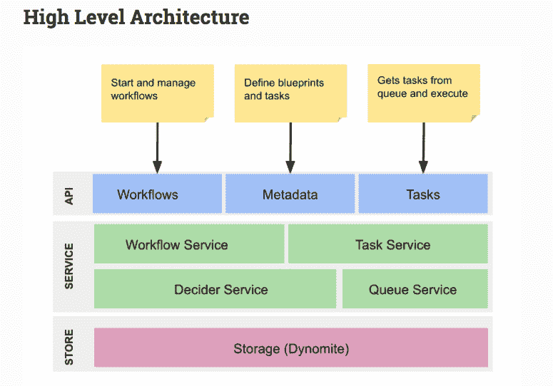

# 分析这个:了解微服务监控

> 原文：<https://thenewstack.io/analyze-this-understand-microservices-monitoring/>

网飞、优步、亚马逊和其他科技巨头以及较小的组织已经开始大规模部署微服务，到目前为止，微服务提供的功能和灵活性已经超过了最初的宣传。随着人工智能(AI)和机器学习的加入，你可以期待看到这种相对新的强大的计算架构变得更加令人敬畏。

但是，随着组织打破单一应用程序的束缚，支持在共享微服务池中运行的部署，他们很快发现生活可能会变得比预期的更复杂。首先，微服务可能服务于具有非常不同的计算需求的各种应用程序，需要进行通信。由此产生的潜在相互依赖和错误数量呈指数级增长，这使得管理和监控微服务变得更加困难。

显而易见的解决方案，因为大规模部署微服务的势头正在形成；是采用先进的微服务分析工具，因为 IT 组织开始意识到需要能够监控微服务的每一个模块。

“自从几年前开始采用微服务以来，人们一直专注于建立微服务。但人们刚刚开始意识到，当管理数百甚至数千个相互依赖的微服务时，复杂性成为一个问题，” [Camunda](https://camunda.com/) 的联合创始人兼首席执行官 [Jakob Freund](https://www.linkedin.com/in/jakob-freund-a3a7a33/) 说。“现在，人们开始在粒度级别上寻找他们是如何工作的，并希望更多地了解他们是如何一起玩的。”

自从几年前大规模部署微服务以来；此后，网飞、优步、荷兰国际集团和亚马逊开发了自己的微服务编排和内部分析引擎。

例如，网飞在一年多前发布其开源[指挥平台](https://netflix.github.io/conductor/)时，就已经对微服务分析和编排提供的可能性进行了开创性的研究。由于微服务在后台透明运行，网飞继续依赖该平台让数百万用户选择、播放和下载电影和电视剧。

网飞的指挥协调引擎通过一个基于 JSON DSL 的蓝图来管理这数以千计的微服务，该蓝图定义了执行流程。Conductor 使网飞的开发人员和管理人员能够分析、测试、暂停和停止以及修复不同流程中的单个模型，所有这些都为网飞的全球网络提供了动力。

“随着微服务数量的增长和流程复杂性的增加，在没有中央协调器的情况下，获得这些分布式工作流的可见性变得很困难，”内容网飞工程师 [Viren Baraiya](http://linkedin.com/in/virenb) 和 Vikram Singh 在一篇博客文章中写道。“我们构建了 Conductor 作为编排引擎’,以满足以下需求，消除应用中的样板文件需求，并提供反应式流程。”

网飞和其他人的微服务分析和编排平台是开源的。因此，它们为想要冒险开发自己的部署库的组织提供了丰富的信息和代码。这些部署提供了代码，用于了解单个微服务(实际上是独立的应用程序)如何执行和相互通信，其中许多微服务都有独立的持久存储接口。

当然，最终目标是以对最终用户完全透明的方式管理流程、错误和瓶颈，因为基于微服务的平台可以在微服务分析的帮助下自我修复。例如，在出现瓶颈的情况下，试图在网上购买小部件或服务的最终用户最好永远不会收到提示用户“稍后再试”的错误消息

当然，开发微服务编排和相关的分析能力说起来容易做起来难。为此，第三方为那些缺乏内部开发架构资源的组织提供了解决方案和服务。

[Enterprise Management Associates](https://www.enterprisemanagement.com/)(EMA)的分析师[托尔斯滕·沃尔克](https://www.linkedin.com/in/torstenvolk/)说:“微服务正在成为当今的主流应用，并经常显示出与现有整体企业应用程序的许多集成点。“与此同时，以 DevOps 为中心的应用和基础架构分析软件的供应商正在加紧监控这个通常复杂且动态的应用世界，它由共享服务组成，发布时间表通常不连贯。”

为了填补寻求在[业务流程模型和符号(BPMN)](http://www.bpmn.org/) 内提供微服务分析和监控功能的第三方替代方案的组织的空白，Oracle 的 BPM 产品或 IBM 的 WebSphere Processor Server 作为大规模部署的替代方案。Camunda、Stackstate 和 Dynatrace 也推出了一些独立的微服务分析解决方案，而其他解决方案肯定会紧随其后。

Camunda 提供了 Optimize 2.0，这是其基于 [BPMN](http://www.bpmn.org/) 标准的企业工作流平台的一部分。开源图形界面包括一个工作流程图，允许实时监控和重新配置各个微服务。一个潜在的用例场景可能是，例如，一个组织在很短的时间内收到 1，000 个意外订单和交易。Camunda 说，由于 Optimize 2.0 的工作流程图提供了可见性，因此监控和重新配置单个微服务以防止或修复工作流程瓶颈变得很容易。

Stackstate 的微服务能力，除了业务流程；涵盖云、容器和虚拟机(VM)部署。

EMA 的 Volk 说:“当营销活动中这些微服务的规模扩大导致其他地方出现资源瓶颈时，“Stackstate 以电子列表和拓扑图的形式向您显示所有相关的事件，该图将您的营销活动事件精确定位为瓶颈的触发器。”

Dynatrace 提供 DevOps 集成的全栈监控功能。Volk 说，为了持续提供微服务，Dynatrace 在数据中心和云应用的其余部分的整体背景下，跟踪每次代码推送的资源和用户影响。“像 Stackstate 的系统一样，Dynatrace 提供 ML 驱动的依赖和 BPM 监控，”Volk 说。

## 安全动态

虽然公司正在逐步提供工具来密切跟踪微服务的性能和其他指标，但他们尚未为捆绑有微服务分析软件的微服务提供更严格的安全监控。然而，面向微服务安全监控的第三方供应商工具和服务当然是作为独立服务存在的。从技术上来说，它们可能属于微服务分析产品服务类别，但却是为了安全而设计的。

[Aqua Security](https://www.aquasec.com/) 的产品营销副总裁 [Rani Osnat](https://www.linkedin.com/in/raniosnat/) 说，与微服务架构相关的监控和安全挑战源于微服务是如何被创建为高度可扩展的——这意味着它们可以跨节点快速复制自己，运行几分钟，然后关闭。因此，适用于静态位置(甚至虚拟位置)的安全工具将不起作用。“此外，网络变成了如何动态扩展，因此网络控制必须能够跟上变化，并具有微服务之间主机内和主机间通信的可见性，”Osnat 说。

当然，随着微服务部署和底层代码的不断发展，安全性和监控也将继续发展。对于那些只想尝试一下的组织来说，除了数据安全性之外，他们主要关心的是如何在近期内使用分析来跟踪底层架构的复杂性。

“组织现在才开始采用微服务，并建立这些有点复杂的基础设施，”Camunda 的 Freund 说。“下一个问题是处理这种复杂性，这就是大型工作流自动化(可以提供帮助)的地方。”

[Aqua](https://www.aquasec.com/) 是新堆栈的赞助商。

通过 Pixabay 的特征图像。

<svg xmlns:xlink="http://www.w3.org/1999/xlink" viewBox="0 0 68 31" version="1.1"><title>Group</title> <desc>Created with Sketch.</desc></svg>