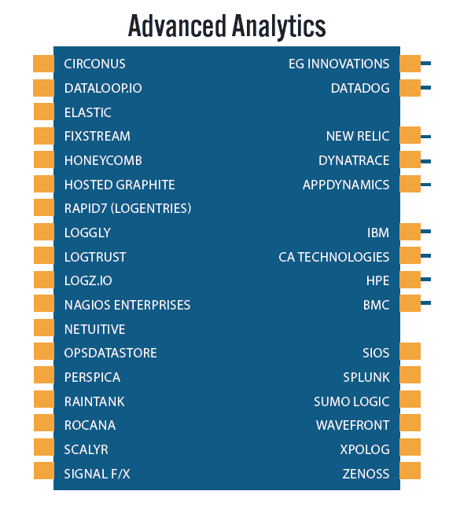
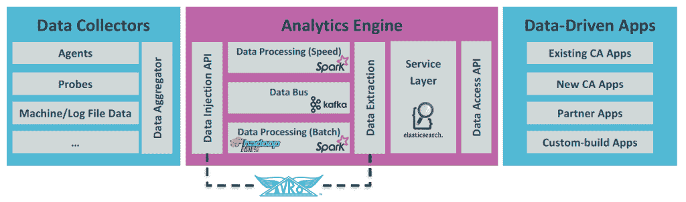
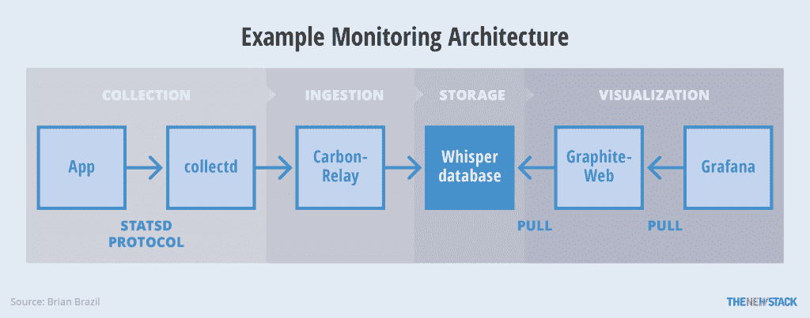

# 变形监控市场分析:APM、日志、定价和分析

> 原文：<https://thenewstack.io/analyzing-morphing-monitoring-market-apm-logs-pricing-analytics/>

在第 131 集的[新堆栈分析师](https://451research.com/)播客中， [451 Research](https://451research.com/) 的 [Nancy Gohring](https://451research.com/analyst-team/analyst/Nancy+Gohring) 和我们一起讨论应用监控和 IT 运营分析之间的差异。仅仅定义市场就很复杂，所以 Gohring 提供了一些解释。在许多方面，她看到了应用性能监控(APM)与服务器和基础设施监控之间的许多相似之处。然而，当涉及到处理日志管理的提供商时，她看到了更多的差异。高级分析领域是重叠程度最高的领域，也是供应商努力关注创新的领域。

[#131:变形监测市场分析:APM、日志、定价和分析](https://thenewstack.simplecast.com/episodes/131-analyzing-the-morphing-monitoring-market-apm-logs-pricing-and-analytics)

Gohring 在她最近的“[应用和基础设施性能市场图 2017](https://451research.com/report-long?icid=4155) ”报告中提出了以下关于高级分析和监控的要点:

*   **主要挑战:**包括 APM、服务器监控和日志管理在内的各个细分市场的供应商都在增加分析功能，这些功能在某些情况下可以解决一些常见的问题，从而带来了新的竞争战场。
*   **Innovations:** Anomaly detection, automatic baselining, predictive analytics, sophisticated querying capabilities and innovative backend data management techniques are driving this sector.

    虽然完整的报告只提供给 451 个研究客户，但这张图表显示了 APM 分析领域的一些参与者。

涉及的其他主题包括:

*   部署模式:例如，同时使用多少监控工具？是否使用了完整的 ELK 堆栈？
*   定价:Gohring 认为“2017 年将是定价实验的一年……我们听到供应商开始研究不同的定价模式，并期望在来年看到一些新的计划。”供应商工具描述了[四种方法](https://instrumentalapp.com/blog/application-monitoring-pricing-comparison/):
    *   基于主机数量(例如，Datadog、New Relic)
    *   基于数量的定价(如 SignalFx)
    *   基于公制计数的定价(例如，仪器、天平)
    *   基于分辨率的定价(例如 Librato)
*   IT 运营分析(ITOA):戈林认为这是一个供应商驱动的术语。基于这个[供应商创造的 ITOA 景观](http://www.itoa-landscape.org/)，我们相信她是对的。对她来说，IT 运营分析结合了应用程序、基础架构、业务数据和其他来源来提供见解。她谈到了市场如何将自己重塑为 ITOA 2.0。自播客以来，她在报告“[大数据，机器学习塑造表现——监控发展](https://451research.com/report-short?entityId=91728&referrer=marketing?&utm_campaign=2017_market_insight&utm_source=website_homepage&utm_medium=website&utm_content=apply_for_trial&utm_term=cloud_transformation)”中对此进行了阐述
*   [亚马逊网络服务](https://aws.amazon.com/)已经成为这个领域的大玩家。提到了 [CloudWatch](https://aws.amazon.com/cloudwatch/) 和 [X 射线](https://aws.amazon.com/xray/)产品。Gohring 说，使用 AWS，你仍然不能百分之百地了解应用程序的性能。依赖 AWS 的另一个挑战是当您在真正的混合云环境中运行应用程序时。
*   老牌科技公司的两项努力是:

使用 Jarvis 项目的 CA 分析参考架构

通过 Pixabay 的特征图像。

<svg xmlns:xlink="http://www.w3.org/1999/xlink" viewBox="0 0 68 31" version="1.1"><title>Group</title> <desc>Created with Sketch.</desc></svg>