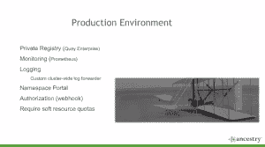
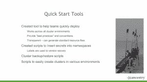

# Ancestry.com 的 Docker 故事以及它如何最终导致 Kubernetes

> 原文：<https://thenewstack.io/ancestry-coms-docker-story-eventually-lead-kubernetes/>

Ancestry.com[的软件工程师架构师 Paul MacKay](https://www.ancestry.com/?s_kwcid=ancestry.com&gclid=CjwKCAjwzYDMBRA1EiwAwCv6JpZB-s5foim0ADMfPNABcQkX60l1PYjXxJE-qSePr9uio99DzxLTXBoC5oIQAvD_BwE&o_xid=57465&o_lid=57465&o_sch=Paid+Search+Brand) 最近在微服务虚拟峰会上发言，阐述了采用容器的问题以及它在如何运行他们的技术堆栈方面带来的巨大变化。

Ancestry 是一个拥有 200 亿历史记录、9000 万个独立的家谱和超过 100 亿个档案的网站。它的 400 万会员有 1.75 亿张可分享的照片、文档、书面故事和收藏。这总计超过 9pb 的数据。

他们目前有九个集群，包括内部部署和 AWS。在生产集群中，有成百上千个节点和成百上千个单独的服务，然后成千上万个 pod 通过 Docker 和 Kubernetes 运行。

他们于 1996 年上线，团队成员一直稳定在三到四人。从使用 C#和 Microsoft Windows 开始。NET 框架来提供服务，随着时间的推移，它们扩展到包括。然后，NET、SQL Server 和 IIS 转向开源技术，包括运行在 Linux 上的 Java、Node.js 和 Python。

Ancestry.com 生产环境

但是在三年前的一次会议上看到 Docker 的演示后，他们将容器添加到组合中，这就需要改变他们运行堆栈的方式。

“我们能够向管理层证明，部署和扩展这些服务很容易，并且部署时间会缩短，”他说。迁移到 Docker 还使他们能够更有效地利用我们的计算资源。

## 预计道路会崎岖不平

首先，他说，采用新技术很难。他说，Ancestry 的开发人员不是为了创建基础设施，而是为客户开发新功能。“你必须一开始就认识到，采用新技术会减少开发向客户提供的功能，”他说。

他解释说，因为新技术可能非常具有破坏性，所以上层管理人员必须确信，为什么新技术值得从新功能上转移注意力、资源和努力。

他说，关键是要有一个赞助人，他不仅能给你你需要的时间和资源，还能给你实验和做新事情的真正能力。一个明白路上可能会有失败并允许失败的人。

麦凯解释说，与此同时，你需要工作人员的认同。在 Ancestry，他们创建了试点团队来推广新的微服务技术。这些团队不仅仅创建 POC(概念验证)，他们还有各种各样的实际问题要解决。

## 这就是支持的样子

“如果(这些团队)不成功，他们就不会成功，”他说。“我们是这一过程变化的一部分。”他们给予这些团队全力支持，从大量训练开始。

McKay 说，当他们开始走上微服务之路时，他们有许多没有 Linux、容器或编排经验的 Windows 开发人员，他们需要接受如何让它们工作的培训。他说，不仅仅是工具，还有如何将服务分解成更小块的概念和范例。目标是让他们感到舒适，并有能力采用新技术。

McKay 说，然后他们提供工具来帮助快速部署任何规模的服务。这些工具适用于所有集群，并为新的和有经验的开发人员提供了惯例和最佳实践。

Ancestry 快速入门工具

当你采用新技术时，他说，你真的是在飞行中学习。这就产生了非常敏捷的需求。会犯错误，这没关系。他们确保团队知道他们需要一起工作，并且他们都将使彼此成功。

## 回到技术

他们开始了决定拆分哪些服务的过程。McKay 解释说，需要考虑许多方面，例如网络延迟、监控和协调所有这些服务的部署。“东西不是免费的，”他指出。“管理服务是有成本的。”

他说，你需要了解如何扩大规模。“您是扩展这些微服务的一部分还是子集？您是否会一次扩展所有内容？这些服务独立存在真的有意义吗？是对生态系统有用的东西吗？”他问。

他们让开发者决定服务的规模。他解释说:“我们真的觉得，对于容器化来说，最简单的方法是让开发者决定服务的规模以及如何去耦合。”

## 推出微服务

所以他们推出了 Docker，构建了自己的 Linux 发行版和 CoreOS。当他们看到 Kubernetes 的测试版演示时，McKay 避开了其他编排工具，转而支持新技术。

他为他们忠诚的试验团队创建了一个小型的 Kubernetes 沙盒，这些试验团队致力于将他们的服务分开，并尝试将 Kubernetes 用于容器部署。

他们建立了每日站立，以确保问题得到快速解决。“有一些难题需要解决，”他说。"可解决的问题…但是困难、独特和不同的问题."

McKay 解释说，除了培训之外，他们还创造了最佳实践，构建了模板和脚本，以帮助开发人员快速入门如何分解服务，然后使用容器部署服务，并使用 Kubernetes 编排服务。

## 从 REPL 搬到 CDEL

McKay 说，程序员熟悉 REPL 环境(读取、评估、打印和循环)。与 Kubernetes 这种变化，以编译，部署，执行，然后循环(CDEL)。“这意味着，”他说，“不再有协调部署、试验各种规模和分离的障碍。现在你可以真正编译，你可以部署它，你可以弄清楚它在环境中是什么样子，然后你可以重申并弄清楚什么是合适的，什么是不合适的。”

## 制定标准

在将微服务投入生产的一年半时间里，他们开发了一些部署标准。

*   遵循 Kubernetes 约定，他们为每个服务创建一个名称空间，而不管其大小，并使用一个命名约定(functionalgroup-servicename)
*   他们限制每个箱子只能放一个集装箱。
*   在他们的生产环境中，每个服务都有自己的存储库，无论大小。
*   他们使用 Prometheus 来监控服务，确保符合 SOA。
*   开发人员可以一直部署到生产。他们从非常宽的特权开始，根据需要缩小它们。
*   他们为每个开发、试运行和生产环境创建单独的集群。
*   他们运行自己定制的集群范围的记录器，并创建了一个名称空间门户。
*   Kubernetes 在 cube DNS 中使用集群内 DNS 服务器，并且在部署微服务时有一个服务发现，这大大减少了网络延迟。
*   无论大小如何，每个服务都需要 CPU 和内存配额。开发人员可以申请更多的资源，他们可以得到他们需要的东西。

欲了解更多信息和更深入的探讨，请点击此处查看他的演讲。

CoreOS 是新堆栈的赞助商。

通过 Ancestry.com 的[拍摄特写照片和插页照片。](http://ancestry.com)

<svg xmlns:xlink="http://www.w3.org/1999/xlink" viewBox="0 0 68 31" version="1.1"><title>Group</title> <desc>Created with Sketch.</desc></svg>