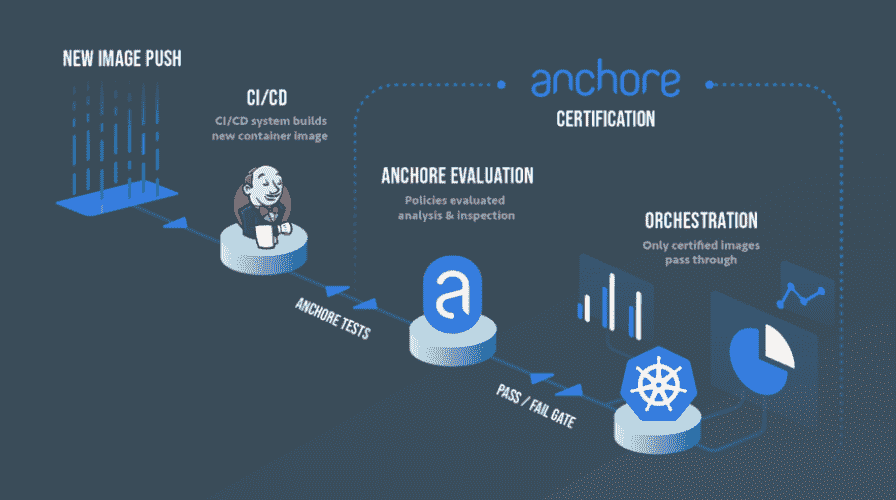

# 主播:集装箱安全从图像开始

> 原文：<https://thenewstack.io/anchore-container-security-starts-with-the-images/>

在关于集装箱安全的焦点应该放在哪里的争论中，对于主播来说，很明显精力应该放在图像上。

首席执行官 [赛义德·齐瓦尼](https://twitter.com/SaidZiouani?ref_src=twsrc%5Egoogle%7Ctwcamp%5Eserp%7Ctwgr%5Eauthor)说:“我们坚信，安全始于预防，而非补救。“如果您是预运行时用户，您可以进入这些容器，了解关于这些容器的一切，从漏洞到机密和凭证，从错误配置到文件系统，并且能够发现所有这些信息。这就是 Anchore 所做的——在你进入运行期之前发现问题。”

他说，这家总部位于加州圣巴巴拉的公司声称其客户中有几十家财富 100 强公司，但没有计划解决运行时、编排或其他方面的安全问题。

“我们现在有能力拍摄一张图像，找出关于该图像的所有信息，并随着时间的推移在本地保存这些信息，甚至是一年后，如果发生了什么事情，无论是漏洞还是策略被破坏，我们都能够通知您，并说，‘嘿，这张合规的图像不再安全或合规，这就是原因，’”他说。

周二，该公司披露了除其最初的 Anchore Enterprise 开源命令行查询工具以外的新功能。

## 真知灼见

自动化引擎 [Ansible](https://www.ansible.com/) (被红帽收购)的联合创始人齐瓦尼(Ziouani)于 2016 年与私有云供应商 [Eucalyptus](https://www.businessinsider.com/hp-buys-eucalyptus-systems-2014-9) (被惠普收购)的联合创始人[丹尼尔·努尔米](https://www.linkedin.com/in/dannurmi/)联手创建了 Anchore。

[Anchore Engine](https://github.com/anchore/anchore-engine) 建立在开源项目的基础上，提供了一个集中的本地工具来分析容器映像的漏洞、策略、兼容性和配置，以确保只部署受信任的容器。Anchore Engine 可以分析任何基于 Linux 的映像，并将生成一份“材料清单”，涵盖映像中的每个工件，包括官方操作系统包、非官方包、配置文件、语言模块和工件，如包管理器 [NPM](https://www.npmjs.com/) 、PiP、 [RubyGems](https://guides.rubygems.org/what-is-a-gem/) 和 Java 档案。

它支持任何 Docker V2 兼容的注册表，包括亚马逊 ECR、CoreOS Quay DockerHub、谷歌 GCR、JFrog Artifactory、微软 Azure ACR、SuSE Portus 和 VMware Harbor。

Anchore Cloud 是 SaaS 的一个产品，用于分析 DockerHub 等公共容器注册表中的图像，允许用户在这些图像的基础上检查和编写策略。Anchore 提供了有关这些映像的详细数据，包括通常无法从公共注册表中获得的信息，包括映像摘要、操作系统和标签。它提供历史记录，例如图像更新的频率和图像标记的历史记录，包括显示图像之间哪些包和文件发生了更改的更改日志。它的图形化策略编辑器允许用户创建自己的自定义策略，并定义哪些策略用于特定的映像。

此外，高级服务允许扫描存储在 DockerHub 或 Amazon EC2 Container Registry (ECR)上的组织的私有存储库。

今年早些时候，该公司试运行了 Anchore Enterprise。它在本周发布了 1.1 版本，包括:

*   基于 web 的 UI，具有容器注册/存储库和图像仪表板视图，具有历史报告功能，
*   针对空隙部署的本地漏洞数据馈送服务以及对漏洞数据来源的控制，
*   普罗米修斯，S3，迅速整合，
*   一个全面且易于使用的图形化策略编辑器和管理器，
*   系统审计和事件日志。

它使用户能够创建自定义策略，涵盖操作系统包、配置文件、用户提供的二进制文件和第三方软件库，包括 Node。JS，Ruby GEMs，Python 模块和 Java 包。

Zioani 说，将于几个月后推出的 1.2 版本将增加基于规则的访问控制、LDAP 支持和企业用户一直要求的其他东西。

【T2

## 技术独立

在一篇针对新堆栈的[研究文章](https://thenewstack.io/draft-vulnerability-scanners/)中，分析师 Lawrence Hecht 指出了与特定技术相关的图像扫描仪之间的差异，例如 CoreOS 的 Quay.io 的 [Clair](https://github.com/coreos/clair) 扫描，或与 [Docker Trusted Registry](https://docs.docker.com/datacenter/dtr/2.4/guides/) 一起工作的 [Docker 安全扫描](https://thenewstack.io/docker-launches-vulnerability-scanner-containers/)。

其他的，包括 Anchore、 [Aqua Peekr](https://www.aquasec.com/news/blog-peekr-free-security-scanner-just-got-upgraded/) 和 [Twistlock Trust](https://www.twistlock.com/trust/) 独立于特定的注册中心工作，如果你使用来自多个来源的容器图像，这可能是有价值的。

据该公司称，Anchore 因其开源性而与其他图像扫描产品区别开来；通过覆盖不仅仅是常见的漏洞，如秘密和错误配置；以及提供基于策略的遵从工具。

“制定政策不是一项简单的任务，”齐奥尼说。“您需要知道这些策略应该是什么样子，以及如何将这些策略映射到实际映像中，如何加入黑名单和白名单，因此我们必须构建一个能够为您提供这种能力的用户界面。”

Zioani 说，Anchore 通过一个 CI/CD 插件与 Jenkins 紧密集成，该插件也可以安装在内部，但它被设计成任何 CI/CD 管道的一部分。

[Jenkins 的博客](https://wiki.jenkins.io/display/JENKINS/Anchore+Container+Image+Scanner+Plugin)包含了 Nurmi 解释两者如何合作的帖子。

“Anchore 非常灵活，您可以通过 CLI、API 接口直接利用它，也可以通过 CI/CD 利用它。…如果你下载了一个图像，在它进入测试之前，Anchore 在中间。它成为一个大门，如果有简历或政策被破坏，Anchore 将根据检查这些图像的结果说停止或继续或警告，”他说。

[https://www.youtube.com/embed/rB8Sw0FqCQk?feature=oembed](https://www.youtube.com/embed/rB8Sw0FqCQk?feature=oembed)

视频

今年 4 月，Anchore 宣布与总部位于 DC 华盛顿州的 stackArmor 公司建立战略合作伙伴关系，该公司专注于为政府、医疗保健和金融服务等高度监管的行业提供云迁移、管理、网络安全和合规服务。

通过 Pixabay 的特征图像。

<svg xmlns:xlink="http://www.w3.org/1999/xlink" viewBox="0 0 68 31" version="1.1"><title>Group</title> <desc>Created with Sketch.</desc></svg>