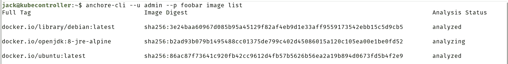
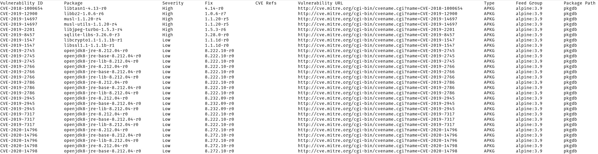

# Anchore:从命令行扫描你的容器镜像的漏洞

> 原文：<https://thenewstack.io/anchore-scan-your-container-images-for-vulnerabilities-from-the-command-line/>

你为 Kubernetes 集群开发。或者，您可以将单个容器微服务部署到您的云托管平台。无论哪种方式，您的工作都取决于拥有尽可能没有漏洞的图像。无论您是从头开始开发自己的映像，还是使用预卷映像，您都需要知道它们在安全性方面的地位。

解决这个问题的一个方法是使用 [Anchore Engine](https://engine.anchore.io/) ，这是一个用于检查、分析和认证集装箱图像的开源软件。 [Anchore CLI](https://github.com/anchore/anchore-cli) 为这些功能提供了一个开发者界面。这种命令行魔术可以从官方 Docker 注册表(或其他注册表)中下载图像，将它们存储在本地库中，然后运行漏洞扫描、策略评估，甚至列出在图像中找到的系统包。换句话说，它可以确保您所依赖的图像可以正常运行。

但是 Anchore CLI 并不是开发者工具包中最大的工具。它不仅是另一个安装文档不太理想的容器邻近工具，而且它的用途也不太明显。我将为您澄清这一点，以便您可以在日常的容器开发工作流中使用 Anchore CLI。

为此，您需要一个支持 Docker 的运行中的 Linux 实例和一个拥有`sudo`特权的用户。我将用 Ubuntu Server 20.04 进行演示，但是这个过程在大多数 Linux 发行版上都是相似的(只要您修改安装命令以匹配发行版的包管理器)。

说到这里，让我们启动并运行 Anchore CLI。

## 安装 Anchore CLI

我们必须做的第一件事是安装 Anchore CLI。在此之前，我们将确保安装了 Docker。为此，登录你的 Ubuntu 服务器，用下面的命令安装 Docker:

`sudo apt-get install docker.io -y`

安装后，使用以下命令将您的用户添加到 docker 组:

`sudo usermod -aG docker $USER`

注销并重新登录，以便更改生效。

一旦安装了 Docker，我们需要安装 PIP，这可以通过以下命令来完成:

`sudo apt-get install python3-pip -y`

将 Python 包管理器添加到系统后，您可以使用以下命令安装 Anchore CLI:

`pip install anchorecli`

当上述命令完成时，您会发现 anchore-cli 命令无法运行。为什么？因为 Pip 把可执行文件安装在~/里。local/bin，它不是您的用户路径的一部分。要解决这个问题，您需要使用以下命令将目录添加到您的路径中:

`export PATH="$HOME/.local/bin/:$PATH"`

此时，如果您发出命令 anchore-cli，您会发现它无法连接到 anchore 引擎。那是因为我们必须把它添加到系统中。幸运的是，启动并运行这个子系统最简单的方法是将其部署为一个容器。为此，我们需要将 Docker Compose 添加到组合中。这可以通过以下两个命令来完成:

`sudo curl -L "https://github.com/docker/compose/releases/download/1.23.1/docker-compose-$(uname -s)-$(uname -m)" -o /usr/local/bin/docker-compose`

`sudo chmod +x /usr/local/bin/docker-compose`

接下来，使用以下命令下载 Anchore 引擎 YAML 文件:

`curl https://engine.anchore.io/docs/quickstart/docker-compose.yaml > docker-compose.yaml`

存储 YAML 后，使用以下命令部署引擎:

`docker-compose up -d`

Anchore 引擎启动后，你需要给它几分钟的时间。在它工作时，让我们导出一些变量(这样您就不必总是将它们添加到 Anchore CLI 命令中)。我们将设置 URL、用户和密码变量。Anchore 引擎的默认凭据是 admin/foobar。

如果需要，您可以更改管理员密码(在发出 docker-compose up -d 命令之前)。为此，打开您刚才下载的 docker-compose.yaml 文件，查找下面的行:

```
-  ANCHORE_ADMIN_PASSWORD=foobar

```

把 foobar 改成你喜欢的任何密码。保存并关闭文件。如果您已经部署了 Anchore Engine contain，请在更改密码之前发出以下命令:

`docker-compose down`

当容器关闭时，更改密码，然后重新部署容器。

要设置环境变量，发出以下三个命令:

`ANCHORE_CLI_URL=http://SERVER:8228/v1`

`ANCHORE_CLI_USER=admin`

`ANCHORE_CLI_PASS=PASSWORD`

其中 SERVER 是您的服务器的 IP 地址，PASSWORD 是您在 YAML 文件中设置的(注意:如果您没有更改密码，请确保使用 foobar)。

## 使用 Anchore CLI

您现在已经准备好使用 Anchore CLI 了。首先，让我们下载一个图像，然后我们将扫描它。我们将使用以下命令下载官方的 openjdk:8-jre-alpine 映像:

`anchore-cli --u admin --p foobar image add docker.io/library/openjdk:8-jre-alpine`

下载映像后，Anchore CLI 将开始分析映像的过程。这需要一些时间。如果您发出以下命令:

`anchore-cli --u admin --p foobar image list`

您将看到 openjdk-8-jre-alpine 图像仍在分析过程中(图 1)。



图 1:对 openjdk-8-jre-alpine 图像的分析还没有完成。

如果您收到错误“未授权”，这是因为 Anchore CLI 无法识别您设置的变量。我发现这太常见了。要解决这个问题，您必须发出命令，包括如下所示的授权凭证:

`anchore-cli --u admin --p foobar image list`

一旦映像从分析状态转移到已分析状态(您需要继续发出 image list 命令来查找)，您就可以使用以下命令执行漏洞扫描:

`anchore-cli --u admin --p foobar image vuln docker.io/library/openjdk:8-jre-alpine all`

上述命令将列出所有与映像相关的已知漏洞(图 2)(如果有)。



图 2:一些被列为高的简历可能会阻止你使用这张图片。

如果您发现一个映像包含太多不可接受的漏洞，您的最佳选择是避开该映像，并找到另一个用于开发目的的映像。

要运行策略检查，命令应该是:

`anchore-cli --u admin --p foobar evaluate check docker.io/library/debian:latest --detail`

从这个命令中，您应该可以看到如下输出:

```
Image Digest:  sha256:3e24baa60967d085b95a45129f82af4eb9d1e33aff9559173542ebb15c5d9cb5
Full Tag:  docker.io/library/debian:latest
Image ID:  4a7a1f4017349067a21bd2de060dcf8b41e49fabf61b0dc3cf86a87e1f6dba9d
Status:  pass
Last Eval:  2021-05-28T14:14:21Z
Policy ID:  2c53a13c-1765-11e8-82ef-23527761d060
Final Action:  warn
Final Action Reason:  policy_evaluation
Gate Trigger Detail Status
dockerfile instruction Dockerfile directive  'HEALTHCHECK'  not found,  matching condition  'not_exists'  check warn
vulnerabilities package MEDIUM Vulnerability found in os package type  (dpkg)  -  libgnutls30  (CVE-2011-3389  -  https://security-tracker.debian.org/tracker/CVE-2011-3389) warn

```

您甚至可以使用以下命令订阅在新 CVE 添加到更新时接收通知:

`anchore-cli --u admin --p foobar subscription activate vuln_update docker.io/library/debian:latest`

这就是安装和使用 Anchore CLI 的全部内容，以确保您使用的容器映像没有漏洞。明智地(经常)使用这个工具，它会很好地为你服务。

<svg xmlns:xlink="http://www.w3.org/1999/xlink" viewBox="0 0 68 31" version="1.1"><title>Group</title> <desc>Created with Sketch.</desc></svg>