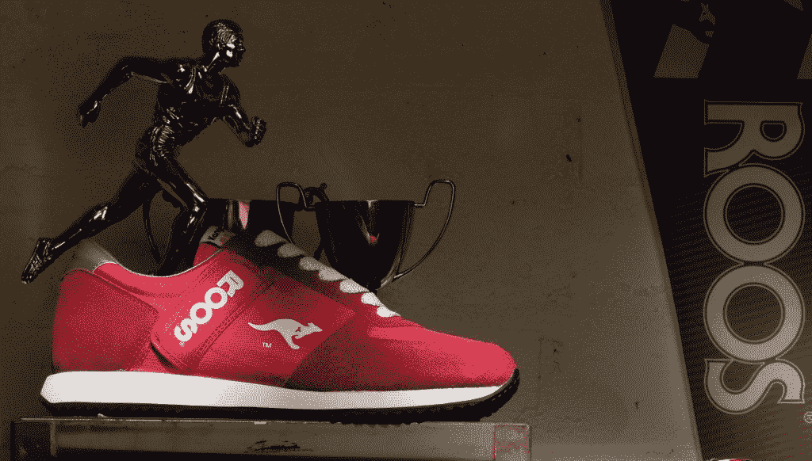

# 安妮·温柔:一个堆垛机的旅程

> 原文：<https://thenewstack.io/anne-gentle-one-stackers-journey/>

尽管我已经在德克萨斯州的奥斯汀住了 14 年多，但当被问到时，我倾向于说自己是中西部人。中西部精神有一些特质，我会一直在自己身上找到:努力工作、资源创新和保护、谦逊，以及对世界某处正在形成的趋势的好奇心。20 世纪 80 年代，当我还是个孩子的时候，我去密歇根州卡拉马祖的一家鞋店买袋鼠鞋。这些是 Velcro 最新的技术！配有一个隐藏的拉链口袋，可以藏钥匙、零钱，甚至是给同学的美钞或纸币。这双鞋是我对一项很酷的颠覆性技术的第一印象，这项技术应用于一个老问题——移动存储。

很快我就要有自己的孩子了，并尝试用新的方法来解决一个老问题:在我的孩子长大之前，我怎样才能集中精力，与他们共度美好时光，同时还能做有意义的工作，用新的方法解决有趣的问题？对我来说，解决办法是灵活的工作时间和开源软件的引入。

我一周工作 30 个小时编写专有的传统软件文档。这个时间表给了我很大的时间。白天轮班，下午开始妈妈轮班。尽管如此，我还是在工作之余不断寻找新的技术文档解决方案。开源项目正在制作他们自己的文档工具，并融合了书籍和维基的写作和出版技术。

经过进一步的调查，我决定学徒是学习更多开源文档的最好方式——它实用，有创造性，并且吸引了我的中西部自我。开源对文档所做的事情看起来像是一个创新的应用程序，用来解决另一个古老的问题:如何用有限的资源快速编写准确的技术文档？我觉得最好的学习方法是练习，开源让你练习很多。

[FLOSS Manuals](http://en.flossmanuals.net/) 是我找到的组织，他们欢迎我的帮助。他们愿意为共同的事业努力工作。FLOSS Manuals 的创始人亚当·海德(Adam Hyde)召集团队完成了一项不可能完成的任务，即在短短五天内写出一本有凝聚力的书。我加入了一个团队，他们正在为[每个孩子一台笔记本电脑](http://one.laptop.org/)项目的老师和家长写一本书。

时间又快进到四年前，那时我在 Rackspace 找到了一份工作，使用开源技术在社区中编写 OpenStack 文档。您如何为两个快速发展的软件项目制作高质量的技术文档，这两个项目有选择地集成并每六个月发布一次？我把我的职业生涯押在利用社区的力量来产生技术文档上。

再次快进到 20 多个项目，我继续调整技术，同时在户外练习我的手艺。

> OpenStack 本身就像那些带有隐藏口袋的 velcro 扣袋鼠鞋一样令人惊叹。

这些功能以创新的方式重新组合。多年来，存储、计算能力、网络解决方案都已经完成并重做。这一次，云方式提供了共享资源、灵活供应、按使用付费和资源保护，满足了我的中西部情感。借助 OpenStack，我们可以在开源社区中为 docs.openstack.org 的 T2 撰写文档。当我们快速推进云解决方案时,“像对待代码一样对待文档”的愿景仍然是新鲜和令人兴奋的。

[https://www.youtube.com/embed/SNW-lhdrnEU?feature=oembed](https://www.youtube.com/embed/SNW-lhdrnEU?feature=oembed)

视频

Rackspace 是新堆栈的赞助商。

<svg xmlns:xlink="http://www.w3.org/1999/xlink" viewBox="0 0 68 31" version="1.1"><title>Group</title> <desc>Created with Sketch.</desc></svg>