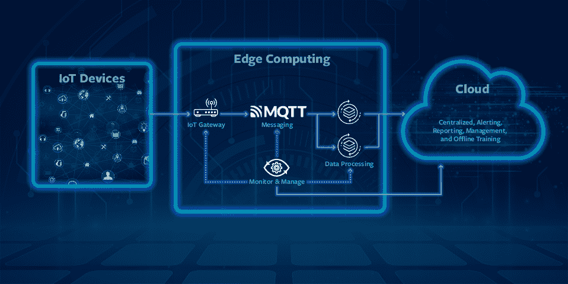
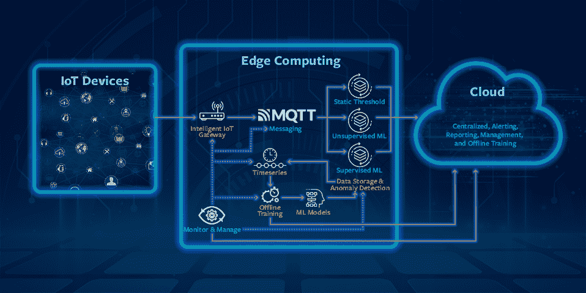

# 异常检测:物联网数据未来一瞥

> 原文：<https://thenewstack.io/anomaly-detection-glimpse-into-the-future-of-iot-data/>

 [玛格丽特·李

Margaret 是 BMC Software，Inc .的高级副总裁兼数字服务和运营管理总经理。她负责公司全套 BMC Helix 解决方案的 IT 服务管理和 IT 运营管理。](https://www.linkedin.com/in/margaretmei/) 

大数据和[物联网](https://thenewstack.io/category/edge-iot/)齐头并进。随着物联网设备的持续激增-一位预测者估计，到 2025 年将有[640 亿台物联网设备在线](https://techjury.net/blog/internet-of-things-statistics/#gref)-企业面临着极大的数据量。

管理这些数据量并从中获得切实可行的见解，是在数据像阳光一样重要的时代实现业务转型的关键。

[物联网数据](https://thenewstack.io/azure-iot-edge-a-technology-primer/)洪流可以提供洞察的一个领域是异常检测。像传统的业务应用程序和 IT 基础设施一样，物联网可以监控它们所连接的物理设备中的问题。

例如，当物联网设备用于帮助工业或制造环境中的流程现代化和自动化时，异常可能是某台特定机器需要维护的信号。及早发现潜在问题有助于减少意外停机时间。

但收集所有这些数据可能是一个挑战，因为将数据从设备转移到中央计算平台可能会有问题。您真的需要发送来自每台设备的所有数据吗？

边缘计算可以帮助克服数据过载，使物联网异常检测更加有效。深入探索这一实践为新兴的网络架构以及它们如何在未来推动业务发展提供了一个启发性的视角。

### 常见的检测策略

物联网案例中集成了两种突出的异常检测策略，各有优缺点。

静态阈值具有自动执行日常决策和警报的优势，这使其优于传统策略。但是要使用静态阈值，管理员需要适当级别的领域知识阈值。并且这些水平不会根据条件而改变，使得它们难以在不断变化的环境中保持。

基于机器学习(ML)的方法，无论是有监督的还是无监督的，都为自动化异常检测增加了智能。通过不断学习时间序列数据行为，系统变得更适应数据变化，并能更好地处理不断变化的环境。

然而，随着时间的推移，物联网设备生成的数据量将继续增加，推动网络带宽、存储容量和计算需求的相关增长。因此，使用集中式资源(甚至是云)进行实时物联网数据处理变得越来越昂贵，并延长了数据处理的延迟。

边缘计算提供了一种更有效的方法来利用基于 ML 的异常检测。通过将关键数据处理工作负载转移到更靠近数据源(物联网设备)的地方，您可以减少云上的工作负载，确保零延迟数据处理，缩短响应时间，并降低网络负载和云成本。

边缘计算还可用于实时监控机器健康状况，以检测可能表明系统故障的异常情况。零延迟数据处理使近实时报告重大事故和防止系统故障成为可能。

### 边缘计算架构

边缘计算可以部署在许多架构中，包括 100%的边缘计算和结合了边缘和云计算的混合模型。为了阐明异常部署的边缘架构，图 1 显示了后者。

图 1:包括边缘计算和云计算的通用架构

在该模型中，物联网网关使用各种物联网数据协议从物联网设备收集和接收数据，并将数据推送到消息层。边缘的数据处理组件从消息传递层提取数据，对其进行处理，并将见解发送到云，以进行集中警报和报告。监控和管理系统向云报告操作问题，并确保组件与从云集中管理的配置数据同步。

边缘计算组件可以一起部署在 Raspberry Pi 等单板计算机中，也可以跨同一数据中心的多个设备部署，以实现更大的可扩展性。选择取决于可伸缩性需求。

### 物联网异常检测

图 2 示出了用于实现异常检测的边缘计算的架构。该模型为前面描述的通用架构增加了智能。

图 2:用于实时异常检测的边缘计算

在该模型中，智能物联网网关充当时序数据路由器。对于每种异常检测方法，消息传递层都有单独的队列。根据应用于特定时间序列的异常检测方法，网关做出路由决策，并将数据放入相应的队列中。动态路由决策由配置决定。配置更改在云中进行，监控和管理系统应用这些更改。

异常检测处理器从各自的队列中提取数据，检测异常并将其报告给云。这些处理器还将数据存储在时序数据库中。

在这个例子中，离线训练计划作业定期从时间序列数据库中获取批量数据，压缩数据并将其发送到云，以训练用于监督异常检测的 ML 模型。该作业还从云中获取 ML 模型，并将它们存储在 ML 模型数据库中。受监督的最大似然异常检测器从模型数据库中获取最大似然模型。

监控和管理系统向云报告操作问题，并确保组件与从云集中管理的配置数据同步。

### 现代化物联网实施

在可预见的未来，大多数企业将采用混合 IT 方法，包括集中式和边缘计算，作为更加复杂的 IT 环境的一部分。

下一步是使用边缘计算来收集、应用分析和采取行动。集中式计算引擎和落后见解的时代已经屈指可数。今天，我们生活在一个可以收集、分析和处理即时生成的数据的世界。

在这种情况下，我们可以应用智能自动化来寻找将重要的边缘数据与中央数据管道协调起来的方法，以便即时获得自动化行动所需的洞察力。

现代物联网实施的数据量和速度要求可扩展、高效、实时的异常检测。边缘计算使得利用机器学习进行物联网异常检测成为可能，同时避免了高昂的云成本和处理延迟。通过使用上述架构，您可以快速检测和解决物联网故障，以确保为您的组织提供最佳服务。

<svg xmlns:xlink="http://www.w3.org/1999/xlink" viewBox="0 0 68 31" version="1.1"><title>Group</title> <desc>Created with Sketch.</desc></svg>