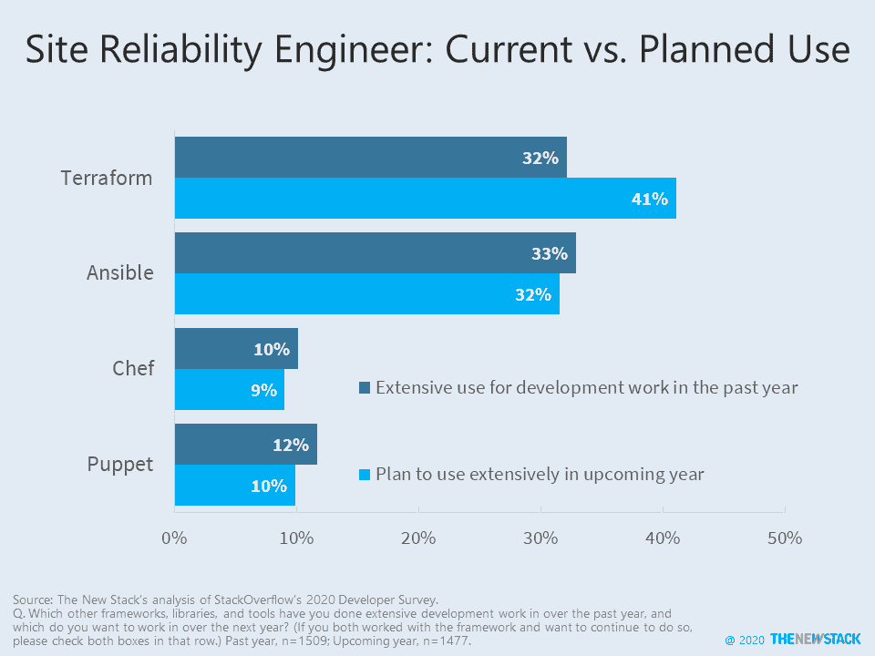
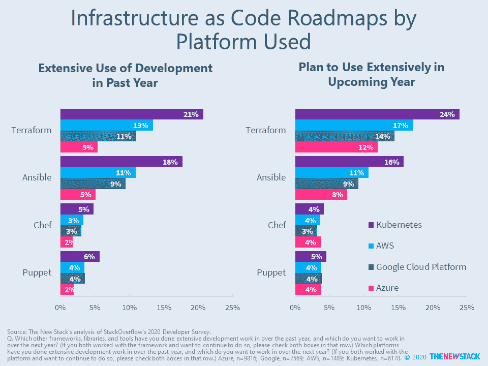
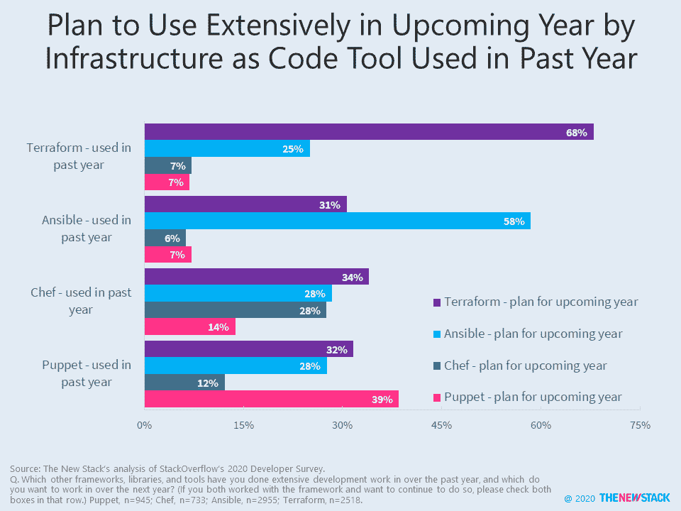

# Ansible、Terraform 在现场可靠性工程师、开发人员中表现出色

> 原文：<https://thenewstack.io/ansible-terraform-excel-among-site-reliability-engineers-devops/>

在 2020 年的 StackOverflow 调查中，几乎四分之三的 Chef 用户明年不想使用它。在业界，只有 IBM DB2、VBA 和其他一些技术是“可怕的”。木偶的前景也好不到哪里去。

在过去的几年里，Red Hat 的 [Ansible](https://www.redhat.com/en/technologies/management/ansible) 和现在 HashiCorp 的 [Terraform](https://www.terraform.io/) 已经成为用于以代码形式部署基础设施的两个顶级工具。三分之一的调查参与者使用 Ansible 和 Terraform，将现场可靠性工程描述为他们的工作职责之一。许多站点可靠性工程师(sre)都强烈要求在接下来的一年里使用 Terraform，而其他三种工具将会减少。

超过一半的 SRE 受访者称自己是开发运维专家。在这一群体中，Terraform 预计也将在 2020 年大放异彩，而其他三种工具预计将略有增长。SREs 和 DevOps 角色很可能会使用这些工具，在评估各种解决方案的未来时，关注他们的技术路线图是有益的，这些解决方案有时被描述为代码形式的基础架构。

StackOverflow 调查没有询问许多其他基础设施即代码工具，AWS CloudFormation、Helm 和 SaltStack 在调查问卷中明显缺失。这些以及其他云平台自带的其他工具将包含在新堆栈关于多云可编程基础设施可行性的报告中。

 

<svg xmlns:xlink="http://www.w3.org/1999/xlink" viewBox="0 0 68 31" version="1.1"><title>Group</title> <desc>Created with Sketch.</desc></svg>