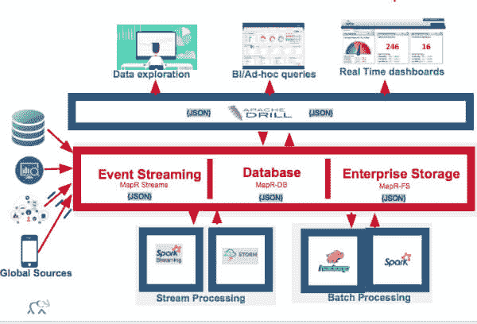
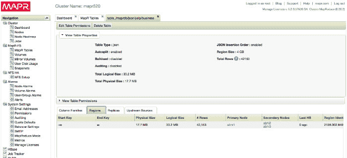

# Apache Drill 消除了 ETL，MapR 数据库的数据转换

> 原文：<https://thenewstack.io/apache-drill-eliminates-etl-data-transformation-mapr-database/>

Hadoop 分发提供商 MapR 正在使用最近发布的 [Apache Drill](https://www.mapr.com/products/apache-drill) 查询引擎版本 1.6 作为其融合数据平台的“统一 SQL 层”，以提供与 MapR-DB 文档数据库的更紧密集成。

通过 Drill 1.6 中的 MapR-DB 文档数据库格式插件，用户可以直接[查询 MapR-DB 中的 JSON 表](https://www.mapr.com/blog/apache-drill-16-mapr-converged-platform-gearing-new-generation-stack-json-enabled-big-data)，潜在地消除了对额外 ETL(提取、转换和加载)操作的需要。

数据和应用高级副总裁 Jack Norris 表示:“您可以通过该融合平台包含和管理文件、数据库表和流，Apache Drill 可用于跨所有数据进行查询，无论这些数据位于何处。

“用户可以使用 Drill 直接访问这些文件，他们可以在数据库表中查询它们；他们可以通过蜂巢看到它。Norris 说:“不管数据是如何到达的，也不管数据位于何处，Drill 都是 SQL 接口，允许直接访问和查询这些数据。

六个月前，MapR 发布了其基于 JSON 的文档数据库[的开发者预览版，用于 Hadoop 内部。它宣布了 MapR-DB 文档数据库功能，作为三月份发布的 MapR 5.1 的一部分。](https://thenewstack.io/latest-integrate-json-mapr-memory-operational-analytics/)

Apache Software Foundation 在 2014 年 12 月将 Drill 提升为顶级项目。它在去年五月发布了 1.0 版本。

Drill 被设计成一个用于多个数据源的无模式 SQL 查询引擎，包括 JSON、Parquet 和 HBase。它不仅允许在 Apache Hadoop 上快速开发应用程序，还使企业 BI 分析师能够自己探索数据——将 It 人员从为他们构建数据中解放出来。

Drill 让您无需 ETL 或先创建模式即可分析 Hadoop 数据；它动态生成模式，并保持文件的原始格式，而不是在将文件加载到数据库系统之前将其转换为表格或预先指定的格式。

“Apache Drill 占据的独特位置实际上是在数据探索领域——能够直接支持一些最常见的格式，这些格式也很难直接查询，比如 JSON 文档，”Norris 说。

例如，自行车设备的网络提供商可以提供单一的搜索服务，该服务既可以涵盖深入的信息，如自行车的文档，也可以返回简单产品搜索的结果，如附件目录。

信息可以存储在关系数据库、HBase 等 NoSQL 系统、MapR 等文档数据库中，甚至可以存储在平面文件中。

Drill 1.6 版本包括性能增强，包括:

*   通过分区修剪的早期应用加速查询规划。
*   通过改进的内存分配器增强了稳定性和可扩展性。
*   对配置单元表查询进行更快的查询规划。
*   拼花元数据缓存的优化读取。
*   和安全性，Norris 将其描述为没有多个不同副本的基于角色的数据视图。

“Apache Drill 是我们的游戏规则改变者，”PYA Analytics 的首席技术官 Edmon Begoli 说，PYA Analytics 是一家位于田纳西州的高级分析公司，服务于医疗保健，国防和其他行业。

“我们已经能够在不到 60 秒的时间内查询商业和政府实体(如医疗补助和医疗服务中心)两年的索赔、账单和临床数据的平面 PSV 文件，”Begoli 说。“Drill 使我们能够绕过传统的 ETL 和数据仓库方法，将平面文件转换为高效的格式(如 Parquet)以提高性能，并对大量文件使用普通 SQL。”

*专题图片:* [天 232–photo 365–施工](https://www.flickr.com/photos/threar/20740016482/in/photolist-7pwceV-qaq7sy-63DGcV-ixj2HW-4XJsbd-8c2fEg-7GDg2j-9QeWnq-9kapsX-9kdsNG-5ZuauN-omRS5a-811jcm-5RMvZf-88biBa-6zKWUr-ptcsKr-zbmrZ-8VLEmt-9RRgZF-8132fW-7ZXb8V-7ZXbHz-pVXJCN-cozpis-xAJ1k5-noX2vR-yccEK5-ymPyhy-8NbhAQ-5dG2vA)由 [Makia Minich](https://www.flickr.com/photos/threar/) ，*持牌下**[*CC BY-SA 2.0*](https://creativecommons.org/licenses/by/2.0/)。*

<svg xmlns:xlink="http://www.w3.org/1999/xlink" viewBox="0 0 68 31" version="1.1"><title>Group</title> <desc>Created with Sketch.</desc></svg>