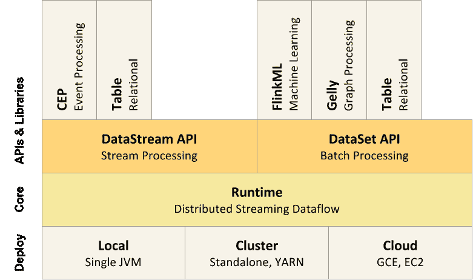

# Apache Flink 实现了连续流处理

> 原文：<https://thenewstack.io/apache-flink-addresses-continuous-stream-processing/>

最流行的技术不一定是手头工作的最佳工具，因为 Capital One 的大数据工程总监 Slim Baltagi 一直在向与会者介绍 Apache Flink 的好处。

Capital One 开发了 100 多个标准来评估流处理工具。在概念验证中，它发现可以用 [Apache Kafka](http://kafka.apache.org/) 、Flink、 [Elasticsearch](https://thenewstack.io/comparison-cloud-based-elasticsearch-elk-solutions/) 和 Elasticsearch 的 Kibana 数据可视化工具取代其专有系统，这是一个提高性能和减少资源消耗的软件包。

尽管他承认 Flink 和更受欢迎的 Spark 都不能解决所有大数据问题，但他提出 Flink 是一项值得研究的技术，可以满足数据分析需求。

[Apache Flink](https://flink.apache.org/) 专注于高吞吐量、低延迟的实时流处理。它的创造者列举了它的优势，包括易用性、性能、实时结果和更好的内存管理。

与 Apache Spark Streamin 相比，这种方法不是一个纯粹的流处理引擎，而是使用一种称为“微批处理”的过程:在一段时间内对一小部分传入数据进行快速批处理操作，这可能会影响延迟。从那以后，Spark 通过[项目钨](https://databricks.com/blog/2015/04/28/project-tungsten-bringing-spark-closer-to-bare-metal.html)增加了更多的实时流处理能力。

“Flink 基本上是开源世界中可用功能的组合。它可以处理非常大的流量——在一个 10 节点的集群中，每秒钟超过 1500 万个事件——而[Apache Storm](http://storm.apache.org/)在 50 万个事件时停止，”Flink 背后的公司首席执行官[Kostas Tzoumas](https://twitter.com/kostas_tzoumas)首席执行官、T20 数据工匠说。Tzoumas 表示，Flink streams 提供了完全容错、无数据丢失或重复以及完全可重复的结果。

他说，这意味着你要使用流处理器作为主要的分析引擎，而不是多层，这样你就可以简化你的堆栈，获得实时响应，并降低总拥有成本。

## **缓和复杂**

“如果你看一下传统架构，你会发现人们有一个连续的数据流，他们将数据输入数据库或 Hadoop 进行分析。越来越难跟上数量的增长，”佐马斯说。

它在 Flink 中构建了查询聚集的功能，甚至在聚集最终出现在数据库中之前，所以在许多情况下，不需要数据库。

“这对数据管理来说意味着从基于批处理的方法向这种流方法的转变。很明显，这个领域需要一个计算平台，一个能够以低延迟处理这些负载的流处理器，并与这种架构很好地匹配，”他说。

它非常适合任何高容量数据流，例如电信、金融部门、移动游戏，尤其是物联网应用。流数据的一个用途是跟踪一组微服务。不是将所有状态反馈给数据库，而是在单个流程流中捕获所有事件。

“使用 Hadoop 及其工具构建的典型工作流具有驱动文件系统的连续入侵管道，然后调度 Hive 作业或 Spark 作业来访问这些文件，然后假装您有连续的输出，”他说。

他说，以 Storm 为例，你使用批处理组，并通过流处理器增强实时结果，尽管这些结果必须通过批处理机进行修正。

Flink 的重点是具有简单易用的 API 的 24/7 流处理器，使用它可以构建要求流处理器精度的应用程序。

## **基于数据库技术**

Flink 在德语中是“快速”或“敏捷”的意思，它于 2009 年以同温层的名字从柏林技术大学发展而来。它最初是一个研究项目，旨在结合基于 MapReduce 的系统和并行数据库系统的最佳技术，然后将重点转向数据流。

Stephan Ewen 和 Kostas Tzoumas 在 2014 年围绕开源项目成立了商业公司 data Artisans，同年它加入了 Apache 孵化器，更名为 Flink。

软件包括用于[复杂事件处理](http://ci.apache.org/projects/flink/flink-docs-master/apis/streaming/libs/cep.html)、机器学习和[图形处理](https://ci.apache.org/projects/flink/flink-docs-master/apis/batch/libs/gelly.html)的库。它宣称能够在单个运行时执行批处理和流式传输。

Flink 使用基于 JVM 的数据处理系统，对序列化的二进制数据进行操作，其他 Apache 项目也是如此，包括 [Drill](http://drill.apache.org/) 、 [Ignite](http://ignite.incubator.apache.org/) 和 [Geode](http://projectgeode.org/) 。它以高效的垃圾收集作为提高性能的手段而自豪；高效的数据解编/串行化堆栈，有助于对二进制数据的操作，并使更多数据适合内存；和 DBMS 风格的操作符，它们对二进制数据进行本机操作，从而在内存中产生高性能，并在必要时将溢出发送到磁盘。

Flink 只能处理数据中实际发生变化的部分，这大大加快了工作速度。Flink 用户也可以运行 Storm 拓扑在两者之间转换。

它在 1.0 版中有 Java 和 Scala 的 API，还有 Python 的测试版。它运行在纱和 HDFS，并有一个 Hadoop 兼容性包。它使用由脸书开发的开源键值存储库 [RocksDB](http://rocksdb.org/) 来存储任何需要存储的状态数据。

展望未来，该公司正在构建 SQL 功能，编写更多的库，提高与 Kafka 和 HDFS 的兼容性，为 Cassandra 等数据库提供支持，并为 Mesos 提供构建支持。

Tzoumas 说，柏林的 11 名数据工匠，包括旧金山的一名，一直专注于扩大其社区，而不是将项目货币化。它有 160 多个贡献者。

Flink 在 2015 年 1 月成为顶级项目，上个月[发布了 1.0 版本](https://flink.apache.org/news/2016/03/08/release-1.0.0.html)，这应该有助于缓解对其生产就绪性的质疑。该公司最近还在由英特尔投资公司牵头的首轮融资中为€筹集了 550 万英镑(600 万美元)。

虽然它落后于 Spark 和 Storm 等开发项目，但英特尔数据中心集团副总裁兼大数据解决方案总经理 Ron Kasabian 称其为“开源社区中最先进和最具变革性的流处理系统之一”。

Capital One 和英特尔是新堆栈的赞助商。

特征图片:[彼得·斯蒂文斯](https://www.flickr.com/photos/nordique/)的《 [200+ mph 喷射气流在西北太平洋上空尖叫](https://www.flickr.com/photos/nordique/15895982978/in/photolist-qdF4W3-dgwpVy-nGQ4Zq-e7d3es-zHcdcw-ecEDca-bezLtM-dXESR1-aDeAYv-ecLkqU-rx7gK5-bjccY6-zJEqro-dWYPSf-s8KZPr-r1YygN-A5hQU6-2jbNAc-zYSLhy-eR6Rwe-eZXsf6-zLoiKr-abKQev-zHj6kb-fJhBsw-z71K8M-bhZL7g-dz4Gcu-aBwsuW-6P7gKH-6PbHkh-dnMedn-ecECEX-bEqZ1b-7TRcLo-aS1piV-fzT481-ap1Unj-986MWn-dxHAgT-7iqVZu-bhZHgB-dyYdHz-9fnCtQ-ecEBMa-eR7h3g-eR6Ryv-b9f4pc-aEJ4G-hQwcLH)》，授权于**CC BY-SA 2.0**。

<svg xmlns:xlink="http://www.w3.org/1999/xlink" viewBox="0 0 68 31" version="1.1"><title>Group</title> <desc>Created with Sketch.</desc></svg>