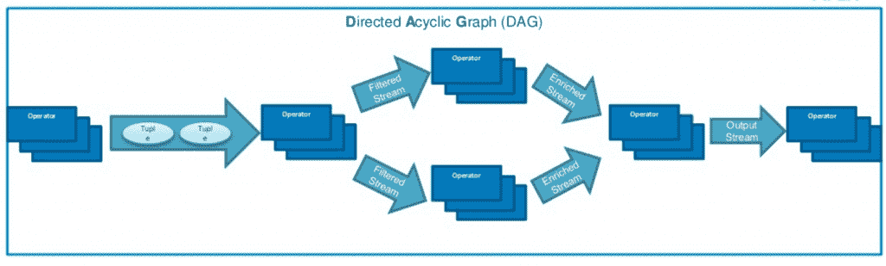

# Apache 通过 Apex 获得了另一个流处理引擎

> 原文：<https://thenewstack.io/apache-gets-another-real-time-stream-processing-framework-apex/>

DataTorrent 的 [Apex 最近被提升为 Apache Software Foundation 的顶级项目](https://blogs.apache.org/foundation/entry/the_apache_software_foundation_announces90)，这为该基金会提供了另一个用于实时数据流处理的开源引擎，与 [Storm](http://storm.apache.org/) 、 [Spark](https://thenewstack.io/spark-2-0-will-offer-interactive-querying-live-data/) 、 [Samza](https://thenewstack.io/apache-samza-linkedins-framework-for-stream-processing/) 和 [Flink](https://thenewstack.io/apache-flink-addresses-continuous-stream-processing/) 等类似引擎一起。

这些项目源于 Twitter 和 LinkedIn 等公司繁重的实时数据分析需求。各有各的做法， [Apex](http://apex.apache.org/) 也不例外。该技术来自 DataTorrent 的需求——该公司由雅虎校友于 2012 年创立——利用当时最新发布的 Hadoop 资源管理平台 [YARN](http://searchdatamanagement.techtarget.com/definition/Apache-Hadoop-YARN-Yet-Another-Resource-Negotiator) 构建一个在 Hadoop 上本地运行的流处理引擎。

DataTorrent 的重点是构建一个易于部署的平台，除了日常的 IT 专业知识外，不需要任何东西，并且可以轻松地与现有的 IT 基础架构集成，并确保易于迁移。DataTorrent 于 2015 年 8 月将该技术捐赠给了 Apache 孵化器。

实时数据处理是一个热门的技术领域。 [IBM 去年夏天宣布的对 Spark 的大赌注无疑增加了它的势头，Storm 也仍然更为人所知，但 Apex 以其速度和易用性而闻名。](https://www-03.ibm.com/press/us/en/pressrelease/47107.wss)

通用电气的 Predix 物联网云平台将 Apex 用于工业数据和分析，正如 [Capital One](http://www.slideshare.net/ApacheApex/capital-ones-next-generation-decision-in-less-than-2-ms) 用于实时决策和欺诈检测。

Apex 和 [Flink](https://thenewstack.io/apache-flink-addresses-continuous-stream-processing/) 在概念上是相似的，根据[的说法，DataTorrent 的 Apex 副总裁 Thomas Weise](https://twitter.com/thweise) (不要和同名的无服务器计算框架[混淆)。Apex 和 Flink 都可以做批处理，但是更侧重于流。虽然他承认合并这两个项目可能是有意义的，但他认为这不会发生，主要是因为它们的根源不同。](https://thenewstack.io/apex-makes-aws-lambda-easy-peasy-programmers/)

他说 Apex 比 Flink 更先进一点，因为它在生产中使用得更多。“它变得更加强硬了，”他说。

> “易用性是我们从一开始就关注的事情”——Thomas Weise 说。

虽然 Spark 和 Storm 更广为人知，但被认为难以实施和操作。

Storm 是一个流架构，但不是有状态的，并且缺乏处理语义和效率。Spark Streaming (Spark 更广泛)是建立在批处理架构上的，不能做低延迟用例。用户还必须为状态管理编写额外的代码。Apex 和 Flink 可以进行低延迟处理，并且不会因为必须重复调度批处理而遭受延迟开销。

Storm 的容错能力有限，Weise 充电，Spark 和 Storm 的可靠性和流媒体效率较低。同时，他吹嘘 Apex 的流功能、容错、处理语义、分区操作符等等。

“我们有其他项目没有的分区方案，比如构建可以进行冗余处理的并行管道。然后，如果你有一个故障，他们可以独立复位，而不需要复位类型。因此，您可以利用 SLA 进行低延迟处理，”他说。

Apex 的应用程序开发基于直接丙烯图模型，由流(数据元组)和运算符组成。

用户也可以在运行时改变事情，而不用关闭应用程序。“易用性是我们从一开始就关注的事情，”Weise 说。该公司“不仅在应用程序的构建上花了很多心思，而且在将应用程序投入生产时也花了很多心思。”

Apex 还简化了部署，使开发人员能够编写或重用通用 Java 代码来表达任何业务逻辑，从而最大限度地减少编写大数据应用程序所需的专业知识。

“我们觉得基于 Java 很好，因为那里有一个巨大的人才库，比 Scala 或其他语言要多得多。在 Java 领域，你也有一个庞大的图书馆生态系统，”他说。

Apex 的 Malhar 库包括可重复使用的操作符(功能构建模块),可用于流行的文件传输协议、数据库和消息队列，包括 FTP、NFS、JMS、Kafka、RabbitMQ 和 NoSQL 数据库，如 Cassandra、HBase 和 MongoDB。

在生产中，Apex 可以快速重新分配故障节点的工作，同时自动识别新节点。

“当它运行时，它只是在处理数据；没有调度，没有中断，只是执行计算，”Weise 说。“只有在发生变化时，如果出现故障，才会有恢复，我们可以获得替代资源并恢复状态。用户还可以编写代码，在运行时使用指标来更改分区，比如当延迟变得过高或者当您想要增加或减少资源时。”

[展望未来](http://apex.incubator.apache.org/roadmap.html)，社区计划增加对(反)亲和功能的支持。“你可以说，‘这些东西不能在同一台机器上运行，或者它们绝对必须在同一台机器上运行，’”Weise 解释道。

它还计划添加迭代处理，您可以稍后将计算结果作为输入返回，并在您的处理图中进行循环。与分布式机器学习库 [Apache Samoa](https://samoa.incubator.apache.org/) 的集成正在进行中，为用户提供的简化配置也在进行中，比如本地支持加密。

“我们也将考虑支持 [Mesos](https://thenewstack.io/mesos-simplifies-support-container-formats-unified-containerizer/) ，”Weise 说。“由于需求不足，我们还没有这么做，但人们已经开始要求这么做了。”

<svg xmlns:xlink="http://www.w3.org/1999/xlink" viewBox="0 0 68 31" version="1.1"><title>Group</title> <desc>Created with Sketch.</desc></svg>