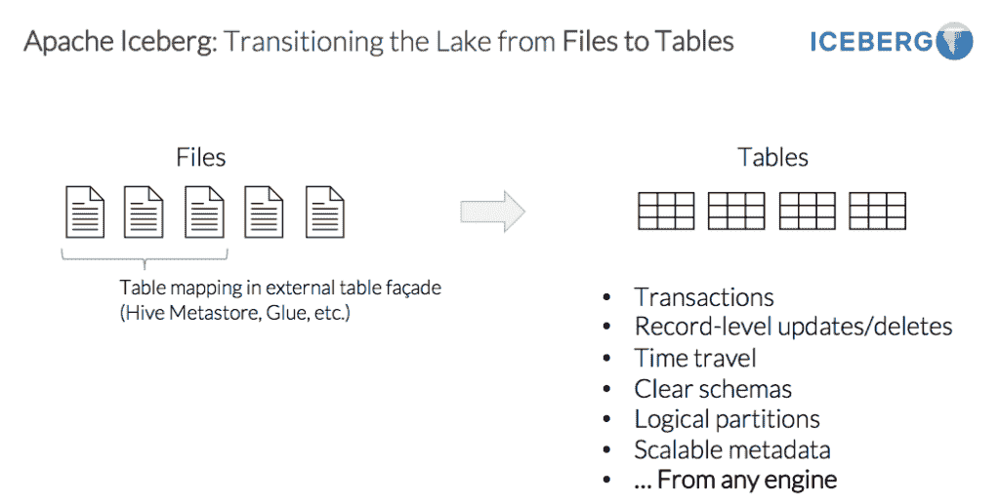

# Apache Iceberg:大数据的不同表设计

> 原文：<https://thenewstack.io/apache-iceberg-a-different-table-design-for-big-data/>

像许多科技项目一样，[阿帕奇冰山](https://iceberg.apache.org/)是在挫折中成长起来的。

[Ryan Blue](https://github.com/rdblue) 在 Cloudera 处理数据格式时体验过。

他说:“我们不断看到问题并不在文件层面，人们试图在文件层面解决问题，或者，你知道，基本上是试图绕过限制。”。

这些问题包括无法可靠地写入配置单元表、正确性问题以及无法信任来自其大规模并行处理数据库的结果。

他说，当他搬到网飞时，“问题依然存在，只是比以前糟糕了 10 倍”。

“在网飞，我花了几年时间解决这些问题，试图从根本上修补它们或处理底层格式。…我把它描述为在这些问题上贴上创可贴，这里那里都是非常不同的问题。我们有很多不同的。我们最后只是说，‘你知道，我们知道这里的问题是什么。那就是我们用错误的方式跟踪表中的数据。我们需要解决这个问题，回到一个绝对可行的设计。"

这种挫败感的产物是[冰山](https://github.com/apache/iceberg)，一种用于大型分析数据集的开放表格格式。

它基于一种全有或全无的方法:一个操作应该在某个时间点完全完成并提交，或者应该失败并且不对表进行任何更改。介于两者之间的任何东西都会留下大量的清理工作。

他解释说，Hive 的想法是将数据保存在目录中，并能够删除不需要的目录。这使得 Hive 表可以对大量数据进行快速查询。

然而，问题是他们所做的是试图跟踪这些目录。但最终并没有扩大规模。所以他们最终添加了这些目录的数据库。然后，当您需要查询数据时，您可以找到这些目录中的文件。这就产生了一个问题，即表的状态存储在保存目录的数据库和文件系统本身的两个地方。

“在文件系统中保持这种状态的问题是，您不能对它进行细粒度的更改。您可以对目录集进行细粒度的更改。但是您不能对文件集进行细粒度的更改，这意味着如果您想同时向两个目录提交新数据，您不能在一次成功或失败的操作中完成。因此，这就是我们希望从我们的表格中得到的原子性，”项目管理主席 Blue 说。

网飞在 2018 年开源了该项目，并将其捐赠给了阿帕奇软件基金会。去年 5 月，它从孵化器中脱颖而出，成为一个顶级项目。它的贡献者包括 AirBnB、[亚马逊网络服务](https://aws.amazon.com/?utm_content=inline-mention)、阿里巴巴、Expedia、Dremio 等。

[https://www.youtube.com/embed/IzkSGKoUxcQ?feature=oembed](https://www.youtube.com/embed/IzkSGKoUxcQ?feature=oembed)

视频

该项目由一个跟踪表快照和元数据的核心 Java 库组成。它旨在改进[蜂巢](https://hive.com/)、 [Trino](https://trino.io/) 和 [Spark](https://spark.apache.org/) 的桌面布局，并集成了 [Flink](https://flink.apache.org/) 等新引擎。

## 处理分区

它的一个卖点是用户不需要知道太多关于分区的知识。

“在旧模型中，用于生成这些目录的列只是普通的列，它们与其他列没有关联，”Blue 说因此，如果您想按天存储数据，您可能会从时间戳中获得该日期。但是系统没有办法说，‘哦，我知道你在寻找这个时间戳范围。’你必须添加你要找的时间戳和你要找的日子，这非常非常容易出错。因此，我们开始跟踪这些关系，这样我们就可以根据时间戳进行查询，然后根据日期范围进行查询，并自动找出您需要的文件。"

一篇 IBM [博客文章](https://developer.ibm.com/technologies/artificial-intelligence/articles/the-why-and-how-of-partitioning-in-apache-iceberg/)解释道，Iceberg 用户不必维护分区列，甚至不必理解物理表布局就能获得准确的查询结果。Iceberg 处理分区和查询的所有细节，并跟踪列值及其分区之间的关系，而不需要额外的列。

除了解决可靠性和正确性问题之外，该项目还致力于通过使用文件元数据来提高性能，以便可以跳过更多文件来更快地满足查询，并就地进行表演变，以便它可以随着业务需求的变化而变化。

“现在我们正在研究所有我们能做的新东西，给桌子一个更好的设计，”Blue 说。它们包括添加行级删除和向上插入。它只是将“merge into”作为高级 SQL 操作和“delete from”提交，并将添加“update”

“所以这些操作的目标不是了解表是如何存储和布局的，而是更关注你想对表中的每一行做什么？这就是我们希望数据工程师关注的地方，”他说。该系统可以使事情变得快速有效，因为它可以准确地找出哪些数据文件需要更新，然后去重写那些数据文件。

Blue 说，他对行级删除功能和构建数据服务的能力感到兴奋，这些数据服务可以在不需要用户过多考虑细节或物理布局的表上操作。

## 分离计算和数据

据 [Dremio](https://thenewstack.io/dremio-wants-put-data-scientists-drivers-seat/) 的联合创始人[托默·施兰](https://twitter.com/tshiran?lang=en)称，这是[将计算和数据](https://tdwi.org/articles/2021/01/13/ta-all-whats-ahead-for-data-teams-in-2021.aspx)分离的趋势的一部分，也是数据湖和数据仓库之间权衡的替代方案。

“我们希望数据层支持事务、数据突变和时间旅行等。它必须是开源的，所有这些不同的引擎都可以访问，这就是现代松散耦合架构的全部价值。所以冰山是一个完美的选择，”他说。

Dremio 的目标是消除中间层以及用户和数据存储之间的工作，该公司今年宣布了将其平台与 Iceberg 集成的计划。它有两个与冰山有关的项目:

*   Nessie 项目为数据湖提供了类似 git 的语义。它使用户能够试验数据分支或准备数据，而不影响数据的实时视图。
*   Arrow Flight 3.0 为支持 Apache Arrow 的系统提供了同时交换数据的能力，其速度比以前快了几个数量级。

他看到了这个领域中两个相互竞争的标准，由 Databricks 创造的三角洲湖和冰山。

他说，Delta Lake 的一个问题是，你只能从 Spark 进行插入和事务，而 Iceberg 允许从任何系统进行时间旅行中的事务和更新——从 Dremio、Spark、Presto 等。

“这涉及到数据是如何存储的，”Shiran 说。“人们总是会选择更开放的方法。当谈到文件格式时，我们已经看到了, [Parquet](https://parquet.apache.org/documentation/latest/) ,对吗？当时有一些相互竞争的标准，有些只适用于 Hive 这样的引擎，有些则适用于所有领域。拼花显然赢了，我认为这是一种非常相似的情况。”

<svg xmlns:xlink="http://www.w3.org/1999/xlink" viewBox="0 0 68 31" version="1.1"><title>Group</title> <desc>Created with Sketch.</desc></svg>