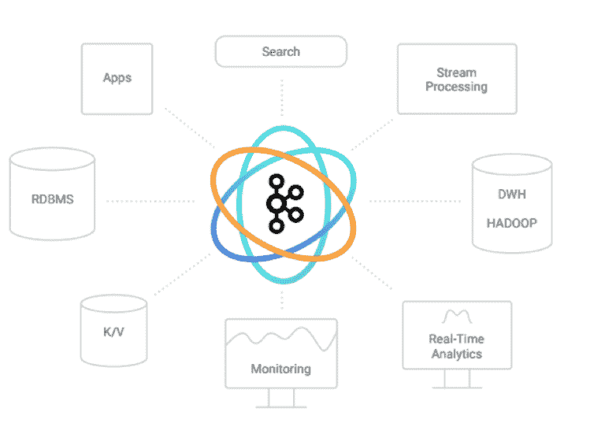

# 阿帕奇卡夫卡 1.0 正好发布了一次

> 原文：<https://thenewstack.io/apache-kafka-1-0-released-exactly/>

随着本周[阿帕奇卡夫卡 1.0](https://www.confluent.io/blog/apache-kafka-goes-1-0/) 的发布，八年的旅程终于要暂时结束了。暂时的，因为项目将继续发展，看到近期的大修复，和长期的功能更新。但是对于 [Confluent](https://www.confluent.io/) 的首席技术官 [Neha Narkhede](https://www.linkedin.com/in/nehanarkhede/) 来说，这个版本是她和一个工程师团队在 2009 年首次提出的愿景的高潮。

当时，LinkedIn 的一个团队认为他们找到了解决一个主要数据流处理问题的方法。Narkhede 说，Kafka 的创始人最初是通过坐下来试图理解为什么 20 世纪 90 年代和 21 世纪初成立的流处理公司会失败，从而开始了他们的项目建设之旅。

“我们之所以这样做，是因为我们确实需要在真实的公司中构建这样的应用程序。这塑造了整个系统和 Apache Kafka 项目的愿景。我们没有想象一些假设的需求，而是真实的业务需求。我们不是从构建 Kafka 开始的，而是从思考‘为什么流处理初创公司在 2000 年和 20 世纪 90 年代失败了？’他们失败了，因为公司没有能力收集这些流，并把它们放在周围处理。你需要有这种记忆力。"

这一概念是当时大多数现有流媒体解决方案的禁忌。例如，传统的消息队列不是为了长期保存数据而准备的，而是为了将数据向下移动，并确保它在一个紧张的时间窗口内得到处理。Narkhede 说，对于以批处理方式运行的应用程序来说，这不是处理数据的正确方法。

此外，现代[微服务](/category/microservices/)和基于容器的应用程序在设计上很大程度上是无状态的。因此，让一个应用程序的新实例上线会使它缺少数据，就像一个等待命令的僵尸。凭借 Kafka 长期存储数据的能力，这意味着新上线的服务器可以跟上，按照数据到达的确切顺序处理现有数据，使其能够达到与集群其余部分相同的速度，并位于同一数据线上。

在一个像 ZeroMQ 这样的东西正在推动高度完善的消息传递服务的世界里，Narkhede 说，Kafka 在传统的批处理类型的作业和必须在毫秒内执行的现代流压制作业之间提供了一座桥梁。因此，Confluent 一直在大力开发 [KSQL](https://www.confluent.io/blog/ksql-open-source-streaming-sql-for-apache-kafka/) ，它能够对 Kafka 存储的数据和流运行 SQL 查询。

Narkhede 说，业界花了一段时间才意识到这是解决流处理问题的正确方法。“我认为整个行业花了大约五年时间才意识到我们在做什么。有相当多的剥离系统，如 ZeroMQ，是卡夫卡试图实现的超级准系统版本。ZeroMQ 更像是用于消息传递的内存网络层。卡夫卡试图解决的一个大问题是，它是批处理世界和在线数据库世界之间的桥梁。这样做的系统的本质是你需要存储数据。Narkhede 说:“ZeroMQ 旨在快速处理一次性消息，不需要处理超过一次。

## 终于可以生产了

对于这个 1.0 版本，许多特性已经接受了最后的检查。这包括对简单身份验证和安全层(SASL)身份验证故障的更好的诊断、对磁盘故障的更好的处理，并且 Streams builder API 已经过清理，更易于使用。

对于未来，Narkhede 说，Confluent 希望建立一个连接器市场，客户将能够浏览和选择现有数据系统的各种企业级连接器。她说 Apache Kafka 的精确一次功能将有助于以可控的方式实现企业流处理。

在[发布博客](https://www.confluent.io/blog/apache-kafka-goes-1-0/)中，Narkhede 详细介绍了她写的“恰好一次”功能的好处，它支持流处理的类似闭包的函数。在分布式无状态系统中，向某个端点传递消息一次，且不超过一次，[一直是一个挑战](http://bravenewgeek.com/you-cannot-have-exactly-once-delivery/)，因为这些系统在设计上不保留状态。然而，Kafka 和其他分布式流处理系统的可能用途将会大大扩展，如果它们能够保证恰好一次交付，对于那些处理事件只能以特定顺序发生的作业，尽管不一定由单个处理器以线性方式执行。

“所有这一切的好处是，虽然 Kafka 的 Streams APIs 的当前实例化是以 Java 库的形式，但它并不局限于 Java 本身。Kafka 对流处理的支持主要是一种协议级的能力，可以用任何语言来表示。这是一个重要的区别。流处理不是一个接口，所以它作为一个单独的 Java 库是没有限制的。有许多方式来表达连续的程序:SQL、功能即服务或许多编程语言中类似集合的 DSL。基础协议是解决基础设施平台应用多样性的正确方法。”

当这些功能首次发布时，她在 8 月对此做了更详细的描述。“我们用更智能的服务器端过滤取代了消费者端的事务性读取缓冲，从而避免了潜在的巨大性能开销。同样，我们还通过压缩主题和添加安全功能来完善交易的相互作用，”Narkhede 写道。

她还说，汇合将侧重于“分区滑动和弹性领域”。你能把数据扔给 Kafka，让它扩展、收缩和改变，以匹配你的流量和数据流的性质吗？Kafka 今天就是这么做的，但这允许你以一种可操作的成本有效的方式这么做。我认为这是一个真正的大问题。这是我们将在未来几年与整个社区一起大规模开展的事情，”Narkhede 说。

Uroš Jovič通过 Unsplash 提供的特写图像。

<svg xmlns:xlink="http://www.w3.org/1999/xlink" viewBox="0 0 68 31" version="1.1"><title>Group</title> <desc>Created with Sketch.</desc></svg>