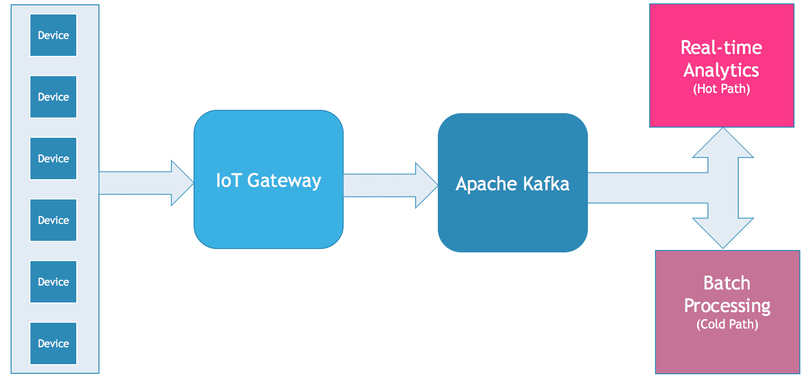

# Apache Kafka:物联网数据平台的基石

> 原文：<https://thenewstack.io/apache-kafka-cornerstone-iot-data-platform/>

当提到[物联网(IoT)](https://thenewstack.io/azure-iot-edge-a-technology-primer/) 时，许多开发人员会想到微控制器、片上系统板、单板计算机、传感器和各种其他电子组件。虽然设备无疑是物联网的基础，但互联解决方案的核心价值在于这些设备产生的数据。

设备层只是冰山一角，水印之下的底层数据平台正在处理繁重的工作。一个强大的[物联网(IoT)](https://thenewstack.io/category/edge-iot/) 数据平台的关键支柱之一是 [Apache Kafka](https://kafka.apache.org/) ，这是一个开源软件，旨在处理大量的数据摄取。它充当数据中心中由 [Apache Storm](http://storm.apache.org/) 、 [Apache Spark](http://spark.apache.org/) 和 [Apache Hadoop](http://hadoop.apache.org/) 集群驱动的数据处理管道的网关。

如果你是一名考虑将物联网作为职业选择的开发人员，现在是你开始投资 Apache Kafka 的时候了。本文探讨了 Apache Kafka 在部署可扩展物联网解决方案中扮演的角色。

## Kafka:传感器数据的高性能摄取层

物联网设备由各种能够生成多个数据点的传感器组成，这些数据点以高频率收集。一个简单的恒温器可能每分钟产生几个字节的数据，而联网的汽车或风力涡轮机在几秒钟内产生几十亿字节的数据。这些海量数据集被接收到数据处理管道中进行存储、转换、处理、查询和分析。

每个数据集由代表特定指标的多个数据点组成。例如，连接的供暖、通风和空调(HVAC)系统将报告环境温度、所需温度、湿度、空气质量、鼓风机速度、负载和能耗指标。

在大型购物中心，这些数据点通常是从数百个 HVACs 中收集的。由于这些设备可能不够强大，无法运行完整的 TCP 网络堆栈，因此它们使用 [Z-Wave](http://www.z-wave.com/) 和 [ZigBee](http://www.zigbee.org/) 等协议将数据发送到中央网关，该网关能够聚合数据点并将其接收到系统中。

网关将数据集推送到 Apache Kafka 集群，在那里数据采用多条路径。需要实时监控的数据点通过热路径。在我们的 HVAC 场景中，实时跟踪温度、湿度和空气质量等指标以采取纠正措施非常重要。这些数据点可以通过 Apache Storm 和 Apache Spark 集群进行近乎实时的处理。

负载和功耗等指标在收集一段时间后进行分析。通过批处理收集和分析的这些数据点通常采用数据处理管道的冷路径。一个 [MapReduce](https://www-01.ibm.com/software/data/infosphere/hadoop/mapreduce/) 作业可以在 Hadoop 集群中运行，用于分析 HVACs 的能效。

不管数据点采用什么路径，它们都需要被接收到系统中。Apache Kafka 充当处理海量数据集的高性能数据摄取层。负责热路径和冷路径分析的数据处理管道组件成为 Apache Kafka 的订户。

## 卡夫卡 vs. MQTT

Apache Kafka 不是 MQTT 的替代品，MQTT 是一个消息代理，通常用于机器对机器(M2M)通信。卡夫卡的设计目标和 MQTT 大相径庭。

在物联网解决方案中，设备可以分为传感器和执行器。传感器生成数据点，而致动器是可以通过命令控制的机械组件。例如，房间中的环境照明可以用于调节 LED 灯泡的亮度。在这种情况下，光传感器需要与 LED 通信，这是 M2M 通信的一个例子。MQTT 是针对传感器网络和 M2M 优化的协议。

> 因为 Kafka 不使用 HTTP 进行摄取，所以它提供了更好的性能和规模。

由于 MQTT [是为低功耗设备](https://thenewstack.io/off-shelf-hacker-lightweight-inter-device-messaging-mqtt/)设计的，它不能处理大量数据集的摄取。另一方面，Apache Kafka 可以处理高速数据摄取，但不能处理 M2M。

可扩展的物联网解决方案使用 MQTT 作为显式设备通信，同时依赖 Apache Kafka 来获取传感器数据。也可以[桥接](https://github.com/evokly/kafka-connect-mqtt)卡夫卡和 MQTT 的摄取和 M2M。但是建议通过将设备或网关配置为 Kafka 生产者，同时仍然参与由 MQTT 代理管理的 M2M 网络来保持它们的分离。

## 卡夫卡 vs. HTTP/REST

Apache Kafka 公开了一个基于二进制协议的 TCP 端口。推送数据的客户端启动一个套接字连接，然后写入一系列请求消息并读回相应的响应消息。该协议不要求每次连接或断开都要握手。

因为 Kafka 不使用 HTTP 进行摄取，所以它提供了更好的性能和规模。客户端可以连接到集群的一个实例来接收数据。这种架构与原始 TCP 套接字相结合，提供了最大的可伸缩性和吞吐量。

虽然使用 HTTP 代理与 Kafka 集群通信可能很有吸引力，但是建议解决方案使用 native client。由于 Kafka 是用 Java 编写的，[本地 Java 客户端库](http://docs.confluent.io/3.0.0/clients/consumer.html#basic-usage)提供了最佳的性能。社区[已经为 Go、](https://cwiki.apache.org/confluence/display/KAFKA/Clients) [Python](https://github.com/confluentinc/confluent-kafka-python) ，甚至 [Node.js](https://github.com/SOHU-Co/kafka-node/) 构建了优化的客户端库。Shopify 还为 Kafka 提供了一个名为 Sarama 的开源 Go 库。Rackspace 的 Mailgun 团队已经构建了 Kafka-Pixy，这是 Kafka 的一个开源 HTTP 代理。Python、C#、Ruby 和其他语言都有多个库。

大多数物联网网关都足够强大，可以运行 Java、Go 或 Python。为了获得最佳性能和吞吐量，建议使用为 Kafka 本地设计的客户端库。

## 卡夫卡入门

Apache Kafka 用 Java 开发，其部署由 [Apache ZooKeeper](https://zookeeper.apache.org) 管理。任何能够运行 JVM 的操作系统都可以用来部署 Kafka 集群。为了试水，你可能想在 Docker 中运行 [Kafka。](https://github.com/spotify/docker-kafka)

如果不想处理基础设施，可以从云中的托管 Kafka 服务开始。IBM Bluemix 有 [Message Hub](http://www-03.ibm.com/software/products/en/ibm-message-hub) ，这是一个基于 Kafka 的完全托管的基于云的消息服务。 [Cloud Karafka](https://www.cloudkarafka.com) 是公共云中的另一个流平台，专为 Apache Kafka 工作负载而设计。 [Aiven.io](https://aiven.io/) 提供托管的 Kafka 以及 InfluxDB、Grafana 和 Elasticsearch。如果你是现有的 Salesforce.com 或 Heroku 开发者，你可以在 Heroku 上利用 [Kafka。](https://www.heroku.com/kafka)

Apache Kafka 是许多大数据部署的基础。在本系列接下来的文章中，我将介绍 Kafka 的关键概念、架构和术语。敬请关注。

<svg xmlns:xlink="http://www.w3.org/1999/xlink" viewBox="0 0 68 31" version="1.1"><title>Group</title> <desc>Created with Sketch.</desc></svg>