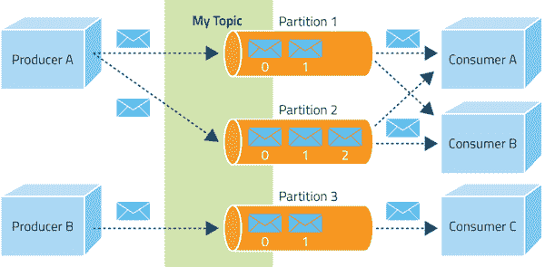
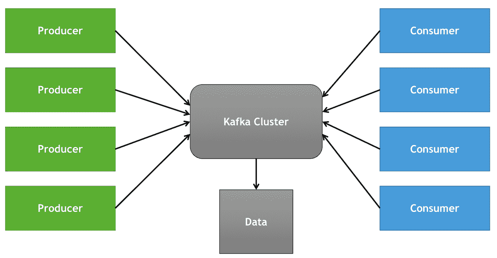
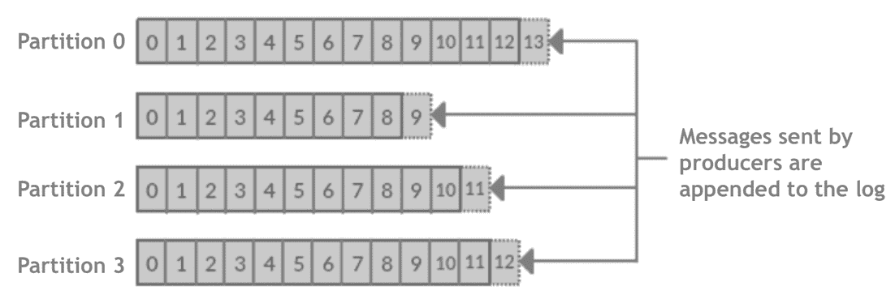

# 阿帕奇卡夫卡:初级读本

> 原文：<https://thenewstack.io/apache-kafka-primer/>

Apache Kafka 正迅速成为处理当代以数据为中心的工作负载(如物联网、游戏和在线广告)的首选消息传递基础设施。以闪电般的速度接收数据的能力使其成为构建复杂数据处理管道的理想选择。在[之前的文章](https://thenewstack.io/apache-kafka-cornerstone-iot-data-platform/)中，我们讨论了 Kafka 如何充当物联网传感器数据的网关，以处理热路径和冷路径分析。

在本文中，我们将介绍 [Apache Kafka](https://kafka.apache.org/) 的核心概念和术语以及高层架构。

## 为什么是卡夫卡？

在引入 Apache Kafka 之前，面向消息的中间件(MOM)如 [Apache Qpid](https://qpid.apache.org/) 、 [RabbitMQ](https://www.rabbitmq.com/) 、[微软消息队列](https://msdn.microsoft.com/en-us/library/ms711472(v=vs.85).aspx)和 [IBM MQ 系列](http://www.ibm.com/software/products/en/ibm-mq)被用于跨各种组件交换消息。虽然这些产品擅长实现发布者/订阅者模式(Pub/Sub ),但它们并不是专门为处理来自数千个发布者的大量数据流而设计的。大多数 MOM 软件都有一个代理，它公开了用于异步通信的高级消息队列协议(AMQP)。

卡夫卡的设计是从头开始的，以应对数百万个快速连续产生的消防水管式事件。它保证低延迟，“至少一次”，向消费者传递消息。Kafka 还支持为离线消费者保留数据，这意味着数据可以实时或离线处理。

> 面向消息的中间件和 Kafka 之间的根本区别在于，客户端永远不会自动接收消息。当他们准备好处理时，他们必须明确地请求一个消息。

进一步扩展持久性和保留性，Kafka 被设计成一个分布式提交日志。与关系数据库非常相似，它可以提供所有事务的持久记录，可以回放这些记录来恢复系统的状态。要理解的关键是，数据是按照可以确定读取的顺序持久存储的。由于分布式设计，Kafka 提供了冗余，即使其中一台服务器面临中断，也能确保数据的高可用性。

这种架构使得 Kafka 成为所有数据的门户。多个事件源可以同时向 Kafka 集群发送数据，该集群将可靠地向多个目的地发送数据。

## 关键概念和术语

Apache Kafka 使用的命名法与传统的发布/订阅系统略有不同。让我们探讨一下术语，以便更好地理解它。

**消息**——在卡夫卡那里，消息代表了数据的基本单位。每条消息都是一个键/值对。不管数据类型如何，Kafka 总是将消息转换成字节数组。

**生产者** —生产者映射到发布者或发布/订阅架构的作者。它们是生成消息的来源，这些消息被接收到系统中。在卡夫卡的语境中，生产者通常被称为客户。需要注意的是，客户端是数据的来源，不要与消费者混淆。

**消费者** —消费者是接收数据的订户或读者。他们在卡夫卡基础设施的另一边。与 MOM 中的订阅者不同，Kafka 消费者是有状态的，这意味着他们负责记住光标位置，这被称为**偏移**。消费者也是 Kafka cluster 的客户。每个消费者可能属于一个消费者组，这将在后面的章节中介绍。

MOM 和 Kafka 的根本区别在于客户端永远不会自动接收消息。当他们准备好处理时，他们必须明确地请求一个消息。

**主题** —主题表示属于一个组的消息的逻辑集合。它们类似于《妈妈》中的主题。生产者发送的数据存储在主题中。消费者订阅他们感兴趣的特定主题。

**分区** —分区是 Apache Kafka 所独有的，在传统的消息队列系统中看不到。每个主题被分成一个或多个分区。在发送数据时，生产者不提及分区，但消费者知道可用的分区。Kafka 可以使用消息密钥将相似的消息自动分组到一个分区中。这个方案使 Kafka 能够动态扩展消息传递基础设施。

分区冗余地分布在 Kafka 集群中。消息被写入一个分区，但是被复制到至少另外两个分区，这两个分区在集群的不同代理上维护。

分区和消费者组的概念允许系统的水平可伸缩性。

**消费者群体** —如前所述，消费者属于至少一个消费者群体，该群体通常与一个主题相关联。组中的每个消费者被映射到主题的一个或多个分区。Kafka 将保证一条消息只被群体中的一个消费者阅读。Kafka 还将确保属于同一主题的所有消息都被发送给一个组的所有注册消费者。

每个消费者将在跟踪偏移量的同时从一个分区中读取数据。如果属于特定消费者组的消费者离线，Kafka 可以将分区分配给现有消费者。类似地，当一个新的消费者加入组时，它平衡分区与可用消费者的关联。

多个消费者群体订阅同一主题是可能的。例如，在物联网用例中，消费者群体可能通过 Apache Storm 集群接收消息进行实时处理。不同的使用者组也可以接收来自相同主题的消息，以便将它们存储在 HBase 中进行批处理。

分区和消费者组的概念允许系统的水平可伸缩性。

**代理** —属于一个集群的每个 Kafka 实例被称为一个代理。它的主要职责是接收来自生产者的消息，分配偏移量，最后将消息提交给磁盘。基于底层硬件，每个代理每秒可以轻松处理数千个分区和数百万条消息。

一个主题中的分区可以分布在多个代理中。这种冗余确保了消息的高可用性。

**集群**——一群卡夫卡式的经纪人组成了集群。集群中的一个代理被指定为控制器，负责处理管理操作以及将分区分配给其他代理。控制器还跟踪代理故障。

## 动物园管理员的角色

大多数当代的分布式编排系统，比如 Kubernetes 和 Swarm，都依赖于一个分布式的键/值对来维护集群的全局状态。 [Consul](https://www.consul.io/) ， [etcd](https://github.com/coreos/etcd) ，甚至 [Redis](https://redis.io/) 都是用于服务发现和集群状态管理。Apache Kafka 的设计远远早于这些轻量级服务的构建。

像大多数其他基于 Java 的分布式系统一样，如 [Apache Hadoop](http://hadoop.apache.org/) ，Kafka 使用 [Apache ZooKeeper](https://zookeeper.apache.org/) 作为分布式配置存储。它构成了 Kafka 集群的主干，持续监控经纪人的健康状况。当新的代理被添加到集群中时，ZooKeeper 将通过在集群上创建主题和分区来开始利用集群。

除了集群管理，Kafka 的初始版本使用 ZooKeeper 来存储每个消费者的分区和偏移信息。从 0.10 开始，这些信息已经转移到一个内部的 Kafka 主题。

在本系列的下一篇文章中，我们将构建一个利用 Apache Kafka 进行实时数据处理的端到端物联网应用程序。敬请关注。

<svg xmlns:xlink="http://www.w3.org/1999/xlink" viewBox="0 0 68 31" version="1.1"><title>Group</title> <desc>Created with Sketch.</desc></svg>