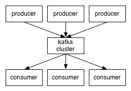
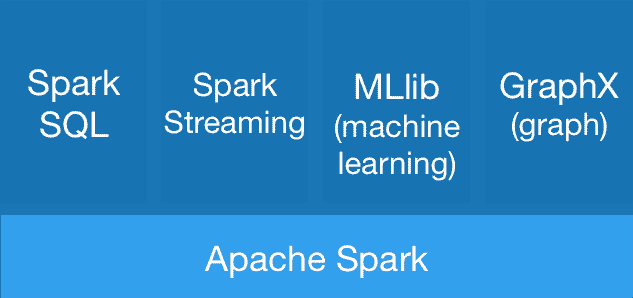

# 阿帕奇卡夫卡+火花+数据库=实时三位一体

> 原文：<https://thenewstack.io/apache-kafka-spark-database-real-time-trinity/>

MemSQL 是我们一直想写的一家公司。首席执行官 Eric Frenkiel 和他的团队与我们取得了联系，因此我们认为这是一个获得他对市场、开源分析项目的作用及其与数据库技术的契合度的看法的机会。

随着技术融入我们的生活并融入我们的手腕，对智能和实时移动应用的需求也在增加。这些应用程序需要提供相关和即时的信息和服务。为了跟上不断涌入的信息流，应用程序必须通过实时基础设施传输数据流，以捕获、处理、分析海量数据，并将其提供给数百万甚至数十亿用户。


当今领先的部署将三个分布式系统结合在一起，创建了实时三位一体:

*   捕获和发布提要的消息传递系统。
*   提取信息、丰富数据并提供正确格式的转换层。
*   一个可持续运行的数据库，便于应用程序开发和分析。

这些系统共同创建了一个全面的实时数据管道和运营分析环路。让我们更详细地探讨一下。

## 信息系统

实时管道通常从数据捕获开始，并使用消息系统来确保每条记录都到达正确的位置。数据可能来自日志信息、传感器数据、金融市场流、移动应用程序或其他来源。它将被写入文件系统、对象存储和数据库。

阿帕奇卡夫卡就是这样一个信息系统的例子。根据 Apache Kafka 的网站:“Apache Kafka 是发布-订阅消息，被认为是分布式提交日志。”它充当消息流的生产者和消费者之间的代理，如下图所示:

[](https://thenewstack.io/wp-content/uploads/2015/05/image01.png)

由于是分布式系统，Kafka 可以通过向集群添加服务器或实例来扩展生产者和消费者的数量。Kafka 对内存的有效使用，结合提交日志到磁盘，为实时管道提供了出色的性能，并在服务器出现故障时提供了耐用性。

消息接收和传播就绪后，是时候进入下一个转换层了。

## 变形层

在应用程序使用数据之前，转换层允许对数据进行操作、丰富和分析。今天， [Apache Spark](https://spark.apache.org/) 是最流行的转换层之一。

Spark 也是一个分布式、内存优化的系统，因此是 Kafka 的完美补充。Spark 包括一个流库和一组丰富的编程接口，使数据处理和转换更容易。

[](https://thenewstack.io/wp-content/uploads/2015/05/image02.png)

借助 Spark，您可以从 Kafka 获取数据，将数据流过滤成更小的数据集，运行浓缩操作来扩充数据，然后将经过提炼的数据集推送到持久数据存储中。

Spark 支持多种运算符以促进数据转换，允许在单个系统中实现广泛的功能，并使其成为实时管道的理想组成部分。但是，Spark 不包含存储引擎，因此在与持久性数据存储(如操作数据库)配合使用时可以很好地工作。

## 运行数据库

当分析跨越实时和历史数据时，实时数据流提供最大的价值。为了做到这一点，数据必须在流方面(如消息传递和转换为永久数据存储)之外持久化。虽然这可能是像 Hadoop 分布式文件系统或亚马逊 S3 这样的非结构化系统，但这些解决方案都不提供即时分析。

然而，内存操作数据库提供了实时和历史数据的持久性以及同时查询这两种数据的能力。

举个例子， [MemSQL](http://www.memsql.com/) ，一个我们公司开发的用于交易和分析的内存数据库，可以从 Spark 获取并持久存储数据。这使得应用程序可以使用最新的数据构建在可运行的数据库上。现在，借助熟悉的 SQL，即用于数据编程的通用语言 ，企业可以快速轻松地构建实时应用并运行分析。

## 使用操作数据库轻松删除重复项

流式管道的挑战之一是重复的出现。为了保证不丢失数据，消息和数据点有时会传播多次。这可能会对容量产生负面影响，并使分析变得复杂。

对于一个可操作的数据库和一个可变的数据集，可以包含如下操作符:

```
INSERT  ...  ON DUPLICATE KEY UPDATE

```

这将添加新记录，或更新现有记录，避免重复挑战。

## 完成实时三位一体

Pinterest 等公司已经看到了这种软件基础设施组合的力量，在今年的 Strata + Hadoop World 上展示了成果。

实时数据管道还支持应用数据的高级分析。来自运营数据库的数据可以转到 Spark 进行高级分析，并保存回运营数据库供应用程序使用。

[](https://thenewstack.io/wp-content/uploads/2015/05/image00.png)

经济学使这一工作流程变得可行。由于每个部分都是一个分布式系统，用户可以使用最具成本效益的基础设施在商用硬件或云上进行部署。性能随着节点数量的增加而灵活扩展。全新的部署方法也正在出现，如 Mesosphere，以简化多个分布式系统的部署。

我们对即时信息的渴望很难减弱。幸运的是，像实时三位一体这样的高性价比架构支持当今的这种需求。

Eric Frenkiel 是分布式内存数据库 MemSQL 的创始人和首席执行官。

<svg xmlns:xlink="http://www.w3.org/1999/xlink" viewBox="0 0 68 31" version="1.1"><title>Group</title> <desc>Created with Sketch.</desc></svg>