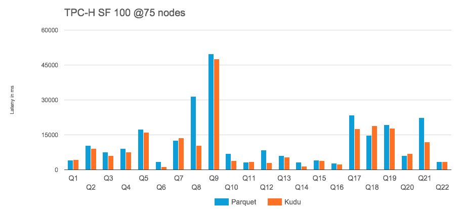

# Apache Kudu:用于 Hadoop 的快速柱状数据存储

> 原文：<https://thenewstack.io/apache-kudu-fast-columnar-data-store-hadoop/>

非洲羚羊 Kudu 有垂直条纹，这是 Apache Kudu 项目中柱状数据存储的象征。

Cloudera 于 2012 年底开始致力于 Kudu T1，以弥合 Hadoop 文件系统 [HDFS](http://hortonworks.com/apache/hdfs/) 和 [HBase](https://hbase.apache.org/) Hadoop 数据库之间的差距，并利用更新的硬件。去年年底，它将 Kudu 及其附带的查询引擎 Impala 捐赠给了 Apache 软件基金会；Kudu 最近被命名为顶级项目。

“我们的想法是为混合工作负载的 Hadoop 生态系统构建一个存储系统，”Apache Kudu 的副总裁兼 Cloudera 的软件工程师 Todd Lipcon 解释道。

HDFS 适用于批量加载大量数据的分析，但通常不会更新数据。他说，这只是昨天发生的一批交易或博客或类似的东西。

与此同时，HBase 基本上采取了这种权衡的另一面。实时性强多了。真的很适合流媒体。您可以低延迟地快速写入数据。你可以随机读取数据。你可以查找个人记录。你也有能力更新。

“当我们发现 HBase 变得非常受欢迎时，我们发现一些用户混合了这两者。他们不只是进行在线随机访问，他们还进行了一些分析。相反，其他客户从分析开始，然后说，‘嘿，等等。对于这种分析工作负载，开始以流的方式而不是批处理的方式接收它会非常好。“我偶尔会修改数据——更新或删除，”因此，我们在 Cloudera 的社区和客户中有很多人处于进退两难的境地，”他说。

他们需要 HBase 的功能，但也需要 HDFS 的分析性能，为此他们构建了非常复杂的系统。

“他们会在 HBase 中保留一些数据，例如最新的数据，然后通过这些后台进程将这些数据导出到 HDFS，然后必须同步两个系统，使它们与数据保持同步。所有这些复杂性阻碍了人们采用生态系统的能力，因为您不再拥有一个存储系统。你必须管理两个，你必须了解两个，它们有不同的 API，你需要构建许多额外的工具来保持两者之间的数据同步。

“我们决定尝试为这两个用例构建一个令人满意的媒介。即使这种折中的方法可能对这两种用例都不是最佳的，但至少它是一个可以很好地处理这两种用例的系统。当然，当你建立一个专门的系统时，它会比通用的要好。因此，在一些特定的使用案例中，HDFS 会更有意义，而在许多使用案例中，HBase 会更有意义。

“所以基本上，有些人愿意为了部署的简单性和应用程序开发的简单性而在性能上做出一些折衷，”他说。

## 有点熟悉

Cloudera 对 Kudu 最初的设计目标是:

*   强大的扫描和随机访问性能
*   高 CPU 效率和 IO 效率。
*   就地更新数据的能力。
*   支持主动-主动复制集群的能力，这些集群跨越世界不同地方的多个数据中心。

Kudu 是一个用于结构化数据表的存储系统。它的表看起来像 SQL 关系数据库中的表，每个表都有一个由一列或多列组成的主键，这些主键强制实现惟一性，并作为高效更新和删除的索引。

被称为平板的数据的逻辑子集构成了表，类似于关系数据库系统中的分区。它使用 [Raft](https://raft.github.io/) 共识算法将这些平板电脑复制到多个商用硬件节点，确保在响应客户端请求之前，每次写入都由至少两个节点保存，以防止因机器故障而丢失数据。

有 Java、C++或 Python APIs 可以对单个行进行“NoSQL”式的访问。这些 API 可以用于机器学习或分析的批量访问。

您可以使用 Java 客户端传输实时数据，然后使用 Spark、Impala 或 MapReduce 立即处理它，并透明地将 Kudu 表与存储在 HDFS 或 HBase 中的数据连接起来。

NYU 朗格内医疗中心的数据架构和战略主任拉詹·钱德拉**，**称 [Kudu/Impala 为 Hive/MapReduce/HDFS 堆栈的成熟替代品。](http://data-informed.com/kudu-and-the-ongoing-evolution-of-hadoop/)

## 1.0 即将推出

Lipcon 说，虽然 Kudu 与 Impala 有很好的集成，但不是紧密耦合。

“你可以选择使用 SQL 或 Impala，这是 Cloudera 一直专注的一个，但你也可以选择使用 SparkSQL。Kudu 项目有人在进行 Apache Drill。我们很乐意与任何 SQL 引擎集成，越多越好。为了取得成功，我们希望与尽可能多的 SQL 引擎和分析引擎合作。”

该软件仍处于 1.0 发布前的阶段，尽管许多组织已经在生产中使用 Kudu。但是，这些用户与开发社区紧密结合在一起。这些是尖端用户，他们从源代码编译自己的 Kudu 二进制文件。

“当然，我们的目标是让它成为任何企业都可以普遍使用的东西，”利普孔说。“这是我们正在迈向的 1.0 里程碑，我们希望这将在 9 月份的某个时候实现。它将包括更多的质量保证和一些对系统的稳定性和可靠性很重要的特性。修复一些错误，提高高可用性，知道:你真的可以 24/7 365 运行这个东西，并有真正的正常运行时间吗？”

<svg xmlns:xlink="http://www.w3.org/1999/xlink" viewBox="0 0 68 31" version="1.1"><title>Group</title> <desc>Created with Sketch.</desc></svg>