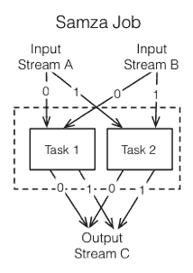
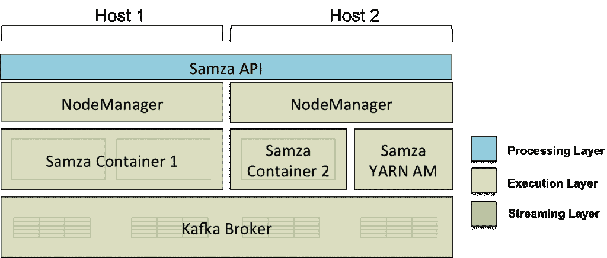
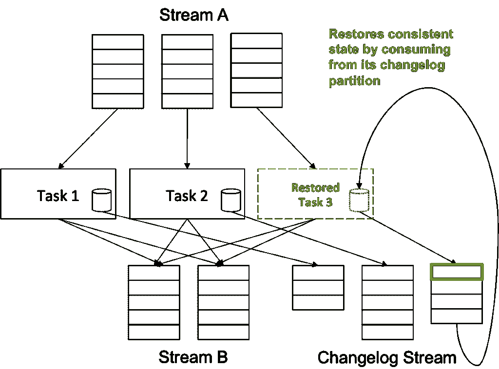
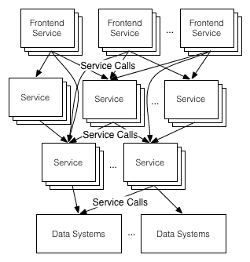
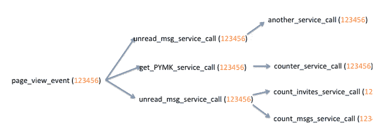
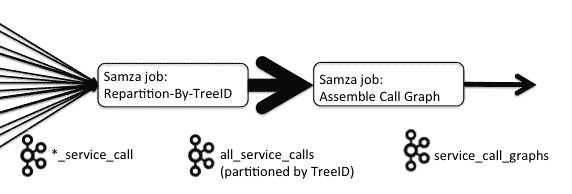

# Apache Samza，LinkedIn 的流处理框架

> 原文：<https://thenewstack.io/apache-samza-linkedins-framework-for-stream-processing/>

六年前，LinkedIn 开始在 Apache Hadoop 上处理“大数据”。随着时间的推移，我们认识到，由于批处理需要大量的周转时间，我们的一些用例无法在 Hadoop 中实现。我们希望我们的结果是增量计算的，并且可以随时获得。

大约在同一时间，LinkedIn 开发了 [Apache Kafka](http://kafka.apache.org) ，这是一个低延迟的分布式消息系统。与针对吞吐量进行优化的 Hadoop 不同，Kafka 针对低延迟消息传递进行了优化。我们在卡夫卡的基础上建立了一个处理系统，允许我们对信息做出反应——加入、过滤和统计信息。新的处理系统 [Apache Samza](http://samza.incubator.apache.org) 解决了我们的批处理延迟问题，使我们能够近乎实时地处理数据。

## 流处理的起源

几十年前，互联网规模的应用并不多。随着 Web 的出现，N 层体系结构成为增加规模的常见解决方案:“表示层”(网站、桌面应用程序)只处理强制请求，然后将其余请求传输到称为“中间层”的高吞吐量队列。然后，异步(通常是无状态的)后端流程将对这个“事件流”进行操作，并更新后端层中的关系数据库。

出现了许多应用服务器来托管中间层逻辑。这些早期解决方案的产量足以满足当时的需求。但是随着 web 应用程序的规模呈指数级增长，单一的关系数据库开始让位于可伸缩的、分区的、非 SQL 数据库和 HDFS。在 [Hadoop](http://hadoop.apache.org/) 中使用 [Hive](http://hive.apache.org/) / [Pig](http://pig.apache.org/) 对数 Pb 数据的查询取代了对关系数据库的单独查询。大数据时代已经到来。

毫不奇怪，中间层产品也在不断发展，以满足大数据接收的需求。 [Apache Kafka](http://kafka.apache.org) 和其他分布式消息传递产品通过将队列分区分布在机器集群上来线性扩展消息吞吐量，从而开始支持每秒数百万条消息。

所有这些系统都需要不断增长的规模和分区消费模式，这就需要一个框架来轻松处理大规模的“事件流”。

## 介绍 Apache Samza

在 LinkedIn，我们创建了 [Apache Samza](http://samza.incubator.apache.org/) 来解决公司中各种类型的流处理需求。这个框架，[最初由 LinkedIn](https://engineering.linkedin.com/data-streams/apache-samza-linkedins-real-time-stream-processing-framework) 开源，帮助你构建应用程序来处理消息的提要。自 2013 年 9 月以来，Samza 一直是 Apache 孵化器项目。

Samza 的目标是为连续数据处理提供一个轻量级框架。

> 随着数据的到达，Samza 不断计算结果，这使得亚秒级响应时间成为可能。

它不像 [Hadoop](http://hadoop.apache.org/) 等批处理系统，通常具有高延迟响应，有时可能需要几个小时。

Samza 可能会帮助您更新数据库、计算计数或其他聚合、转换消息或任何数量的其他操作。它已经在 LinkedIn 生产了几年，目前在多个数据中心的数百台机器上运行。

> 我们最大的 Samza 工作是在高峰流量时段每秒处理超过一百万条消息。

## 架构和概念

流和作业是 Samza 应用程序的构造块:

*   流由相似类型或类别的不可变消息序列组成。为了扩展系统以处理大规模数据，我们将每个流分解成分区。在每个分区中，消息序列是完全有序的，每个消息的位置由其偏移量唯一标识。在 LinkedIn，信息流是由 Apache Kafka 提供的。
*   作业是消耗和处理一组输入流的代码。为了扩展流处理器的吞吐量，作业被分成称为任务的更小的执行单元。对于作业的每个输入流，每个任务消耗来自一个或多个分区的数据。由于没有跨分区的消息的定义顺序，它允许任务独立操作。

Samza 分配要在一个或多个容器中执行的任务组——运行 JVM 的 UNIX 进程为单个作业执行一组 Samza 任务。Samza 的容器代码是单线程的(当一个任务处理一条消息时，容器中没有其他任务是活动的)，负责管理一个或多个任务的启动、执行和关闭。

有关 Samza 概念的更多详细解释，请参见此处的。

Samza 的架构由 3 个组件组成:

1.  流层—负责提供可复制且持久的分区流
2.  执行层——负责跨机器调度和协调任务
3.  处理层—负责处理输入流和应用转换

【T2

流层和执行层的实际实现是可插拔的。流式实现可以通过任何现有的实现来提供: [Kafka](http://kafka.apache.org/) (主题)或[Hadoop](http://hadoop.apache.org/)(HDFS 的文件目录)或数据库(表)。类似地，像 Apache [YARN](http://hadoop.apache.org/docs/current/hadoop-yarn/hadoop-yarn-site/YARN.html) 和 Apache [Mesos](http://mesos.apache.org/) 这样的系统可以被插入作业执行系统。Samza 内置了对 Apache YARN 和 Apache Kafka 的支持。

有关 Samza 中这些组件集成的详细信息，请参考我们的[架构文档。](http://samza.incubator.apache.org/learn/documentation/latest/introduction/architecture.html)

## 容错和隔离

Samza 通过重新启动失败的容器(可能在另一台机器上)并继续处理流来提供容错。Samza 通过使用“检查点”从相同的偏移量恢复。Samza 容器定期检查任务消耗的每个输入流分区的当前偏移量。当容器在失败后再次启动时，它会查找最近的检查点，并开始使用来自检查点偏移量的消息。这保证了消息至少处理一次。

与卡夫卡紧密结合的一个好处是，下游工作的失败不会对上游工作造成反压力。通常，当作业失败时，为失败作业生成输入的作业必须决定要做什么:它有需要发送的消息，但是下游作业无法处理它们。它可以丢弃消息，阻塞消息直到下游处理恢复，或者将消息存储在本地直到作业恢复。Samza 通过将作业之间的所有消息发送给 Kafka 来避免这个问题。这允许上游作业继续全速处理，而不用担心丢失输出，即使在正在处理的作业可能停机的情况下也是如此。即使没有工作，消息也会存储在 Kafka brokers 上。

通过使用处理输入流的不同分区的独立任务，并通过容器隔离任务执行，Samza 实现了进程隔离和容错。因为每个容器都是一个独立的 UNIX 进程，所以执行框架(Samza 与之集成)可以很容易地将一个进程从一台机器迁移到另一台机器，以防任何容器开始占用机器的资源。进程隔离还意味着当一个作业失败时，它不会影响集群中的其他作业。对此有一些警告，记录在这里的。

## 有状态流处理

使 Samza 区别于其他流处理系统的一个独特特性是它内置了对有状态流处理的支持。一些流处理任务是无状态的，一次只对一条记录进行操作，但其他用途(如计数、聚合或连接流中的一个窗口)需要在系统中缓冲状态。

我们可以使用远程数据存储来维护状态信息。但是，基于远程商店的模型无法扩展。流任务的消息处理速率远高于 DB 处理请求的速率。此外，如果任务失败，我们不能将突变回滚到数据库。这意味着任务无法以正确的状态恢复。

【T2

Samza 通过让数据更靠近流处理器来解决这个问题。每个 Samza 任务都有自己的数据存储，与任务位于同一台机器上。这将读/写性能提高了许多数量级(与远程数据存储相比)。对本地数据存储的所有写入都被复制到持久的更改日志流(通常是 Kafka)。当机器出现故障时，该任务可以使用 changelog 流将本地数据存储的内容恢复到一致的。

通过允许有状态的任务，Samza 为复杂的流处理作业开辟了可能性:比如加入输入流、聚合消息组等。

Samza 允许插入不同的存储引擎进行有状态处理，目前支持开箱即用的 RocksDB。

## 案例研究:LinkedIn 的调用图汇编

LinkedIn 使用分布式面向服务的架构来尽可能快地组装页面，同时仍然具有故障恢复能力。每一点内容都是由独立的服务提供的，每个服务通常会调用其他后续服务来完成它的工作。构建服务调用图有助于深入了解站点的性能，Samza 允许我们实时完成这项工作。

考虑像主页这样的前端服务，它汇集了来自多个下游服务的内容，如你可能认识的人(PYMK)、脉动新闻、更新、相关广告等。最初的请求创建了许多对其他服务的并行 REST 请求。我们将一个名为 treeID 的 GUID(T4)与初始请求相关联。每次进行这些 REST 调用时，服务器都会发送一个请求日志和 treeID。

调用图看起来会像这样。

我们围绕这一点构建了一个 Samza 工作流:调用图汇编(CGA)管道。它由两个 Samza 作业组成:第一个作业对来自各种服务调用 Kafka 主题的事件进行重新划分，从它们的 TreeIDs 创建一个新的键，而第二个作业将这些重新划分的事件组装到对应于来自前端请求的原始调用的树中。这种两阶段的方法看起来非常类似于经典的 Map-Reduce 方法，其中映射器将记录定向到正确的 reducer，然后这些 reducer 以某种方式将它们聚集在一起。

欲了解更多关于 CGA 的信息，请点击[此处](http://engineering.linkedin.com/samza/real-time-insights-linkedins-performance-using-apache-samza)。

Samza 还用于 LinkedIn 的其他用例，如网站速度监控、数据标准化、指标/监控等。有关这些用例的更多信息，请参考此处的[和](http://engineering.linkedin.com/stream-processing/moving-faster-data-streams-rise-samza-linkedin)。

## 为什么选择 Samza？

流处理领域现在非常活跃。在 [Hadoop](http://hadoop.apache.org/) 普及后，开发者开始意识到批处理有局限性。周转时间不足的情况很多。解决低延迟异步处理的项目开始涌现，Samza 就是这样一个项目。

Samza 最独特的特性是它管理处理器状态的方法。与从数据库远程读取状态的其他流处理系统不同，Samza 将每个任务的状态存储在运行 Samza 容器的同一台计算机的本地磁盘上，这可能会导致吞吐量问题并破坏隔离。这极大地提高了读取性能，有助于更容易地处理状态流。如果您正在进行有状态处理，Samza 可能非常适合您的用例。

除了有状态处理，Samza 还与 [Apache Kafka](http://kafka.apache.org) 紧密集成。大多数流处理系统都有一个非常轻量级的流概念，并使用传输层，如 [ZeroMQ](http://zeromq.org/) 、 [Netty](http://netty.io/) 或原始 TCP 连接。它们不要求流是有序的、持久的、可复制的等等。相反，这些特性是固定在底层协议之上的。这通常会使流处理框架变得复杂，并使体系结构在存在背压的情况下变得脆弱，当您在生产中运行这样的作业时，这是很常见的。Samza 有一个更强大的流模型:它们必须是有序的、高度可用的、分区的和持久的。这些强烈的需求与卡夫卡的流模型完美契合，并允许 Samza 将大量困难的问题推送到底层流层。如果您的组织已经在运行 Kafka，那么这种对 Kakfa 的严重依赖，以及 Samza 有意识地集成 Kafka 的全部功能集，使得 Samza 非常适合。

## 下一步是什么？

Navina Ramesh 是 LinkedIn 的一名软件工程师。

<svg xmlns:xlink="http://www.w3.org/1999/xlink" viewBox="0 0 68 31" version="1.1"><title>Group</title> <desc>Created with Sketch.</desc></svg>