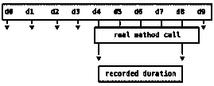
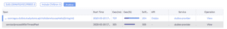
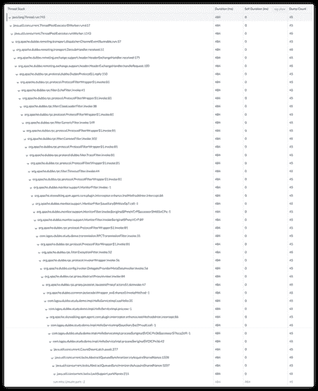

# Apache SkyWalking:使用分析来修复分布式跟踪的盲点

> 原文：<https://thenewstack.io/apache-skywalking-use-profiling-to-fix-the-blind-spot-of-distributed-tracing/>

这篇文章介绍了一种在生产中使用 [Apache SkyWalking](https://skywalking.apache.org/) 自动分析代码的方法。我们相信 profile 方法有助于减少维护和开销，同时提高根本原因分析的精确度。

## 分布式跟踪的局限性

 [吴声

tetrate.io 创始工程师。阿帕奇天行者创始人，PMC 和副总裁。许多 Apache TLP/孵化项目的 PMC/PPMC 成员。微软 MVP，阿里云 MVP，腾讯云 TVP。](https://github.com/wu-sheng) 

在早期，度量和日志系统是监控平台中的关键解决方案。随着微服务和基于分布式系统的架构的采用，分布式跟踪变得更加重要。分布式跟踪提供相关的服务上下文，如系统拓扑图和 RPC 父子关系。

有人声称分布式跟踪是发现分布式系统中性能问题原因的最佳方式。它擅长在 RPC 抽象中，或者在使用 spans 工具的组件范围中发现问题。然而，它并不完美。

你是否惊讶地发现跨度持续时间比预期的长，却不知道为什么？你下一步应该做什么？有些人可能认为下一步是添加更多的工具，将更多的跨度添加到跟踪中，认为您最终会通过更多的数据点找到根本原因。我们认为这在生产环境中不是一个好的选择。原因如下:

 [阿德里安·科尔

Adrian Cole 在 VMware 的 Spring Cloud 团队工作，主要负责 Zipkin。](https://github.com/adriancole?tab=overview&org=spring-cloud) 

1.  存在应用程序开销和系统过载的风险。特别跨度度量特定范围或方法的性能，但是选择正确的位置可能很困难。要确定准确的原因，您可以“检测”(添加跨度)许多可疑的地方。在生产环境中，额外的工具消耗更多的 CPU 和内存。接下来，没有帮助的专用工具通常会被遗忘，而不是被删除。这造成了无价值的开销负载。在最坏的情况下，过多的测量会导致生产应用程序的性能问题，或者使跟踪系统过载。
2.  特别(手动)检测的过程通常意味着至少一次重启。跟踪工具库，如 Zipkin Brave，被集成到许多框架库中。测试一个方法的性能通常意味着更改代码，即使只是一个注释。这意味着重新部署。即使你有办法进行自动检测，比如 Apache SkyWalking，你仍然需要改变配置并重启应用程序。否则，您将承担热动态插装导致的 GC 风险。
3.  向未经测试的第三方库中注入测试既困难又复杂。这需要更多的时间，许多人不知道如何去做。
4.  通常，我们在分布式跟踪中没有代码行号。特别是当使用 lambdas 时，很难识别与 span 相关联的代码行。

无论上述选择如何，深入研究都需要与您的 Ops 或 SRE 团队协作，并共享分布式跟踪方面的深层知识。

## 生产中的剖析

### 介绍

 [刘汉

刘汉是 Lagou 的技术专家。他是阿帕奇空中行走委员会成员。](https://skywalking.apache.org/team/) 

要重用分布式跟踪来实现方法范围精度，需要理解上述限制和不同的方法。我们称之为侧写。

大多数高级语言都是基于线程概念构建和运行的。profile 方法采用连续的线程转储。我们合并线程转储来估计线程转储中显示的每个方法的执行时间。分布式跟踪的关键是跟踪上下文，即被分析方法的活动(或当前)标识符。使用这个跟踪上下文，我们可以将从分析中获得的数据编织到现有的跟踪中。这允许系统自动执行其他特别的检测。让我们更深入地了解分析是如何工作的:

我们考虑具有相同堆栈深度和签名(方法、行号等)的方法调用，相同的操作。我们从同一个操作所在的线程转储中导出跨度时间戳。让我们形象地说一下:



代表 10 个连续的线程转储。如果这个方法在转储 4-8 中，我们假设它在转储 4 之前开始，在转储 8 之后结束。我们无法准确说出该方法的开始和停止时间。但是线程转储的时间戳足够接近。

为了减少由线程转储引起的开销，我们只分析由特定入口点包围的方法，比如 URI 或 MVC 控制器方法。我们通过跟踪上下文和 APM 系统来识别这些入口点。

该配置文件进行线程转储分析，并为我们提供:

1.  根本原因，精确到代码中的行号。
2.  由于消除了特别的仪器，减少了维护。
3.  降低了临时仪器引起的过载风险。
4.  动态激活:只有在必要的时候，并有一个非常明确的配置文件目标。

## 使用 Apache SkyWalking 7 实现精确分析

分布式分析内置于 Apache SkyWalking 应用程序性能监控(APM)中。让我们演示一下分析方法如何找到性能问题的根本原因。

```
final CountDownLatchcountDownLatch=  new CountDownLatch(2);

threadPool.submit(new Task1(countDownLatch));

threadPool.submit(new Task2(countDownLatch));

try  {

    countDownLatch.await(500,  TimeUnit.MILLISECONDS);

}  catch  (InterruptedExceptione)  {

}

```

Task1 和 Task2 有一个竞争条件和不稳定的执行时间:它们会影响彼此和任何调用它们的东西的性能。虽然这段代码看起来可疑，但它代表了现实生活。OPS/SRE 团队中的人通常不知道所有的代码变更以及是谁做的。他们只知道新代码中的某些东西导致了问题。

有趣的是，上面的代码并不总是很慢:它只在条件被锁定时才会发生。在 SkyWalking APM 中，我们有端点 p99/p95 延迟的指标，因此，我们很容易发现该端点的 p99 远离平均响应时间。然而，这并不等同于理解延迟的原因。要找到根本原因，请向此端点添加一个配置文件条件:持续时间大于 500 毫秒。这意味着更快的执行不会增加分析负载。



这是一个典型的概要跟踪段(整个分布式跟踪的一部分),显示在 SkyWalking UI 上。我们现在注意到“service/processWithThreadPool”跨度如我们预期的那样慢，但是为什么呢？这个方法是我们添加了错误代码的方法。当 UI 显示该方法时，我们知道分析器正在工作。现在，让我们看看侧写分析结果是什么。



这是剖面分析堆栈视图。我们看到堆栈元素名称、持续时间(包括/排除子元素)和最慢的方法已经突出显示。它清楚地显示，“sun.misc.Unsafe.park”花费的时间最多。如果我们寻找调用者，就是我们添加的代码: **CountDownLatch.await** 。

## 剖析方法的局限性

没有任何诊断工具可以适用于所有情况，即使是侧写方法也不行。

首先要考虑的是将重复调用的方法误认为是慢方法。线程转储是周期性的。如果有一个调用一个方法的循环，概要分析结果会说目标方法很慢，因为它是在每次转储过程中被捕获的。可能还有其他原因。多次调用的方法也可能在每次线程转储中被捕获。即便如此，这个侧写还是完成了它的设计目标。这仍然有助于 OPS/SRE 团队找到有问题的代码。

第二个要考虑的是开销，重复线程转储的影响是真实的，不能忽略。在 SkyWalking 中，我们将配置文件转储周期设置为至少 10ms。这意味着，如果方法性能问题在 10 毫秒内完成，我们就无法定位它们。天行道也有一个控制最大平行度的阈值。

理解以上内容可以让分布式跟踪和 APM 系统对您的 OPS/SRE 团队有用。

## 这个怎么试

我们讨论的所有内容，包括 Apache SkyWalking Java 代理、概要分析代码和 UI，都可以在我们的 GitHub 存储库中找到。我们希望你喜欢这个新的方法，并喜欢阿帕奇空中行走。如果是这样，[在 GitHub 上给我们一颗星](https://github.com/apache/skywalking)以示鼓励。

天行者 7 刚刚发布。您可以通过以下渠道联系项目团队:

通过 Pixabay 的特征图像。

<svg xmlns:xlink="http://www.w3.org/1999/xlink" viewBox="0 0 68 31" version="1.1"><title>Group</title> <desc>Created with Sketch.</desc></svg>