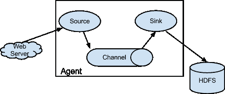
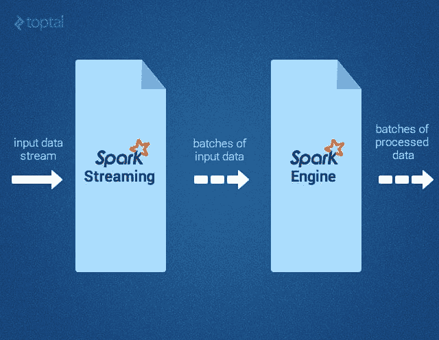
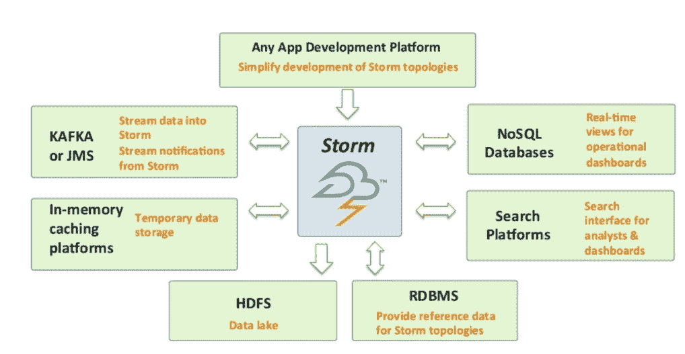
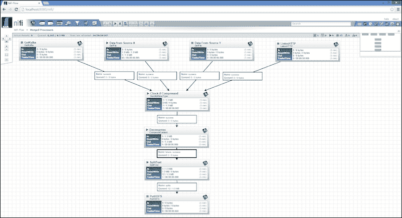
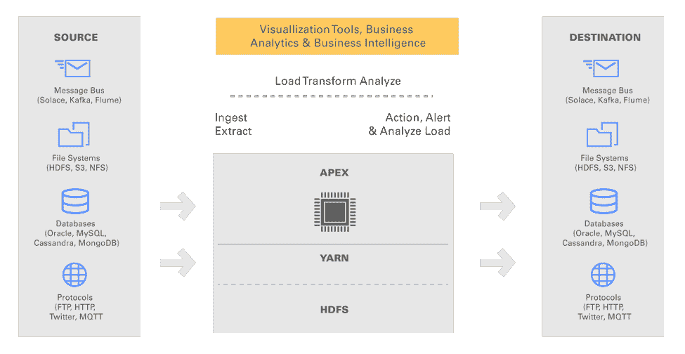
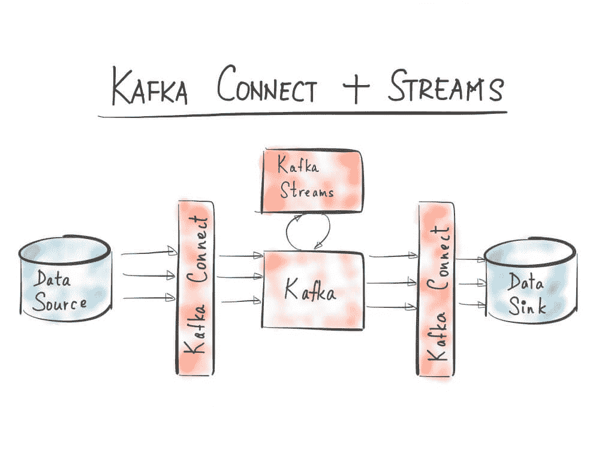
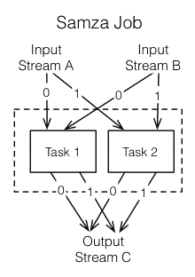
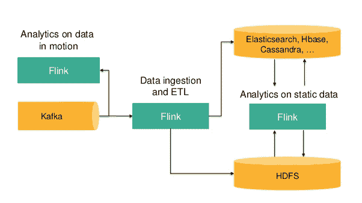
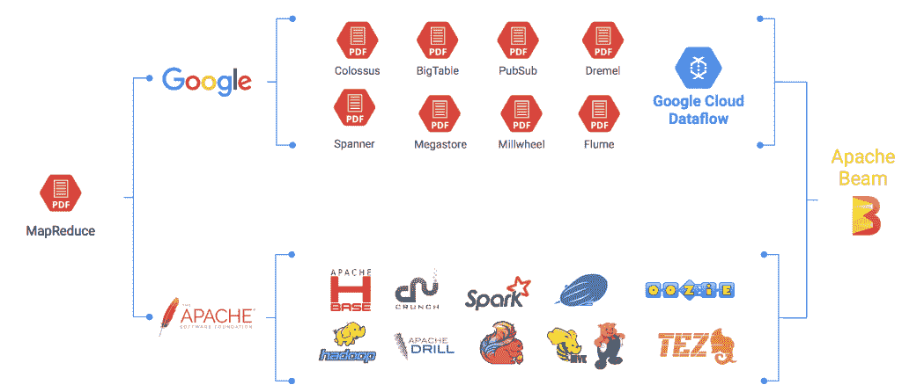
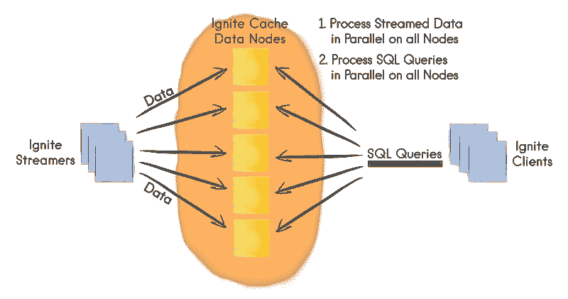

# 所有 Apache 流项目:探索指南

> 原文：<https://thenewstack.io/apache-streaming-projects-exploratory-guide/>

**数据生成、消费、处理和分析的速度正以令人难以置信的速度增长。社交媒体、物联网、广告技术和游戏垂直行业正在努力应对不成比例的数据集规模。这些行业需要近乎实时的数据处理和分析。Apache Hadoop 等传统大数据风格的框架不太适合这些用例。**

 **因此，在过去的几年中，多个开源项目已经启动，以处理流数据(T2)。所有这些都是为了处理来自不止一个来源的[永无止境的记录序列](http://oreilly.com/ideas/the-world-beyond-batch-streaming-102)。从 Kafka 到 Beam，有十几个 Apache 项目处于不同的完成阶段。

由于高度重叠，当前的 Apache 流项目处理类似的场景。用户经常发现选择正确的开源栈来实现实时流处理解决方案是令人困惑的。本文试图通过指出每个项目的关键区别来帮助客户在 Apache 流项目的复杂迷宫中导航。我们将讨论 Apache Kafka、Apache Storm、Apache Spark、Apache Samza、Apache Beam 和相关项目的用例及关键场景。

## 阿帕奇水槽

Apache Flume 是最古老的 Apache 项目之一，旨在收集、聚合和移动大型数据集(如 web 服务器日志)到一个集中的位置。它属于流处理解决方案的数据收集和单事件处理家族。Flume 基于一个代理驱动的架构，其中由客户端生成的事件直接传输到 Apache Hive、HBase 或其他数据存储。

Flume 的配置包括源、通道和汇。来源可以是任何东西，从 Syslog 到 Twitter 流，再到 Avro 端点。通道定义了如何将流传递到目的地。有效选项包括内存、JDBC、卡夫卡、文件等。接收器确定流被传递到的目的地。Flume 支持很多水槽，比如 HDFS，Hive，HBase，ElasticSearch，Kafka 等等。

Apache Flume 非常适合客户端基础设施支持安装代理的场景。最流行的用例是将来自多个源的日志流式传输到一个集中的持久数据存储，以供进一步处理分析。

**示例用例:**从能够运行 JVM 的多个源流式传输日志。

## 阿帕奇火花

[Apache Spark](http://spark.apache.org) 是大数据生态系统中最热门的技术。它以其快速的内存处理能力和富于表现力的开发 API 赢得了数据科学家和开发人员的关注。Spark 最初是在加州大学伯克利分校的 AMPLab 开发的，后来捐赠给了 Apache 软件基金会。

Apache Spark 为开发人员提供了一个以称为弹性分布式数据集(RDD)的数据结构为中心的 API，这是一个分布在一个机器集群上的只读多数据项集，具有容错能力。Spark 旨在克服 MapReduce 的局限性，在 MapReduce 中，rdd 作为分布式程序的工作集，利用分布式共享内存。Spark 号称在内存上比 Hadoop MapReduce 快 100 倍，在磁盘上运行快 10 倍。

Spark 是用 Scala 编写的，但是支持多种编程语言。它配有适配器，可以处理存储在不同来源的数据，包括 HDFS 文件、Cassandra、HBase 和亚马逊 S3。

Spark 流是构建容错流应用程序的重要组成部分。它使开发人员能够通过 Sparks 的高级 API 构建流应用程序。由于它运行在 Spark 上，Spark Streaming 允许开发人员重用相同的代码进行批处理，根据历史数据连接流，或者在流状态上运行特定的查询。它可用于构建超越传统分析的强大交互式应用。Spark Streaming 以微批量模式运行，批量比传统的批量处理小得多。

资料来源:Toptal

虽然不是严格的要求，但是 Spark 可以在现有的 Hadoop 和 Mesos 集群上运行。它为交互式地探索数据提供了一个外壳。

Apache Spark 与 Apache Kafka 结合使用时，可以提供强大的流处理环境。

**示例用例:**实时处理社交媒体源，以执行情感分析。

## 阿帕奇风暴

Apache Storm 最初是由被 Twitter 收购的 BackType 公司的 Nathan Marz 开发的。收购后，Twitter 在将 Storm 捐赠给 Apache 之前对其进行了开源。受到 Flipboard、Yahoo！和 Twitter，它已经成为开发分布式实时数据处理平台的标准。

Storm 通常被称为实时处理的 Hadoop。根据官方文档，“Storm 使可靠地处理无界数据流变得容易，为实时处理做了 Hadoop 为批处理做的事情。”

Apache Storm 主要是为可伸缩性和容错而设计的。它保证每个元组至少被处理一次。虽然它是用 Clojure 编写的，但是应用程序可以用任何能够读写标准输入和输出流的编程语言编写。Storm 旨在支持连接输入流，称为“喷口”和“螺栓”，它们是处理和输出模块。喷口和螺栓的集合形成有向无环图(DAG ),称为拓扑。基于预定义的配置，拓扑在集群上运行，调度程序将工作分布在集群中的节点上。

风暴拓扑经常被比作 Hadoop MapReduce 作业。但是与 Hadoop 作业不同，拓扑会持续运行，直到它们被终止。在一个拓扑中，spouts 获取数据，这些数据将通过一系列螺栓传递。每个螺栓负责转换或处理数据。一些 bolts 可能会将数据写入永久数据库或文件，而其他 bolts 可能会调用第三方 API 来转换数据。

来源:Hortonworks

由于开源生态系统，有一个由社区创建的流行数据源的丰富集合。通过适配器的概念，Storm 可以与 HDFS 文件系统互操作，以参与 Hadoop 作业。

Storm 通常与其他数据接收和处理组件(如 Apache Kafka 和 Apache Spark)结合使用。它提供了一个可靠的、可扩展的、容错的分布式计算框架。

**示例用例:**实时转换和处理社交媒体/物联网传感器流。

## 阿帕奇尼菲

与其他流媒体解决方案相比， [Apache NiFi](https://nifi.apache.org/) 是一个相对较新的项目，于 2015 年 7 月成为 Apache 顶级项目。它基于企业集成模式(EIP ),其中数据在到达目的地之前要经过多个阶段和转换。

Apache NiFi 提供了一个非常直观的图形界面，可以很容易地设计数据流和转换。业务分析师和决策者可以使用该工具来定义数据流。它支持各种输入源，包括静态和流数据集。从文件系统、社交媒体流、Kafka、FTP、HTTP、JMS 等来源获取的数据可以流向各种目的地，包括 ElasticSearch、亚马逊 S3、AWS Lambda、Splunk、Solr、SQL 和 NoSQL 数据库。可以将转换引入数据流的路径中。

新兴的工业物联网领域需要强大、可靠和安全的数据流引擎。Apache NiFi 有潜力成为物联网实施中处理传感器数据的最首选编排引擎。它提供了 [Node-Red](http://nodered.org/) 的简单性和大数据的强大功能。对 Kafka、JMS 和其他渠道的内置支持使其成为企业物联网解决方案的理想选择。

Apache NiFi 解决的一个经典场景是创建热路径和冷路径分析。物联网设备和传感器生成的数据集包含某些需要实时分析的数据点，同时存储一部分数据用于批处理。这样的数据集通常通过高速引擎传输，如[阿帕奇卡夫卡](http://kafka.apache.org/)、[亚马逊 Kinesis](https://aws.amazon.com/kinesis/) 和 [Azure 事件中心](https://azure.microsoft.com/en-us/services/event-hubs/)。Apache NiFi 可用于为负责近实时处理(热路径)和批处理(冷路径)的相同数据集定义两个独立的路径。

**示例用例:**定义物联网传感器数据流的交互式规则引擎。

## 阿帕奇 Apex

总部位于硅谷的公司 DataTorrent 向 Apache 基金会捐赠了一款实时流媒体商业产品，该产品现在被称为 [Apache Apex](https://apex.apache.org) 。这是 Apache 最年轻的项目之一，从孵化器中毕业，成为顶级项目。Apache Apex 被定位为 Apache Storm 和 Apache Spark 的替代产品，用于实时流处理。据称它至少比 Spark 快 10 到 100 倍。

与 Apache Spark 相比，Apex 具有企业特性，如事件处理、事件交付的保证顺序以及核心平台级别的容错。不像 Spark 需要很强的 Scala 技能，Apex 可以被现有的 Java 开发者使用。它旨在在现有的 Hadoop 生态系统中运行良好，使用 YARN 进行扩展或缩减，同时使用 HDFS 进行容错。

Apache Apex 被定位为业界唯一能够处理批量数据以及流数据需求的开源企业级引擎。它是一个动态数据平台，允许统一处理实时无边界数据流(流作业)或传统文件中的有边界数据(批处理作业)。组织可以构建适合其业务逻辑的应用程序，并将应用程序扩展到批处理和流作业。Apache Apex 架构可以处理消息总线、文件系统、数据库或任何其他来源的读写。只要这些源拥有可以在 JVM 中运行的客户机代码，集成就可以无缝地工作。

Apex 附带了一个名为 [Malhar](https://github.com/apache/apex-malhar) 的操作符库，这些操作符是为数据源和目的地(如消息总线、文件系统和数据库)预先构建的操作符。这些操作符使开发人员能够快速构建处理各种数据源的业务逻辑。Apex 的总体目标是降低企业大数据项目的复杂性。

**示例用例:**在容错基础设施上运行的应用程序，需要以实时和批处理模式处理异构数据集。

## 阿帕奇卡夫卡溪流

[Kafka Streams](http://docs.confluent.io/3.0.0/streams/index.html) 是一个构建在流行的数据摄取平台 Apache Kafka 之上的库。源代码是 Kafka 项目的一部分。它是由 LinkedIn 上 Kafka 项目的最初开发者创建的创业公司 [Confluent](http://www.confluent.io/) 提供的。

最近，Apache Kafka 成为最流行的实时、大规模消息传递系统。它已迅速成为当代数据平台的核心基础设施构建模块。包括网飞、思科、PayPal 和 Twitter 在内的数千家公司广泛使用它。Kafka 也是公共云提供商提供的托管大数据和分析平台的托管服务。

Kafka Streams 是一个用于构建流应用程序的库，特别是那些处理将输入 Kafka 主题转换为输出 Kafka 主题的应用程序。它不是为大型分析而设计的，而是为提供高效和紧凑的流处理的微服务而设计的。这意味着 Kafka Streams 库旨在集成到应用程序的核心业务逻辑中，而不是批处理分析作业的一部分。

Kafka 流将用户从设置、配置和管理仅用于流处理的复杂 Spark 集群中解放出来。它简化了流处理，使其可以作为异步服务的独立应用程序编程模型进行访问。开发者可以嵌入 Kafka Streams 功能，而不需要流处理集群。该架构将有 Apache Kafka 和一个没有外部依赖性的应用程序。Kafka Streams 提供了一个处理模型，该模型与 Kafka 提供的核心抽象完全集成，以减少流架构中移动部分的总数。它不是 MapReduce 代码的一部分，通常是为了处理批处理而编写的。

在讨论 Kafka Streams 时，触及 [Kafka Connect](http://kafka.apache.org/documentation.html#connect) 也很重要，它是一个可靠地将 Kafka 与外部系统(如数据库、键值存储、搜索索引和文件系统)连接起来的框架。

Kafka Streams 最棒的一点是，它可以打包成一个可以放在 Docker 上的容器。DevOps 团队还可以使用 Ansible、Puppet、Chef、Salt 甚至 shell 脚本来部署和管理应用程序。一旦打包成一个容器，它就可以与诸如 Docker Swarm、Kubernetes、DC/OS、Yarn 等编排引擎集成。

**示例用例:**需要嵌入式流处理能力而不依赖复杂集群的微服务和独立应用。

## 阿帕奇萨姆扎

[Apache Samza](http://samza.apache.org/) 是在 LinkedIn 上[开发的](https://engineering.linkedin.com/data-streams/apache-samza-linkedins-real-time-stream-processing-framework)，以避免 Hadoop 批处理中涉及的大量周转时间。它建立在 Apache Kafka 之上，Apache Kafka 是一个低延迟的分布式消息传递系统。Samza 是为连续数据处理提供轻量级框架而构建的。

卡夫卡和萨姆扎的结合类似于 HDFS 和 MapReduce。如果 HDFS 充当 MapReduce 作业的输入，那么 Kafka 接收由 Samza 处理的数据。当数据到达时，Samza 可以持续计算结果，从而实现亚秒级响应时间。

从流中获得输入后，Samza 执行一个作业，这是消耗和处理一组输入流的代码。作业可以用 Java、Scala 或者其他支持 JVM 的语言编写。为了实现可伸缩性，作业被进一步细分为称为任务的更小的执行单元，这是并行性的单位，就像分区对于流一样。每个任务消耗由其中一个分区提供的数据。任务按照消息偏移量的顺序依次处理来自每个输入分区的消息。分区之间没有明确的顺序，允许每个任务独立运行。

Samza 将在一个或多个容器中执行的多个任务分组，这些容器是运行 JVM 的独立操作系统进程，负责为单个作业执行一组任务。容器是单线程的，负责管理任务的生命周期。

Samza 和其他流技术的关键区别在于它的有状态流处理能力。Samza 任务具有专用的键/值存储，与任务位于同一台机器上。这种架构提供了比任何其他流处理软件更好的读/写性能。

由于 Samza 是从 LinkedIn 上对 Kafka 的广泛使用演变而来的，所以它们有很大的兼容性。在卡夫卡被用于摄取的建筑中，它成为一个自然的选择。

Apache Samza 和 Kafka Streams 解决了同样的问题，后者是一个可嵌入的库，而不是一个成熟的软件。

**示例用例:**为利用 Kafka 进行摄取的应用程序优化流处理。

## 阿帕奇弗林克

Apache Flink 最初于 2010 年在德国开发为“平流层:云上的信息管理”，由柏林工业大学、柏林洪堡大学和哈苏-普拉特纳波茨坦研究所合作开发。在提交给 Apache Software Foundation 之后，它在 2014 年 12 月成为顶级项目。起初，Apache Flink 的概念和用例看起来类似于 Apache Spark。它的目标是成为运行批处理、流、交互、图形处理和机器学习应用的单一平台。但是 Spark 和 Flink 在实现上是有区别的。

Spark Streaming 旨在处理小型批处理，可以提供接近实时的能力。由于细粒度的事件级处理架构，Apache Flink 提供了实时处理。

Flink 为流处理带来了一些独特的功能。它为状态更新提供了一次性保证，将开发人员从处理重复项的负担中解放出来。它有一个高吞吐量的引擎，可以在事件通过分布式网络发送之前对其进行缓冲。Flink 提供了一个强大的流编程模型，具有灵活的窗口方案。

Flink 被构建为两者，一个用于流分析的数据流 API，一个基于底层流处理引擎的用于批量分析的数据集 API。

Apache Flink 支持用 Java 或 Scala 编写的程序，这些程序被自动编译和优化成数据流程序。Flink 没有自己的数据存储系统。输入数据可以来自分布式存储系统，如 HDFS 或 HBase。对于数据流处理，Flink 可以使用来自 Kafka 等消息队列的数据。

**示例用例:**实时检测和预防欺诈性信用卡交易。

## 阿帕奇波束

[Apache Beam](http://beam.incubator.apache.org/) 是 Apache 软件基金会不断增长的流媒体项目列表中的最新成员。这个项目的名字象征着设计，它是批处理和流处理模型的组合。它基于一个统一的模型来定义和执行数据并行处理管道，这些管道带有一组用于构建管道的语言特定的 SDK 和用于执行管道的运行时特定的运行器。

谷歌与数据工匠、Cloudera 和 PayPal 一起向 ASF 捐赠了其大数据服务的 SDK[Cloud Data flow](https://cloud.google.com/dataflow/)，这已经成为 Apache Beam 的基础。它是从各种 Google 内部项目演化而来的，比如 MapReduce、FlumeJava 和 Millwheel。Beam 中管道运行器的概念将数据处理管道转化为一个 API，该 API 与多个分布式处理后端兼容。管道是处理数据集的一系列进程。每个 Beam 程序都有一个后端运行器，这取决于管道的执行位置。该平台目前支持包括 Google Cloud Dataflow、Apache Flink 和 Apache Spark 在内的跑步者。其他运行程序如 Storm 和 MapReduce 正在开发中。

Beam 解决什么问题？当 MapReduce 作业从 Hadoop 迁移到 Spark 或 Flink 时，需要进行大量的重构。数据流试图成为代码和执行运行时之间的抽象层。代码在数据流 SDK 中实现时，会在 Flink、Spark 等多个后端上运行。Beam 支持 Java 和 Python 以及正在开发的其他语言绑定。它旨在将多种语言、框架和 SDK 整合到一个统一的编程模型中。

**样例用例:**依赖多个框架的应用，包括 Flink 和 Spark。

## Apache Ignite

[Apache Ignite](https://ignite.apache.org/) 是一个构建在分布式内存计算平台之上的内存层。它针对实时处理大型数据集进行了优化。与传统的基于磁盘或基于闪存的技术相比，内存架构使其速度更快。

该项目最初由 [GridGain Systems](https://www.gridgain.com/) 开发，并于 2014 年捐赠给 ASF。2015 年 9 月，Ignite 孵化毕业，成为一名 TLP。

尽管 Spark 和 Ignite 都依赖于分布式内存处理架构，但两者之间还是有细微的差别。Spark 主要设计用于交互式分析和机器学习应用，而 Ignite 旨在提供编程式实时分析、机器对机器通信和高性能事务处理。

Ignite 有望成为股票交易、欺诈检测、实时建模和分析等交易处理系统的首选解决方案。它同样适用于在商用硬件上运行的横向扩展体系结构，也适用于高端工作站和服务器上的垂直扩展。

Ignite 流功能允许以可扩展和容错的方式处理连续不断的数据流。向 Ignite 注入数据的速率可能非常高，在中等规模的集群上很容易超过每秒数百万个事件。

**示例用例:**严重依赖编程式实时分析、机器对机器通信和高性能事务处理的应用。

<svg xmlns:xlink="http://www.w3.org/1999/xlink" viewBox="0 0 68 31" version="1.1"><title>Group</title> <desc>Created with Sketch.</desc></svg>**