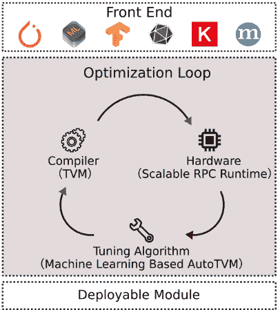
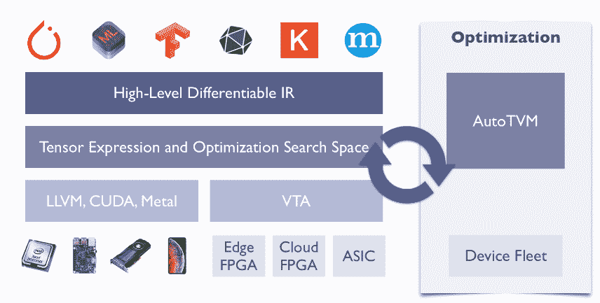
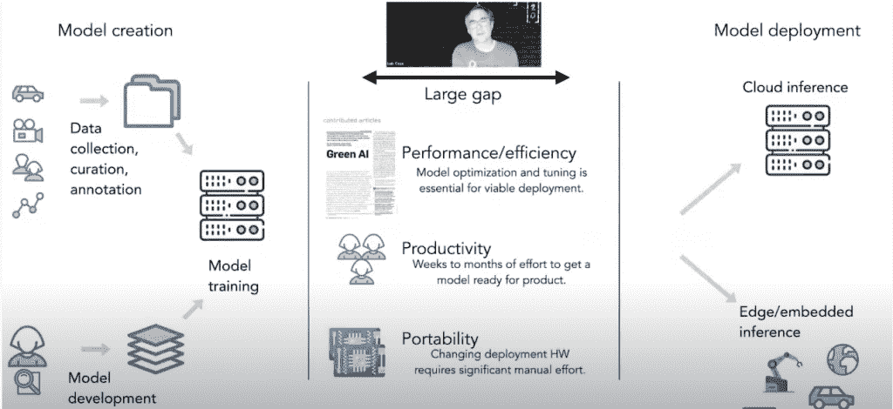

# Apache TVM:跨后端的可移植机器学习

> 原文：<https://thenewstack.io/apache-tvm-portable-machine-learning-across-backends/>

[Apache Software Foundation](https://www.apache.org/foundation/) 的最新顶级项目 [TVM、](https://tvm.apache.org/)旨在弥合机器学习模型的创建和将其投入生产之间的差距。它自动化了针对各种后端硬件(特别是 CPU、GPU 和专用加速器)调整模型的耗时工作。

“现在有很多应用程序需要将人工智能机器学习放到我们的后端，包括你的手机或数据中心设备，等等。然后，我们面临的挑战是，很难建立一个可移植的解决方案，”[Apache TVM 副总裁陈天琦](https://github.com/tqchen)解释道。这些应用包括语音识别、自动校正摄像头等等。

他说，像谷歌这样的大公司只是雇佣大量工程师来优化不同平台上的机器学习应用程序，但大多数公司都没有资源来这样做。

在最近的 [2020 TVM 虚拟会议](https://www.youtube.com/watch?v=5BRb_R3bexM)期间，华盛顿大学教授兼 OctoML 首席执行官 [Luis Ceze](https://www.cs.washington.edu/people/faculty/luisceze) 解释说，Apache TVM 是一个创建“以自动化方式从【模型创建】框架到目标平台选择的单一、干净路径”的项目。

[TVM](https://github.com/apache/tvm)2017 年起源于华盛顿大学 SAMPL 跨学科机器学习研究组，2019 年进入 Apache 孵化器。OctoML 公司是开源项目的商业分支。Ceze 在会议上说，在过去的一年中，该项目的贡献者人数增加了 50%。这些贡献者来自、谷歌、华为、AMD、康奈尔大学、加州大学伯克利分校和卡耐基梅隆大学，陈现在是卡耐基梅隆大学的助理教授。

TVM 与深度学习框架(Keras、MXNet、PyTorch、Tensorflow、CoreML、DarkNet)合作，为不同的后端提供端到端的编译，包括浏览器、微控制器、FPGAs(现场可编程门阵列)等。

它提供了最少的可部署模块，可以在一系列系统和设备上运行，包括手机、可穿戴设备、专用芯片和嵌入式设备。

它被用于 AWS、脸书和阿里巴巴等公司的生产中。

TVM 从 [Halide](https://github.com/halide/Halide) 中获得灵感，这是一种为 CPU 和 GPU 编写高性能图像和阵列处理代码的编程语言； [Loopy](https://github.com/inducer/loopy) 的整数集分析和循环变换原语；以及 Python 库 [Theano](https://github.com/Theano/Theano) 。

TVM 堆栈包括一个用于高级优化的高级可微分编程 IR(中间表示)，一个机器学习驱动的程序优化器和[VTA](https://tvm.apache.org/vta)——一个完全开源的深度学习加速器。

该技术可以从多个前端开始，包括 Tensorflow、ONNX 和 MXNet。前端将一个模型吸收到一个 IRModule(中间表示模块)中，然后根据目标后端将它转换成一个功能相当的版本。它被翻译成目标指定的可执行格式，然后封装成一个**运行时。可以导出并在目标硬件上运行的模块**。编译的工件是用选择的语言编写的，包括 Python、C++、Rust、Go、Java 和 JavaScript。

“我的想法是希望带来更多的自动化，而不是让程序员去优化那些库，所有那些平台。在这种情况下，我们[使用]机器学习指导的搜索来搜索可能的候选对象，以找到一个好的解决方案。因此，整个想法是，我们将能够采用由通用机器学习框架生成的 ML 模型，并自动为感兴趣的后端找到优化的过去的程序，”陈说。该技术还可以寻找优化以提高性能，并预测最佳行动方案。

它使用迭代循环进行内核优化。在典型地采取计算图形表示方式的形式的输入之后，它为该网络中的所有操作符生成内核。

“内部循环使用可扩展的 RPC 运行时、基于机器学习的调谐器和张量编译器。在每一轮循环中，调优器挑选一批有希望的候选内核实现，并在实际硬件上对它们进行分析。然后，调谐器获得分析结果。这些分析结果被用作训练数据来拟合预测模型。拟合预测模型后，调谐器根据预测挑选下一个有希望的候选对象，然后循环继续。他的方法是，我们迭代地搜索快速内核，”一篇博文解释道。

最接近 TVM 的项目是谷歌的 [MLIR](https://mlir.llvm.org/) (多级中间表示概述)，用于构建可重用和可扩展的编译器基础设施。张量计算的其他项目包括 Halide 和 [TACO](http://://tensor-compiler.org/) (张量代数编译器)。

自动调度是孵化器中正在开发的功能之一。陈说，前进的道路当然将由项目的贡献者来决定，但他希望它能支持更多不同种类的硬件，并发现新的研究领域。

TVM 已经扩展到了一个微控制器后端，称为 [TVM](https://tvm.apache.org/2020/06/04/tinyml-how-tvm-is-taming-tiny) (发音为“MicroTVM”)，它有助于在裸机设备上执行主机驱动的张量程序。

图片由来自 Pixabay 的 J Garget 提供。

<svg xmlns:xlink="http://www.w3.org/1999/xlink" viewBox="0 0 68 31" version="1.1"><title>Group</title> <desc>Created with Sketch.</desc></svg>