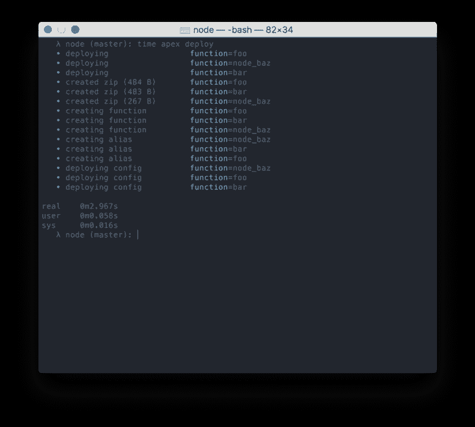

# Apex 让 AWS Lambda 对程序员来说很容易

> 原文：<https://thenewstack.io/apex-makes-aws-lambda-easy-peasy-programmers/>

AWS 旨在使 Lambda 服务易于使用，无需担心状态或服务器，只需在您需要时提供纯粹的实时电源。正如早期用户[已经发现](https://news.ycombinator.com/item?id=10921008)的那样，要让这个可能没有被充分记录的 Lambda 以任何有意义的规模工作，可能需要做一些工作。

Apex 是一个小型围棋程序，旨在解决这个问题，让那些只想轻松使用 Lambda 构建一些东西的雄心勃勃的人的生活变得更容易。

[TJ Holowaychuk](https://twitter.com/tjholowaychuk) 在[向全世界宣布 Apex](https://medium.com/@tjholowaychuk/introducing-apex-800824ffaa70#.8u0vx85kr)的博客帖子中写道:“我创立 Apex 是因为我作为一名单独的工程师一直在研究一些产品想法，如果我要作为一个单独的团队拥有一个成功的产品，我负担不起花时间管理和维护机器。”。

AWS [Lambda](https://aws.amazon.com/lambda/) 被设计成在云中运行用户生成的函数，而不需要用户担心运行所述函数的任何支持栈。它是一个无状态的计算机服务，这意味着它运行一个用户定义的功能，从外部服务收集数据，以某种方式处理数据，并将输出传递给其他服务。您为函数提供一个 ZIP 文件(用 JavaScript、Python 和 Java 编写),它返回结果。不需要服务器。

尽管使用 Lambda 有其自身的开销:它对那些使用 AWS 基础设施的其他组件的人来说非常友好，但是您仍然需要在 ECS(弹性容器服务)上设置容器并处理 API 网关。

Holowaychuk 的 Apex(不要与 Apache Apex 项目混淆)为运行 Lambda 作业提供了项目级功能和资源管理。使用基于 JSON 的配置文件，用 Go 编写的软件允许您设置项目级别的默认值和全局属性。Apex 支持并发“单次运行”[等幂部署](http://docs.aws.amazon.com/AWSEC2/latest/APIReference/Run_Instance_Idempotency.html)和多功能部署。

使用 Apex 在 AWS Lambda 上部署三个节点应用程序。

使用 Apex，您可以通过 JSON 格式的命令调用 Lambda 函数。您还可以重新配置和删除功能。Apex 支持操纵 AWS 资源的任何命令的模拟运行。

Apex 目前支持用 Node.js、Python 和 Golang 编写的函数。向 Lambda 不直接支持的任何语言添加填充程序。事件通过**标准输入**的方式输入到函数中，响应来自**标准输出**。

Apex 是众多旨在简化 Lambda 使用流程的项目之一。基于 Node.js 的 Serverless.com[为构建基于 lambda 的应用程序提供了一个框架。](http://www.serverless.com) [Dexter](https://rundexter.com/) 为用户提供了一个图形界面，方便用户组装程序，链接不同的 API。 [Kappa](https://github.com/garnaat/kappa) 是一个命令行工具，用于部署、更新和测试 AWS Lambda 的功能。

对于 Holowaychuk 来说，Lambda 和其他无状态服务代表了一种新的计算方式，一种包袱最小的方式。“最终，没有人真正关心机器、容器，我们只关心逻辑和结果，”Holowaychuk 写道。

<svg xmlns:xlink="http://www.w3.org/1999/xlink" viewBox="0 0 68 31" version="1.1"><title>Group</title> <desc>Created with Sketch.</desc></svg>