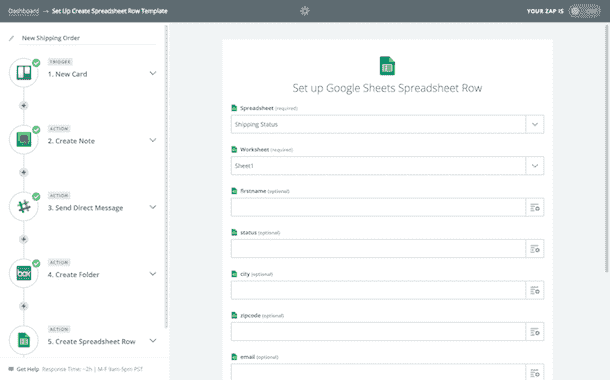

# API 聚合器如何帮助业务单位构建自动化工作流，绕过 IT

> 原文：<https://thenewstack.io/api-aggregators-help-business-units-work-build-sophisticated-workflows-bypass/>

API 集成提供商 Zapier 推出了一项服务，旨在通过将 SaaS API 菊花链化为完整的业务流程，帮助企业创建工作流自动化工具。

“这是我们大约两年半前开始的事情，我们试图让它尽可能简单，”Zapier 的联合创始人布莱恩·赫尔姆格说。“我们必须备份并重新思考我们将如何构建工作流。这就是我们如何知道我们必须设计它并呈现给用户。这是一开始的巨大推动力。”

这一新特性表明，在几年的承诺之后，API 可能最终会推动新一波的工作流自动化工具，到目前为止，只有一小部分潜在客户市场采用了这些工具。新功能还表明，企业更加需要能够超越通过 API 进行的 CRUD 类型的数据操作(单个集成可能允许最终用户创建、读取、更新或删除数据集)，并进入更复杂的业务逻辑，其中来自一个 SaaS 工具的数据可能需要验证、清理、过滤或重新计算，然后注入到业务流程的下一阶段。

Zapier 并不是唯一一个升级工作流自动化游戏的人。Cloud Elements、WaveMaker 和其他公司都在提供构建工作流的服务，这些工作流不仅更加复杂，而且旨在更易于部署，最大限度地减少 IT 在部署过程中的作用。

“现在有趣的是，我们看到近 70%的集成任务将发生在 IT 部门之外，”API 集成平台 Cloud Elements 的首席执行官 Mark Geene 说。“所以你会看到这延伸出了协同工作的责任，夏普的 IT 组织正在为业务部门提供工具。因此资源可以由它来管理。显然，你不希望向人力资源部门的每个人开放整个财务系统，但 IT 部门的发展方向是摇尾巴:它的作用将真正围绕着提供哪些资源。”

到目前为止， [Zapier](https://zapier.com/) 和其他 API 聚合和集成服务，如 [IFTTT](https://ifttt.com/) ，已经提供了单个 SaaS 到 SaaS 的集成，集成者 GUI 后面的 API 负责将数据从一个 SaaS 工具转移到另一个工具。Zapier 可以进行点对点类型的集成(他们称之为“zaps”)，比如将新的 Salesforce 客户添加到 MailChimp 订户列表，或者在 Trello 项目管理板上的任务完成时更新 Toggl 时间条目。

现在，借助新的[多步 Zaps 功能](https://zapier.com/blog/workflow-automation/)，最终用户可以创建完整的工作流，首先将新的 Salesforce 客户添加到订户列表中，然后取出他们的电话号码，以获取新联系人的每日 Google Sheets 列表，然后通过 Slack 通知共享该每日联系人列表。

【T2

Helmig 说，为了提供新功能，Zapier 必须重建他们的核心代码库，这是整体到微服务趋势中的一种新兴模式。现在，不仅仅是传统企业在其遗留系统中存在技术债务。对于正在成长的初创公司来说，在他们扩展的某个点上，他们发现如果不在微服务基础上重建核心架构，他们就无法添加新功能。

“我们利用了很多我们已经拥有的东西，并且必须将它们分开。我们使用 Docker 和 AWS Lambda 之类的东西来驱动许多代码步骤。此前，我们已经在 Docker 上构建了自己的内部版本 AWS Lambda，但谢天谢地，亚马逊正在做我们试图做的事情。”

## “有点像 ETL”

Helmig 说，他已经在使用多步 zaps 的方法之一是用 crontabs 代替常规管理任务:

“在 Zapier，我们试图创造一种工程文化，让每个人都可以对代码库发表评论，”他说。“我们有一个时间表，接受一堆拉请求，整理所有的评论，并为评论者计算分数。现在，我们可以使用多 zaps 来做到这一点，将其发布到 Slack，并让我们的大脑知道我们需要继续这样做。每天早上 8 点，它就像一张更新我们协作工程文化的排行榜。”

Helmig 说，多步 zaps 从 API 调用开始，并添加了“有点像 ETL 的东西”最初从业务流程工具开始的 API 集成工具最终随着 Slack 和 HipChat 等工作场所协作工具变得越来越普遍。

过去，从一个数据集中提取数据，可能会附加到软件即服务(SaaS)产品，如客户关系管理工具，然后需要应用一些小代码片段来转换数据并将其加载到下一个流程中。

例如，销售代理可能会将新客户的详细信息输入到数据库中，但是工作流流程需要提取电子邮件地址以将其添加到邮件订阅者工具中，并单独提取电话号码以添加到跟进电话电子表格中。虽然已经有一些简单程度不同的工具可以做到这一点，但只有随着 Slack 的出现及其竞争对手(如 HipChat)的增长，才有一个跨业务团队使用的平台，在这个平台上，这些集成可以以转换后的报告状态呈现，供员工使用。

“我认为 Slack 和 HipChat 中的专业机器人对我们来说将是巨大的，”Helmig 说。"它们将被建模为工作流."

## 绕过它

Zapier 推广的第一批多步 zaps 合作伙伴之一是 Slack，这也不是偶然的。

[在云服务变得更容易被市场接受的时代，Slack 在企业中得到迅速采用](https://thenewstack.io/slack-new-model-business-process-software/)。个别业务单位在没有获得 IT 部门批准的情况下，就在他们自己的项目工作中采用 Slack，这种情况随后在整个业务中蔓延开来。现在，随着 SaaS 工具变得越来越普遍，并且越来越多地由每个业务单位自行决定使用，对在 SaaS 产品之间连接和移动数据的工作流工具的需求也在增长。

Vijay Pullur 是 [WaveMaker](http://www.wavemaker.com/) 的首席执行官，这是另一种类型的 API 集成工具，允许用户从记录数据库系统创建自己的 API，以及创建统一的 API 层，用于从 SaaS 和其他云服务引入第三方数据源。他说，个别业务单位绕过它，选择自己的 SaaS 正在发生“相当多”

例如，WaveMaker 每周都会看到大约 35 个来自企业的新注册用户，他们希望尝试他们的 API 集成工具。“这些不是我们的客户，”普鲁尔说。“这些是大公司里的人，他们来试用我们。所以很明显，这是一个自下而上的过程。”

普鲁尔说，在一个企业中，“我可以不经许可尝试一些东西”的想法始于对开源的吸收。“大约十年前，当开源获得势头时，它更多的是一种尝试，我将向它推荐，这就是方法。当它转向 OK 的时候，我会买它并开始更多地在营销方面使用它。例如，当您看到 SaaS 的增长时，它是营销部门使用 SaaS 软件，因此营销部门开始减少对其 it 的依赖。现在，这已经开始从 IT 核心向外扩散。这就像接受像 AWS 这样的公共云，这在几年前还是一个完全的禁忌，而现在几乎每个公司都有！”普鲁尔说。

他认为，由于消费者不断变化的数字媒体消费模式，市场营销部门已经受到消费者需求的驱动，需要更加敏捷地行动，以满足潜在消费者的期望，并在他们所处的位置满足他们。当企业能够建立这些关系时，企业的其他部分必须同样敏捷地工作，然后提供满足这些数字客户需求的服务和新产品。

## Provident Security:利用技术建立客户信任

总部位于加拿大的 [Provident Security](http://www.providentsecurity.ca/) 的创始人兼首席执行官迈克·贾格尔(Mike Jagger)最初联系了 Zapier 的技术支持，请求帮助使用 zaps 实现工作流程自动化，并被邀请参加多步 Zaps 测试试点。

贾格尔说:“我们已经在一些领域使用了这项服务，比如人力资源和客户入职，以及那些让人们慢下来的随机任务。”。

他举了一个使用 SaaS 项目协作工具 [Basecamp](https://basecamp.com/) 的例子。作为一家家庭安全公司，Provident Security 有许多独特的案例，其目标是将现有的和新的家庭自动化和安全技术集成到一个完整的系统中。该公司独特价值主张的一部分是，他们可以在五分钟内响应报警电话。因此，每当添加新的家庭安装项目时，他们发现必须手动定制新的项目模板。

“所以我们在 Formstack 中建立了一个逻辑表单，在表单的末尾会产生一系列变量，这些变量可以自动创建适当的模板和特定的待办事项，收集我们在实地工作时需要的信息，并减少重复的数据输入，”Jagger 说。

贾格尔说，该公司的愿望之一是，客户应该只需要提到一次，在他们的过程中没有任何阶段，客户需要重新解释他们当前的系统是什么，或者为什么他们希望他们的家庭自动化系统以特定的方式设计。

“我们可以将所有这些数据收集点集中到一个地方，因此我们正在慢慢构建一个故事，并启动一些自动化。我们的核心价值观之一是在与客户的每一次对话中建立信任，现在我们在将数据纳入实时数据方面取得了很大成功，客户只是根据我们迄今已知的信息被问及适当的问题。我们已经通过每个新项目节省了额外的时间。我们希望客户觉得我们做的事情很顺利、很容易，但要让任何事情看起来很容易，在幕后要困难得多。”

贾格尔认为，像多步 Zaps 这样的工具的出现正在改变非技术人员的角色，也完全改变了传统 IT 部门的职责。

“我们从事的是与技术打交道的行业，但我们有传统的家庭安全设置。因此，我们有专人负责我们的网络和 IT 基础设施，我们有聪明的人负责我们的数据，我们有专人负责我们的 SQL 数据库。”贾格尔说，像 Zapier 这样的工具让非 It、非编码人员开始以新的方式操纵和试验数据。

“参与的人越多，你就会失去很多数据的背景，”他说。“在过去，编写代码的人必须真正理解为什么某些事情很重要的业务案例。如果我们使用像 Zapier 这样的工具并连接 API，整个想法背后的精神可以更快地移动。我们有聪明的人，我们不想浪费时间，我们不想每次都重新发明轮子，我们真的擅长一些事情，我们想专注于我们的核心业务。因此，如果有其他企业拥有同类最佳的服务，我们希望它们之间有一些简单的挂钩，而不是我们传统的 IT 部门必须编码和构建一些东西。”

## IT 角色的转变

Cloud Elements 公司的 Geene 说他的公司的产品采取了不同于多步 Zaps 的策略。虽然 Zapier 可以向存储在企业核心数据集中的数据添加业务逻辑(这些数据存储在 Salesforce 等 SaaS 工具中)，但 Cloud Elements 构建了一个中心模型，可以从更传统的遗留数据库系统以及 SaaS 工具中提取数据。在 hub 的中心，创建了一个单独的 API，然后可以使用它来提取数据，并沿着工作流路径添加所需的业务逻辑。

“一端是应用程序用户，像 Zapiers 和 IFTTTs 这样的产品提供应用程序最终用户可以实现的服务，”Geene 说。“但是，您还有一大堆业务单位，它们有一个记录系统，记录着包含自定义数据的重要数据对象。CRM 中 99%的系统都有自定义字段，在这些字段中映射和转换数据的能力是 it 所需的下一个复杂级别。传统上，在企业中，这是由 IT 管理的集成平台即服务来完成的，但现在发生在业务部门级别，”Geene 说。

“一个企业可能有 31 个营销方面的 SaaS 应用程序和 18 个人力资源方面的应用程序。它应该接受这些应用程序并说，‘好吧，我有所有这些可用的对象和资源。我不需要控制它们，但是我怎样才能让业务运营者使用它们，我怎样才能提供工具和模板来帮助他们呢？”基恩说。

我对它的未来愿景是，他们是开发资源的管理者。他们让业务部门使用 Zapier 和 SaaS 的工具，并开放越来越多的核心——不仅仅是为了支持边缘应用，以便各部门可以将它们结合在一起——而是问‘我在这些终端上提供了哪些数据？’

他举了一个与客户合作的例子，其中一个业务部门独立开发了一个工具，但意外地创建了一个十进制系统，因此所有这些错误信息都进入了他们的费用系统。“它应该提供良好的工具，这样就不会发生这种情况，以便数据对象可以转换它，从而可以使用它。”

贾格尔同意这一新的愿景。“我们数据的完整性至关重要，因此 IT 团队的职责是确保我们拥有正确的数据，数据安全且组织得当，但我们希望充分利用这些应用程序。因此，他们需要帮助我们确保我们没有制造安全漏洞，这项技术的目的是我们希望我们的员工能够做他们唯一能够做的事情，这项技术需要摆脱这种方式，让我们与客户交谈的员工移动得更快。”

他还表示，新兴的物联网将有助于更快地推动 IT 的重新定位:“来自所有这些独立系统的数据并不短缺。[物联网]给最终用户带来的安全问题比它解决的问题更多，我们所做的是帮助最终用户弥合这些差距，为他们提供系统的便利，而没有安全风险。”他说，一个新的设想 IT 角色将是帮助整个企业的其他人能够安全地使用来自集成系统和传感器的数据对象的核心。

## 作为生态系统的一部分启动多步 Zaps

虽然这项新服务创造了一系列全新的用例，并扩大了 Zapier 将其触角延伸到企业市场的潜力，但这家初创公司仍可以从其他非常了解他们所做平台的 SaaS 那里学到很多东西。

Zapier 与其几个著名的 API 集成合作伙伴(包括 Slack、Trello 和 MailChimp)共同推出了这项服务。今天，所有人都发布了新的博客文章，宣布 Zapier 的功能，这是一个尽可能广泛传播新服务的有力举措。尽管如此，其他服务，如 [Segment.io](https://segment.com/blog/how-segment-models-growth-for-two-sided-marketplaces/) 将现有的 API 汇集成一个单一的 API 用于分析市场，然后使其可用(在云元素所做的更垂直的例子中)，对他们的平台定位有很好的理解，这也许是 Zapier 可以学习的。

创建 Slackbots 和利用无状态架构的能力刚刚被触及，似乎是 Helmig 未来思考的焦点。迄今为止，只有一项来自 Zapier 与现有集成合作伙伴的公开研究表明，当 SaaS 工具与其他 SaaS 工具集成时，它会产生客户粘性并减少流失，尽管 Helmig 愿意与任何其他合作伙伴合作，分析让最终用户更容易地在云产品之间同步数据是否会提高他们的订阅忠诚度。

“平台的基础仍在形成中，”Helmig 确认道。

专题图片:[瑞安·索玛](https://www.flickr.com/photos/ideonexus/)的《T2 机器公园》。根据( [CC BY-SA 2.0](https://creativecommons.org/licenses/by-sa/2.0/) )许可。

<svg xmlns:xlink="http://www.w3.org/1999/xlink" viewBox="0 0 68 31" version="1.1"><title>Group</title> <desc>Created with Sketch.</desc></svg>