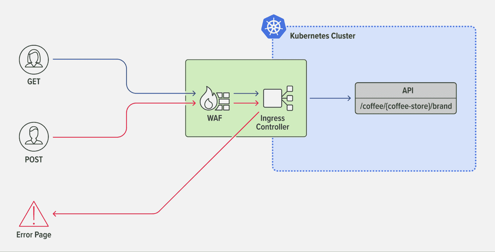
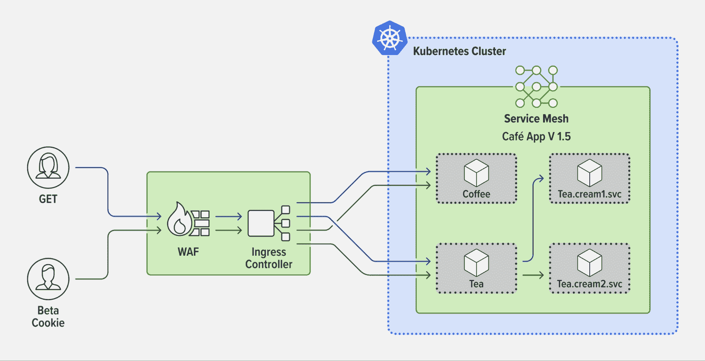

# API 网关、入口控制器或服务网格:何时使用什么，为什么

> 原文：<https://thenewstack.io/api-gateway-ingress-controller-or-service-mesh-when-to-use-what-and-why/>

在几乎所有关于入口控制器和服务网格的对话中，我们都会听到一些不同的问题，“这个工具与 API 网关有什么不同？”或者“在 Kubernetes 中，我需要一个 API 网关和一个入口控制器(或者服务网格)吗？”

这种困惑是可以理解的，原因有二:

*   入口控制器和服务网格可以满足许多 API 网关用例。
*   一些供应商将其 API 网关工具定位为使用入口控制器或服务网格的替代工具，或者他们将多种功能整合到一个工具中。

在这里，我们将讨论这些工具有什么不同，以及哪些工具用于特定于 Kubernetes 的 API 网关用例。如需深入了解，包括演示，请观看网络研讨会“【Kubernetes 的 API 网关用例”

## **定义**

在其核心，API 网关，入口控制器和服务网格都是一种代理，旨在让流量进入和周围的环境。

## **什么是 API 网关？**

一个 [API 网关](https://www.nginx.com/resources/glossary/api-gateway/)将 API 请求从客户端路由到适当的服务。但是对这个简单定义的一个大误解是认为 API 网关是一项独特的技术。不是的。相反，“API 网关”描述了一组可以通过不同类型的代理实现的用例，最常见的是 ADC 或负载平衡器和反向代理，越来越多的是入口控制器或服务网格。事实上，我们经常看到用户，从初创企业到企业，将现成的 [NGINX 部署为具有反向代理、web 服务器或负载平衡器的 API 网关](https://www.nginx.com/blog/deploying-nginx-plus-as-an-api-gateway-part-1/)，并定制配置以满足他们的用例需求。

对于作为 API 网关的工具来说，什么样的功能是“必须具备的”,业界并没有太多的共识。我们通常会看到客户需要以下能力(按使用案例分组):

### **弹性用例**

*   A/B 测试、金丝雀部署和蓝绿色部署
*   协议转换(例如，在 JSON 和 XML 之间)
*   限速
*   服务发现

### **交通管理用例**

*   基于方法的路由和匹配
*   请求/响应标题和正文操作
*   在第 7 层请求路由
*   重试和保持活动

### **安全用例**

*   API 模式实施
*   客户端身份验证和授权
*   自定义响应
*   细粒度访问控制
*   TLS 终止

几乎所有这些用例都是 Kubernetes 中常用的。协议转换和请求/响应头和主体操作不太常见，因为它们通常依赖于不太适合 Kubernetes 和微服务环境的遗留 API。它们也倾向于表示不太可能在 Kubernetes 上运行的单一应用程序。

## **什么是入口控制器？**

一个[入口控制器](https://www.nginx.com/resources/glossary/kubernetes-ingress-controller)是一个专门的第 4 层和第 7 层代理，它将流量输入到 Kubernetes，到达服务，然后再返回(称为入口-出口或南北流量)。除了[流量管理](https://thenewstack.io/ingress-controllers-the-swiss-army-knife-of-kubernetes/)，入口控制器还可用于可视性和故障排除、安全性和身份识别，以及除最先进的 API 网关用例之外的所有应用。

## **什么是服务网格？**

一个[服务网格](https://www.nginx.com/resources/glossary/service-mesh/)处理 Kubernetes 服务之间的流量(称为服务到服务或东西流量)。它通常用于实现端到端加密(E2EE)以及对所有流量应用 TLS。服务网格可以用作非常接近应用程序的分布式(轻量级)API 网关[，服务网格](https://thenewstack.io/service-mesh/) [sidecars](https://www.nginx.com/resources/glossary/sidecar/) 使其在数据平面级别上成为可能。

**注意:** [选择一个服务网格](https://www.nginx.com/blog/how-to-choose-a-service-mesh/)是它自己的旅程，值得一些考虑。

## **为 Kubernetes 环境使用 Kubernetes 本地工具**

那么，如何决定哪种工具适合你呢？我们让它变得简单:如果你需要 Kubernetes 内部的 API 网关功能，通常最好选择一个可以使用本地 Kubernetes 配置工具进行配置的工具，比如 YAML。通常，这是入口控制器或服务网格。但是我们听到你说，“我的 API 网关工具比我的入口控制器(或服务网格)有更多的功能。我不是错过了吗？”不要！更多的特性并不等于更好的工具，尤其是在 Kubernetes 中，工具的复杂性可能是一个杀手。

**注:**“库伯内特土著*”*(与 [Knative](https://knative.dev/docs/) 不同)指的是为库伯内特人设计和制造的工具。通常，它们使用 Kubernetes CLI，可以使用 Helm 安装，并与 Kubernetes 功能集成。

大多数 Kubernetes 用户更喜欢能够以 Kubernetes 本地方式配置的工具，因为这样可以避免开发或 GitOps 体验的改变。YAML 友好型工具有三大优势:

*   YAML 是 Kubernetes 团队熟悉的语言，所以如果您使用现有的 Kubernetes 工具来实现 API 网关功能，学习曲线很低，甚至不存在。这有助于您的团队在他们现有的技能范围内工作，而不需要学习如何配置他们可能只是偶尔使用的新工具。
*   您可以像自动化其他 Kubernetes 工具一样自动化一个 YAML 友好的工具。任何完全适合你的工作流的东西都会受到你的团队的欢迎，增加他们使用它的可能性。
*   您可以通过使用 Kubernetes 中已经存在的本地工具来缩小您的 Kubernetes 流量管理工具堆栈。每一跳都很重要，没有理由增加不必要的延迟或单点故障。当然，减少 Kubernetes 中部署的技术数量也有利于您的预算和整体安全性。

## **南北 API 网关用例:使用入口控制器**

入口控制器有潜力支持许多 API 网关用例。除了定义中概述的那些，我们发现组织最重视能够实现以下功能的入口控制器:

*   卸载身份验证和授权
*   基于授权的路由
*   第 7 层路由和匹配(HTTP、HTTP/S、头、cookies、方法)
*   协议兼容性(HTTP、HTTP/2、WebSocket、gRPC)
*   限速

### **示例场景:方法级路由**

您希望使用入口控制器来实现方法级匹配和路由，以拒绝 API 请求中的`POST`方法。

一些攻击者通过发送不符合 API 定义的请求类型来寻找 API 中的漏洞，例如，将`POST`请求发送到被定义为只接受`GET`请求的 API。Web 应用程序防火墙(WAF)无法检测这些类型的攻击。他们只检查请求字符串和请求体的攻击，所以最好在入口层使用 API 网关来阻止不良请求。



例如，假设新的 API `/coffee/{coffee-store}/brand`刚刚添加到您的集群中。第一步是简单地通过将 API 添加到`upstreams`字段来使用入口控制器公开 API。

```
apiVersion:  k8s.nginx.org/v1
kind:  VirtualServer
metadata:
  name:  cafe
spec:
  host:  cafe.example.com
  tls:
    secret:  cafe-secret
  upstreams:
  -name:  tea
    service:  tea-svc
    port:  80
  -name:  coffee
    service:  coffee-svc 
    port:  80

```

为了启用方法级匹配，您向 routes 字段添加了一个`/coffee/{coffee-store}/brand`路径，并添加了两个使用`$request_method`变量来区分`GET`和`POST`请求的条件。任何使用`HTTP GET`方法的流量都会自动传递给`coffee`服务。使用`POST`方法的流量被定向到带有消息`"You are rejected!"`的错误页面，就这样，您保护了新 API 免受不需要的`POST`流量的影响。

```
routes:
  -  path:  /coffee/{coffee-store}/brand
    matches:
    -  conditions:
      -  variable:  $request_method
        value:  POST
        action:
          return:
            code:  403
            type:  text/plain
            body:  "You are rejected!"
    -  conditions:
      -  variable:  $request_method
        value:  GET
        action:
          pass:  coffee
  -  path:  /tea
    action:
      pass:tea

```

有关如何使用方法级路由和错误页面匹配的更多详细信息，请查看这些[入口控制器文档](https://docs.nginx.com/nginx-ingress-controller/configuration/virtualserver-and-virtualserverroute-resources/#match)。此外，您可以深入研究一个与安全相关的例子,使用入口控制器实现 API 网关功能。

## **东西 API 网关用例:使用服务网格**

对于大多数 API 网关用例来说，服务网格并不是必需的，甚至最初也没有什么帮助，因为您可能想要完成的大部分事情都可以并且应该发生在入口层。但是随着您的架构复杂性的增加，您更有可能从使用服务网格中获得价值。我们发现最有益的用例与 E2EE 和[流量分流](https://www.nginx.com/blog/improve-kubernetes-resilience-with-advanced-traffic-management/)相关，例如 A/B 测试、金丝雀部署和蓝绿部署。

### **示例场景:金丝雀部署**

您希望在基于 HTTP/S 标准的有条件路由的服务之间设置 canary 部署。

这样做的好处是，您可以逐步推出 API 变更——比如新功能或新版本——而不会影响您的大部分生产流量。

目前，您的入口控制器在 NGINX 服务网格管理的两个服务之间路由流量:`Coffee.frontdoor.svc`和`Tea.frontdoor.svc`。这些服务接收来自入口控制器的流量，并将其路由至适当的应用功能，包括`Tea.cream1.svc`。您决定重构`Tea.cream1.svc`，调用新版本`Tea.cream2.svc`。您希望您的 beta 测试人员提供关于新功能的反馈，因此您基于 beta 测试人员的独特会话 cookie 配置了金丝雀流量分割，确保您的普通用户仅体验`Tea.cream1.svc`。



使用服务网格，首先在所有由`Tea.frontdoor.svc,`负责的服务之间创建一个流量分流，包括`Tea.cream1.svc`和`Tea.cream2.svc`。为了启用条件路由，您创建了一个`HTTPRouteGroup`资源(名为`tea-hrg`)并将其与流量分割相关联，结果是只有来自您的 beta 用户的请求(会话 cookie 设置为`version=beta`的请求)被从`Tea.frontdoor.svc`路由到`Tea.cream2.svc`。您的普通用户仍然只能体验到`Tea.frontdoor.svc`之后的第 1 版服务。

```
apiVersion:  split.smi-spec.io/v1alpha3
kind:  TrafficSplit
metadata:
  name:  tea-svc
spec:
  service:  tea.1
  backends:
  -  service:  tea.1
    weight:  0
  -  service:  tea.2
    weight:  100
  matches:
  -  kind:  HTTPRouteGroup
    name:  tea-hrg

apiVersion:  specs.smi-spec.io/v1alpha3
kind:  HTTPRouteGroup
metadata:
  name:  tea-hrg
  namespace:  default
spec:
  matches:
  -  name:  beta-session-cookie
    headers:
    -  cookie:  "version=beta"

```

这个例子以 0-100 分割开始你的 canary 部署，这意味着你的所有 beta 测试人员都经历了`Tea.cream2.svc,`但是当然你可以从任何符合你的 beta 测试策略的比率开始。一旦 beta 测试完成，您可以使用一个简单的 canary 部署(没有 cookie 路由)来测试`Tea.cream2.svc`的弹性。

查看这些[文档](https://docs.nginx.com/nginx-service-mesh/tutorials/trafficsplit-deployments/)，了解有关服务网格流量分割的更多详细信息。上述流量分流配置是自参照的，因为根服务也被列为后端服务。[服务网格接口规范](https://github.com/servicemeshinterface/smi-spec) (smi-spec)目前不支持该配置，但是，该规范目前仍处于 alpha 版本，可能会有所更改。

## **何时(以及如何)为 Kubernetes 应用程序使用 API 网关工具**

虽然 Kubernetes 的大多数 API 网关用例可以(并且应该)通过入口控制器或服务网格来解决，但是在一些特殊的情况下，API 网关工具是合适的。

### **业务需求**

在 Kubernetes 内部同时使用入口控制器和 API 网关可以为组织实现业务需求提供灵活性。一些场景包括:

*   您的 API 网关团队不熟悉 Kubernetes，也不使用 YAML。例如，如果他们对 NGINX 配置感到满意，那么如果他们在 Kubernetes 中将 NGINX 部署为 API 网关，就会减少摩擦，缩短学习曲线。
*   您的平台运营团队更愿意将入口控制器解决方案专用于应用流量管理。
*   您有一个 API 网关用例，它只适用于集群中的一个服务。您可以部署一个 API 网关，仅在需要的地方应用策略，而不是使用入口控制器将策略应用于所有南北流量。

### **将 API 迁移到 Kubernetes 环境中**

当将现有的 API 迁移到 Kubernetes 环境中时，可以将这些 API 发布到部署在 Kubernetes 外部的 API 网关工具中。在这种情况下，API 流量通常通过外部负载平衡器(用于集群之间的负载平衡)进行路由，然后到达配置为充当 API 网关的负载平衡器，最后到达 Kubernetes 集群中的入口控制器或网关 API 模块。

## **面向 API 网关用例的网关 API 的未来**

如果没有对 Kubernetes 网关 API(它[不同于 API 网关](https://www.nginx.com/learn/api-gateway/#:~:text=API%20Gateway%20Is%20Not%20the%20Same%20as%20Gateway%20API))的简短讨论，这个对话将是不完整的。通常被视为[入口 API](https://kubernetes.io/docs/concepts/services-networking/ingress/) 的未来继承者，网关 API 可以为南北向和东西向流量实现。这意味着实现可以执行入口控制器能力、服务网格能力或两者。最终，网关 API 实现有可能充当所有 Kubernetes 流量的 API 网关。

网关 API 是测试版中的[，有很多厂商](https://kubernetes.io/blog/2022/07/13/gateway-api-graduates-to-beta/)[，包括 NGINX](https://github.com/nginxinc/nginx-kubernetes-gateway) ，正在试验实现。密切关注这一领域的创新是值得的，甚至可以自己开始试用测试版。

观看此短片，了解 API 网关与网关 API 的不同之处:

[https://youtu.be/GQOf4t4KGbw](https://youtu.be/GQOf4t4KGbw)

## **结论:针对正确用例的正确工具**

对于 Kubernetes 的新手，甚至是有相当丰富经验的人来说，API 可能会令人困惑。我们希望这些规则能够为如何有效地构建 Kubernetes 架构提供指导。

当然，您的里程可能有所不同，您的用例或情况可能是独特的。但是，如果您坚持使用 Kubernetes 的原生工具来简化您的工具堆栈，并且只考虑在非常特殊的情况下使用单独的 API 网关(尤其是在 Kubernetes 之外),就像上面概述的那样，您的旅程应该会顺利得多。

<svg xmlns:xlink="http://www.w3.org/1999/xlink" viewBox="0 0 68 31" version="1.1"><title>Group</title> <desc>Created with Sketch.</desc></svg>