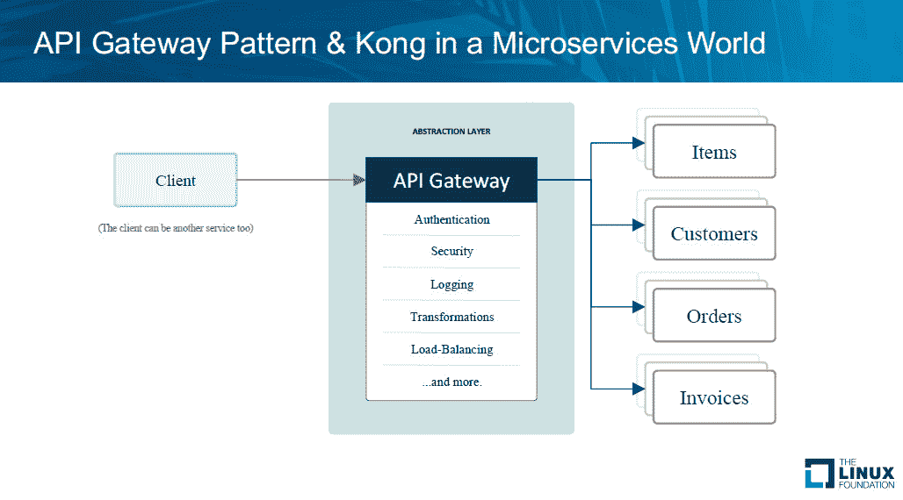

# API 网关在微服务架构中的作用

> 原文：<https://thenewstack.io/api-gateways-age-microservices/>

API 网关提供商 Mashape 的首席技术官[马尔科·帕拉迪诺](https://twitter.com/thefosk)预测，尽管在命名上有所不同，但新兴的[服务网格](/tag/service-mesh/)与 API 网关并没有太大的不同，而且两者之间的相似之处将随着时间的推移而不断增加。

帕拉迪诺指出，这两种技术实际上提供了非常相似的功能。API 网关，如[亚马逊网络服务](https://aws.amazon.com/api-gateway/)API 网关或 Mashape 自己的开源 [Kong](https://getkong.org/about/) ，在过去十年左右主要用于将外部流量映射到内部资源，而最近开发的服务网格-如 [Lyft 的 Envoy](https://thenewstack.io/lyfts-envoy-provides-move-monolith-soa/) 或[优步的 Catylist](https://thenewstack.io/ubers-catalyst-service-mesh-provides-visibility-speed/)-主要用于在[微服务架构](/category/microservices/)中代理内部资源。

“当您想到网关时，通常会想到集中层，即网络中处理附加功能的额外一跳。但这不一定是真的，”帕拉迪诺在上周在洛杉矶举行的 2017 年中尺度会议上说。网关还可以提供一种有效的方式来处理跨微服务的通信。“你还可以在现有的微服务上运行 Kong，消除额外的跳跃，减少延迟，”他说。

在过去的 10 年中，API 一直是一种受欢迎的通信交换方法，Docker 使设置微服务架构变得容易，在微服务架构中，应用程序和服务由更小的可交换组件组成。但是这些组件需要一种找到彼此并与之通信的方法。这就是 API 网关的用武之地。

Palladino 说，API 网关“可以成为一个抽象层，位于每个请求的执行路径上，这些请求将被发送到这些微服务中的一个”。

网关整合了系统所有常用功能的路径，例如身份验证或服务发现，网关可以通过插件识别这些功能。“插件是有效的中间件功能，你可以在任何微服务之上动态应用，”他说。

API 网关还可以聚合来往于这些功能的服务请求。客户端可以做出一个响应，网关可以将这个响应分成多个服务请求，从而节省了让客户端自己进行所有调用的带宽。网关还将跟踪这些请求。

当一个组织开始将一个单一的应用程序分解为微服务时，网关还可以最大限度地减少由此产生的变化对客户端本身的影响。“网关可以是您放在整体应用程序前面的幕布。客户端将只处理网关，你可以在幕后解耦你的单片应用，而不必担心更新你的客户端，”他说。

“如果你无法控制你的客户，这一点尤其有用，”他表示。

传统上，API 网关被用在组织网络的边缘，处理主要是单一应用程序和外部客户端之间的流量。然而，微服务架构将大部分流量转移到内部网络本身，因为不同的微服务之间相互通信。“您仍然有外部客户端用例，但这将成为现在使用这些微服务的众多客户端之一，”Palladino 解释道。

Palladino 吹嘘说，Mashape 的 Kong 建立在 Nginx 高性能服务器软件的基础上，是使用最广泛的开源 API 网关，每月运行超过 20 万个实例。有了 Kong，Nginx 用中间件进行了扩展，可以通过 JSON RESTful 调用动态地提供调用。

<svg xmlns:xlink="http://www.w3.org/1999/xlink" viewBox="0 0 68 31" version="1.1"><title>Group</title> <desc>Created with Sketch.</desc></svg>