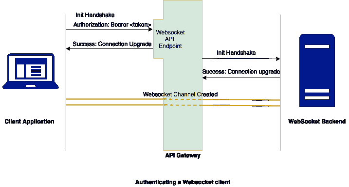

# 异步 API 的 API 管理

> 原文：<https://thenewstack.io/api-management-for-asynchronous-apis/>

 [梅纳卡·贾亚瓦德纳

Menaka 是 WSO2 的助理技术主管，主要负责 WSO2 API Microgateway 产品的研发。](https://www.linkedin.com/in/menakajayawardena/) 

如今，客户越来越多地要求访问实时信息，如股票价格、火车时刻等。对于每个企业来说，及时提供这些关键信息都是一项具有挑战性的任务。传统上，应用程序轮询后端服务器以获取最新信息；然而，这被证明是低效的，因为它消耗了大量的资源。

API 应该被设计成允许用户从服务接收事件流，而不是周期性地轮询它。事件驱动的 API 或异步(async)API 可用于满足这一要求，在事件发生时将任务关键型信息推送到客户端应用程序。

## 什么是异步 API，它们与 REST APIs 有什么不同？

与传统的请求/响应 API(例如 REST 和 SOAP)不同，异步 API 可以对单个请求发送多个响应。这也可以是单向或双向通信的形式。有几种协议可以用于异步 API，比如 Websockets、WebHooks、MQTT 和服务器发送事件(SSE)。这些协议大多在连接创建阶段支持 HTTP，并使用特定的通道在客户机和服务器之间传输后续消息。此外，传统的 HTTP 动词(即 GET、POST、PUT 等。)对这些频道无效。

REST API 和 async API 的另一个显著区别是事件主干技术(消息代理，如 Kafka 或 RabbitMQ)和主题的使用。后端服务注册为事件发布者，它们发布特定主题的事件。客户端应用程序注册为相应主题的事件订阅者，以接收由发布者服务发布的那些事件。收到事件后，客户端执行所需的处理并显示给用户。

安全性、速率限制、节流、货币化和分析是组织在将其核心业务功能作为 API 公开时应该关注的一些重要因素。为了解决这些问题，企业必须选择正确的 API 管理解决方案。然而，由于异步 API 和 REST APIs 在概念上是不同的，当使用传统的异步 API 系统时，会出现几个独特的挑战。这些问题包括与现有安全机制和节流策略的不兼容，以及围绕捕获分析数据的问题。必须通过完全支持事件驱动 API 的适当 API 管理解决方案来应对这些挑战。

## 保护事件驱动的 API

API 安全性可以分为身份验证和授权。身份验证描述谁可以访问哪个资源，而授权描述经过身份验证的用户是否可以执行特定的任务。在传统的 REST APIs 中，可以使用用户凭证、访问令牌、基于证书的认证等来认证用户。同样，每个资源也可以用作用域来保护，每个 API 调用也可以被保护。然而，在异步 API 中，由于只有客户端和服务订阅的主题，并且通信通过专用的消息传递主干进行，因此保护 API 是一项具有挑战性的任务。

应对这一挑战的一种可能方法是在初始 HTTP 通信期间进行身份验证。例如，我们可以在创建连接之前保护初始 WebSocket 握手(通过 HTTP)。还可以通过定义客户端是否可以发布任何事件来实施授权。

## 限速、节流和货币化

很多时候，任何向外部公开 API 的企业的最终目标都是为了创收。为此，主要需求是限制 API 使用的能力(阻止访问、减少带宽等)。API 管理系统支持 REST/SOAP API 的速率限制和货币化，使用基于请求计数(每秒/分钟的请求数、带宽等)的策略。当客户端超过允许的请求数量时，客户端会被阻塞一段时间。

通过引入请求速率限制，也可以通过这些策略来保护后端服务免受请求高峰的影响。但是对于异步 API，服务器发布事件，而应用程序是事件订阅者。因此，不能应用传统的节流策略，因为需要考虑服务器-客户端事件。

节流策略的定义也应该改变。请考虑以下情况:

*   **基于时间的节流**:一个客户端只能订阅特定时间的主题。之后，客户端与服务器断开连接。
*   **基于事件计数的节流**:一个客户端只能接收总数为 x 的事件。这也可以与基于时间的限制相结合，并创建策略(例如，每天 10000 个事件的计数)。
*   **基于背压的节流**:当客户端无法处理它接收到的事件的速率时，它会向网关施加压力以将消息传递给客户端，因为它需要将消息排队并在客户端可以接受它们时发送。在这些情况下，可以从网关中删除客户端，以确保网关不受影响。

## **分析**

分析在任何 API 驱动的业务中都发挥着至关重要的作用，并通过提供 API 消费者数量、最常访问的 API 资源、延迟、识别趋势等详细信息来帮助做出明智的决策。它应该是 API 管理产品支持的强制性功能。

在传统的 REST/SOAP API 中，API 网关可以捕获诸如调用 API 资源、后端延迟、地理位置等信息。这些基本上是从请求/响应头中获取的。

然而，对于异步 API，捕获这些信息变得更加复杂，因为没有 HTTP 请求或响应。我们拥有的是一组主题和订阅者。所有消息都通过单独的通道(服务器->客户机或客户机->服务器)发送，网关应该能够捕获所需的信息。对于 API 的每个订户，网关应该捕获:

1.  推送的消息数量
2.  TPS 随时间的变化
3.  发布错误的数量
4.  后端(端点)的运行状况详细信息

## 结论

使用事件驱动的 API 已经成为满足客户需求和提供更好的用户体验的关键。由于 REST 和 async APIs 之间有几个基本的区别，使用标准的 API 管理解决方案可能具有挑战性。正确的 API 管理解决方案应该将传统的 API 管理功能与事件驱动的架构相结合。这将提供巨大的附加值，以扩大业务范围和采用。

通过 Pixabay 的特征图像。

<svg xmlns:xlink="http://www.w3.org/1999/xlink" viewBox="0 0 68 31" version="1.1"><title>Group</title> <desc>Created with Sketch.</desc></svg>