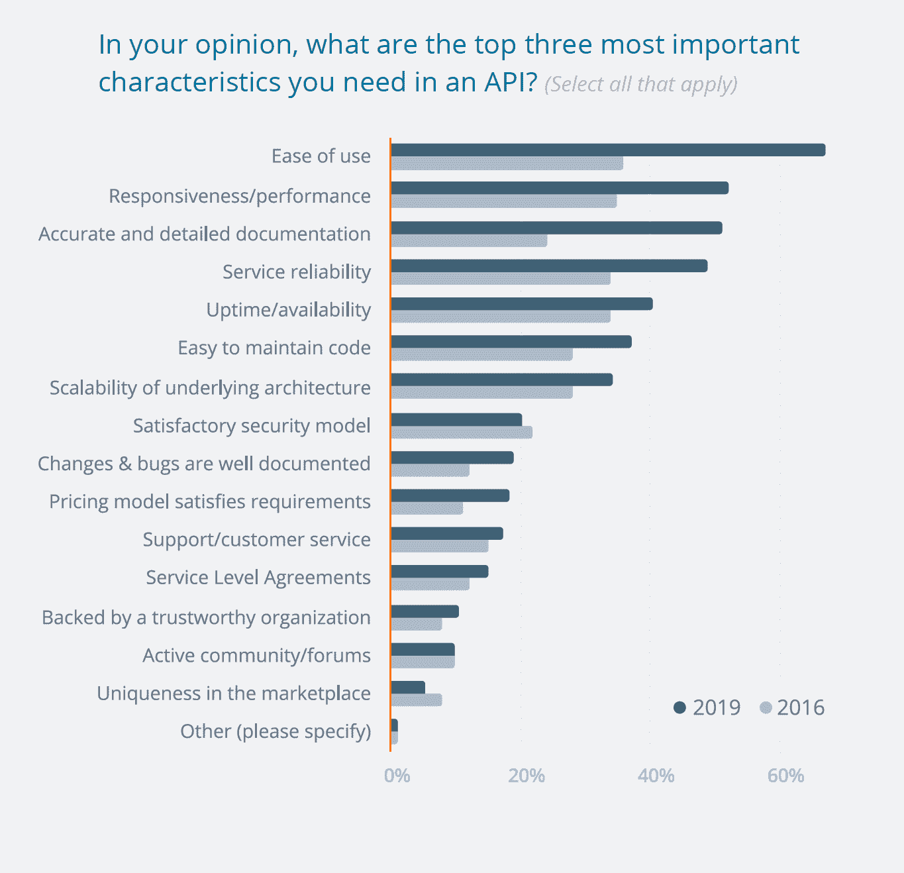
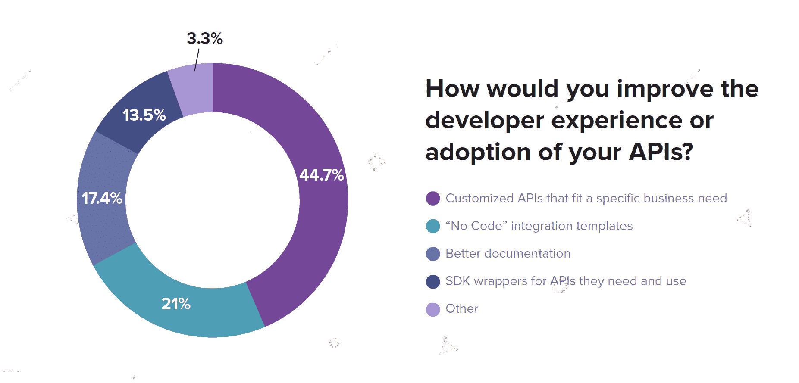
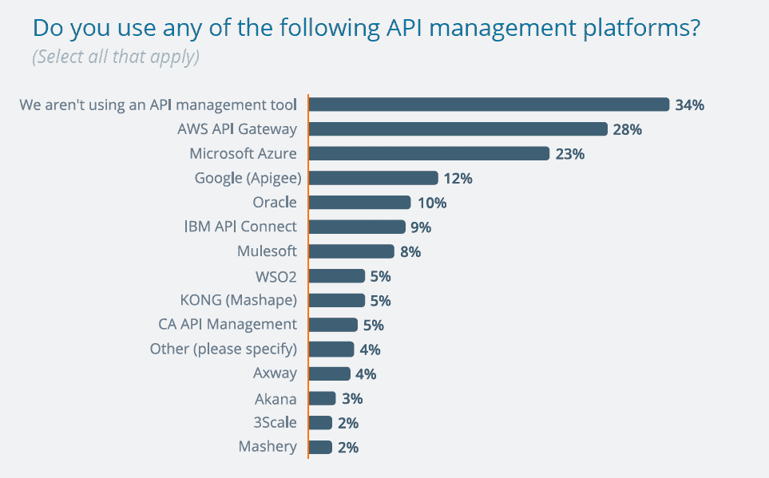

# API 提供商面临着很高的期望

> 原文：<https://thenewstack.io/api-providers-face-high-expectations/>

根据 SmartBear 最近发布的“[API 2019 年状态报告](https://smartbear.com/resources/ebooks/the-state-of-api-2019-report/)”，专业级支持和文档现在是评估使用什么 API 时的首要标准

该报告基于对 3000 多名 API 消费者和从业者的调查，样本主要是 Swagger 或 SOAPUI 的用户。与 2016 年问相同问题时相比，2019 年调查中认为“易用性”和“准确详细的文档记录”是最重要的特征之一的人的比例几乎翻了一番。许多其他类型的标准也变得越来越重要，因为人们通常对他们使用的 API 有更高的期望。当被问及他们在文档方面需要什么时，70%的人说“例子”

随着 API 在如此多的应用程序堆栈中变得根深蒂固，处理它们的策略和工具也变得根深蒂固。57%的受访公司已经实施了正式的原料药监控程序。由于他们花时间跟踪 API 性能，API 用户希望 API 提供者能够快速响应服务水平问题，75%的用户希望提供者能够立即发出通知或警报。

此外，46%的人希望提供商在问题解决之前提供一个临时的解决方案或备份 API。

不管怎样，57%的人说 API 提供商解决一个质量问题平均不到 24 小时。

来源:SmartBear 的 API 2019 年状态报告。

从另一个角度来看，我们查看了“[API 集成报告 2019 年状态](https://cdn2.hubspot.net/hubfs/440197/SMA%20-%20SOAI%202019/cloud-elements-state-of-api-integration-2019-FINAL.pdf)Cloud Elements 的报告基于对 350 名 API 爱好者的调查，其中大多数人提供了实际的 API 产品。这些 API 专业人员认为，定制 API 以适应特定的业务需求是改善开发人员体验和提高其产品采用率的最佳方式。该报告还发现，事件驱动集成是一个重大挑战，这可能是因为大多数应用程序架构都集中在发布/订阅模型上。

在不久的将来，我们将会写更多关于事件驱动架构的挑战。此外，我们计划探索对 API 开发者的需求与开源项目维护者面临的需求是如何相似的。

## 又两张图表

来源:Cloud Elements《2019 年 API 集成状况:低代码集成模板》被 21%的人认为是推动采用的方式，但两倍的人认为定制的 API 是提高使用率的最佳方法。

来源:SmartBear 的 API 2019 年状态报告。像 Mulesoft、Kong 和 WSO2 这样的小公司也有吸引力，但规模不如云提供商。

WSO2 是新堆栈的赞助商。

通过 Pixabay 的特征图像。

<svg xmlns:xlink="http://www.w3.org/1999/xlink" viewBox="0 0 68 31" version="1.1"><title>Group</title> <desc>Created with Sketch.</desc></svg>