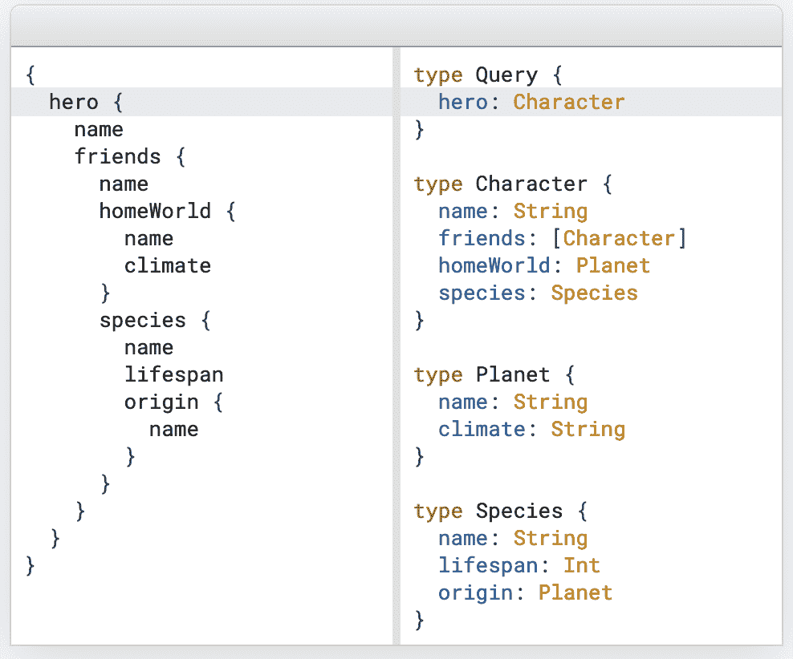
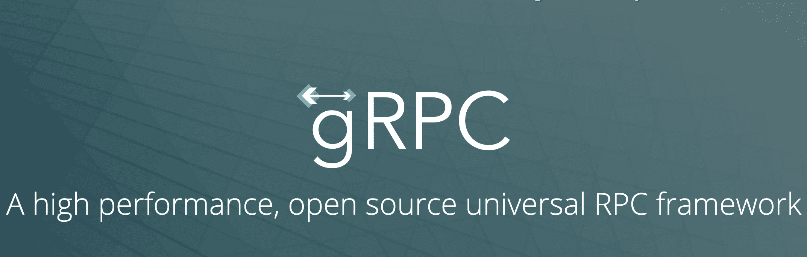

# 2021 年原料药技术趋势

> 原文：<https://thenewstack.io/api-technology-trends-in-2021/>

[Milap neu pane](https://draft.dev/)

[Milap neu pane 是 Draft.dev 的高级软件工程师和作家，他非常信任开发者社区，是 Golang Kathmandu 的组织者。在空闲时间，他喜欢做街头摄影。](https://draft.dev/)

随着公司寻求构建可伸缩、灵活的软件，他们越来越多地转向 API 驱动的开发。一个构建良好的 API 允许您向内部利益相关者或客户提供核心服务，而不会将他们锁定在特定的用户界面中。

2021 年，API 需要针对性能进行优化，提供安全可靠的实时数据访问。像 GraphQL 和 gRPC 这样的新格式和协议为开发人员提供了更多的选择，以交付开发人员友好、安全、可靠且易于集成的 API，但它们也带来了许多挑战。

跟上软件开发中许多不同的技术趋势本身就是一项巨大的工作。理解这些新兴的 API 趋势以及它们将如何影响您的下一个产品，是您在开发职业生涯中需要担心的许多事情之一。

在本文的第一部分，我将分享一些 2021 年你应该关注的关键 API 技术趋势。我将对每一种趋势提供一些见解，以及您可以如何利用这些趋势来构建更好、更快、更灵活的软件。在文章的第二部分，我将分享一些用来实现这些趋势的新兴技术。您将了解更多关于如何构建、测试和扩展下一代 API 的信息。

## 1.实时数据同步

API 消费者越来越希望立即得到结果，因此实时数据访问是必不可少的。一些任务，如预订优步或订购披萨，相对容易使用传统的 REST 模式构建，但其他问题如欺诈检测和报告可能会更加复杂，难以实时解决。

对于某些行业，实时 API 交付是一项关键任务服务。在库存管理中，当一件商品可供购买时，提供实时通知可能是达成销售或失去客户的区别。

最后，实时数据同步对于许多内部流程也是必不可少的。内部报告和管理控制面板可能需要在几秒钟内更新，以确保快速和正确的业务决策。

## 2.全球绩效

API 中的实时数据访问相对简单，除非 API 消费者期望在世界上任何地方都能获得最佳性能。这意味着您的 API 需要某种形式的缓存，并且缓存可能会导致数据不同步。因此，性能优化成为趋势。

作为许多服务的主要接口，API 需要在全球范围内进行优化。消费者(无论是内部的还是外部的)期望快速的响应时间，因此测量 API 性能是必不可少的。一旦性能指标到位，您就可以使用诸如缓存、负载限制、速率限制等技术来优化 API。

使用真实场景对 API 进行压力测试可以帮助您在开发阶段发现性能问题，从而在最终上线时将问题最小化。这就是为什么[负载测试工具](https://speedscale.com/2021/04/08/kubernetes-load-testing/)变得如此流行和多样，尤其是在以 API 为中心的 Kubernetes 领域。

## 3.更高的安全性和更好的第三方选项

随着 API 的使用和分布越来越广泛，它们的攻击面也越来越大。许多组织使用的 API 的复杂性和多样性只会增加安全风险:

> “简而言之，保护你不了解的东西是不可能的。但是很多时候，组织根本不知道他们的网络上运行着什么。公司以一次性的方式添加安全工具…此外，传统工具并没有考虑到现代、分散的企业，通常会导致比它们解决的问题更多的问题。”

——[肖恩·利奇，法斯特莱](https://thenewstack.io/its-time-to-consolidate-your-web-app-and-api-security-mess/)

当然，与其他服务相比，有些服务对安全问题更敏感，但是 API 开发的趋势似乎是朝着提高安全性意识和关注安全性的方向发展。

传统上，API 包括身份验证和速率限制作为基线安全措施。现在，开发人员必须采取更多措施来应对复杂的 DDoS 攻击、授权错误和无意的数据泄露。

现在有很多工具和服务正在发展，以保护你的 API 免受常见的安全攻击，许多人现在开始使用人工智能来为你的 API 提供[甚至更好的保护。虽然在内部构建解决方案可能很诱人，但从头开始构建自己的安全性通常不是一个好主意。](https://itchronicles.com/artificial-intelligence/how-api-security-has-advanced-with-the-advent-of-artificial-intelligence/)

## 4.微服务的广泛采用

[微服务](https://thenewstack.io/category/microservices/)现在是构建 API 的核心焦点。虽然曾经是科技行业的流行语，但它们显然会继续存在。在理想情况下，微服务将有助于提高可伸缩性、灵活性和安全性。当然，他们也介绍了自己对 API 开发者的挑战。

比如 API 网关就是微服务必不可少的一部分。它们会根据您配置的路由规则将请求转发给相应的服务。认证和安全检查通常在 API 网关中完成，因此每个服务不需要重复。如果没有正确实现，这可能会将一个[单点故障](https://www.krakend.io/blog/what-is-an-api-gateway/)引入到您的 API 中，因此这不是一件可以不加考虑就采用的事情。

微服务内部也需要互相沟通。历史上，这种通信是使用 REST APIs 完成的。如今，鉴于微服务通信的速度和可靠性(我们将在下一节讨论)，微服务通信正朝着 gRPC 和事件驱动架构发展。延迟可能是微服务的一个主要问题，因此从 REST 过渡是有意义的，但这些新的网络协议还不太成熟和受支持。

## 推动这些趋势的技术

随着 API 开发人员关注实时数据同步、全局性能、安全性和微服务的采用，开源和专有工具正在开发中，以促进这些趋势。以下是当今出现的一些最著名的 API 开发工具。

### GraphQL

[GraphQL](https://en.wikipedia.org/wiki/GraphQL) 是一种用于 API 的查询语言。在 REST API 开发中，您必须创建端点来限制用户使用每个调用中包含的特定数据。使用 GraphQL，客户机可以请求任意数量的资源——您只需定义类型和字段。在大多数情况下，这意味着消费者提出更少的请求，更快地获得他们需要的数据。

> “与 REST 最大的不同是，GraphQL 只需要一次到服务器的访问，这使得数据读取速度更快。对 GraphQL 查询的响应作为 JSON 发送回来。在获取数据的 REST 模型中，通常需要多次往返服务器才能获得应用程序所需的所有数据，因此速度会很慢，尤其是在移动设备上。”

— [理查德·麦克马努斯，新堆栈](https://thenewstack.io/why-shopify-favors-graphql-over-rest-for-its-apis/)

例如，假设客户机请求一个用户资源。如果他们还想获得用户的评论，他们可以在一个请求中完成。这为您节省了开发时间，因为您不需要构建具有不同格式的多个端点，但也为只需要发出一个请求的用户节省了时间。由于强大的开发工具(如 [Apollo](https://www.apollographql.com/) )可以连接到现有的数据存储，GraphQL 也相对容易实现和维护。

### gRPC

gRPC 是一个现代的、开源的、高性能的远程过程调用框架。它可以在任何环境下运行，并可用于跨后端、前端和移动设备进行通信。

gRPC 的速度和跨平台支持是其关键优势，尤其是在微服务日益流行的情况下。在许多微服务架构中，需要向多个服务发出请求来编译响应。由于网络调用，响应时间会变得很慢，gRPC 有助于减少这种延迟。

gRPC 使用协议缓冲区进行二进制序列化，而不是 JSON。这使得 gRPC 速度很快，即使数据负载很大。事实上，gRPC 大约比 REST API 调用快 7 倍，而且它有内置的[HTTP/2](https://en.wikipedia.org/wiki/HTTP/2)协议支持。最后，gRPC 提供了一个自动生成的 SDK，客户端可以使用它来调用服务，而不是依赖于像 REST 这样单独定义的 API 端点。

## REST:屡试不爽，但是有什么新鲜的？

REST API 已经存在了一段时间，老实说，REST 不会很快消失。因为它被广泛使用和理解，大多数常见的问题[已经被解决](https://stackoverflow.blog/2020/03/02/best-practices-for-rest-api-design/)，并且由于 HTTP 协议的创新，它在过去几年变得更好。

HTTP/1 有一个请求阻塞问题，一次只能处理一个请求。将 REST 与 HTTP/2 一起使用可以让您获得多路复用的能力，其中多个 HTTP 请求和响应可以同时处于活动状态。在 HTTP/1 中，并行性需要多个连接，而 HTTP/2 只需要一个连接就可以实现并行性。

## Web 推送 API

[Web Push API](https://www.w3.org/TR/push-api/) 允许您的 API 服务器主动向客户端发送信息。这主要用于您希望尽快反映在用户界面中的时间敏感数据(如通知或警报)。用户不必为了查看最新更新而刷新浏览器。

Web Push API 甚至可以向暂时离线的用户发送消息。虽然经常与传统的异步协议(如 webhooks 或电子邮件通知)一起使用，但 Web Push API 的广泛使用为 API 消费者的实时通信开辟了新的途径。

## 结论

软件行业发展很快，每个开发人员都必须想办法跟上。新技术允许 API 开发者更容易地构建高性能、高可用性、安全的应用程序。它们还为 API 消费者提供了更多的集成选项。

比以往任何时候都更大的挑战是为正确的使用情形选择正确的技术。例如，实时聊天 API 可能是 gRPC 的理想选择，而社交网络 API 可能依赖于 GraphQL。类似地，通知 API 可能会使用推送通知来提醒用户，而简单的两个或三个端点的应用程序可能会将其提供的内容限制为更传统的 REST API。

随着提供的 API 种类的增加，API 技术也将相应地继续发展。视频流、云原生技术和边缘计算的兴起都可能将行业推向难以预测的新方向。

<svg xmlns:xlink="http://www.w3.org/1999/xlink" viewBox="0 0 68 31" version="1.1"><title>Group</title> <desc>Created with Sketch.</desc></svg>