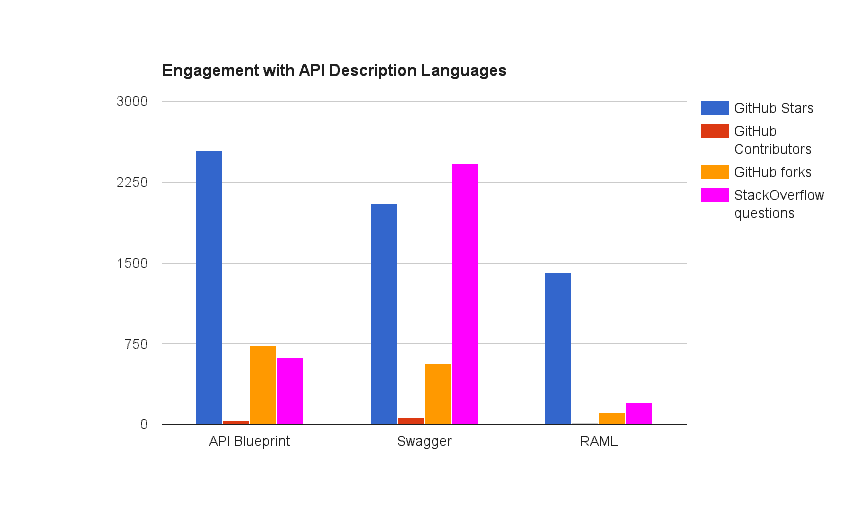
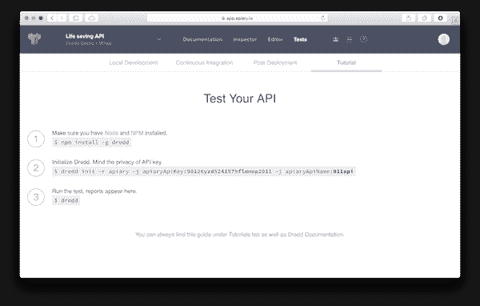
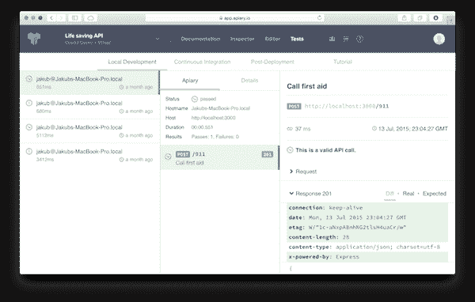

# 养蜂场发布“世界首个”自动化 API CI 测试服务

> 原文：<https://thenewstack.io/apiary-releases-world-first-automated-api-ci-testing-service/>

反映了 API 经济的不断成熟，API 设计工具栈 [Apiary](https://apiary.io/) 推出了“世界上第一个”持续集成 API 测试服务。

在对该项目的开源版本进行用户测试并收到反馈后，该版本被命名为 [Dredd](http://dredd.readthedocs.org/en/latest/) ，以英国漫画《公元 2000 年》中反乌托邦警察的名字命名。

“我们看到整个行业出现了令人难以置信的激增，”养蜂场的首席执行官兼创始人雅各布·奈瑟特里尔说。“五年前，API 是作为副产品构建的，但今天我们看到企业内部令人难以置信的协作，每个人都集中在设计优先的方法上。”

Nesetril 说，他看到企业团队围绕 API 的合作方式发生了翻天覆地的变化，许多人转向了埃森哲(T4)的 Teresa Tung 在工业 API 模型(T5)中阐述的那种模型。

“我刚从一个品牌企业的会议上回来，我们有 50 个企业架构师和其他决策者，都坐在桌子周围谈论推动一致性，以确保一切都可以快速构建，并在内部满足标准:这是他们安全的含义，”Nesetril 说。

## 工业 API 模型

这反映了 Tung 的模型，该模型发现，在企业中，API 成熟度通常始于应用程序或工作流的单个用例，从而导致在该用例部门内创建特定的 API。但是，在接下来的六个月左右的时间里，企业的其他部门采用类似的方法来进行试点项目，这很快导致了一个混乱的 API 目录，这些目录是在没有为该机构更广泛的需求建立长期、工业思维的情况下构建的。埃森哲的工业 API 模型建议，在最初的几个用例展示了 API 的能力和功效之后，未来的设计应该使用内部标准来构建，以便 API 有共同的命名和端点描述，并且通过 API 开放数据源和功能应该被认为具有更广泛的潜在用途，而不仅仅是一个用例。

养蜂场——特别是它的企业产品的[养蜂场——是专门围绕“API 蓝图”API 描述格式构建的，目的是使工业成熟成为可能。](https://enterprise.apiary.io/)

该产品正在获得巨大的吸引力，Nesetril 表示，其中大部分是在使用 Apiary 来描述和构建内部 API 的企业中，因此他的数字是 160，000 个使用 API Blueprint 语言构建的 API。虽然其中大部分可能是内部 API，但有一些数据表明 API Blueprint 是开发人员中流行的描述格式。

## API 描述语言之间的牵引

在三种最著名的描述格式中——API blue print、Swagger 和 RAML——API blue print 在 GitHub 用户方面处于领先地位(无论是通过那些主演 repo、分叉它还是为开源项目做出贡献的人来衡量)。StackOverflow 给出了一个稍微不太清晰的画面:更多的开发人员询问关于 Swagger 的问题，但是 API Blueprint 排在第二，RAML 落后。

(顺便提一下，对于那些正在寻找 API 描述语言之间转换方法的人来说，Bobby Brennan 最近发布了一个可以在三种格式之间转换的 [JavaScript 包。)](https://www.npmjs.com/package/api-spec-converter)

如果 Apiary 的许多客户在内部使用 API 设计工具，那么测试服务的增加是一个至关重要的新产品，可以帮助确保一个敏捷、不太复杂的 API 数据模型环境。

## 自动化 CI 工具

Nesetril 说:“这在 API 领域从未以完全自动化的方式完成过。“它为我们完成了生命周期。”

Nesetril 很快指出，测试服务不是外部 API 生态系统服务的竞争对手，如专注于 API 生产监控的 [Runscope](https://thenewstack.io/new-tools-from-runscope-reflect-the-coming-ubiquity-of-microservices/) 。相反，测试服务的目标是在开发过程中自动化持续集成过程。

“作为一个 API 设计平台，Apiary 总是能够在用户点击保存按钮时在本地运行测试，以确保 API 是按照规范构建的，开发人员没有破坏任何东西。

“新工具允许架构师保持 API 设计的一致性。它还帮助负责交付产品的产品经理:没有错误，可以自动检查 API 在公司中的构建进度。”

Nesetril 解释说，新的测试服务使用户能够针对后端实现测试 API 规范。开发人员还可以从他们的本地开发环境以及持续集成(CI)测试框架中进行测试。在引入该服务之前，开发人员必须使用命令行工具进行手动测试，“每个键至少一行代码。”

“因此，当你从内部看时，这种测试服务极大地改变了事情:在这里，API 可以推动公司内部的标准化。这就是这个测试变得非常重要的地方。随着微服务的兴起，你会突然看到公司拥有数百个 API。因此，软件错误的成本有多大，开发人员的工作效率有多高……我们看到开发人员持续集成方法带来了 10 倍的提升。”

Nesetril 说新的工具与 Jenkins 完全兼容，并且“所有的 CI 工具都在那里(在内部和在云中)。”

## 向 Dredd 学习

Phil Sturgeon 是拼车服务 [Ride](https://ride.com/) 的开发者，也是“[构建你不会讨厌的 APIs】的作者。他一直在使用 Dredd 开源项目将 API 测试集成到他的持续集成工作流中。](https://apisyouwonthate.com/)

“这与设计标准关系不大，我们不是用它来实施一致的设计。在我们的团队中，我们有四五个人，所以我们认为我们可以用其他方式来管理。

“我们看到一个巨大的好处是确保文档完全正确。通常，人们可能已经添加了新的字段，但是前端客户端不知道它的存在，或者它没有被添加到文档中。在其他情况下，一个特性可能已经被添加到文档中，但是开发意味着我们改变了一些东西，然后文档与我们最终构建的不匹配。”

sturgeon——他也使用 apary 的完整 API 设计产品——说虽然 apary 没有强制执行文档优先的设计方法，但它在这种开发文化中工作得很好。

“在我关于构建 API 的书中，文档是第 11 章，它确实应该是第一章。在过去，我的做法是使用 Postman 客户端，并将 Postman 用作文档，因此构建文档的想法是在我们构建之后出现的。现在，如果我们有了一个新的端点，我们就做好记录，让每个人都可以使用。这样，整个团队就可以解决这个问题，并且可以说这样不行，你可以这样做吗…然后我们模拟这个端点，让每个人都可以与之交互。整个组织的人都可以发表评论，他们的评论将被测试工具(如 Dredd)合并，在您制作功能之前和制作功能时。”

其他科技公司将这种方式视为确保更大内部协作和沟通的重要方式。网站制造商 Wix 的 SDK 产品经理 Karen Cohen 今年早些时候在柏林举行的 API 策略和实践会议上发表了类似的评论。

“很长一段时间，除了最终文档或最终产品，我们什么都不做，”科恩分享道。“现在，当我们开始一个开发项目时，我们会编写一份技术规范，并通过谷歌文档分享，这样每个人都可以对其进行评论。”

养蜂场的新测试服务旨在接受这种文化，使其成熟并自动化。

Sturgeon 说，Dredd 的一些繁琐任务现在已经解决了——最初用户需要导入他们的数据，启动服务器，然后在测试后关闭它。自动化这些过程的特性被添加到 YAML 文件中，现在已经作为产品开发和正式发布的一部分实现了。

## 680 万美元的首轮融资

在养蜂产品中推出测试服务的同时，该初创公司宣布获得 680 万美元的 A 轮融资，Nesetril 表示，这是捷克共和国初创公司获得的最大一笔 A 轮融资。据为欧盟初创公司撰稿的 [Pavel Curda](http://www.eu-startups.com/2015/01/5-czech-startups-to-watch-in-2015/) 称，Apiary 是值得关注的五家捷克初创公司之一，它们都希望跟随捷克科技领军企业 Good Data 的脚步，据 Owler 称，该公司迄今已筹集了 9670 万美元。Apiary 可能走在稳健的轨道上:他们的 A 轮融资比 GoodData 的 650 万美元 A 轮融资高出 30 万美元。

特征图片:[美国农业部](https://www.flickr.com/photos/usdagov/)的: [20140905-AMS-LSC-0333](https://www.flickr.com/photos/usdagov/14965637357/in/photolist-oNsNAi-oNsC5t-oNrV5V-oNs8jW-p5Fxne-oNs7Nq-oNsiuL-p5X5Xc-p5V15Y-oNsNLE-oNrZLt-p5USBb-oNsGS5-oZ19aX-pgniWR-pg6Lpt-pMnLaf-fA4FwA-p5WRfT-p5FxMT-oNrTeF-p3UQDQ-edXC21-pMqFeQ-edXBW1-edXBRG-9QZZ6Z-9QZYUa-9R3R7j-9R3QSm-9R3QFh-9QZXU2-9QZXGT-9R3PPW-9R3PAh-9R3Pjj-9R3NYu-9QZWj6-9R3Nnw-9R3N4h-9QZVqe-q4Teqh-oYSGDy-uGdZqW-qEVzc3-pg6EzH-uEmx9Y-oYTtdm-pgdkGP-oYZ7c2) 。由 2.0 在 [CC 下授权。](https://creativecommons.org/licenses/by/2.0/)

<svg xmlns:xlink="http://www.w3.org/1999/xlink" viewBox="0 0 68 31" version="1.1"><title>Group</title> <desc>Created with Sketch.</desc></svg>