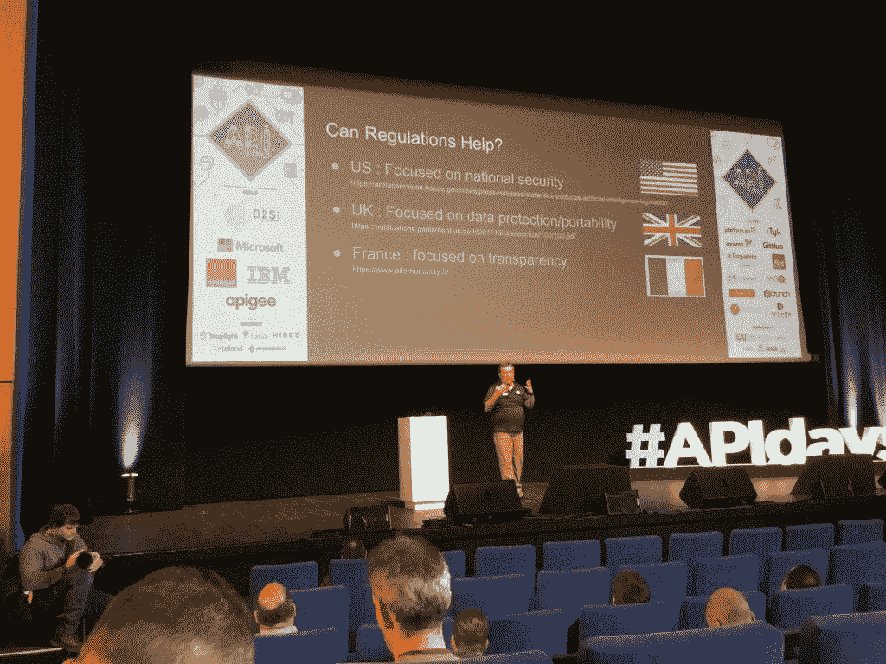
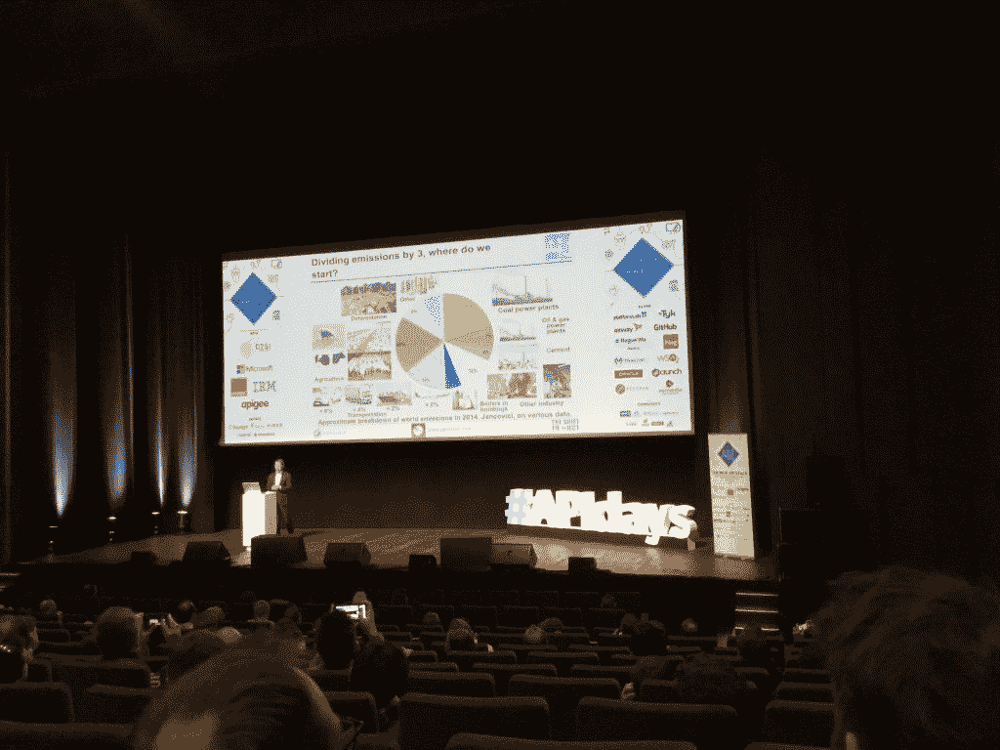
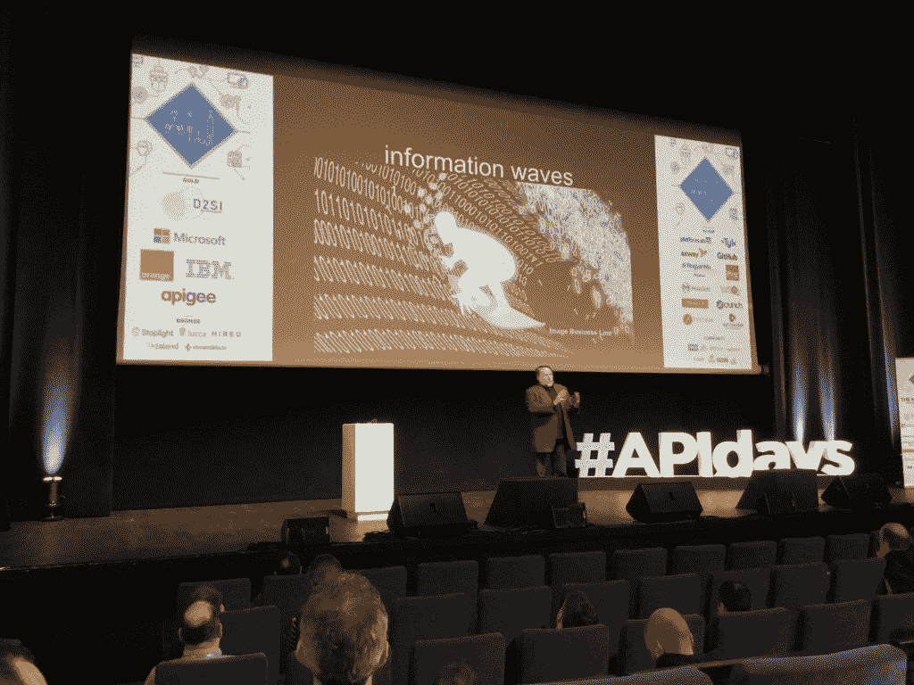

# 每日在巴黎变得政治化和沉重

> 原文：<https://thenewstack.io/apidays-gets-political-and-heavy-in-paris/>

政治主题和话题在最近举行的 APIdays 巴黎特别流行。

例如，一些主题演讲触及了人工智能、数据安全和民族主义的社会影响，IT 行业在气候变化中的地位，甚至计算机科学在人类社会和基因进化中的作用。

会议也在巴黎举行，巴黎也成为二战以来法国一些最严重的骚乱和重大政治动荡的中心。这场混乱的出口是法国的黄背心运动，它已经导致大规模骚乱，10 人死亡，据报道[44 亿欧元的经济损失。](https://www.francetvinfo.fr/economie/transports/gilets-jaunes/economie-le-cout-des-gilets-jaunes_3117689.html)它是由日益高涨的民粹主义情绪引发的，这在很大程度上是由于财富不平等加剧，同时生活成本上升、政府援助减少和税收增加。

在许多方面，法国的政治动荡似乎成了 APIdays Paris 的几个主题演讲和会议的真实背景。

## 对抗邪恶的机器人

在“网络上的机器人:好的、坏的和未来”期间，Broadcom 的 API 架构总监[API 学院](https://www.apiacademy.co/)Mike Amundsen 讨论了机器人的历史，以及它们的 API 如何仍然不受信任——尽管它们最终应该在社会中发挥非常重要的作用。阿蒙森描述的政治解决方案包括安全和隐私方面的规定，这些规定现在正被写入联合国宪章。

即将出台的法规包括美国的国家安全、英国的数据保护和数据可移植性，而在法国，“大多数关于人工智能、聊天机器人和安全的讨论都与透明度以及知道你在与谁打交道、某个东西是否是机器以及数据来自哪里有很大关系，”阿蒙森说。“在联合国，他们正在将国家安全、保护的可移植性和透明度的重要性纳入联合国人工智能政策的非常重要的元素中，”阿蒙森说。

人工智能可以完成特定的角色和任务，这应该能够安抚那些最不信任人工智能的人。阿蒙森说，这些任务包括辅导、税务准备和旅行社的机器人。阿蒙森说:“这里(这些用例)没有太多的上下文可以混淆，在学习这些元素时也没有太多的规划和推理。”。“创造帮助我们的机器有很大的机会。”

## 气候变暖

法国黄背心运动很大程度上是由柴油增税引发的。这项税收是为了进一步阻止碳基燃料替代品的使用，部分由前法国生态和团结过渡部长尼古拉斯·于洛起草，他最近辞职以示抗议，因为法国总统埃马纽埃尔·马克龙的政府在降低碳排放气体方面行动不够快，以及其他原因。

然而，正如胡洛特(他仍然是采取行动缓解全球变暖的直言不讳的倡导者)所指出的，穷人和中产阶级将是全球变暖及其导致的政治动荡的最大受害者。与此同时，黄背心参与者主要声称他们无法靠工作工资生活，并经常淡化甚至否认需要采取行动——以他们的名义——为变暖的气候做准备。

正是在这种背景下， [The Shift Project 的总裁](https://theshiftproject.org/en/home/)Jean-Marc Jancovici 描述了他所说的对未来几代人的非常可怕的预测，他们将为我们这一代人没有减少碳气体进入地球大气层的无能付出非常沉重的代价。

其中，他在主题演讲“我们的全球 IT 系统，节能者还是气候破坏者？”中公开批评了 IT 行业 Jancovici 说，“绿色 IT”是一个用词不当的说法，就像说“天然气”对环境有益，因为它是“天然的”。

Jancovici 说:“IT 系统在很大程度上是由(化石燃料)资源支持的。”。"有机化学为信息技术系统提供了许多东西."

## 美国科技帝国主义的邪恶

交织在一起的政府和企业利益经常影响法国媒体。这有助于解释为什么美国科技巨头苹果谷歌，亚马逊，脸书甚至网飞在科技领域，以及其他美国跨国公司经常在法国媒体上受到诋毁，而法国跨国公司至少受到的批评较少。

在巴黎 APIdays 的一次媒体活动中，主题是“媒体行业如何在转型中使用 API？”人们可能会看到对美国云计算巨头谷歌、亚马逊和微软在数据存储和管理方面不可信的强烈政治批评。但这种假设是错误的——来自法国最大的报纸之一《费加罗报》和总部位于法国的全球领先通讯社 T2 法新社的代表在会议上发言，他们确实证实了他们的数据仍保留在本地服务中。但是，这些原因与其说与数据安全有关，不如说是出于成本考虑。

《费加罗报》首席技术官布里斯·曼孔表示，定价是《费加罗报》没有将其 IT 基础设施迁移到云环境的主要考虑因素。

“我们衡量了这将花费我们多少，”曼孔说。“我们也不想被一两家云供应商束缚住手脚。”

Mancone 表示，尽管《费加罗报》从第三方租赁本地服务器，但云与本地无服务器基础设施的安全考虑是相同的。

## 虚拟遗传学的发展

与人工智能和数据科学对社会的深远影响相关的政治含义也是人类生物学进化趋势的一部分，目前是[奇点大学](https://su.org/)联合创始人和脸书顾问的里斯·琼斯在主题演讲“区块链喜欢生物学”中说琼斯曾担任过许多董事会职位，并领导过对科技行业产生持久影响的初创公司，他将进化生物学追溯到变形虫阶段，并描述了区块链如何在人类遗传学、人工智能和虚拟现实的背景下融入现代人类生态系统。

“区块链人喜欢生物学。区块链是 API，”琼斯说。“因此，这些想法中的一些可以应用于 API 以及生物学、进化论和一般生命，”琼斯说。

琼斯说，从许多方面来说，我们作为个人是在“冲浪”。琼斯说:“生活体验就是在这种关于我们自己和我们所处的生态系统的信息变化中冲浪。”“因此，这是一种趋势，它将继续影响生物生命的电子版本和开始进化的电子生命的智能版本。”

## 机器人和人类灭绝

人类文明的崩溃，以及正如一些人所认为的，人类在不太遥远的未来即将灭绝，显然将标志着 IT 行业的终结，从而使任何其他政治或人类相关问题都变得过时(除非人工智能能够找到一种自学生存的方法，这并非不可能)。但在这可能发生也可能不发生之前，看看未来的 APIdays 和其他技术会议如何以及是否反映了与技术行业密切相关的当今政治，将是一件有趣的事情。

从积极的方面来看，APIdays 的参与者将有可能继续从软件开发和管理的实践会议和研讨会中受益——并更多地了解一些主要问题和政治背景，在这些问题和政治背景中，我们也是共同的关键参与者。

也许在未来的日子里，一些讨论和辩论甚至会导致一些真正的和可行的解决方案，利用软件开发来解决上面描述的一些更可怕的问题。

<svg xmlns:xlink="http://www.w3.org/1999/xlink" viewBox="0 0 68 31" version="1.1"><title>Group</title> <desc>Created with Sketch.</desc></svg>